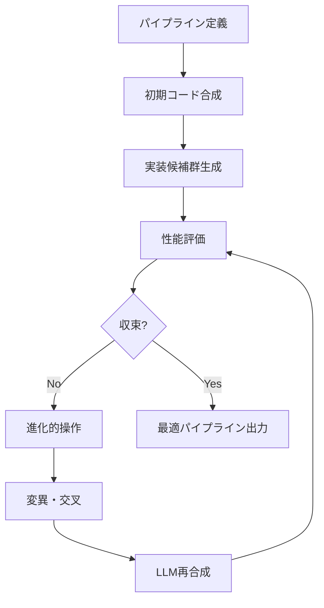
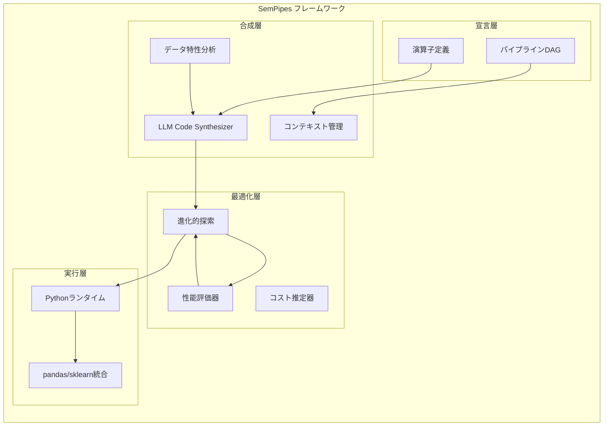
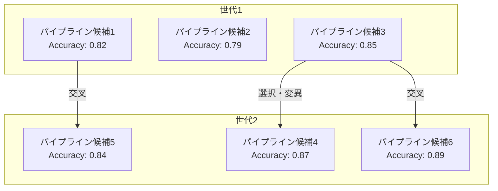

# SemPipes: Optimizable Semantic Data Operators for Tabular ML Pipelines

## 基本情報

- **タイトル**: SemPipes -- Optimizable Semantic Data Operators for Tabular Machine Learning Pipelines
- **著者**: Olga Ovcharenko, Matthias Boehm, Sebastian Schelter
- **所属**: TU Berlin / University of Amsterdam
- **発表年**: 2026
- **arXiv**: [2602.05134](https://arxiv.org/abs/2602.05134)
- **分野**: Machine Learning (cs.LG), Databases (cs.DB)

---

## Abstract

> Real-world machine learning on tabular data relies on complex data preparation pipelines for prediction, data integration, augmentation, and debugging. SemPipes integrates LLM-powered semantic data operators into tabular ML pipelines using a novel declarative programming model. The system synthesizes custom operator implementations based on data characteristics, operator instructions, and pipeline context during training, enabling automatic optimization of data operations via LLM-based code synthesis guided by evolutionary search.

**要旨**: 表形式データの実世界ML処理では、データ準備パイプラインが複雑化している。SemPipesは、LLMを活用した意味的データ演算子を宣言的プログラミングモデルにより表形式MLパイプラインに統合するフレームワークである。データ特性・演算子命令・パイプラインコンテキストに基づき、訓練時にカスタム演算子実装を自動合成し、進化的探索によるLLMベースのコード合成で最適化を実現する。

---

## 1. 概要

SemPipesは、表形式データに対するMLパイプラインにおけるデータ前処理の自動化と最適化を目指すシステムである。従来の手動パイプライン構築やAutoMLシステムの限界を超え、LLMの意味理解能力を活かしてデータ操作を宣言的に定義・最適化する。データベースのクエリ最適化に着想を得た設計により、演算子の構成・順序を自動的に改善する。

---

## 2. 問題設定

表形式MLパイプラインの主要課題：

| 課題 | 説明 | 従来アプローチの限界 |
|------|------|---------------------|
| パイプライン複雑性 | 予測・統合・拡張・デバッグの多段処理 | 手動設計はスケールしない |
| ドメイン知識依存 | 特徴量エンジニアリングに専門知識が必要 | AutoMLは構文的変換のみ |
| 意味的操作の不在 | データの「意味」を理解した操作が必要 | ルールベースでは限界 |
| 最適化困難 | 演算子の順序・パラメータの組合せ爆発 | 網羅的探索は非実用的 |

---

## 3. 提案手法

### 3.1 宣言的プログラミングモデル

SemPipesの中核は、意味的データ演算子を宣言的に定義する仕組みである。ユーザーは「何を」達成したいかを記述し、「どのように」実現するかはシステムが決定する。

```
SemPipe定義:
  - 演算子名: 意味的操作の高レベル記述
  - 命令: LLMへの具体的指示
  - データ特性: 入力データの型・分布情報
  - パイプラインコンテキスト: 前後の演算子との関係
```

### 3.2 LLMベースのコード合成

訓練フェーズにおいて、LLMが各演算子の具体的な実装コード（Python）を生成する：

1. データ特性の分析（列名、データ型、統計量）
2. 演算子命令の解釈
3. パイプラインコンテキストの考慮
4. Pythonコードの生成・検証

### 3.3 進化的探索による最適化

生成された演算子実装の性能を評価し、進化的アルゴリズムにより改善を繰り返す：



---

## 4. アーキテクチャ



---

## 5. 図表・視覚要素

### 表1: SemPipesの設計原則と比較

| 特性 | SemPipes | 従来AutoML | 手動パイプライン |
|------|----------|-----------|----------------|
| 意味理解 | LLMによる | なし | 人間の知識 |
| 最適化 | 自動（進化的） | グリッド/ランダム | 手動チューニング |
| 表現力 | 宣言的 + コード生成 | 固定テンプレート | 完全自由 |
| スケーラビリティ | 高（自動化） | 中 | 低 |
| 再現性 | コード固定後は完全 | 高 | 低 |

### 表2: データ操作の分類体系

| カテゴリ | 操作例 | 意味的要素の重要度 |
|----------|--------|-------------------|
| データクリーニング | 欠損値補完、外れ値除去 | 中 |
| 特徴量エンジニアリング | 特徴量生成、変換 | 高 |
| データ統合 | スキーママッチング、レコード結合 | 非常に高 |
| データ拡張 | 合成データ生成、外部データ結合 | 高 |
| デバッグ | データ品質検証、異常検出 | 中 |

### 演算子構成の概念図


### パイプライン最適化の概念



---

## 6. 実験・評価

### 実験設定

- **比較対象**: pandas変換、scikit-learn前処理パイプライン、AutoMLシステム（AutoGluon等）、MLlib
- **評価指標**: 実行時間、モデル性能（accuracy、F1）、最適化効果、コード生成品質
- **実装**: Python、GitHubにて公開（https://github.com/deem-data/sempipes/）

### 主要結果

SemPipesは以下の点で有効性を実証：

1. **パイプライン実行の高速化**: 演算子最適化による有意な速度改善
2. **下流モデル性能の向上**: 手作業の前処理と同等以上の結果
3. **効果的なLLMコード合成**: 意味的変換の自動生成
4. **自動最適化**: 演算子順序・パラメータの自動調整

### 技術的詳細

SemPipesの進化的探索は以下の要素を組合わせる：

- **変異**: 個々の演算子実装の微修正をLLMに依頼
- **交叉**: 異なるパイプラインの優れた部分を組合わせ
- **選択**: 下流タスクの性能に基づくフィットネス評価
- **多様性維持**: パイプライン構造の多様性を保つ制約

---

## 7. 議論・注目点

### 学術的貢献

1. **宣言的MLパイプライン**: データベースのクエリ最適化の概念をMLパイプラインに適用
2. **LLMによるコード合成の新応用**: データ前処理の自動コード生成と最適化
3. **進化的探索との統合**: LLMの生成能力と進化的アルゴリズムの探索能力の融合

### 実務的含意

- **データサイエンティストの生産性向上**: パイプライン設計の自動化
- **再現性の保証**: 合成されたコードによる決定的実行
- **ドメイン横断適用**: 宣言的記述により異なるドメインへの転用が容易

### 限界と今後の課題

- LLMのコード生成品質に依存（ハルシネーションのリスク）
- 大規模データセットでの進化的探索のコスト
- 演算子間の依存関係の複雑な最適化
- ストリーミングデータへの適用は未検討

### データ分析エージェントへの示唆

- 宣言的パイプライン定義は、エージェントが自律的にデータ前処理を実行する際のインタフェースとして有望
- LLMによるコード合成と進化的最適化の組合わせは、自動特徴量エンジニアリングの基盤技術となり得る
- パイプラインDAGの概念は、マルチステップのデータ前処理ワークフロー管理に直接応用可能
