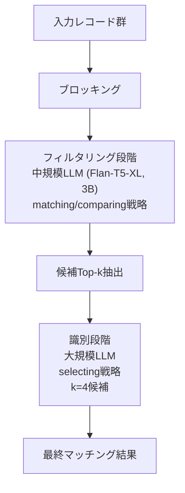
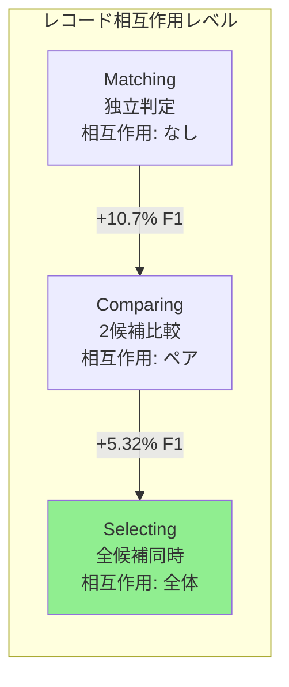
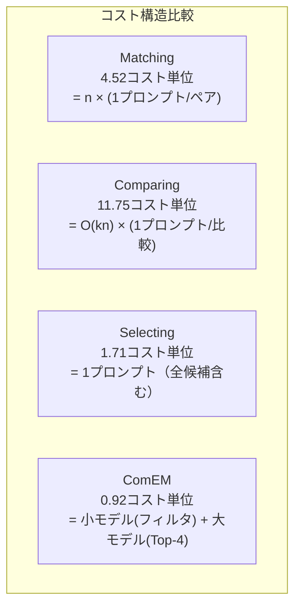

# Match, Compare, or Select? An Investigation of Large Language Models for Entity Matching

## 基本情報

- **タイトル**: Match, Compare, or Select? An Investigation of Large Language Models for Entity Matching
- **著者**: Tianshu Wang, Xiaoyang Chen, Hongyu Lin, Xuanang Chen, Xianpei Han, Hao Wang, Zhenyu Zeng, Le Sun
- **所属**: Chinese Academy of Sciences / University of Chinese Academy of Sciences
- **発表年**: 2024
- **arXiv**: [2405.16884](https://arxiv.org/abs/2405.16884)
- **分野**: Computation and Language (cs.CL), Databases (cs.DB)
- **採択**: COLING 2025

---

## Abstract

> This paper comprehensively compares three representative strategies for entity matching using large language models: matching, comparing, and selecting. By incorporating record interactions, the authors present ComEM, a compound framework combining multiple strategies in a two-stage pipeline. Testing across 8 datasets and 10 LLMs shows that the selecting strategy improves both effectiveness and cost-efficiency.

**要旨**: LLMによるエンティティマッチングにおいて、matching（独立ペア判定）、comparing（比較判定）、selecting（候補選択）の3戦略を体系的に比較する。レコード間相互作用を組込むComEMフレームワークを提案し、8データセット・10モデルで検証した結果、selecting戦略が効果とコスト効率の両面で優位性を示した。

---

## 1. 概要

エンティティマッチング（EM）とは、異なるデータソースのレコードが同一の実世界エンティティを指すかどうかを判定するタスクである。従来のLLMベースEM研究は主にペアワイズの二値分類（matching戦略）に焦点を当てていたが、本研究では複数レコードの相互作用を活用する2つの追加戦略（comparing, selecting）を含めた包括的な比較を行い、それらを統合するComEMフレームワークを提案する。

---

## 2. 問題設定

### 3つの戦略の比較

| 戦略 | 入力形式 | 出力 | 計算量 | 特徴 |
|------|---------|------|--------|------|
| Matching | 2レコード | Yes/No | O(n) | 独立ペア判定、相互作用なし |
| Comparing | 3レコード (アンカー+2候補) | A or B | O(kn) | バブルソートで相対ランキング |
| Selecting | 1+n レコード (アンカー+候補リスト) | インデックス | O(1) | 1回の呼出しで直接選択 |

---

## 3. 提案手法: ComEMフレームワーク

### 3.1 アーキテクチャ

ComEMは2段階パイプラインで構成される：



### 3.2 各戦略のスコア計算

**Matching戦略**:
```
s_i = 1 + p(Yes)  または  1 - p(No)
```

**Comparing戦略**（ブラックボックスLLM対応）:
```
s_i = 2 × (他候補に対する勝利数) + 1 × (引分け数)
```

**Selecting戦略**: LLMが候補リストからインデックスを直接選択。「該当なし」オプション（インデックス0）を含む変種あり。

### 3.3 プロンプト設計

- **Matching**: "Do these two records refer to same entity? Answer Yes/No"
- **Comparing**: "Which record more likely matches given entity? Answer A or B"
- **Selecting**: "Select matching record from numbered candidates or [0] if none"
- 温度: 0（再現性確保）
- 文脈内学習: レコード類似度に基づく3正例+3負例

---

## 4. アルゴリズム・処理フロー

```mermaid
flowchart TD
    subgraph "ComEM パイプライン"
        A[全レコード] --> B[Sparklyブロッキング\nRecall@10: 86.57-99.96%]
        B --> C[候補10件/レコード抽出]
        C --> D{フィルタリングLLM\n3Bモデル}
        D -->|matching| E1[各ペアYes/No判定]
        D -->|comparing| E2[バブルソートランキング]
        E1 --> F[Top-4候補選出]
        E2 --> F
        F --> G[識別LLM\n大規模モデル]
        G --> H[selecting戦略で最終判定]
        H --> I[マッチング結果]
    end
```

---

## 5. 図表・視覚要素

### 表1: 主要性能比較 (GPT-3.5 Turbo, F1スコア)

| 戦略 | 平均F1 | コスト単位 | 対matching改善 |
|------|--------|-----------|---------------|
| Matching | 64.02% | 4.52 | - |
| Comparing | 66.86% | 11.75 | +2.84% |
| Selecting | 81.60% | 1.71 | +17.58% |
| **ComEM** | **85.61%** | **0.92** | **+21.59%** |

### 表2: GPT-4o Mini での性能比較

| 戦略 | 平均F1 | 備考 |
|------|--------|------|
| Matching | 67.80% | ベースライン |
| Comparing | 84.36% | 最も高いF1 |
| Selecting | 82.26% | コスト効率良 |
| **ComEM** | **86.42%** | **最高性能** |

### 表3: データセット詳細

| データセット | ソースレコード | ターゲットレコード | マッチ数 |
|-------------|--------------|------------------|---------|
| Abt-Buy | 1,076 | 1,076 | 1,076 |
| Amazon-Google | 1,354 | 3,039 | 1,103 |
| DBLP-ACM | 2,616 | 2,294 | 2,224 |
| DBLP-Scholar | 2,516 | 61,353 | 2,308 |
| IMDB-TMDB | 5,118 | 6,056 | 1,968 |
| IMDB-TVDB | 5,118 | 7,810 | 1,072 |
| TMDB-TVDB | 6,056 | 7,810 | 1,095 |
| Walmart-Amazon | 2,554 | 22,074 | 853 |

### 戦略間の相互作用比較



---

## 6. 実験・評価

### 実験設定

- **評価対象LLM**: 商用（GPT-3.5 Turbo, GPT-4o Mini）、オープンソース（Llama-3.1-8B, Qwen2-7B, Mistral-7B, Mixtral-8x7B, Command-R-35B, Flan-T5-XXL, Flan-UL2, Solar-10.7B）
- **ベースライン**: 教師あり（Ditto, HierGAT）、教師なし/自己教師あり（ZeroER, Sudowoodo）、既存LLM手法
- **前処理**: Sparklyブロッキング（recall@10: 86.57-99.96%）
- **評価規模**: データセットあたり400サンプル（うち300にマッチあり）、計4,000ペア

### 主要知見

1. **レコード相互作用の効果**: 複数レコードを同時に扱う戦略（comparing +10.7%, selecting +5.32%）が独立判定を大幅に上回る

2. **位置バイアス**: selecting戦略ではマッチレコードの位置が後方になるほど性能が低下する重大な課題を発見

3. **モデル-戦略間の相互作用**: Chat-tunedモデルはmatching戦略で劣るがcomparing/selectingで優秀。Task-tunedモデル（Flan-T5）は全戦略で安定

4. **コスト効率**: ComEMはF1最高かつコスト最低（0.92単位）を同時達成

5. **文脈長の限界**: 現行LLMは長い候補リストの処理に困難を示し、2段階パイプライン設計の合理性を裏付け

### アブレーション

- ComEMのtop-kパラメータ分析：GPT-3.5ではk値による変動大、GPT-4o Miniではk=2-6で安定
- 新しいモデルほどロバスト性が向上する傾向

---

## 7. 議論・注目点

### 学術的貢献

1. **エンティティマッチング戦略の体系化**: matching/comparing/selectingの3戦略を統一的に比較した初の包括的研究
2. **位置バイアスの定量化**: LLMベースEMにおける重要な課題を特定
3. **ComEMの段階的設計**: タスク分解による品質・コスト最適化の実証

### 実務的含意

- 大規模データ統合でのLLM活用指針を提供
- コスト制約下での戦略選択基準（selecting戦略のコスト効率が突出）
- 小規模モデルによるフィルタリング + 大規模モデルによる精密判定の組合わせが最適

### 限界

- ブロッキング段階でのRecall損失は未考慮
- 8データセットはすべてクリーンデータ（ノイズの影響は未検証）
- 大規模モデル（70B以上）での検証が不足

### データ分析エージェントへの示唆

- エンティティマッチングの戦略選択はデータ品質・コスト・精度のトレードオフの良い事例
- 2段階パイプライン設計（粗いフィルタ + 精密判定）はデータ前処理全般に応用可能
- 位置バイアスへの対処はLLMベースのデータ処理システム設計時の重要な考慮事項

---

## 8. 詳細分析: モデル-戦略間の相互作用

### 8.1 LLMファミリー別の傾向

本研究で最も興味深い知見の一つは、LLMのチューニング方法によって最適な戦略が異なるという発見である。

| LLMタイプ | Matching | Comparing | Selecting | 推奨戦略 |
|----------|---------|-----------|-----------|---------|
| Chat-tuned (GPT-3.5, Llama) | 低 | 高 | 高 | Comparing/Selecting |
| Task-tuned (Flan-T5, Flan-UL2) | 中-高 | 中 | 中 | 安定（戦略非依存） |
| Instruction-tuned (Mistral) | 中 | 中-高 | 高 | Selecting |

### 8.2 コスト分析の詳細

ComEMのコスト効率を分解すると、以下の構造が見える：



### 8.3 位置バイアスの詳細分析

selecting戦略における位置バイアスは、LLMの注意機構に起因する根本的な問題である。候補リストの先頭に配置されたレコードが選択されやすい傾向が観察されており、これはLLMベースのデータ処理全般に影響する。ComEMでは、フィルタリング段階でtop-k候補に絞り込むことで、候補リストの長さを制限し、この問題を緩和している。

### 8.4 教師あり手法との比較

ComEMは教師なし（ラベル不要）でありながら、教師あり手法と比較して以下の特性を持つ：

| 特性 | ComEM | Ditto | HierGAT | ZeroER |
|------|-------|-------|---------|--------|
| 訓練データ | 不要 | 必要 | 必要 | 不要 |
| ドメイン適応 | プロンプトで対応 | 再訓練必要 | 再訓練必要 | 自動 |
| 計算コスト | API呼出し | GPU訓練 | GPU訓練 | CPU |
| 新規データセット対応 | 即時 | 数時間 | 数時間 | 即時 |
