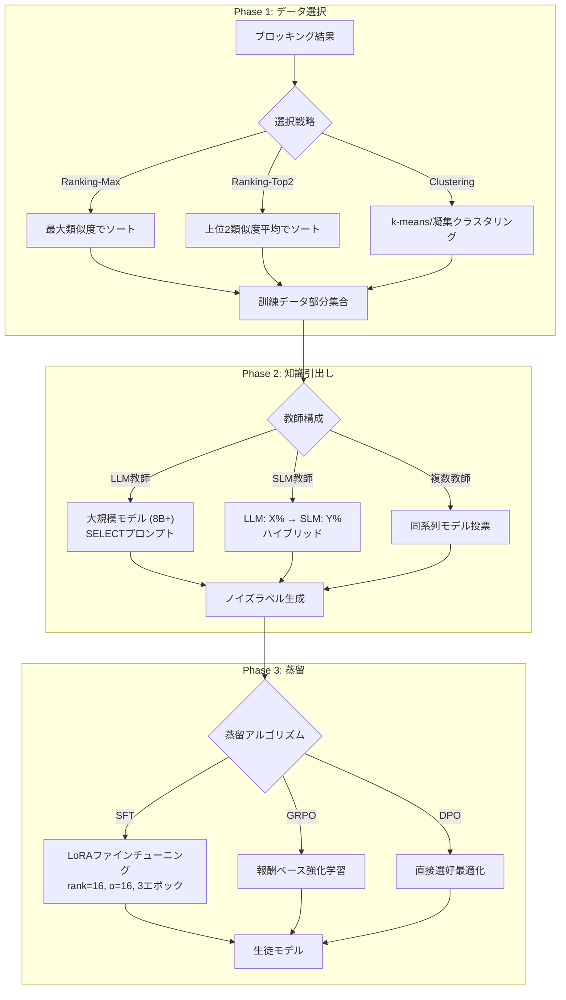
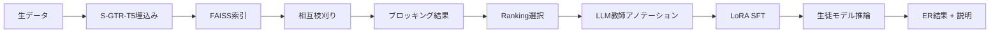
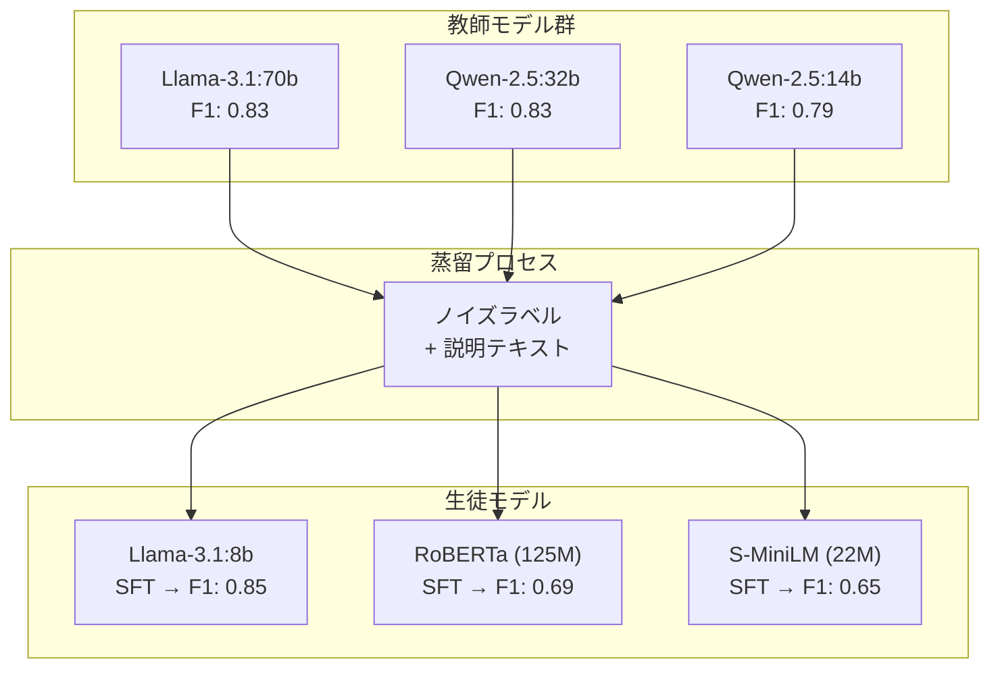

# DistillER: Knowledge Distillation in Entity Resolution with Large Language Models

## 基本情報

- **タイトル**: DistillER: Knowledge Distillation in Entity Resolution with Large Language Models
- **著者**: Alexandros Zeakis, George Papadakis, Dimitrios Skoutas, Manolis Koubarakis
- **所属**: National and Kapodistrian University of Athens / Athena Research Center
- **発表年**: 2026
- **arXiv**: [2602.05452](https://arxiv.org/abs/2602.05452)
- **分野**: Databases (cs.DB)
- **ライセンス**: CC BY-NC-ND 4.0

---

## Abstract

> DistillER is a knowledge distillation framework for entity resolution that transfers expertise from large language models to smaller, more efficient alternatives without requiring ground-truth annotations. The framework examines three key dimensions: identifying informative data subsets, comparing single versus multi-teacher configurations, and evaluating supervised fine-tuning alongside reinforcement learning. Results indicate that supervised fine-tuning of student models using noisy labels from teacher LLMs achieves superior performance.

**要旨**: DistillERはエンティティ解決（ER）における知識蒸留フレームワークであり、正解ラベルなしでLLMの専門知識を小型モデルに転移する。データ選択、単一/複数教師構成、教師ありファインチューニングと強化学習の3次元を調査し、LLM教師のノイズラベルによる教師ありファインチューニングが最良の性能を達成することを示す。

---

## 1. 概要

エンティティ解決は同一実世界エンティティを指すレコードの識別・リンクを行う基盤タスクである。LLMは高精度なERを可能にするが、推論コストが高い。DistillERは、LLM（教師）の知識を小型モデル（生徒）に蒸留することで、正解ラベル不要でありながら高品質かつ低コストなERを実現する。

---

## 2. 問題設定

| 課題 | 説明 |
|------|------|
| LLMの推論コスト | 大規模データセットでのER実行は時間・計算資源の面で非実用的 |
| 正解ラベルの不在 | 実世界ではグラウンドトゥルースが得られないことが多い |
| 品質-効率トレードオフ | 小型モデルは高速だが精度が低い |
| 説明可能性 | ERの判定根拠の提示が実務で求められる |

---

## 3. 提案手法: DistillERフレームワーク

### 3.1 全体アーキテクチャ



### 3.2 データ選択戦略

- **Ranking**: 類似度スコアでソートし代表的なサンプルを選択
  - Max score: 候補中の最大類似度
  - Top-2 score: 上位2候補の平均類似度
- **Clustering**: ヒストグラムベクトル表現でk-meansまたは凝集クラスタリング

### 3.3 強化学習（GRPO）の報酬関数

```
R_total = w1 × R_digit + w2 × R_length + w3 × R_correct
```

- R_digit: 複数回答ペナルティ（括弧内の数字数）
- R_length: 簡潔性報酬
- R_correct: 正解二値スコア

---

## 4. 処理フロー



---

## 5. 図表・視覚要素

### 表1: データセット概要

| データセット | エンティティ数 | ドメイン |
|-------------|--------------|---------|
| Buy | ~1K | 商品 |
| Abt | ~1K | 商品 |
| Amazon | ~23K | 商品 |
| IMDb | ~5K | 映画 |
| TMDb | ~6K | 映画 |
| TVDb | ~8K | 映画 |
| ACM | ~2.5K | 論文 |
| DBLP | ~2.5K | 論文 |
| Scholar | ~61K | 論文 |

### 表2: 蒸留手法別F1性能比較

| 手法 | 平均F1 | 推論速度 | 説明生成 |
|------|--------|---------|---------|
| LLM教師 (Qwen-2.5:32b) | 0.83 | 遅い (42-44K秒) | 可 |
| SLM教師 (RoBERTa) | 0.71 | 速い (~8.8K秒) | 限定的 |
| **DistillER SFT (Llama-8b)** | **0.85** | **中** | **可** |
| DistillER DPO | 0.78 | 遅い (推論2倍) | 可 |
| DistillER GRPO | 0.71 | 中 | 可 |

### 表3: 既存手法との比較

| 手法 | 平均F1 | カテゴリ |
|------|--------|---------|
| **DistillER SFT** | **0.85** | **蒸留** |
| ComEM (LLMベース) | 0.43 | LLM直接 |
| Unicorn (教師ありSLM) | 0.73 | 教師あり |
| ZeroER (教師なし) | 0.59 | 教師なし |

### 知識蒸留パイプラインの概念図



---

## 6. 実験・評価

### 実験設定

- **ハードウェア**: RTX 4090 GPU, 256GB RAM, AMD Threadripper 3960X
- **訓練データ**: 各データセット10%のエンティティ（計2,181タプル）
- **LLM教師**: Llama-3.1:8b/70b, Qwen-2.5:14b/32b
- **SLM生徒**: S-MiniLM (22M), RoBERTa (125M)
- **ファインチューニング**: LoRA (rank=16, α=16), 3エポック, 学習率2×10⁻⁴, 4bit量子化

### 主要結果

1. **SFTの優位性**: ノイズラベルでのSFTが一貫して最高性能（F1=0.85）で、正解ラベルベースのベースラインと同等
2. **Rankingの安定性**: データ選択ではRanking-Maxが最も信頼性高く、平均0.67の正例比率を維持
3. **推論速度**: SLMはLLMの100倍高速
4. **説明生成の両立**: SFTモデルは説明付きでもF1=0.84（回答のみと同等）を維持
5. **DPOの特性**: DPOはLLMラベルでF1=0.78（正解ラベルGRPO 0.71を上回る）が推論時間2倍

---

## 7. 議論・注目点

### 学術的貢献

1. **ラベル不要の知識蒸留**: 正解データなしで高品質ERモデルを構築する実用的フレームワーク
2. **蒸留手法の体系的比較**: SFT、GRPO、DPOの3手法を同一条件で包括的に評価
3. **「生徒が教師を超える」現象**: ノイズラベルSFTの生徒（F1=0.85）が教師LLM（F1=0.83）を上回る

### 実務的含意

- 高コストLLMの一回限りのアノテーションで、低コストモデルによる持続的ER運用が可能
- 説明生成能力の維持により、監査・デバッグが可能なERシステムを構築
- 22Mパラメータモデルでも実用的な性能（F1=0.65）を達成

### 限界

- 8データセットはすべて英語（多言語対応は未検証）
- データ選択の最適戦略はデータセット依存の可能性
- GRPO報酬設計のハイパーパラメータ感度は未詳細分析

### データ分析エージェントへの示唆

- LLMによるアノテーション → 小型モデルへの蒸留パターンは、データ前処理の様々なタスクに汎用化可能
- 正解ラベル不要という特性は、ラベル取得が困難な実務データに直結する価値
- 説明生成と判定を同時に行うモデルは、データ品質管理の自動化に有用
