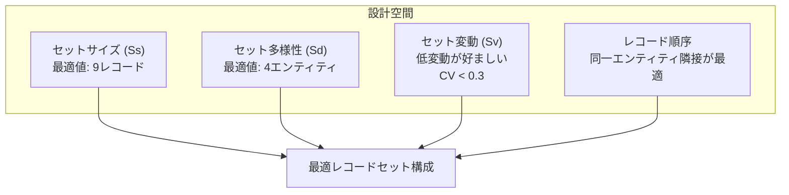
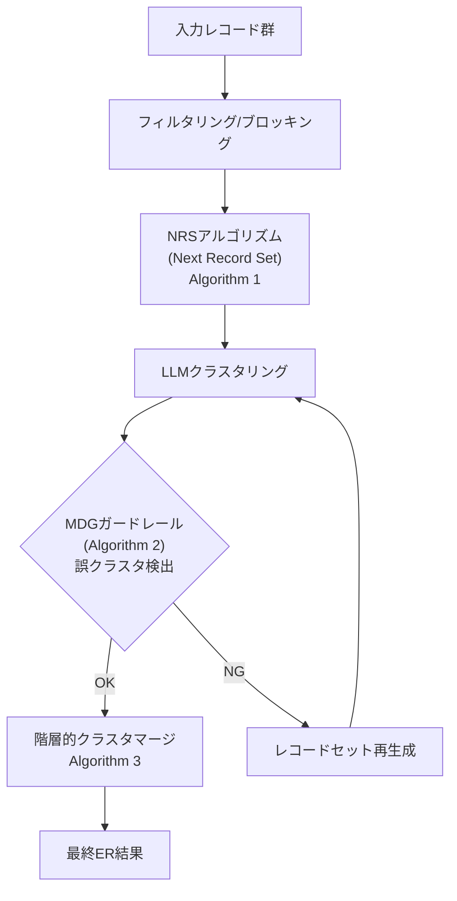
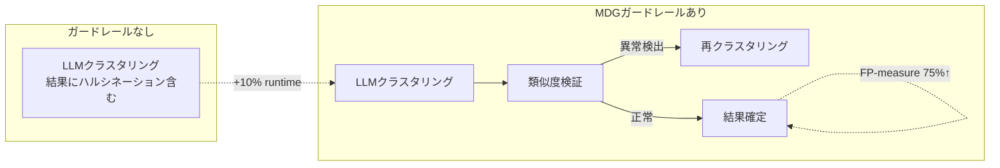
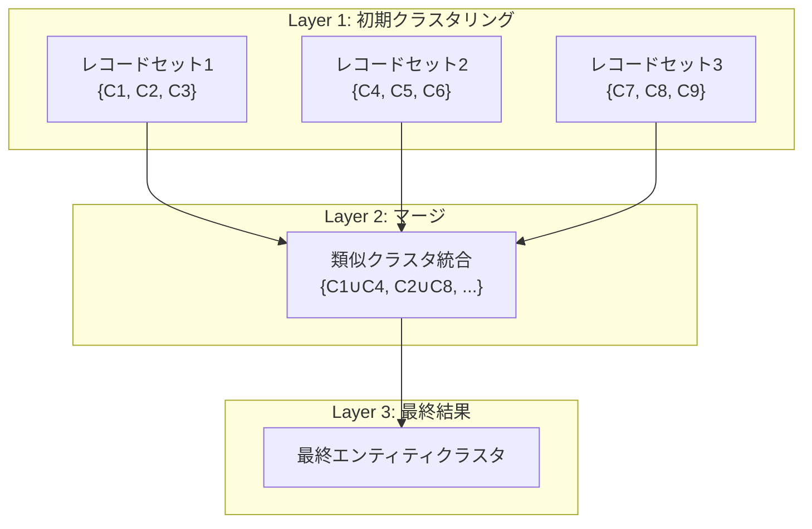

# In-context Clustering-based Entity Resolution with Large Language Models: A Design Space Exploration

## 基本情報

- **タイトル**: In-context Clustering-based Entity Resolution with Large Language Models: A Design Space Exploration
- **著者**: Jiajie Fu, Haitong Tang, Arijit Khan, Sharad Mehrotra, Xiangyu Ke, Yunjun Gao
- **所属**: Zhejiang University / University of California, Irvine / Aalborg University
- **発表年**: 2025
- **arXiv**: [2506.02509](https://arxiv.org/abs/2506.02509)
- **分野**: Databases (cs.DB)
- **採択**: SIGMOD 2026

---

## Abstract

> Entity Resolution (ER) is a fundamental data quality improvement task. Traditional ER approaches rely on pairwise comparisons, which are costly with large datasets. This paper proposes a novel in-context clustering approach where LLMs cluster records directly, reducing time complexity and monetary costs. The design space for in-context clustering is systematically investigated, and LLM-CER achieves up to 150% higher accuracy, 10% increase in F-measure, and 5x reduction in API calls.

**要旨**: エンティティ解決（ER）における新しいアプローチとして、LLMによる文脈内クラスタリングを提案する。従来のペアワイズ比較に代わり、LLMがレコードを直接クラスタリングすることで時間計算量とコストを削減する。設計空間を体系的に調査し、LLM-CERフレームワークを開発。精度150%向上、F値10%向上、API呼出し5倍削減を達成。

---

## 1. 概要

エンティティ解決はデータ品質の根幹をなすタスクだが、レコード数に対してO(n²)のペアワイズ比較が必要で、LLMのAPI呼出しコストが大きな障壁となる。本研究は、LLMのクラスタリング能力を活用し、複数レコードを一度に処理する文脈内クラスタリングアプローチを提案する。設計空間の4つの主要因子を特定し、それらの最適化によりAPI呼出し回数を大幅に削減しながら高品質なERを実現する。

---

## 2. 問題設定

### ペアワイズ vs. クラスタリングアプローチの比較

| 特性 | ペアワイズマッチング | バッチングペアワイズ | **文脈内クラスタリング** |
|------|---------------------|---------------------|------------------------|
| API呼出し (8レコード例) | 13回 | 7回 | **5回** |
| 情報密度 | 低（1ペア/呼出し） | 中 | **高（全関係/呼出し）** |
| スケーラビリティ | O(n²) | O(n²/k) | **O(n/Ss)** |
| 推移律の活用 | なし | 限定的 | **自動的** |

---

## 3. 提案手法: LLM-CER

### 3.1 設計空間の4因子

### 3.2 パイプライン全体

### 3.3 NRSアルゴリズム (Algorithm 1)

1. k-meansクラスタリング + エルボー法で多様性を評価
2. target_size = ⌊Ss/Sd⌋ でバランスの取れたクラスタを目標
3. 貪欲選択で変動を最小化
4. 同一エンティティのレコードを隣接配置

### 3.4 誤クラスタ検出ガードレール (Algorithm 2)

- クラスタ内類似度: レコードと同クラスタ他レコードの最小類似度
- クラスタ間類似度: 他クラスタレコードとの最大類似度
- 判定: クラスタ内 < クラスタ間 → 誤分類と判定
- 計算量: O(Ss²) ≈ O(81) (Ss=9のデフォルト)

### 3.5 階層的クラスタマージ (Algorithm 3)

- NP困難なK次元最大マッチング問題をヒューリスティックで解決
- クラスタを「新レコード」として扱い再帰的にグルーピング
- K個のレコードセットを ⌈K/Sd⌉ グループに分割
- 反推移性制約: 同一元セットのクラスタは同パックに配置しない

---

## 4. アルゴリズム詳細

### ブロッキング戦略

| 戦略 | 手法 | 特徴 |
|------|------|------|
| フィルタリング | Jaccard類似度 + 閾値最適化 | シンプル |
| LSH | コサイン類似度 + 埋込み | **デフォルト** |
| Canopy | 二重閾値 (bs, ms) | 柔軟 |

---

## 5. 図表・視覚要素

### 表1: API呼出し効率比較 (8レコード例)

| アプローチ | API呼出し数 | 質問数 | 情報密度 |
|-----------|------------|--------|---------|
| ペアワイズ | 13 | 13 | 1ペア/呼出し |
| バッチング | 7 | 13 | ~2ペア/呼出し |
| **文脈内クラスタリング** | **5** | **5** | **全関係/呼出し** |

### 表2: 主要性能結果

| 指標 | LLM-CER | ベースライン比 |
|------|---------|--------------|
| 精度 (ACC) | - | **最大150%向上** |
| FP-measure | - | **~10%向上** |
| API呼出し数 | - | **5倍削減** |
| コスト | 同等 | 最もコスト効率的なベースラインと同等 |
| MDGオーバーヘッド | +10% runtime | FP-measure 75%改善 |

### ガードレール効果の概念図

### 階層的マージの処理構造

---

## 6. 実験・評価

### 実験設定

- **データセット**: 9つの実世界データセット（Music 20K, Cora, Alaska等）
- **評価指標**: ACC（精度）、FP-measure、API呼出し数、コスト、実行時間
- **ベースライン**: ペアワイズマッチング（Narayan et al., 2022）、バッチングペアワイズ（Fan et al., 2024, SOTA）、CrowdER
- **プロンプト**: ゼロショット（タスクデモンストレーション・ファインチューニングなし）
- **パラメータ探索**: 設定あたり200サンプル

### 主要結果

1. **精度**: ベースライン比で最大150%向上
2. **FP-measure**: 約10%改善かつコスト同等
3. **API呼出し**: ペアワイズバッチングの5分の1に削減
4. **ガードレール効果**: 10%のランタイム追加でFP-measure 75%改善
5. **スケーラビリティ**: データセットサイズ増加に伴い効率差が拡大

### CrowdERとの差異

- 階層的レコードセット生成（CrowdERは単一パス）
- 推移律/反推移律のレイヤー間活用
- ハルシネーション対策の組込みバリデーション
- 同等設定で2-5倍少ないAPI呼出し

---

## 7. 議論・注目点

### 学術的貢献

1. **ER向け文脈内クラスタリングの先駆的研究**: ペアワイズからクラスタリングへのパラダイムシフト
2. **設計空間の体系的探索**: Ss, Sd, Sv, 順序の4因子を実証的に最適化
3. **ハルシネーション対策**: MDGガードレールによる検出・修正メカニズム
4. **SIGMOD 2026採択**: トップ会議への採択が手法の学術的価値を裏付け

### 実務的含意

- API呼出しコストの大幅削減は、大規模データ統合プロジェクトの実現可能性を高める
- ゼロショットで高性能を達成することから、ドメイン固有の訓練データが不要
- ガードレールにより、LLMのハルシネーションリスクを管理可能

### 限界

- 最適パラメータ（Ss=9, Sd=4）はデータセット依存の可能性
- ブロッキング段階のRecall損失は別途対処が必要
- 超大規模データセット（数百万レコード）での検証は不足

### データ分析エージェントへの示唆

- クラスタリングベースのERアプローチは、データ前処理パイプラインのデデュプリケーション段階に直接適用可能
- 設計空間の体系的探索手法は、他のLLMベースデータ処理タスクの最適化にも応用できる
- ガードレールの概念は、LLMによるデータ処理全般の品質保証メカニズムとして参考になる
