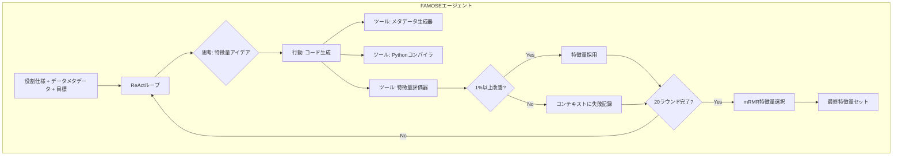
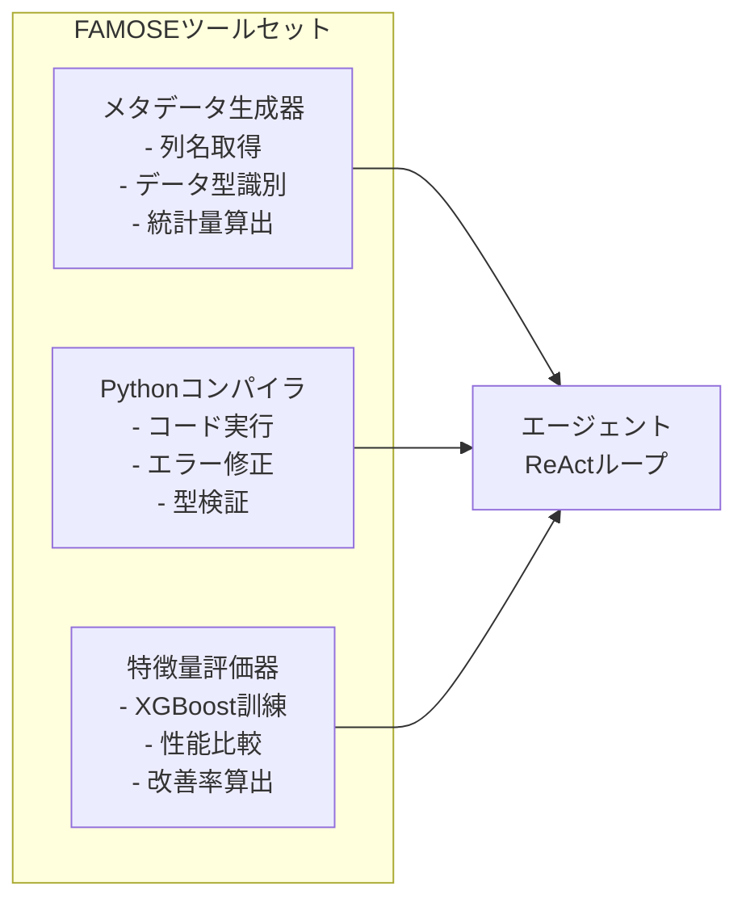
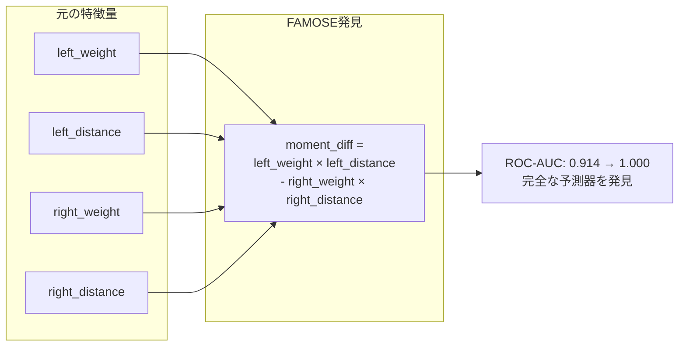

# FAMOSE: A ReAct Approach to Automated Feature Discovery

## 基本情報

- **タイトル**: FAMOSE: A ReAct Approach to Automated Feature Discovery
- **著者**: Keith Burghardt, Jienan Liu, Sadman Sakib, Yuning Hao, Bo Li
- **所属**: USC Information Sciences Institute / University of Chicago
- **発表年**: 2026
- **arXiv**: [2602.17641](https://arxiv.org/abs/2602.17641)
- **分野**: Machine Learning (cs.LG), Artificial Intelligence (cs.AI)
- **ページ数**: 23ページ、6図

---

## Abstract

> FAMOSE (Feature AugMentation and Optimal Selection agEnt) introduces a framework utilizing the ReAct paradigm for autonomous feature exploration and refinement. The system integrates feature selection and evaluation tools within an agent architecture, achieving competitive results on classification tasks and state-of-the-art performance on regression tasks. ReAct's iterative feature discovery process documents successful and unsuccessful features in the LLM context window, guiding the model toward generating more innovative features.

**要旨**: FAMOSEはReActパラダイムを活用した自律的特徴量発見フレームワークである。特徴量選択・評価ツールをエージェントアーキテクチャ内に統合し、分類タスクで競争力のある結果、回帰タスクでSOTA性能を達成する。ReActの反復的発見プロセスにより、成功・失敗した特徴量がコンテキスト窓内に蓄積され、少数ショットプロンプティングと同様の効果で革新的な特徴量生成を誘導する。

---

## 1. 概要

特徴量エンジニアリングは表形式MLの性能を大きく左右するが、ドメイン知識と試行錯誤に依存する労働集約的な作業である。FAMOSEは、LLMエージェントがReAct（Reasoning + Acting）パラダイムに基づき自律的に特徴量を探索・生成・評価・選択する枠組みを提案する。既存のAutoFEツールが構文的変換に限定されるのに対し、LLMの意味理解能力を活かしたドメイン固有の特徴量発見を実現する。

---

## 2. 問題設定

| 課題 | 説明 | FAMOSEの対処 |
|------|------|-------------|
| 探索空間の広大さ | 可能な特徴量変換の組合せは膨大 | ReActによる意味的絞込み |
| ドメイン知識の必要性 | 効果的な特徴量は専門知識に依存 | LLMの学習済み知識を活用 |
| 評価の非効率性 | 各候補特徴量の評価にモデル訓練が必要 | ツール統合による自動評価 |
| 冗長特徴量 | 生成された特徴量間の相関 | mRMRによる最終選択 |

---

## 3. 提案手法

### 3.1 アーキテクチャ



### 3.2 アルゴリズム (Algorithm 1)

```
1. 5-fold Stratified Cross-Validation で訓練データ分割
2. FOR round = 1 TO 20:
   a. エージェントがReActでの特徴量を提案
   b. Pythonコードを生成・検証
   c. 正規表現でハルシネーション特徴量を検出・置換
   d. 既採用特徴量すべてを含めた上で性能評価
   e. 1%以上の改善なら採用、そうでなければ失敗として記録
3. mRMR (minimum redundancy-maximum relevance) で最終選択
4. テストフォールドで評価
```

### 3.3 主要設計要素

- **ポスト検証**: LLMハルシネーション防止のためのコード実行検証
- **累積評価**: 新特徴量は既採用特徴量すべてと共に評価
- **mRMR選択**: ターゲットとの関連性最大・特徴量間相関最小を両立
- **目標値除外**: データ漏洩防止のため生成時にターゲット変数を除去

---

## 4. ツール詳細



---

## 5. 図表・視覚要素

### 表1: 回帰タスク性能 (RMSE削減率)

| 手法 | 平均RMSE改善 | 成功率 | Wilcoxon p値 |
|------|-------------|--------|-------------|
| **FAMOSE** | **-2.0%** | **100%** | **0.07** |
| CAAFE | -1.2% | 100% | - |
| OpenFE | -0.8% | 71% | - |
| AutoFeat | -0.5% | 86% | - |
| FeatLLM | -0.3% | 100% | - |

### 表2: 分類タスク性能 (ROC-AUC改善)

| 手法 | 全体改善 | 大規模 (>10K) | 小規模 | タスク完了率 |
|------|---------|-------------|--------|------------|
| **FAMOSE** | **+0.32%** | **+0.229%** | **+0.36%** | **100%** |
| CAAFE | +0.25% | +0.15% | +0.30% | 100% |
| OpenFE | +0.40% | 失敗多数 | +0.45% | 58% |
| AutoFeat | +0.28% | 失敗多数 | +0.35% | 89% |

### 表3: 特徴量のモデル間転用性

| 生成元モデル | XGBoost | Random Forest | AutoGluon |
|------------|---------|---------------|-----------|
| FAMOSE (XGBoost用) | ベースライン | +1.2% | +0.02% |

### Balance-Scaleタスクの事例



---

## 6. 実験・評価

### 実験設定

- **データセット**: 分類20タスク + 回帰7タスク（500-580K件、5-280特徴量）
- **LLM**: AWS Bedrock Claude 3.5 Sonnet V2（主）、Deepseek-R1（ロバスト性検証）
- **温度**: 0.8
- **予測モデル**: XGBoost（主）、Random Forest、AutoGluon（ロバスト性）
- **ベースライン**: AutoFeat, OpenFE (古典的)、CAAFE, FeatLLM (LLMベース)
- **計算環境**: AWS SageMaker (ml.r6i.32xlarge, ml.m7i.48xlarge, ml.g5.48xlarge)
- **最長実行時間**: 約6時間 (covtype, 580K件)

### 主要知見

1. **大規模タスクでの優位性**: 10K件以上のタスクでFAMOSEとCAAFEのみが100%完了。古典的手法は11-42%で失敗
2. **ReActの効果**: 反復的な成功/失敗の記録がfew-shot効果を生み、より革新的な特徴量を誘導
3. **特徴量転用性**: XGBoost用に生成された特徴量がRandom Forest (+1.2%) やAutoGluon (+0.02%) でも有効
4. **Deepseek-R1**: Claude 3.5と同等の結果（+0.29%改善）を達成、モデル非依存性を実証
5. **アブレーション**: 目標除去で性能微減、特徴量選択なしで回帰RMSE 0.8%悪化

### プロンプト構造

5つの逐次タスク:
1. 数学的操作を用いた多様な特徴量生成
2. 特徴量の有用性説明
3. ツールによる性能評価
4. 1%以上の改善確認
5. 最良特徴量の保存

---

## 7. 議論・注目点

### 学術的貢献

1. **ReActパラダイムの特徴量エンジニアリングへの初の適用**: 思考-行動-観察ループによる反復的発見
2. **コンテキスト内学習効果の発見**: 成功/失敗記録の蓄積がfew-shotプロンプティングと同等の誘導効果
3. **大規模タスクでのロバスト性**: 古典的手法が失敗する大規模データセットで安定動作

### 実務的含意

- 特徴量エンジニアリングの自動化により、データサイエンティストの時間を上流タスクに充当可能
- 生成された特徴量は解釈可能（LLMの推論出力による説明付き）
- モデル横断的に転用可能な特徴量を生成

### 限界

- ReActチェーンの高トークンコスト
- 小規模LLM (Llama 3.1-8B) では性能低下
- LLMの学習データに関連ドメインが含まれない場合の性能は未知数
- マルチラベル分類への対応には修正が必要

### データ分析エージェントへの示唆

- ReActベースのエージェント設計は、データ前処理の他タスク（欠損値補完、外れ値検出）にも適用可能
- 成功/失敗パターンのコンテキスト蓄積は、エージェントの学習メカニズムとして普遍的に有用
- mRMRによる最終選択フェーズは、エージェントが生成した候補を絞込む汎用的な後処理パターン
