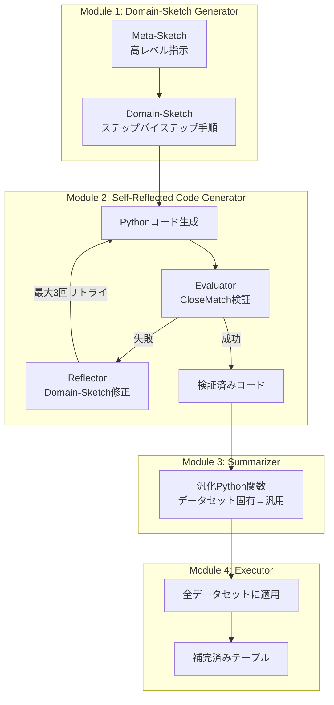
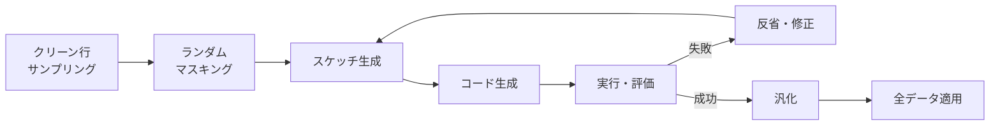
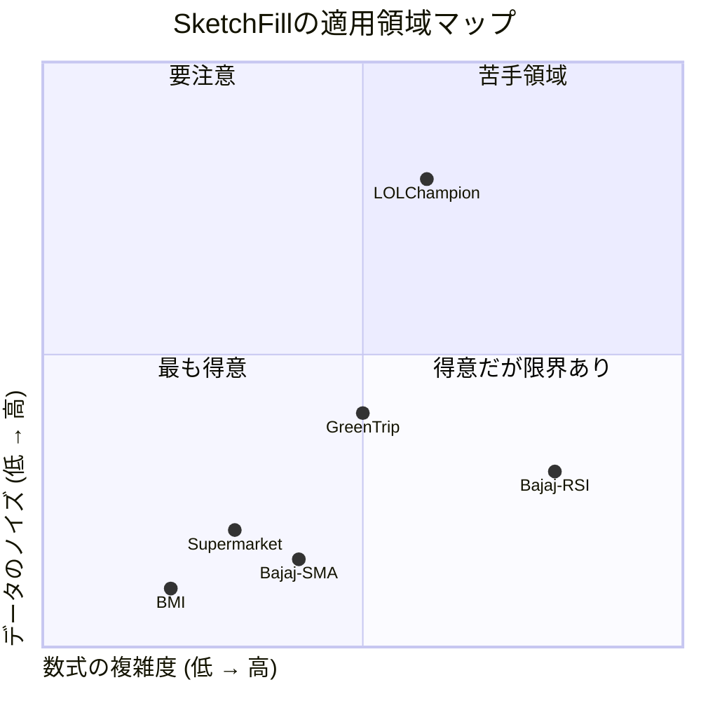

# SketchFill: Sketch-Guided Code Generation for Imputing Derived Missing Values

## 基本情報

- **タイトル**: SketchFill: Sketch-Guided Code Generation for Imputing Derived Missing Values
- **著者**: Yunfan Zhang, Changlun Li, Yuyu Luo, Nan Tang
- **所属**: HKUST / East China Normal University
- **発表年**: 2024
- **arXiv**: [2412.19113](https://arxiv.org/abs/2412.19113)
- **分野**: Computation and Language (cs.CL), Databases (cs.DB), Machine Learning (cs.LG)
- **ページ数**: 19ページ、6図

---

## Abstract

> Missing value is a critical issue in data science, significantly impacting the reliability of analyses and predictions. SketchFill proposes a sketch-guided code generation approach for imputing derived missing values, achieving 56.2% higher accuracy than Chain-of-Thought methods and 78.8% higher accuracy than MetaGPT.

**要旨**: 欠損値はデータサイエンスにおける重大な課題であり、分析と予測の信頼性に大きく影響する。SketchFillは、派生的な欠損値（数式で計算可能な値）の補完に対し、スケッチ誘導型コード生成アプローチを提案する。Chain-of-Thought手法比56.2%、MetaGPT比78.8%の精度向上を達成した。

---

## 1. 概要

従来の欠損値補完手法は統計的手法（KNN、MICE）や深層学習（拡散モデル）が主流だが、これらは値の「導出関係」を考慮しない。例えば「BMI = 体重 / 身長²」のような数式に基づく欠損値は、統計的推定ではなく正確な計算により補完すべきである。SketchFillは、この「派生的欠損値補完（DMVI）」問題に特化し、2段階のスケッチ抽象化とLLMコード生成を組合わせた新しいアプローチを提案する。

---

## 2. 問題設定: 派生的欠損値補完（DMVI）

| 特性 | 観測的欠損値 | 派生的欠損値 |
|------|------------|------------|
| 本質 | 観測されなかったデータ | 他の列から計算可能な値 |
| 適切な補完法 | 統計的推定 | **数式による正確な計算** |
| 例 | 気温のランダム欠損 | BMI = Weight / Height² |
| 従来手法の問題 | 近似値で代替 | **数式を発見できない** |

---

## 3. 提案手法: SketchFillアーキテクチャ

### 3.1 全体構造



### 3.2 2段階スケッチ抽象化

- **Meta-Sketch**: ユーザー提供の高レベル指示（ドメイン非依存）
- **Domain-Sketch**: データセット固有のステップバイステップ論理手順

この2段階抽象化により、ユーザーの意図とコード実行の間のギャップを効果的に橋渡しする。

### 3.3 Self-Reflected Code Generatorの評価基準

CloseMatch指標:
```
sgn(|C'_mij - Cij| - ε)
```
- C'_mij: マスクされた値の補完結果
- Cij: 真の値
- ε: 許容誤差閾値

---

## 4. アルゴリズム (Algorithm 1)

```
入力: ダーティテーブル, Meta-Sketch, パラメータ(k, λ)
1. クリーン行からk行をサンプリング
2. λ行のターゲット変数をランダムにマスク
3. REPEAT (最大3回):
   a. Meta-Sketch → Domain-Sketch生成
   b. Domain-Sketch → Pythonコード生成
   c. マスク行でコード実行
   d. CloseMatch評価
   e. IF 成功 → BREAK
   f. ELSE → Reflectorで Domain-Sketch修正
4. Summarizerで汎化関数生成
5. Executorで全ダーティ行に適用
出力: 補完済みテーブル
```



---

## 5. 図表・視覚要素

### 表1: データセット概要

| データセット | ドメイン | タプル数 | 変数数 | 欠損率 | 代表的数式 |
|-------------|--------|---------|--------|--------|-----------|
| Bajaj | 金融 | 3,600 | 6 | 9.28-19.31% | SMA5, EMA5, CCI5, ROC5, MOM10, RSI8 |
| BMI | 健康 | 720 | 3 | - | BMI = Weight / Height² |
| Supermarket | 小売 | 960 | 6 | - | Total = UnitPrice × Quantity + Tax5 |
| GreenTrip | 交通 | 1,800 | 4 | - | NYC タクシーデータ |
| LOLChampion | ゲーム | 554 | 5 | - | パフォーマンス指標 |

### 表2: 主要性能比較 (全データセット平均精度)

| 手法 | カテゴリ | 精度 | SketchFill比 |
|------|---------|------|-------------|
| **SketchFill** | **LLM (提案)** | **84.2%** | **-** |
| Chain-of-Thought | LLM | 53.9% | -56.2% |
| Code Generation | LLM | 52.9% | -59.1% |
| MetaGPT | LLM | 47.1% | -78.8% |
| Direct Prompting | LLM | 45.0% | -87.1% |
| KNN (k=5) | 統計的 | 変動大 | - |
| MICE | 統計的 | 変動大 | - |
| TabCSDI | 深層学習 | 変動大 | - |

### 表3: データセット別RMSE比較（主要結果）

| データセット | SketchFill | CoT | MICE | 備考 |
|-------------|-----------|-----|------|------|
| BMI | **0.0000** | >0 | >0 | 完全正解 |
| Bajaj (SMA5) | **0.0000** | >0 | >0 | 完全正解 |
| Bajaj (RSI8) | 8.7993 | - | **2.559** | 多段計算で苦戦 |
| GreenTrip | 0.572 | **0.438** | >0 | 僅差で劣位 |
| LOLChampion | 1.2712 | - | - | ノイジーデータ |

### SketchFillの強み・弱みの構造



---

## 6. 実験・評価

### 実験設定

- **データセット**: 5ドメイン、975タプル合計
- **ベースライン**: 統計的（KNN k=5、MICE）、深層学習（TabCSDI）、LLM（Direct, CoT, CodeGen, MetaGPT）
- **評価指標**: Accuracy（正解率）、FindAccuracy（1回以上補完された変数の精度）、RMSE
- **バックエンドLLM**: GPT-4o（主）、Llama3-8B（比較）

### 主要結果

1. **全体精度84.2%**: 全LLMベースライン・統計手法を大幅に上回る
2. **BMIで完全正解**: 単純な数式に対し100%精度・ゼロRMSE
3. **金融指標でも優秀**: SMA5, EMA5, ROC5, MOM10でゼロRMSE
4. **多段計算の課題**: RSI8（上昇/下降平均の計算が必要）では統計手法MICEに劣後
5. **ノイジーデータの限界**: LOLChampionの重複データで性能低下

### アブレーション分析

- 2段階スケッチがコアの貢献（Domain-Sketch除去で大幅性能低下）
- Self-Reflection（最大3リトライ）による漸進的改善
- Summarizerなしでは個別行の補完は可能だが汎化不能

---

## 7. 議論・注目点

### 学術的貢献

1. **DMVI問題の定式化**: 派生的欠損値補完という新しいタスクカテゴリの提唱
2. **2段階スケッチ抽象化**: ユーザー意図 → ドメイン固有手順 → コードの段階的変換
3. **自己反省メカニズム**: 具体的な評価基準に基づく反復的改善

### 実務的含意

- 金融・医療・小売など数式関係が存在するドメインで直接適用可能
- Meta-Sketchの再利用により、類似ドメインへの横展開が容易
- 正確な数式発見により、統計的推定では得られない精度を実現

### 限界

- 非派生的（観測的）欠損値は対象外
- 多段階計算（RSI8等）では複雑さにより性能低下
- バックエンドLLMの能力に強く依存（Llama3-8Bでは大幅な性能低下）
- ユーザーがMeta-Sketchテンプレートを提供する必要がある

### データ分析エージェントへの示唆

- スケッチベースのコード生成は、データ前処理の多様なタスクに応用可能な汎用パターン
- 自己反省+具体的評価基準の組合わせは、エージェントの自律的品質改善の参考設計
- 派生的欠損値の自動検出（どの列が数式関係にあるか）を追加することで完全自動化の可能性
- Meta-Sketchの自動生成をLLMに委ねることで、ユーザー介入をさらに削減できる可能性
