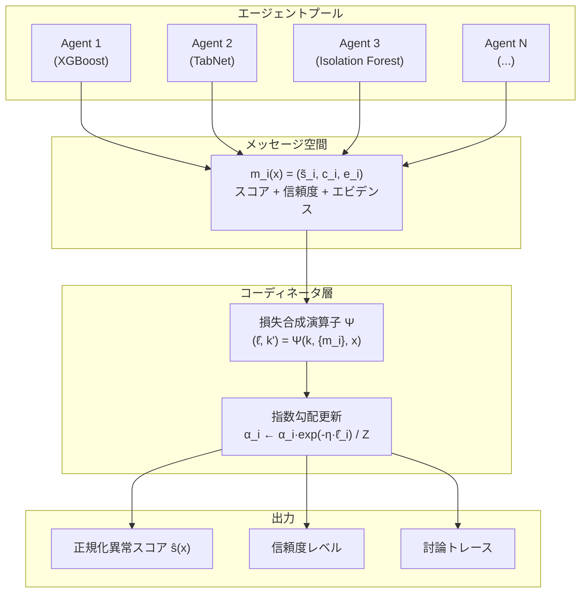
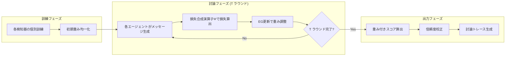
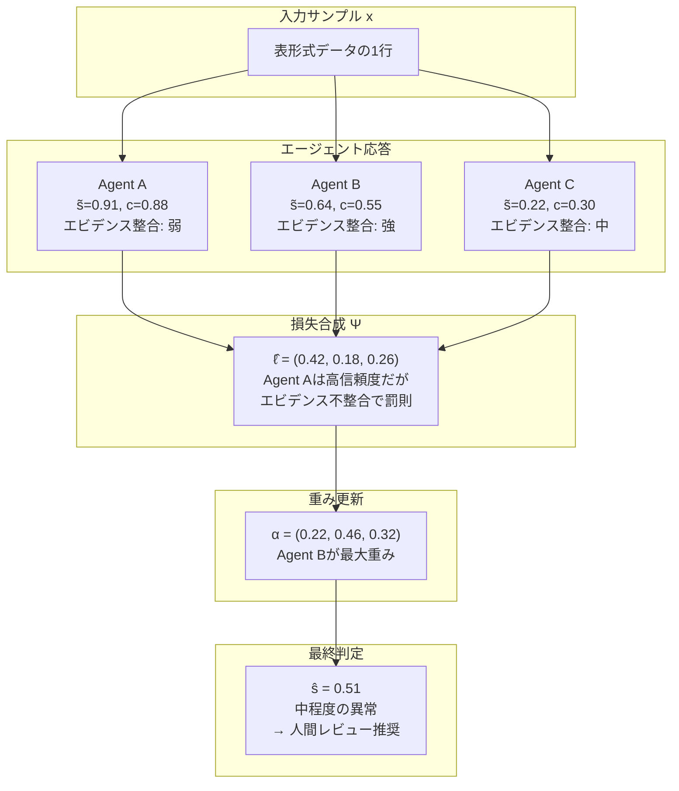

# Multi-Agent Debate: A Unified Agentic Framework for Tabular Anomaly Detection

## 基本情報

- **タイトル**: Multi-Agent Debate: A Unified Agentic Framework for Tabular Anomaly Detection
- **著者**: Pinqiao Wang, Sheng Li
- **所属**: University of Virginia
- **発表年**: 2026
- **arXiv**: [2602.14251](https://arxiv.org/abs/2602.14251)
- **分野**: Machine Learning (cs.LG), Artificial Intelligence (cs.AI)
- **ライセンス**: CC BY 4.0

---

## Abstract

> MAD (Multi-Agent Debate) is a framework treating disagreement among heterogeneous anomaly detectors as valuable information. The approach coordinates multiple ML-based detectors and an LLM-based critic through a mathematically grounded layer, producing normalized anomaly scores with confidence levels and evidence traces. The system applies an exponentiated-gradient rule for agent influence updates and offers both theoretical regret guarantees and practical robustness improvements.

**要旨**: MAD（Multi-Agent Debate）は、異種異常検知器間の不一致を有用な情報として扱うフレームワークである。複数のMLベース検知器とLLMベースの批評者を数学的に基礎づけられた層で協調させ、信頼度レベルとエビデンストレースを伴う正規化異常スコアを生成する。指数勾配ルールによるエージェント重み更新と理論的リグレット保証を提供する。

---

## 1. 概要

表形式データの異常検知では、単一の手法が全てのデータセットで最適とは限らない。従来のアンサンブル手法は単純な平均化や多数決に頼るが、検知器間の「不一致」自体に重要な情報が含まれている。MADは、異種の異常検知器をエージェントとして扱い、構造化されたメッセージ交換と数学的に保証された重み更新メカニズムにより、不一致を解決する「討論」フレームワークを提案する。

---

## 2. 問題設定

| 課題 | 説明 | MADの対処 |
|------|------|----------|
| 検知器の異質性 | 木・深層学習・距離ベースなど異なる原理の検知器 | 構造化メッセージで統一 |
| 不一致の活用 | 従来は平均化で不一致情報を消失 | 討論メカニズムで活用 |
| 信頼度校正 | 検知器ごとにスコアの意味が異なる | 正規化+信頼度付与 |
| 説明可能性 | アンサンブルの判定根拠が不明 | エビデンストレース |
| 理論的保証 | 多くのアンサンブルに収束保証がない | リグレット上界の証明 |

---

## 3. 提案手法: MADフレームワーク

### 3.1 アーキテクチャ



### 3.2 メッセージ形式

各エージェント i のメッセージ:
```
m_i^(t)(x) = (s̃_i^(t)(x), c_i^(t)(x), e_i^(t)(x))
```

- s̃_i: 正規化異常スコア ∈ [0,1]
- c_i: 信頼度 ∈ [0,1]
- e_i: エビデンス（特徴量寄与度）

### 3.3 指数勾配（EG）重み更新

```
α_i^(t+1) = α_i^(t) · exp(-η · ℓ̂_i^(t)) / Σ_j α_j^(t) · exp(-η · ℓ̂_j^(t))
```

- η: 学習率
- ℓ̂_i^(t): 損失合成演算子Ψにより算出されるエージェント i の損失

### 3.4 理論的保証 (Theorem 4.1)

有界損失 ℓ̂_i^(t) ∈ [0,1] のもとで:
```
Σ_t ⟨α^(t), ℓ̂^(t)⟩ - min_i Σ_t ℓ̂_i^(t) ≤ log(N)/η + ηT/8
```

これは古典的なエキスパートアドバイス理論の保証を回復しつつ、構造化メッセージ空間を可能にする。

---

## 4. 処理フロー



---

## 5. 図表・視覚要素

### 表1: 16ベンチマークデータセット

| データセット | 行数 | 特徴量数 | 異常率 | ドメイン |
|-------------|------|---------|--------|---------|
| Credit Card Fraud | 284,807 | 30 | 0.17% | 金融 |
| IEEE-CIS Fraud | 590K+ | 400+ | <1% | 金融 |
| Mammography | - | - | - | 医療 |
| Arrhythmia | - | - | - | 医療 |
| Thyroid | - | - | - | 医療 |
| UNSW-NB15 | - | - | - | サイバーセキュリティ |
| NSL-KDD | - | - | - | サイバーセキュリティ |
| CIC-IDS2017 | - | - | - | サイバーセキュリティ |

### 表2: 主要性能比較

| 指標 | MAD | 最良ベースライン | 改善率 |
|------|-----|---------------|--------|
| PR-AUC | 0.352 ± 0.071 | 0.312 ± 0.076 (HeteroStack) | **+12.8%** |
| Recall@1%FPR | 0.647 ± 0.094 | 0.498 ± 0.097 (HeteroStack) | **+29.9%** |
| ROC-AUC | 0.936 ± 0.015 | 0.905 ± 0.024 (HeteroStack) | **+3.4%** |
| Macro-F1 | 0.893 ± 0.026 | 0.862 ± 0.033 (HeteroStack) | **+3.6%** |
| ECE | 5.0 ± 1.5 | 6.0 ± 2.5 (CatBoost) | **-17%** |
| Gap | 0.050 ± 0.024 | 0.073 ± 0.033 (HeteroStack) | **-31%** |

### 表3: アブレーション結果 (PR-AUC)

| 構成 | PR-AUC | 変化 |
|------|--------|------|
| **MAD (完全版)** | **0.352** | - |
| 討論チャネル除去 | 0.332 | -5.7% |
| エビデンスチャネル除去 | 0.301 | -14.5% |
| エビデンス30%破損 | 0.322 | -8.5% |
| エビデンス50%破損 | 0.298 | -15.3% |
| 予測のみEG (λ=γ=0) | 0.315 | -10.5% |

### ケーススタディ: 3エージェントの討論例



---

## 6. 実験・評価

### 実験設定

- **データセット**: 16ベンチマーク（金融、医療、サイバーセキュリティ、オペレーション）
- **ベースライン**:
  - 古典的: Logistic Regression, Random Forest, XGBoost, LightGBM, CatBoost
  - AutoML: AutoGluon, H2O, auto-sklearn
  - 深層学習: TabNet, FT-Transformer, SAINT, TabTransformer, TabPFN
  - 教師なし: Isolation Forest, LOC-SVM, LOF, HBOS, COPOD, ECOD
  - メタベースライン: HeteroStack
- **評価指標**: PR-AUC, ROC-AUC, Recall@1%FPR, ECE, Macro-F1, Gap

### 主要結果

1. **PR-AUC +12.8%**: 最も重要な稀事象検知指標で大幅改善
2. **Recall@1%FPR +29.9%**: 偽陽性率1%での検出力が約30%向上
3. **校正精度 -17% ECE**: より信頼性の高い確率推定
4. **スライス間格差 -31% Gap**: サブグループ間の公平性が向上

### ハイパーパラメータ感度

- 最適討論ラウンド数: T ∈ {1, 2}（収穫逓減）
- エージェント数: 4-6で性能安定
- 学習率: η ∈ {0.25, 1.0}

### ロバスト性検証

- ガウスノイズ、欠損値注入、特徴量スケーリングドリフト、カテゴリ摂動に対し安定
- ベースラインよりも各破損タイプで優れた頑健性

### フレームワークの一般性

MADは以下の古典的アプローチを特殊ケースとして包含：

| 制約条件 | 得られる手法 |
|----------|------------|
| メッセージ空間をスカラーに制限、Ψが相互作用無視 | バギング/アンサンブル |
| Ψが条件付き重み付け学習 | Mixture of Experts |
| T=1、討論なし | エキスパートアドバイス |
| λ=γ=0（予測のみ） | 標準アンサンブル |

---

## 7. 議論・注目点

### 学術的貢献

1. **不一致の数学的定式化**: 検知器間の不一致を損失合成演算子により構造的に扱う初のフレームワーク
2. **理論的保証**: 指数勾配更新によるリグレット上界の証明
3. **既存手法の統一**: バギング、MoE、エキスパートアドバイスを特殊ケースとして包含
4. **エビデンストレース**: 判定過程の透明性を確保する監査可能なログ

### 実務的含意

- **金融不正検知**: Recall@1%FPRの29.9%改善は実務的に非常に大きな価値
- **規制対応**: エビデンストレースによる説明可能性は金融・医療の規制要件を満たす
- **運用効率**: T=1（単一ラウンド）で実用的な性能を達成、推論オーバーヘッドが小さい
- **適応性**: 分布シフト下でも適応的に重み更新が可能

### 限界

- エージェント多様性が低い場合、不一致シグナルが減少
- メッセージ品質（信頼度・エビデンス）のノイズが性能に影響
- 持続的な不一致がバイアスではなく不確実性を反映する場合の区別が困難
- LLMクリティックの利用はレイテンシ追加

### データ分析エージェントへの示唆

- マルチエージェント討論パラダイムは、データ品質評価・異常検知に直接適用可能
- エビデンスベースの重み更新は、複数のデータ前処理手法を組合わせる際の品質保証メカニズムとして参考になる
- 不一致を「問題」ではなく「情報」として扱う設計哲学は、データ分析パイプライン全体に応用できる
- 理論的保証付きのアンサンブル手法は、ミッションクリティカルなデータ処理に適する
