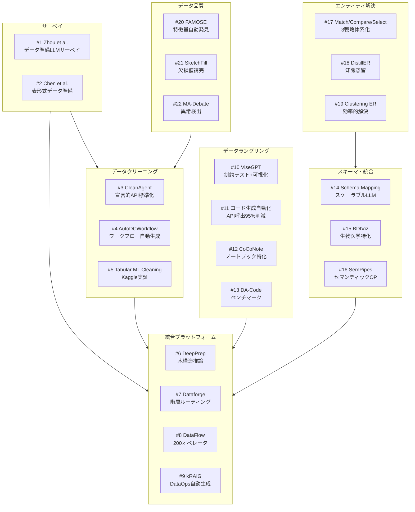

# データ前処理 & クリーニング自動化 — 詳細レポート

## パラメータ

- **分析リソース数**: 22件
- **リソースタイプ**: 学術論文
- **生成日**: 2026-04-12
- **入力元**: gather 出力 (`20260412_data_preprocessing/resources-data-preprocessing.md`)
- **重点セクション**: 全セクション（コア手法・結果・動機・応用）
- **詳細レベル**: 詳細（200-400行/レポート）

## レポート一覧

### サーベイ（#1-2）

| # | タイトル | 著者 | 年 | Venue | 概要 | レポート |
|---|---------|------|-----|-------|------|---------|
| 1 | Can LLMs Clean Up Your Mess? A Survey of Application-Ready Data Preparation with LLMs | Zhou et al. | 2026 | arXiv | クリーニング・統合・エンリッチメントの3カテゴリで体系化する包括的サーベイ | [詳細](01-survey-data-preparation-llm.md) |
| 2 | Empowering Tabular Data Preparation with Language Models | Chen et al. | 2025 | arXiv | 表形式データ前処理におけるLM活用の理由と手法のサーベイ | [詳細](02-survey-tabular-data-preparation.md) |

### データクリーニング・標準化（#3-5）

| # | タイトル | 著者 | 年 | Venue | 概要 | レポート |
|---|---------|------|-----|-------|------|---------|
| 3 | CleanAgent: Automating Data Standardization with LLM-based Agents | Qi et al. | 2024 | arXiv | Dataprep.Clean統合、宣言的APIによるワンライナー標準化 | [詳細](03-cleanagent.md) |
| 4 | AutoDCWorkflow: LLM-based Data Cleaning Workflow Auto-Generation | Li et al. | 2024 | EMNLP 2025 | クリーニング手順自動生成、96テーブル・142テストケースのベンチマーク | [詳細](04-autodcworkflow.md) |
| 5 | Exploring LLM Agents for Cleaning Tabular ML Datasets | Bendinelli et al. | 2025 | ICLR 2025 WS | Kaggleデータセットでの誤エントリ自動検出・修正の実証的検証 | [詳細](05-llm-agents-cleaning-tabular.md) |

### データ前処理統合プラットフォーム（#6-9）

| # | タイトル | 著者 | 年 | Venue | 概要 | レポート |
|---|---------|------|-----|-------|------|---------|
| 6 | DeepPrep: LLM-Powered Agentic System for Autonomous Data Preparation | Fan et al. | 2026 | arXiv | 木構造推論、Qwen3-14BでGPT-5匹敵を15倍低コストで達成 | [詳細](06-deepprep.md) |
| 7 | Dataforge: Agentic Platform for Autonomous Data Engineering | Wang et al. | 2025 | arXiv | 階層的ルーティング+デュアルフィードバック、9データセット全てでRL手法を上回る | [詳細](07-dataforge.md) |
| 8 | DataFlow: LLM-Driven Framework for Unified Data Preparation | Liang et al. | 2025 | arXiv | 約200モジュラーオペレータ+9専門エージェント、1万サンプルで100万匹敵 | [詳細](08-dataflow.md) |
| 9 | kRAIG: Natural Language-Driven Agent for DataOps Pipeline Generation | Siva et al. | 2026 | arXiv | ReQuesActフレームワーク、ELT-Benchで既存比3倍の改善 | [詳細](09-kraig.md) |

### データラングリング・コード生成（#10-13）

| # | タイトル | 著者 | 年 | Venue | 概要 | レポート |
|---|---------|------|-----|-------|------|---------|
| 10 | ViseGPT: Better Alignment of LLM-generated Data Wrangling Scripts | Zhu et al. | 2025 | UIST 2025 | 制約ベーステスト検証+ガントチャート可視化、デバッグ効率大幅改善 | [詳細](10-visegpt.md) |
| 11 | Data Wrangling Task Automation Using Code-Generating LMs | Akella et al. | 2025 | AAAI 2025 | 行単位→コード生成パラダイムでAPI呼出95-98%削減 | [詳細](11-data-wrangling-code-gen.md) |
| 12 | Contextualized Data-Wrangling Code Generation in Notebooks | Huang et al. | 2024 | ASE 2024 | 58,221例CoCoNoteデータセット+DataCoderモデル | [詳細](12-coconote-datacoder.md) |
| 13 | DA-Code: Agent Data Science Code Generation Benchmark | Huang et al. | 2024 | arXiv | 500タスクのエージェントDSベンチマーク（GPT-4で30.5%） | [詳細](13-da-code.md) |

### スキーママッチング・データ統合（#14-16）

| # | タイトル | 著者 | 年 | Venue | 概要 | レポート |
|---|---------|------|-----|-------|------|---------|
| 14 | Towards Scalable Schema Mapping using LLMs | Buss et al. | 2025 | arXiv | サンプリング+集約による大規模スキーママッピングの自動化 | [詳細](14-scalable-schema-mapping.md) |
| 15 | BDIViz: Biomedical Schema Matching with LLM-Powered Validation | Wu et al. | 2025 | arXiv | 生物医学スキーママッチング+インタラクティブ可視化 | [詳細](15-bdiviz-schema-matching.md) |
| 16 | SemPipes: Semantic Data Operators for Tabular ML Pipelines | Ovcharenko et al. | 2026 | arXiv | 宣言的セマンティックオペレータによるMLパイプライン自動化 | [詳細](16-sempipes.md) |

### エンティティ解決（#17-19）

| # | タイトル | 著者 | 年 | Venue | 概要 | レポート |
|---|---------|------|-----|-------|------|---------|
| 17 | Match, Compare, or Select? LLMs for Entity Matching | Wang et al. | 2024 | arXiv | 3戦略の体系的調査+ComEMフレームワーク | [詳細](17-entity-matching-llm.md) |
| 18 | DistillER: Knowledge Distillation in Entity Resolution with LLMs | Zeakis et al. | 2026 | arXiv | LLM知識蒸留によるコスト効率の高いER | [詳細](18-distiller.md) |
| 19 | In-context Clustering-based Entity Resolution with LLMs | Fu et al. | 2025 | SIGMOD 2026 | インコンテキスト学習+クラスタリングによる効率的ER | [詳細](19-incontext-clustering-er.md) |

### 特徴量・欠損値・異常検出（#20-22）

| # | タイトル | 著者 | 年 | Venue | 概要 | レポート |
|---|---------|------|-----|-------|------|---------|
| 20 | FAMOSE: A ReAct Approach to Automated Feature Discovery | Burghardt et al. | 2026 | arXiv | ReActパラダイムで特徴量を自律的に探索・生成・精製 | [詳細](20-famose-feature-discovery.md) |
| 21 | SketchFill: Sketch-Guided Code Generation for Missing Value Imputation | Zhang et al. | 2024 | arXiv | スケッチベース導出欠損値補完、CoT比56.2%精度向上 | [詳細](21-sketchfill.md) |
| 22 | Multi-Agent Debate for Tabular Anomaly Detection | Wang & Li | 2026 | arXiv | 複数異種モデル間の不一致をLLM批評エージェントが解決 | [詳細](22-multi-agent-debate-anomaly.md) |

## リソース間の関係マップ



### データ前処理パイプラインにおける位置づけ

```
生データ取得
  │
  ├── スキーマ理解・統合 (#14, #15, #16)
  │     └── エンティティ解決 (#17, #18, #19)
  │
  ├── データクリーニング (#3, #4, #5)
  │     ├── 標準化 (CleanAgent)
  │     ├── エラー検出・修正 (AutoDCWorkflow)
  │     └── 異常検出 (#22 Multi-Agent Debate)
  │
  ├── データラングリング・変換 (#10, #11, #12)
  │     ├── コード生成ベース
  │     └── ユーザーインタラクション (ViseGPT)
  │
  ├── 欠損値補完 (#21 SketchFill)
  │
  ├── 特徴量エンジニアリング (#20 FAMOSE)
  │
  └── 統合プラットフォーム (#6, #7, #8, #9)
        └── 上記すべてをパイプラインとして自動化
```

## 手法比較テーブル

### データクリーニングシステムの比較

| 手法 | 年 | アプローチ | 自動化レベル | 主要結果 |
|------|-----|----------|------------|---------|
| CleanAgent (#3) | 2024 | 宣言的API+LLMエージェント | カラム単位の標準化 | ワンライナー実行 |
| AutoDCWorkflow (#4) | 2024 | ワークフロー自動生成 | テーブル単位のクリーニング | 142テストケースBM構築 |
| Tabular ML (#5) | 2025 | LLMエージェント直接適用 | 行単位の誤エントリ修正 | 単一行成功、複数行に課題 |

### 統合プラットフォームの比較

| 手法 | 年 | オペレータ数 | 推論方式 | コスト効率 | 主要結果 |
|------|-----|-----------|---------|----------|---------|
| DeepPrep (#6) | 2026 | 31 | 木構造推論+RL | GPT-5比1/15 | Qwen3-14Bで匹敵性能 |
| Dataforge (#7) | 2025 | — | 階層ルーティング | 訓練不要 | 9データセット全勝 |
| DataFlow (#8) | 2025 | ~200 | 9専門エージェント | 1万=100万サンプル | 6ドメインパイプライン |
| kRAIG (#9) | 2026 | — | ReQuesAct+RAG | — | ELT-Bench 3倍改善 |

### エンティティ解決手法の比較

| 手法 | 年 | 戦略 | コスト対策 | Venue |
|------|-----|------|----------|-------|
| Match/Compare/Select (#17) | 2024 | 3戦略体系化+ComEM | 最適戦略選択 | arXiv |
| DistillER (#18) | 2026 | LLM→小モデル蒸留 | 推論コスト大幅削減 | arXiv |
| Clustering ER (#19) | 2025 | インコンテキスト+クラスタリング | ペアワイズ比較削減 | SIGMOD 2026 |

## 追加調査候補

| タイトル | 理由 |
|---------|------|
| Jellyfish (Li et al., 2024) | データ前処理特化のLLMモデル、サーベイで頻繁に言及 |
| CLLM4Rec (Lei et al., 2024) | LLMによるデータクリーニングの推薦システム応用 |
| TableGPT2 (Su et al., 2024) | テーブル理解のファウンデーションモデル、前処理能力を含む |
| ELT-Bench (#ベンチ参考) | ELTパイプライン構築のAIエージェント評価 |
