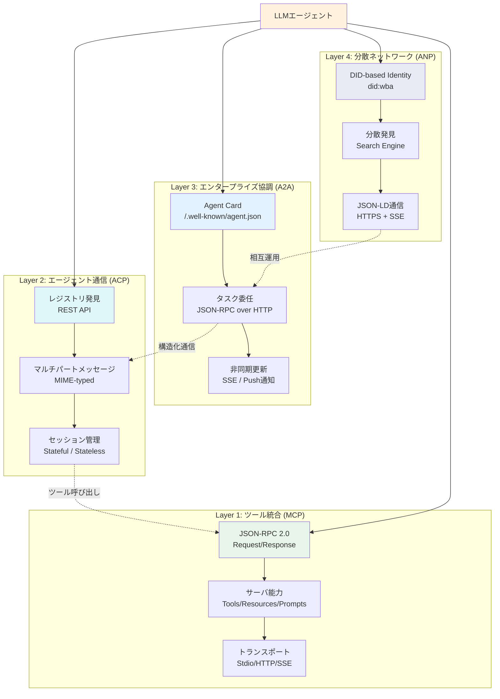
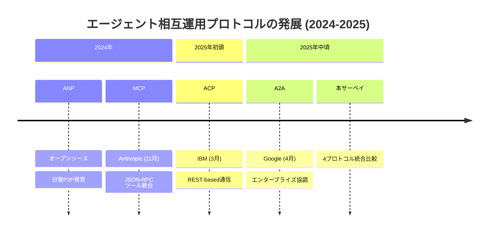
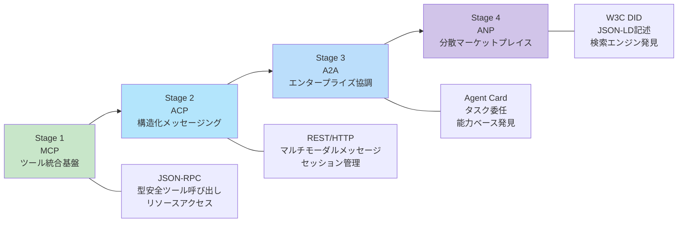
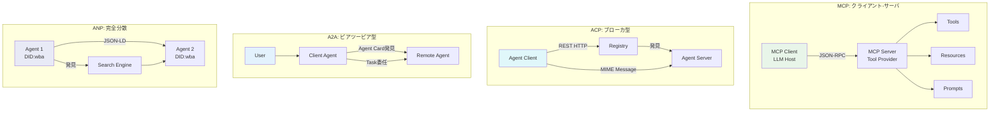

# A Survey of Agent Interoperability Protocols: MCP, ACP, A2A, and ANP

- **Link**: https://arxiv.org/abs/2505.02279
- **Authors**: Abul Ehtesham, Aditi Singh, Gaurav Kumar Gupta, Saket Kumar
- **Year**: 2025
- **Venue**: arXiv preprint (cs.AI)
- **Type**: Academic Paper (Survey)

## Abstract

Large language model powered autonomous agents demand robust, standardized protocols to integrate tools, share contextual data, and coordinate tasks across heterogeneous systems. Ad-hoc integrations are difficult to scale, secure, and generalize across domains. This survey examines four emerging agent communication protocols: Model Context Protocol (MCP), Agent Communication Protocol (ACP), Agent-to-Agent Protocol (A2A), and Agent Network Protocol (ANP), each addressing interoperability in deployment contexts. MCP provides a JSON-RPC client-server interface for secure tool invocation and typed data exchange. ACP defines a general-purpose communication protocol over RESTful HTTP, supporting MIME-typed multipart messages and synchronous and asynchronous interactions. A2A enables peer-to-peer task delegation using capability-based Agent Cards, supporting secure and scalable collaboration across enterprise agent workflows. ANP supports open network agent discovery and secure collaboration using W3C decentralized identifiers (DIDs) and JSON-LD graphs. The protocols are compared across multiple dimensions, including interaction modes, discovery mechanisms, communication patterns, and security models. Based on the comparative analysis, a phased adoption roadmap is proposed.

## Abstract（日本語訳）

大規模言語モデル（LLM）を基盤とする自律エージェントは、ツール統合、コンテキストデータ共有、異種システム間のタスク調整のために、堅牢で標準化されたプロトコルを必要とする。アドホックな統合はスケーリング、セキュリティ確保、ドメイン間の汎化が困難である。本サーベイでは、4つの新興エージェント通信プロトコル（MCP、ACP、A2A、ANP）を調査し、それぞれが対応する相互運用性のデプロイメントコンテキストを検討する。MCPはJSON-RPCクライアント・サーバインターフェースを通じた安全なツール呼び出しと型付きデータ交換を提供する。ACPはRESTful HTTP上の汎用通信プロトコルを定義し、MIME型マルチパートメッセージと同期・非同期インタラクションをサポートする。A2Aは能力ベースのAgent Cardを用いたピアツーピアのタスク委任を実現し、エンタープライズエージェントワークフロー間の安全かつスケーラブルな協調を支援する。ANPはW3C分散識別子（DID）とJSON-LDグラフを用いたオープンネットワークエージェント発見と安全な協調を実現する。比較分析に基づき、段階的な採用ロードマップが提案されている。

## 概要

本論文は、LLMベースの自律エージェント間の相互運用性を実現するための4つの主要プロトコル（MCP、ACP、A2A、ANP）を包括的に比較・分析したサーベイである。各プロトコルの設計思想、アーキテクチャ、セキュリティモデル、発見メカニズムを体系的に整理し、実務的な採用ロードマップを提示している点が特徴的である。

主要な貢献：

1. **4プロトコルの体系的比較**: MCP（Anthropic）、ACP（IBM）、A2A（Google）、ANP（オープンソース）を統一的な評価軸で横断的に比較
2. **多次元比較フレームワーク**: インタラクションモード、発見メカニズム、通信パターン、セキュリティモデルの4軸で評価体系を構築
3. **セキュリティ脅威分析**: 各プロトコルのライフサイクル（作成・運用・更新）フェーズごとの脅威と対策を詳細に整理
4. **段階的採用ロードマップ**: MCP→ACP→A2A→ANPの4段階採用戦略を提案

## 問題と動機

- **アドホック統合の限界**: 現状のLLMエージェント統合は個別のカスタム実装に依存しており、スケーリング、セキュリティ確保、ドメイン間汎化が困難である

- **標準化の不在**: エージェント間通信の標準プロトコルが確立されておらず、異なるベンダー・フレームワーク間の相互運用性が阻害されている

- **セキュリティの断片化**: 各システムが独自のセキュリティモデルを採用しており、クロスシステムの信頼確立が困難

- **発見メカニズムの欠如**: エージェントが動的に他のエージェントやツールを発見・選択するための標準化された仕組みが不足している

- **体系的レビューの必要性**: 2024-2025年に急速に登場した複数のプロトコルを横断的に比較・分析した文献が欠けていた

## 分類フレームワーク / タクソノミー

本サーベイは、エージェント相互運用プロトコルを以下の多次元分類体系で整理している。

### プロトコル階層モデル

4つのプロトコルは、エージェントエコシステムにおける異なるレイヤを対象としている。

**Layer 1 — ツール統合層（MCP）**: LLMと外部ツール・リソース間のインターフェースを標準化する基盤層。JSON-RPC 2.0ベースのクライアント・サーバアーキテクチャにより、型安全なツール呼び出しとデータ交換を実現する。

**Layer 2 — エージェント通信層（ACP）**: 独立したエージェント間の構造化されたメッセージングを提供する中間層。RESTful HTTPベースで、MIME型マルチパートメッセージ、セッション管理、同期・非同期通信を統合的にサポートする。

**Layer 3 — エンタープライズ協調層（A2A）**: 組織内の信頼されたエージェント間のタスク委任と協調を実現する層。Agent Cardベースの能力公開とJSON-RPCベースのタスク管理を組み合わせ、エンタープライズワークフローに対応する。

**Layer 4 — 分散ネットワーク層（ANP）**: オープンインターネット規模の分散エージェント発見と協調を実現する最上位層。W3C DIDベースの分散アイデンティティとJSON-LDベースのセマンティック記述を活用し、プラットフォーム横断的な相互運用性を提供する。

### 各プロトコルのアーキテクチャコンポーネント

**MCP（Model Context Protocol）**:
- プロトコル層: JSON-RPC 2.0仕様
- トランスポート層: Stdio、HTTP、Server-Sent Events（SSE）
- サーバ能力: Tools（ツール呼び出し）、Resources（構造化データ）、Prompts（再利用可能テンプレート）、Sampling（サーバ委任LLMテキスト生成）
- ライフサイクル: 初期化（バージョンネゴシエーション）→ 運用 → シャットダウン

**ACP（Agent Communication Protocol）**:
- Agent Detail: JSON/YAML自己記述メタデータ
- 発見メカニズム: レジストリAPI、マニフェストファイル、コンテナラベル
- メッセージ構造: MIMEアノテーション付きの順序付きパート
- セッションモデル: デフォルトはステートレス、オプションで永続的コンテキスト

**A2A（Agent-to-Agent Protocol）**:
- 3つの主要アクタ: User（タスク発信者）、Client Agent（仲介者）、Remote Agent（スキル実行者）
- Agent Card: `/.well-known/agent.json`に配置されるJSON形式の能力記述
- Skills: 名前付きスキーマ定義された離散操作
- トランスポート: JSON-RPC 2.0 over HTTP + SSE/プッシュ通知

**ANP（Agent Network Protocol）**:
- 分散アイデンティティ: `did:wba`メソッドによるDIDドキュメント
- Agent Description Protocol（ADP）: JSON-LD形式のエージェント記述
- 発見ディレクトリ: `.well-known/agent-descriptions`
- インターフェース: 構造化（JSON-RPC, OpenAPI）、自然言語（YAMLスキーマ）、メタプロトコルネゴシエータ

## アルゴリズム / 擬似コード

```
Algorithm: 段階的プロトコル採用ロードマップ
Input: エージェントエコシステムの成熟度レベル L, 要件セット R
Output: 採用プロトコルセット P

1: P ← {}
2: // Stage 1: ツール統合基盤の確立
3: if R.requires_tool_access then
4:     deploy MCP servers with JSON-RPC schemas
5:     configure transport (Stdio | HTTP | SSE)
6:     P ← P ∪ {MCP}
7: end if
8:
9: // Stage 2: エージェント間通信の構造化
10: if R.requires_agent_communication then
11:     deploy ACP with RESTful HTTP endpoints
12:     configure MIME-typed multipart messaging
13:     enable session management for multi-turn workflows
14:     P ← P ∪ {ACP}
15: end if
16:
17: // Stage 3: エンタープライズ協調の実現
18: if R.requires_enterprise_collaboration then
19:     publish Agent Cards at /.well-known/agent.json
20:     implement task delegation via A2A JSON-RPC
21:     configure push notifications for async updates
22:     P ← P ∪ {A2A}
23: end if
24:
25: // Stage 4: 分散エージェントマーケットプレイス
26: if R.requires_open_network then
27:     establish DID-based identity (did:wba)
28:     publish JSON-LD agent descriptions
29:     enable decentralized discovery via search engines
30:     P ← P ∪ {ANP}
31: end if
32:
33: return P
```

## アーキテクチャ / プロセスフロー



## Figures & Tables

### Table 1: プロトコル比較マトリクス

| 比較次元 | MCP | ACP | A2A | ANP |
|---------|-----|-----|-----|-----|
| 提供元 | Anthropic (2024) | IBM (2025) | Google (2025) | OSS (2024) |
| アーキテクチャ | クライアント-サーバ (JSON-RPC) | ブローカ型クライアント-サーバ | ピアツーピア型 | 完全分散P2P |
| 発見方式 | 手動/静的URL | レジストリベース | Agent Card (HTTP) | 検索エンジン発見 |
| 認証/ID | トークンベース; DIDオプション | Bearer Token, mTLS, JWS | DIDベース or ヘッダ | did:wba + 公開鍵 |
| メッセージ形式 | JSON-RPC 2.0 + Prompts/Tools | マルチパートMIME | Task + Artifact (JSON) | JSON-LD + Schema.org |
| セッション | ステートレス + オプションコンテキスト | セッションアウェア (状態追跡) | クライアント管理セッションID | ステートレス; DIDトークン |
| 対象スコープ | LLM-ツール統合 | インフラレベルエージェント | エンタープライズタスク委任 | オープンインターネット |
| 同期通信 | JSON-RPC req/res | HTTP直接呼び出し | タスク投入 | HTTPS req/res |
| 非同期通信 | SSE (オプション) | ストリーミング, セッション追跡 | SSE / Push通知 | ロングポーリング / SSE |

### Table 2: セキュリティ脅威と対策の比較

| 脅威カテゴリ | MCP対策 | ACP対策 | A2A対策 | ANP対策 |
|-------------|---------|---------|---------|---------|
| ID詐称 | SBOM + デジタル署名 | マニフェスト署名 + CI/CD検証 | Agent Card署名 + チェックサム | HTTPS-hosted DID + DNS検証 |
| メッセージ改竄 | スキーマ検証 + セマンティックガード | TLS + JWS (パート単位) | TLS + JWS + スコープトークン | 暗号署名 + アクセスログ |
| 認証欠陥 | OAuth 2.1 + PKCE, mTLS | 能力スコープ短寿命トークン | スコープトークン | DID公開鍵認証 |
| リソース孤立 | ロール監査 + 認証ローテーション | タスクドレイン + 認証失効 | シャットダウンフック + 失効 | 有効期限 + 失効シグナル |

### Figure 1: プロトコル発展タイムライン



### Figure 2: 段階的採用ロードマップ



### Table 3: 通信パターン詳細比較

| パターン | MCP | ACP | A2A | ANP |
|---------|-----|-----|-----|-----|
| リクエスト-レスポンス | JSON-RPC 2.0 | HTTP REST | JSON-RPC over HTTP | HTTPS |
| ストリーミング | SSE (オプション) | インクリメンタル結果 | SSE | ロングポーリング |
| プッシュ通知 | なし | なし | PushNotificationService | なし |
| マルチターン | オプションコンテキスト | セッション状態追跡 | セッションID管理 | DIDトークン永続化 |
| メッセージ型 | JSON (4種: Request, Result, Error, Notification) | MIMEマルチパート | Task + Artifact + Message | JSON-LD |

### Figure 3: 各プロトコルのアーキテクチャ比較



## 主要な知見と分析

### プロトコル成熟度の評価

- **MCP**はツール統合において最も成熟しており、Anthropic主導で急速にエコシステムが拡大している。しかし中央集権的なサーバ仮定とプロンプトインジェクション脆弱性が課題
- **ACP**はIBMのエンタープライズ知見を反映した堅牢な設計だが、レジストリ依存性とサーバ制御仮定が強い
- **A2A**はGoogleのエンタープライズ指向設計で、Agent Cardベースの発見が実用的だが、管理されたエージェントカタログの維持を前提としている
- **ANP**は最も野心的な分散設計だが、プロトコルネゴシエーションのオーバーヘッドが高く、採用エコシステムが発展途上

### 相互補完性の発見

4プロトコルは競合ではなく相互補完的な関係にあることが重要な知見として示されている。MCPがツール層、ACPが通信層、A2Aが協調層、ANPがネットワーク層をそれぞれ担当し、段階的に採用することでエコシステム全体の相互運用性を実現できる。

### 今後の課題

1. **プロトコル間ブリッジ**: 異なるプロトコルを採用するエージェント間の相互運用性を確保するブリッジ技術の開発
2. **クロス組織信頼フレームワーク**: 組織横断的なエージェント協調のための信頼確立メカニズム
3. **標準化評価ベンチマーク**: プロトコル採用を加速するための統一的な評価基準の策定
4. **実環境耐障害性**: 実運用環境におけるレジリエンス保証の確立

## 備考

- 2024年末から2025年初頭にかけて主要テック企業（Anthropic、IBM、Google）が相次いでプロトコルを発表しており、エージェント相互運用性が産業界の重要課題として認識されていることを示す
- ANPのみがオープンソースコミュニティ主導である点は、分散化とオープン性の観点から注目に値する
- 本サーベイの段階的採用ロードマップ（MCP→ACP→A2A→ANP）は、実務的なエージェントシステム設計の指針として有用
- セキュリティ分析（Tables 3-6）は各プロトコルのライフサイクルフェーズごとの脅威を網羅しており、セキュリティ設計のリファレンスとして価値が高い
- 4プロトコルの比較において「相互補完性」を強調している点は、プロトコル選択を二者択一ではなくレイヤードアプローチとして捉える視座を提供している
