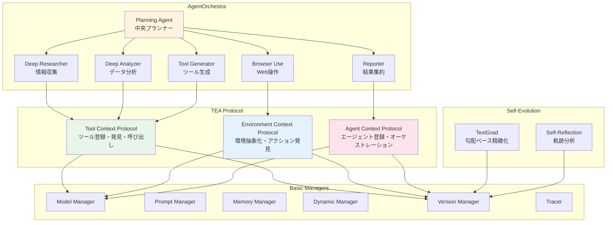
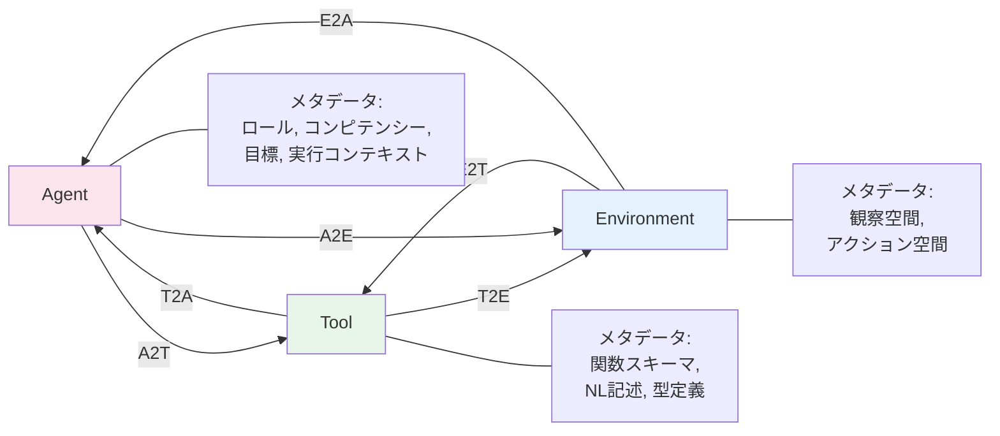
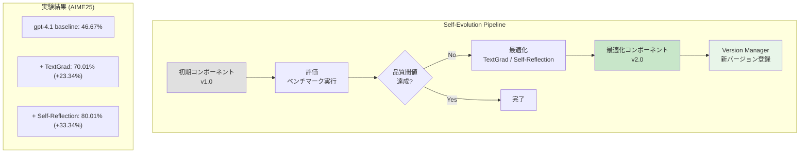

# AgentOrchestra: Orchestrating Multi-Agent Intelligence with the TEA Protocol

- **Link**: https://arxiv.org/abs/2506.12508
- **Authors**: Wentao Zhang, Liang Zeng, Yuzhen Xiao, Yongcong Li, Ce Cui, Yilei Zhao, Rui Hu, Yang Liu, Yahui Zhou, Bo An
- **Year**: 2025
- **Venue**: arXiv preprint (cs.AI)
- **Type**: Academic Paper (Systems / Framework)

## Abstract

The paper addresses limitations in existing LLM-based agent protocols by introducing the TEA protocol -- a unified abstraction modeling environments, agents, and tools as first-class resources with explicit lifecycles and versioned interfaces. This framework improves lifecycle management, version tracking, traceability, and reproducibility. AgentOrchestra, built on TEA, is a hierarchical multi-agent system where a central planner coordinates specialized sub-agents for web navigation, data analysis, and file operations. The system supports continual adaptation through dynamic tool instantiation and refinement. Evaluation across three benchmarks demonstrates state-of-the-art results, achieving 89.04% on GAIA, with evidence that TEA and hierarchical orchestration enhance scalability and generality in multi-agent systems.

## Abstract（日本語訳）

本論文は、既存のLLMベースエージェントプロトコルの限界に対処するため、TEAプロトコルを導入する。TEAは環境（Environment）、エージェント（Agent）、ツール（Tool）をファーストクラスリソースとしてモデル化し、明示的なライフサイクルとバージョン管理インターフェースを備えた統一的な抽象化である。このフレームワークにより、ライフサイクル管理、バージョン追跡、トレーサビリティ、再現性が向上する。TEA上に構築されたAgentOrchestraは、中央プランナーがWeb操作、データ分析、ファイル操作の専門サブエージェントを調整する階層型マルチエージェントシステムである。動的なツールインスタンス化と精緻化を通じた継続的適応を支援する。3つのベンチマークでの評価により、GAIAで89.04%の最先端結果を達成し、TEAと階層的オーケストレーションがマルチエージェントシステムのスケーラビリティと汎用性を向上させることを実証した。

## 概要

本論文は、マルチエージェントシステムにおけるコンポーネント管理の標準化という課題に対して、TEA（Tool-Environment-Agent）プロトコルという統一的抽象化を提案し、その上に構築されたAgentOrchestraシステムの設計と評価を報告する研究である。

主要な貢献：

1. **TEAプロトコルの提案**: ツール、環境、エージェントの3要素を、明示的なライフサイクル・バージョン管理を持つファーストクラスリソースとして統一的に扱うプロトコルを設計
2. **プロトコル変換メカニズム**: A2T（Agent-to-Tool）、T2A（Tool-to-Agent）、E2T（Environment-to-Tool）等の双方向変換により、コンポーネント間の動的な役割再構成を実現
3. **自己進化モジュール**: TextGradおよびSelf-reflectionによるコンポーネントの自動最適化と新バージョン登録
4. **AgentOrchestraの実装と評価**: GAIA 89.04%、SimpleQA 95.3%、Humanity's Last Exam 37.46%の最先端性能を達成

## 問題と動機

- **コンポーネント管理の断片化**: 既存のマルチエージェントフレームワークでは、ツール、環境、エージェントがそれぞれ独自のインターフェースで管理されており、統一的なライフサイクル管理やバージョン追跡が困難

- **再現性とトレーサビリティの欠如**: エージェントの実行結果を再現するために必要なコンポーネントバージョン情報やコンテキスト情報が体系的に管理されていない

- **動的適応の困難**: 実行時に新しいツールを生成・登録したり、既存コンポーネントを最適化するための標準化されたメカニズムが存在しない

- **スケーラビリティの課題**: 単一エージェントでは複雑なマルチドメインタスク（Web操作+データ分析+ファイル処理）に対応困難であり、専門化された複数エージェントの効果的な協調が必要

## 提案手法

### TEAプロトコルの3つのコアプロトコル

**Tool Context Protocol (TCP)**: MCPを拡張し、統合的なコンテキストエンジニアリングと包括的ライフサイクル管理を導入。ツールは関数呼び出しスキーマ（LLM向け）、自然言語記述、型安全な引数スキーマの複数フォーマットで登録される。ベクトル埋め込みによるセマンティック検索で発見を実現。

**Environment Context Protocol (ECP)**: 計算環境を観察空間とアクション空間を持つ形式化された抽象化として定義。環境固有のアクションを自動発見し、標準化されたインターフェースに変換する。ブラウザ、ファイルシステム等の異種ドメインにカスタム適応なしで対応。

**Agent Context Protocol (ACP)**: エージェントの登録、表現、オーケストレーションのための統一フレームワーク。ロール、コンピテンシー、目標に関するセマンティックに豊富なメタデータを含む実行コンテキストを管理。

### プロトコル変換

コンポーネント間の動的な役割再構成を可能にする6つの変換:
- **A2T（Agent-to-Tool）**: エージェント能力を標準化されたツールインターフェースとしてカプセル化
- **T2A（Tool-to-Agent）**: エージェント目標をパラメータ化されたツール呼び出しにマッピング
- **E2T（Environment-to-Tool）**: 環境アクションをツールインターフェースに変換
- **T2E（Tool-to-Environment）**: ツールコレクションを環境抽象化に昇格
- **A2E / E2A**: エージェントと環境の双方向変換

### 自己進化モジュール

コンポーネントを「進化可能な変数」としてラップし、2つの最適化手法を適用:
- **TextGrad**: 言語モデルフィードバックを用いた勾配ベースの精緻化
- **Self-reflection**: 戦略分析と軌跡精緻化による自己改善

最適化されたコンポーネントはバージョンマネージャを通じて新バージョンとして自動登録される。

## アルゴリズム / 擬似コード

```
Algorithm: AgentOrchestra 階層型タスク実行
Input: 複合タスク T, TEAプロトコル環境 Env
Output: 最終結果 R

1: // Phase 1: タスク分解（Planning Agent）
2: subtasks ← PlanningAgent.decompose(T)
3:
4: for each subtask s_i in subtasks do
5:     // Phase 2: 専門エージェント選択
6:     agent ← ACP.select_agent(s_i.requirements)
7:
8:     // Phase 3: ツール発見と実行
9:     tools ← TCP.semantic_search(s_i.tool_needs)
10:    if tools.is_empty() then
11:        // 動的ツール生成
12:        new_tool ← ToolGeneratorAgent.synthesize(s_i)
13:        TCP.register(new_tool)
14:        tools ← {new_tool}
15:    end if
16:
17:    // Phase 4: 環境設定と実行
18:    env ← ECP.configure(s_i.domain)
19:    result_i ← agent.execute(s_i, tools, env)
20:
21:    // Phase 5: 自己進化チェック
22:    if result_i.quality < threshold then
23:        optimized ← SelfEvolution.refine(agent, result_i)
24:        VersionManager.register(optimized)
25:    end if
26:
27:    context.update(result_i)
28: end for
29:
30: // Phase 6: 結果集約（Reporter Agent）
31: R ← ReporterAgent.aggregate(context, deduplicate=True)
32: return R
```

## アーキテクチャ / プロセスフロー



## Figures & Tables

### Table 1: GAIA ベンチマーク結果比較

| システム | Level 1 | Level 2 | Level 3 | 平均 |
|---------|---------|---------|---------|------|
| **AgentOrchestra** | **98.92%** | **85.53%** | **81.63%** | **89.04%** |
| AWorld | -- | -- | -- | 77.58% |
| Langfun | -- | -- | -- | 76.97% |
| Manus | -- | -- | -- | 73.90% |
| OpenAI Deep Research | -- | -- | -- | 67.36% |
| HuggingFace ODR (o1) | -- | -- | -- | 55.15% |

### Table 2: アブレーションスタディ（GAIA Test）

| 構成要素 | Level 1 | Level 2 | Level 3 | 平均 | 改善率 |
|---------|---------|---------|---------|------|--------|
| P (Planner only) | 54.84% | 33.96% | 10.20% | 36.54% | -- |
| P+R (+ Researcher) | 86.02% | 47.17% | 34.69% | 57.14% | +56.40% |
| P+R+B (+ Browser) | 89.25% | 71.07% | 46.94% | 72.76% | +27.33% |
| P+R+B+A (+ Analyzer) | 91.40% | 77.36% | 61.22% | 79.07% | +8.67% |
| P+R+B+A+T (+ Tool Gen) | 98.92% | 85.53% | 81.63% | 89.04% | +12.61% |

### Figure 1: TEAプロトコル変換ダイアグラム



### Table 3: ベンチマーク横断結果

| ベンチマーク | タスク数 | AgentOrchestra | 最強ベースライン | 改善幅 |
|-------------|---------|----------------|-----------------|--------|
| GAIA Test | 301 | 89.04% | AWorld 77.58% (val) | +11.46pp |
| SimpleQA | 4,326 | 95.3% | Perplexity DR 93.9% | +1.4pp |
| Humanity's Last Exam | 2,500 | 37.46% | OpenAI DR 26.6% | +10.86pp |

### Figure 2: 自己進化の効果



### Table 4: 処理効率分析

| タスク複雑度 | 処理時間 | トークン消費量 | 例 |
|-------------|---------|-------------|-----|
| 単純 | ~30秒 | 5,000 tokens | 単一ファイル操作 |
| 中程度 | ~3分 | 25,000 tokens | マルチステップ分析 |
| 高複雑度 | ~10分 | 100,000 tokens | マルチモーダル長期タスク |

## 主要な知見と分析

### 階層的オーケストレーションの有効性

アブレーションスタディにより、各サブエージェントの追加が段階的に性能を向上させることが実証された。特にTool Generator Agentの追加による12.61%の改善は、動的ツール生成の重要性を示している。評価中に50以上の専門ツールが自律的に生成され、30%の再利用率を達成した。

### TEAプロトコルの設計上の利点

- **統一的抽象化**: ツール・環境・エージェントを同一のインターフェースで管理することで、コンポーネント間の相互変換が容易になり、システムの柔軟性が向上
- **バージョン管理**: 各コンポーネントの進化履歴を追跡可能にし、実行結果の再現性を確保
- **セマンティック検索**: ベクトル埋め込みによるツール発見により、事前登録されていないツールの動的生成と利用が可能

### 自己進化の効果

AIME25ベンチマークにおいて、Self-reflectionによる最適化でgpt-4.1ベースラインから33.34%の性能向上を達成。GPQA-Diamondでも61.11%→68.18%の改善を確認。コンポーネントの自動最適化が実用的であることを示す。

### 制約と課題

- アドホックスクリプティングと比較して学習曲線が急峻
- プロトコルのオーバーヘッドによるレイテンシ増加の可能性
- 基盤LLMの推論・指示追従能力に本質的に依存

## 備考

- GAIA Test（301問）で89.04%という結果は、2025-2026年時点での最先端であり、特にLevel 3（最高難度）での81.63%は注目に値する
- MCPの拡張としてTCPを位置づけている点は、既存エコシステムとの互換性を意識した実用的な設計判断
- プロトコル変換（A2T, T2A等）の概念は、エージェント・ツール・環境の境界を流動的にする斬新なアプローチであり、今後のマルチエージェントフレームワーク設計に影響を与える可能性がある
- 自律的ツール生成（50+ツール、30%再利用率）は、エージェントの自己拡張能力の実用性を示す重要な実証
- 不正自動化やプライバシーリスクなどの悪用可能性についても言及しており、責任あるAI開発の観点からの配慮が見られる
