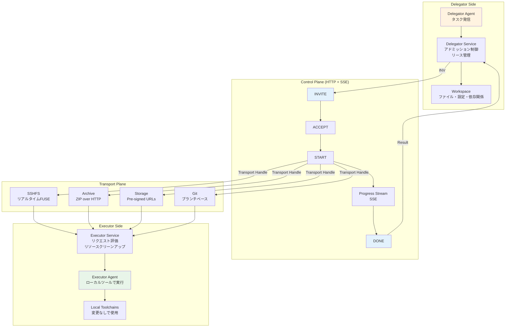
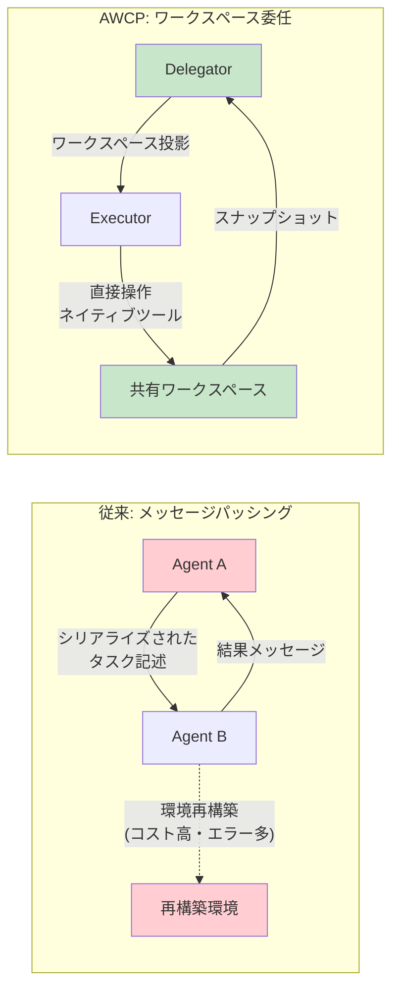
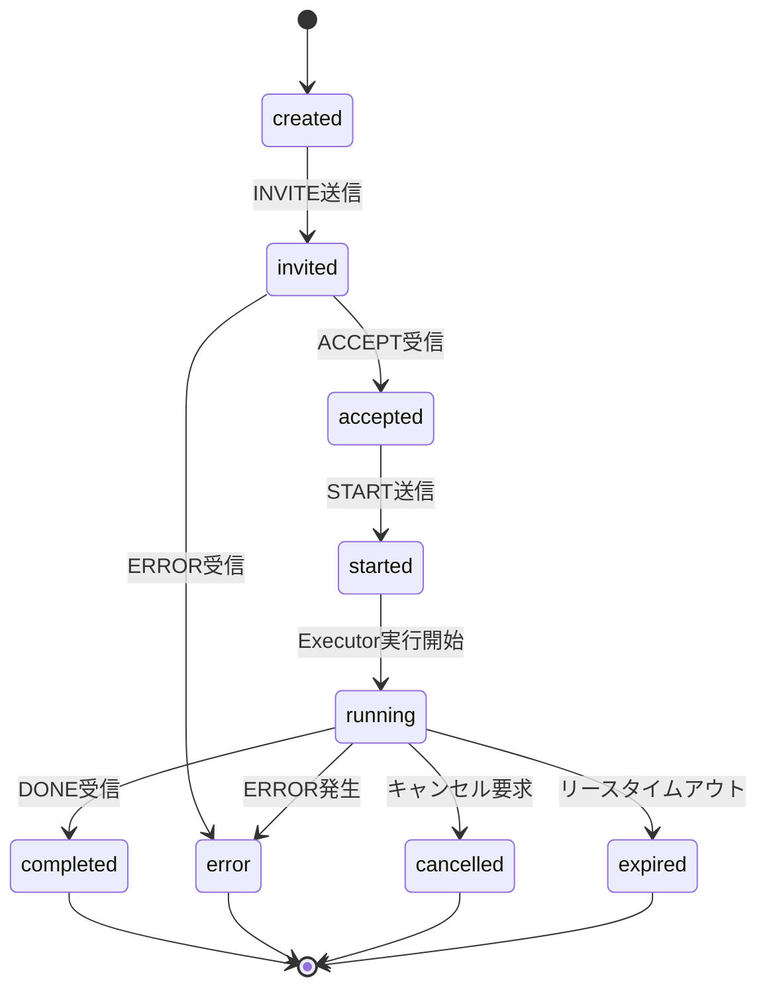

# AWCP: A Workspace Delegation Protocol for Deep-Engagement Collaboration across Remote Agents

- **Link**: https://arxiv.org/abs/2602.20493
- **Authors**: Xiaohang Nie, Zihan Guo, Youliang Chen, Yuanjian Zhou, Weinan Zhang
- **Year**: 2026
- **Venue**: arXiv preprint (cs.NI, cs.MA), Tech Report (16 pages, 7 figures)
- **Type**: Academic Paper (Protocol Design / Systems)

## Abstract

The rapid evolution of Large Language Model (LLM)-based autonomous agents is reshaping the digital landscape toward an emerging Agentic Web, where increasingly specialized agents must collaborate to accomplish complex tasks. However, existing collaboration paradigms are constrained to message passing, leaving execution environments as isolated silos. This creates a context gap: agents cannot directly manipulate files or invoke tools in a peer's environment, and must instead resort to costly, error-prone environment reconstruction. We introduce the Agent Workspace Collaboration Protocol (AWCP), which bridges this gap through temporary workspace delegation inspired by the Unix philosophy that everything is a file. AWCP decouples a lightweight control plane from pluggable transport mechanisms, allowing a Delegator to project its workspace to a remote Executor, who then operates on the shared files directly with unmodified local toolchains. We provide a fully open-source reference implementation with MCP tool integration and validate the protocol through live demonstrations of asymmetric collaboration, where agents with complementary capabilities cooperate through delegated workspaces.

## Abstract（日本語訳）

大規模言語モデル（LLM）ベースの自律エージェントの急速な発展は、デジタルランドスケープを新たなAgentic Webへと変革しつつある。そこでは、ますます専門化されたエージェントが複雑なタスクを達成するために協調する必要がある。しかし、既存の協調パラダイムはメッセージパッシングに制約されており、実行環境は孤立したサイロのままである。これにより、エージェントはピアの環境内でファイルを直接操作したりツールを呼び出すことができず、コストの高いエラーを生じやすい環境再構築に頼らざるを得ないというコンテキストギャップが生じている。本論文では、「すべてはファイルである」というUnix哲学に着想を得た一時的なワークスペース委任を通じてこのギャップを埋めるAgent Workspace Collaboration Protocol（AWCP）を導入する。AWCPは軽量なコントロールプレーンをプラガブルなトランスポートメカニズムから分離し、DelegatorがワークスペースをリモートのExecutorに投影し、Executorが変更されていないローカルツールチェーンで共有ファイルを直接操作することを可能にする。

## 概要

本論文は、既存のエージェント間協調プロトコル（MCP、A2A、ANP等）がメッセージパッシングに限定されているという根本的な問題を指摘し、ファイルシステムレベルのワークスペース委任という新しい協調パラダイムを提案する研究である。

主要な貢献：

1. **ワークスペース委任パラダイムの提案**: メッセージベースの情報交換ではなく、実行環境そのものの一時的な共有という新しい協調モデルを定義
2. **二層アーキテクチャ設計**: コントロールプレーン（委任ライフサイクル管理）とトランスポートプレーン（ファイル同期）の分離による柔軟な設計
3. **4種のトランスポートアダプタ**: SSHFS（リアルタイム）、Archive（ZIP）、Storage（クラウド）、Git（バージョン管理）の実装
4. **MCP統合**: 7つのMCPツールを通じた既存エージェント（Claude Desktop、Cline等）との即時互換性
5. **オープンソース参照実装**: ~9,200行TypeScript、161テストケース

## 問題と動機

- **メッセージパッシングの限界**: 既存プロトコル（MCP、A2A、ANP）はすべてメッセージベースの情報交換に依存しており、エージェントが相互の実行環境に直接アクセスすることができない

- **コンテキストギャップ**: メッセージ交換では、ファイルシステム構造、依存関係、システム設定といった暗黙的なコンテキストが失われ、正確な環境再構築が困難

- **環境再構築のコスト**: リモートエージェントがタスクを実行するために、送信元の環境を再現する必要があり、これはコストが高くエラーを生じやすい

- **プロトコルスタックの空白**: 既存プロトコルはAgent-Tool境界（MCP）やAgent-Agent境界（A2A/ANP）をカバーするが、Agent-Workspace境界が欠落している

## 提案手法

### 二層アーキテクチャ

**コントロールプレーン**: HTTP + Server-Sent Events（SSE）を通じた委任ライフサイクル管理。セッションネゴシエーション、リース強制、ステータス同期を担当。委任ライフサイクルは4フェーズで構成される:

1. **ネゴシエーション**: DelegatorがINVITEメッセージでタスクを提案、ExecutorがACCEPTまたはERRORで応答
2. **プロビジョニング**: STARTメッセージでデータプレーンをアクティベート、トランスポート固有の認証情報を提供
3. **実行**: Executorが委任されたファイル上でネイティブツールチェーンを用いて操作、SSEで進捗をストリーム
4. **完了**: 結果の照合、両者が2フェーズクリーンアップ（デタッチ、リリース）を実行

**トランスポートプレーン**: プラガブルなアダプタによる実際のファイル同期。コントロールロジックは「ファイルがライブFUSEマウント、ZIPアーカイブ、クラウドストレージ、Gitを介して投影されるかに関わらず不変」。

### 5種のプロトコルメッセージ

| メッセージ | 方向 | 内容 |
|-----------|------|------|
| INVITE | D→E | TaskSpec, LeaseConfig, EnvironmentDeclaration |
| ACCEPT | E→D | ExecutorWorkDir, ExecutorConstraints |
| START | D→E | ActiveLease, TransportHandle |
| DONE | E→D | FinalSummary, Highlights |
| ERROR | 双方向 | ErrorCode, Message, Hint |

### 状態マシン

- **DelegationStateMachine（Delegator側）**: 9状態（created→invited→accepted→started→running→completed + error/cancelled/expired）
- **AssignmentStateMachine（Executor側）**: 4状態（pending→active→completed→error）、意図的に最小化された非対称設計

## アルゴリズム / 擬似コード

```
Algorithm: AWCP Workspace Delegation Protocol
Input: タスク仕様 TaskSpec, ワークスペース W, トランスポート種別 Trans
Output: 実行結果 Result, スナップショット Snapshot

1: // Phase 1: ネゴシエーション
2: invite ← Delegator.createInvite(TaskSpec, LeaseConfig, W.manifest)
3: response ← Executor.receive(invite)
4: if response.type == ERROR then
5:     return Error(response.message)
6: end if
7: constraints ← response.constraints  // Executor側の制約（読み取り専用等）
8:
9: // Phase 2: プロビジョニング
10: transport ← TransportFactory.create(Trans)
11: handle ← transport.provision(W, constraints)
12: Delegator.send(START, handle)
13:
14: // Phase 3: 実行
15: Executor.mount(handle)  // ワークスペースをローカルにマウント/展開
16: while not Executor.isDone() do
17:     // Executorはローカルツールチェーンで直接操作
18:     Executor.executeWithLocalTools(TaskSpec)
19:     Delegator.receiveProgress(SSE)  // 進捗ストリーミング
20: end while
21:
22: // Phase 4: 完了と照合
23: snapshot ← Executor.captureSnapshot()
24: Executor.send(DONE, snapshot.summary)
25:
26: // Phase 5: スナップショット照合
27: switch reconciliation_mode do
28:     case AUTO: Delegator.applySnapshot(snapshot)
29:     case STAGED: await Delegator.manualApproval(snapshot)
30:     case DISCARD: // 読み取り専用、変更なし
31: end switch
32:
33: // Phase 6: クリーンアップ
34: Executor.detach(handle)
35: transport.release(handle)
36: return Result, Snapshot
```

## アーキテクチャ / プロセスフロー



## Figures & Tables

### Table 1: トランスポートアダプタ比較

| トランスポート | メカニズム | リアルタイム同期 | 最適用途 | 監査性 |
|--------------|-----------|--------------|---------|--------|
| SSHFS | SSH + FUSEマウント | あり | インタラクティブ、低レイテンシタスク | 低 |
| Archive | HTTP + ZIP | なし | 小規模ワークスペース、自己完結型 | 中 |
| Storage | Pre-signed URLs | なし | 大規模ファイル、クラウドネイティブ | 中 |
| Git | ブランチベースVCS | なし | 監査可能、バージョン管理された変更 | 高 |

### Table 2: プロトコルスタックにおけるAWCPの位置づけ

| プロトコル | 対象境界 | 主要機能 |
|-----------|---------|---------|
| MCP | Agent-Tool境界 | 関数呼び出し、ツール呼び出し |
| A2A / ANP | Agent-Agent境界 | 能力発見、タスク調整 |
| **AWCP** | **Agent-Workspace境界** | **ファイルシステムレベルアクセス、環境投影** |

### Figure 1: メッセージパッシング vs ワークスペース委任



### Table 3: 参照実装の構成

| パッケージ | 機能 | SLoC | 依存関係 |
|-----------|------|------|---------|
| @awcp/core | プロトコル型、状態マシン | 1,075 | ゼロ |
| @awcp/sdk | サービス、永続化 | 3,643 | -- |
| @awcp/transport-sshfs | SSHFSアダプタ | -- | -- |
| @awcp/transport-archive | ZIPアダプタ | -- | -- |
| @awcp/transport-storage | クラウドストレージアダプタ | -- | -- |
| @awcp/transport-git | Gitアダプタ | -- | -- |
| @awcp/mcp | 7つのMCPツールインターフェース | -- | -- |
| **合計** | | **~9,200** | テスト: 2,600行, 161ケース |

### Figure 2: 委任ライフサイクル状態マシン



## 主要な知見と分析

### ライブデモンストレーションの結果

**クロスモーダルデータセットキュレーション**: テキスト専用のDelegator（Cline + DeepSeek V3.2）がマルチモーダルExecutor（Gemini 3 Pro）に100+の混合画像ファイルの分類・整理を委任。SSHFSトランスポートにより、Executorが委任されたファイルシステム上で視覚分析を直接実行し、手動転送なしで完了。

**コンプライアンススタンプ処理**: OpenClawエージェント（Feishuプラットフォーム）がコンプライアンス監査人に委任。Archiveトランスポートで単一PDFファイルを処理。2ラウンドの委任（1回目は身分証明書不足で拒否、2回目で成功）により反復的協調を実証。

### 設計上の革新

AWCPの核心的洞察は、エージェント協調を普遍的な抽象化（ファイルシステム）の周りに再構成する点にある。「コーディングエージェントはファイルを読み、パッチを書き、テストを実行する。ビジョンエージェントは画像ディレクトリを検査する。コンプライアンスエージェントはPDF文書にスタンプを押す。ファイルシステムは、エージェントが計算環境と対話する媒体そのものである。」

### 制約と課題

- ピアツーピアやエッジ最適化アダプタが未実装（帯域制約環境に非対応）
- ファイルレベルのアクセス制御（権限、ロールベース認可）が未実装
- 単一パーティ委任のみ（複数エージェントの同時ワークスペースアクセス非対応）
- Executorの動的な能力発見メカニズムが欠如

## 備考

- Unix哲学（"everything is a file"）をエージェント協調に適用するという着想は、既存のメッセージパッシングベースのプロトコル群とは根本的に異なるアプローチであり、プロトコルスタックにおける新しいレイヤを定義している
- MCP互換のツールインターフェース（7ツール）を提供することで、Claude DesktopやCline等の既存エージェントが即座にAWCPを利用可能になる実用的な設計
- 4種のトランスポートアダプタ（SSHFS、Archive、Storage、Git）は、異なるユースケース（リアルタイム操作、バッチ処理、大規模ファイル、監査可能性）に対応し、実運用での柔軟性を確保
- 非対称的な状態マシン設計（Delegator: 9状態 vs Executor: 4状態）は、責任分離の原則を反映した実務的な判断
- 将来的なCRDTベースの同期、フェデレーテッドマルチエージェント連合、インセンティブ互換な調整メカニズムなど、研究の発展方向が明確に示されている
- 2026年の論文であり、AWCPは既存の4プロトコル（MCP, ACP, A2A, ANP）の分析を踏まえた上で、それらが見落としていたワークスペース層を補完する位置づけ
