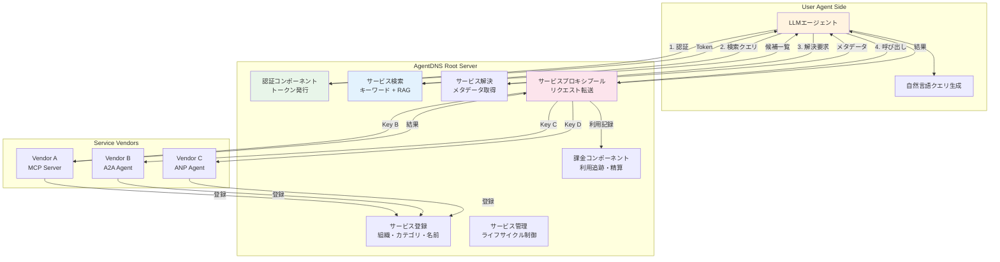
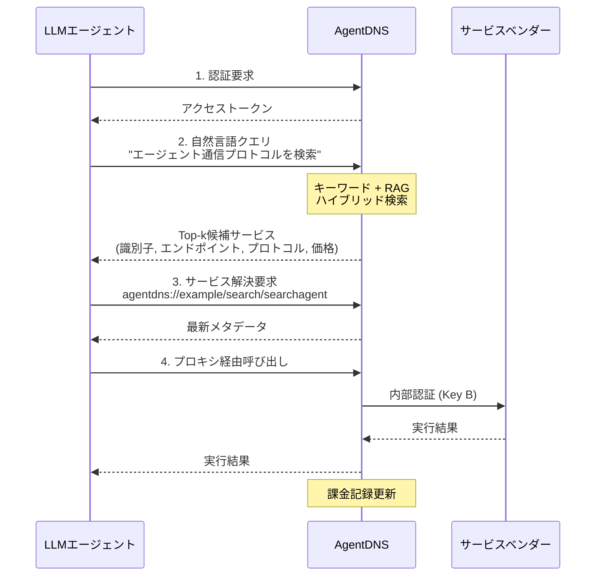
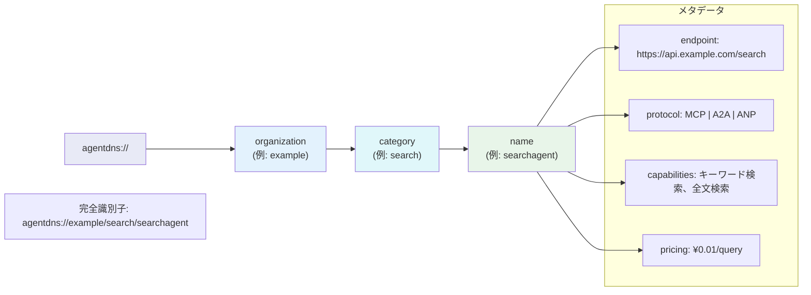

# AgentDNS: A Root Domain Naming System for LLM Agents

- **Link**: https://arxiv.org/abs/2505.22368
- **Authors**: Enfang Cui, Yujun Cheng, Rui She, Dan Liu, Zhiyuan Liang, Minxin Guo, Tianzheng Li, Qian Wei, Wenjuan Xing, Zhijie Zhong
- **Year**: 2025
- **Venue**: arXiv preprint (cs.AI)
- **Type**: Academic Paper (Systems / Infrastructure)

## Abstract

The rapid evolution of Large Language Model (LLM) agents has highlighted critical challenges in cross-vendor service discovery, interoperability, and communication. Existing protocols like Model Context Protocol and Agent-to-Agent Protocol have made significant strides in standardizing interoperability between agents and tools, as well as communication among multi-agents. However, there remains a lack of standardized protocols and solutions for service discovery across different agent and tool vendors. In this paper, we propose AgentDNS, a root domain naming and service discovery system designed to enable LLM agents to autonomously discover, resolve, and securely invoke third-party agent and tool services across organizational and technological boundaries. Inspired by the principles of the traditional DNS, AgentDNS introduces a structured mechanism for service registration, semantic service discovery, secure invocation, and unified billing. We detail the architecture, core functionalities, and use cases of AgentDNS, demonstrating its potential to streamline multi-agent collaboration in real-world scenarios.

## Abstract（日本語訳）

大規模言語モデル（LLM）エージェントの急速な発展により、ベンダー横断的なサービス発見、相互運用性、通信における重要な課題が浮き彫りになっている。Model Context ProtocolやAgent-to-Agent Protocolなどの既存プロトコルは、エージェントとツール間の相互運用性やマルチエージェント間の通信の標準化において大きな進歩を遂げている。しかし、異なるエージェント・ツールベンダー間のサービス発見のための標準化されたプロトコルとソリューションが依然として不足している。本論文では、LLMエージェントが組織的・技術的境界を越えてサードパーティのエージェント・ツールサービスを自律的に発見、解決、安全に呼び出すことを可能にするルートドメイン命名およびサービス発見システムであるAgentDNSを提案する。伝統的なDNSの原則に着想を得て、サービス登録、セマンティックサービス発見、安全な呼び出し、統一的な課金のための構造化されたメカニズムを導入する。

## 概要

本論文は、LLMエージェントエコシステムにおけるサービス発見の標準化という未解決課題に取り組み、インターネットのDNS（Domain Name System）に着想を得たエージェント向けの命名・発見システムを提案する研究である。

主要な貢献：

1. **DNSアナロジーの適用**: 伝統的DNSのドメイン名→IPアドレス解決を、セマンティックサービス識別子→エンドポイント+メタデータ解決に拡張
2. **ハイブリッド発見メカニズム**: キーワードマッチングとRAG（検索拡張生成）ベースのセマンティック検索を組み合わせた発見システム
3. **統一認証・課金**: 単一認証でのマルチベンダーサービスアクセスと、中央集権的な課金決済モデル
4. **プロトコル非依存メタ層**: MCP、A2A、ANP等の既存プロトコルと共存し、プロトコルを意識したサービス発見を実現

## 問題と動機

- **サービス発見の標準化不在**: MCPやA2Aはエージェント間の通信やツール呼び出しを標準化しているが、「どのサービスが存在し、どこにあり、何ができるか」を発見するための標準化された仕組みが欠如

- **ベンダー横断的なアクセスの困難**: 各ベンダーが独自のAPI認証、エンドポイント形式、課金体系を持っており、エージェントが複数ベンダーのサービスをシームレスに利用することが困難

- **セマンティックギャップ**: エージェントが自然言語でニーズを表現しても、それに適合するサービスを機械的に特定する標準化されたメカニズムがない

- **認証の断片化**: 各サービスごとに個別の認証が必要であり、エージェントが多数のサービスを横断的に利用する際のオーバーヘッドが大きい

## 提案手法

### AgentDNSアーキテクチャ

7つのコアコンポーネントで構成される中央集権型ルートサービスシステム:

**1. サービス登録コンポーネント**: 組織アカウント、サービスカテゴリ、メタデータバインディング（ネットワークアドレス、対応プロトコル、能力）を管理

**2. サービスプロキシプール**: ユーザーエージェントからのリクエストをベンダーエンドポイントに転送する中間層

**3. サービス検索コンポーネント**: キーワードマッチングとRAGベースのセマンティック検索によるハイブリッド発見

**4. サービス解決コンポーネント**: キャッシュされた識別子からの最新メタデータ取得を実現

**5. サービス管理コンポーネント**: プロキシのライフサイクル（作成・更新・削除）管理

**6. 課金コンポーネント**: 利用コスト追跡とベンダー精算

**7. 認証コンポーネント**: 全登録サービスに有効な時間制限付きアクセストークンの発行

### サービス識別子の命名規約

```
agentdns://[organization]/[category]/[name]
```

階層的なカテゴリをスラッシュで区切り、多レベルのサービス分類を実現。伝統的DNSのドメイン名階層に相当する。

### ハイブリッド検索メカニズム

1. 自然言語クエリの受信
2. キーワードマッチング: サービス識別子とメタデータフィールドに対する直接パターン認識
3. RAGベースマッチング: 能力記述から構築された知識ベースに対するセマンティック検索
4. Top-k候補サービスの返却（識別子名、物理エンドポイント、プロトコル、能力記述、価格情報を含む）

### 統一認証モデル

3層セキュリティ構造:
1. **エージェント認証**: AgentDNSルートサーバへの単一認証で時間制限付きアクセストークンを取得
2. **プロキシ抽象化**: AgentDNSプロキシがベンダー固有のAPIキーを内部的に保持
3. **リクエスト転送**: ユーザーエージェントは発行されたトークンでAgentDNSプロキシにリクエストを投入、プロキシが保存された認証情報でベンダーに認証

## アルゴリズム / 擬似コード

```
Algorithm: AgentDNS サービス発見・解決・呼び出しフロー
Input: 自然言語クエリ q, エージェント認証トークン token
Output: サービス実行結果 result

1: // Phase 1: 認証
2: if not token.is_valid() then
3:     token ← AgentDNS.authenticate(agent_credentials)
4: end if
5:
6: // Phase 2: サービス発見（ハイブリッド検索）
7: keyword_results ← KeywordMatcher.search(q, service_registry)
8: semantic_results ← RAG.search(q, capability_knowledge_base)
9: candidates ← merge_and_rank(keyword_results, semantic_results, k=top_k)
10:
11: // Phase 3: サービス選択
12: for each candidate c_i in candidates do
13:     if c_i.protocol in agent.supported_protocols then
14:         selected ← c_i
15:         break
16:     end if
17: end for
18:
19: // Phase 4: サービス解決
20: if agent.cache.has(selected.identifier) then
21:     metadata ← AgentDNS.resolve(selected.identifier)
22:     agent.cache.update(metadata)
23: else
24:     metadata ← selected.full_metadata
25:     agent.cache.store(metadata)
26: end if
27:
28: // Phase 5: プロキシ経由の安全な呼び出し
29: proxy_endpoint ← AgentDNS.getProxy(selected.identifier)
30: result ← proxy_endpoint.invoke(
31:     request=q,
32:     auth_token=token,
33:     protocol=metadata.protocol
34: )
35:
36: // Phase 6: 課金
37: AgentDNS.billing.deduct(token.account, result.usage_cost)
38:
39: return result
```

## アーキテクチャ / プロセスフロー



## Figures & Tables

### Table 1: 伝統的DNS vs AgentDNS の対応関係

| DNS要素 | AgentDNS対応物 | 拡張点 |
|---------|--------------|--------|
| ドメイン名 (example.com) | セマンティックサービス識別子 (agentdns://org/cat/name) | 階層的カテゴリ |
| IPアドレス | 物理エンドポイント + プロトコルメタデータ | リッチメタデータ |
| 階層的分散化 | スラッシュ区切りの多レベルカテゴリ | セマンティック階層 |
| 名前→アドレス解決 | 識別子→メタデータ解決 | 能力記述、プロトコル、課金情報 |
| DNSキャッシュ | エージェント側のメタデータキャッシュ | 解決頻度の最適化 |

### Table 2: 既存プロトコルとの役割分担

| プロトコル | 主要機能 | AgentDNSとの関係 |
|-----------|---------|-----------------|
| MCP (Anthropic) | ツール呼び出しインターフェース | 共存レイヤ — MCPサービスをAgentDNSで発見可能 |
| A2A (Google) | エージェント間通信 | 共存レイヤ — A2Aエージェントをプロトコル指定で発見 |
| ANP (OSS) | 分散エージェント発見 | 補完関係 — ANPの分散発見をAgentDNSの中央発見で補完 |
| **AgentDNS** | **サービス発見・命名・認証・課金** | **メタレイヤ — プロトコルを意識した相互運用性を実現** |

### Figure 1: サービス発見・解決シーケンス



### Table 3: AgentDNSコンポーネント機能一覧

| コンポーネント | 機能 | 入力 | 出力 |
|-------------|------|------|------|
| 認証 | トークン発行・検証 | エージェント認証情報 | 時間制限付きトークン |
| 登録 | サービスメタデータ管理 | 組織・カテゴリ・能力記述 | サービス識別子 |
| 検索 | ハイブリッド発見 | 自然言語クエリ | Top-k候補一覧 |
| 解決 | メタデータ取得・更新 | サービス識別子 | 最新メタデータ |
| プロキシ | リクエスト転送・認証抽象化 | ユーザーリクエスト + トークン | ベンダー実行結果 |
| 管理 | プロキシライフサイクル | 管理操作 | 状態変更 |
| 課金 | 利用追跡・精算 | 利用記録 | 請求・決済 |

### Figure 2: サービス識別子の構造



## 主要な知見と分析

### アーキテクチャ上の特徴

AgentDNSは既存プロトコルと競合するのではなく、メタレイヤとして機能する点が重要な設計判断である。MCP、A2A、ANPのいずれのプロトコルで提供されるサービスも、AgentDNSに登録・発見可能であり、エージェントは対象サービスの対応プロトコルに応じて動的に通信方式を選択できる。

### セマンティック発見の実用性

キーワードマッチングとRAGベースのセマンティック検索を組み合わせたハイブリッドアプローチにより、エージェントが自然言語でニーズを表現し、適合するサービスを自動発見できる。これは従来のAPI検索カタログやマニュアルベースのサービス選択を大幅に効率化する。

### 中央集権モデルの利点と課題

**利点**: 統一認証による認証オーバーヘッドの削減、中央課金による精算の簡素化、メタデータの一元管理による一貫性確保

**課題**: 単一障害点（SPOF）のリスク、中央集権的なメタデータ保存におけるプライバシー懸念、パフォーマンスボトルネックの可能性

### 今後の研究方向

1. **分散化・フェデレーション化**: ブロックチェーンベースの実装による耐障害性と組織横断信頼の向上
2. **AgentDNS対応LLM**: AgentDNSサービス選択に最適化されたファインチューニングモデル
3. **プライバシー保護発見**: 準同型暗号、差分プライバシー、安全なマルチパーティ計算
4. **レピュテーションシステム**: サービス品質評価メカニズム
5. **パフォーマンス最適化**: 検索アルゴリズムとキャッシュ戦略の改善

## 備考

- 中国国家重点研究開発計画の支援を受けた研究であり、中国におけるエージェントインフラ標準化への国家レベルの投資を反映している
- 伝統的DNSとのアナロジーは直感的で分かりやすいが、実際のスケーラビリティやパフォーマンスに関する定量的評価が論文に欠けている点は課題
- 統一課金モデルは実務的に有用だが、ベンダー側のインセンティブ設計（手数料率、決済周期等）の詳細が不明
- プロキシ抽象化による認証一元化は、セキュリティの観点では認証情報の集中管理リスクを伴う（プロキシが侵害された場合の影響範囲が広い）
- MCP、A2Aとの「共存レイヤ」としての位置づけは、前述のサーベイ論文（Paper 1）の段階的採用ロードマップと整合的
- 将来の分散化方向（ブロックチェーン、フェデレーション）は、ANPの分散型アプローチとの収斂を示唆している
