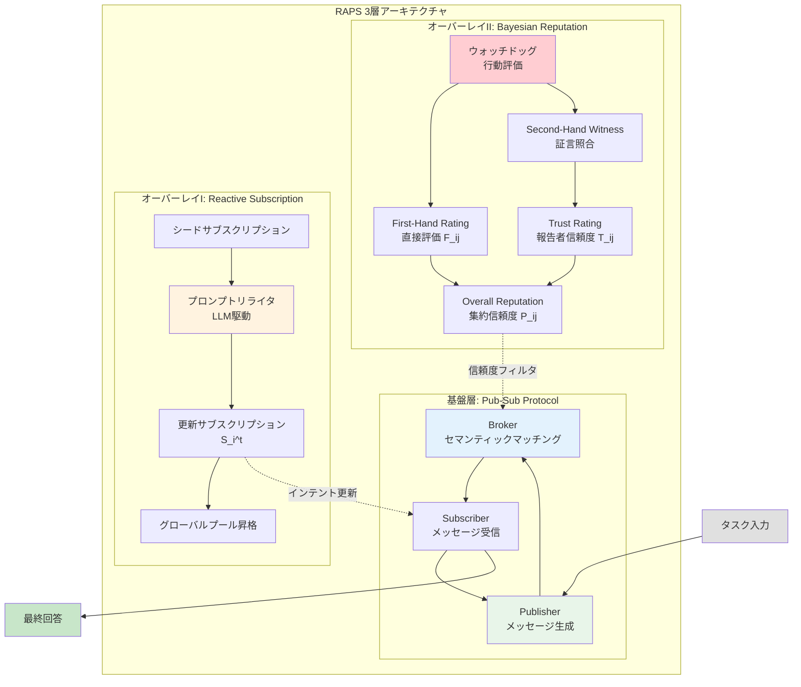
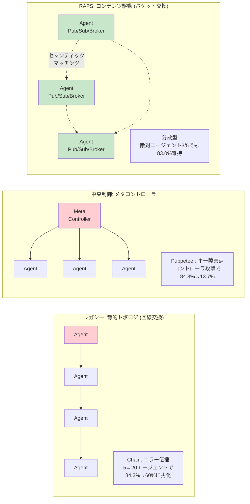
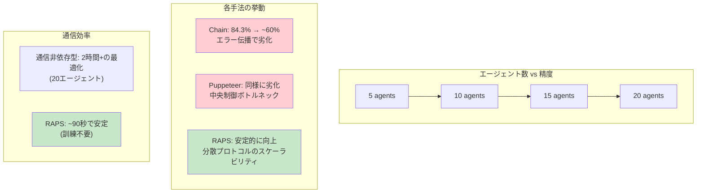

# Towards Adaptive, Scalable, and Robust Coordination of LLM Agents: A Dynamic Ad-Hoc Networking Perspective

- **Link**: https://arxiv.org/abs/2602.08009
- **Authors**: Rui Li, Zeyu Zhang, Xiaohe Bo, Quanyu Dai, Chaozhuo Li, Feng Wen, Xu Chen
- **Year**: 2026
- **Venue**: arXiv preprint (cs.AI, cs.CL)
- **Type**: Academic Paper (Framework / Algorithm)

## Abstract

Multi-agent architectures built on large language models (LLMs) have demonstrated the potential to realize swarm intelligence through well-crafted collaboration. However, the substantial burden of manual orchestration inherently raises an imperative to automate the design of agentic workflows. We frame such an agent coordination challenge as a classic problem in dynamic ad-hoc networking: How to establish adaptive and reliable communication among a scalable number of agentic hosts? In response to this unresolved dilemma, we introduce RAPS, a reputation-aware publish-subscribe paradigm for adaptive, scalable, and robust coordination of LLM agents. RAPS is grounded in the Distributed Publish-Subscribe Protocol, allowing LLM agents to exchange messages based on their declared intents rather than predefined topologies. Beyond this substrate, RAPS further incorporates two coherent overlays: (i) Reactive Subscription, enabling agents to dynamically refine their intents; and (ii) Bayesian Reputation, empowering each agent with a local watchdog to detect and isolate malicious peers. Extensive experiments over five benchmarks showcase that our design effectively reconciles adaptivity, scalability, and robustness in a unified multi-agent coordination framework.

## Abstract（日本語訳）

大規模言語モデル（LLM）に基づくマルチエージェントアーキテクチャは、精巧に設計された協調を通じて群知能を実現する可能性を示してきた。しかし、手動のオーケストレーションの大きな負担は、エージェントワークフロー設計の自動化を本質的に要求する。本論文は、このエージェント調整の課題を動的アドホックネットワーキングの古典的問題として定式化する：スケーラブルな数のエージェントホスト間で、いかに適応的かつ信頼性のある通信を確立するか？この未解決のジレンマに対して、適応的、スケーラブル、かつ堅牢なLLMエージェント調整のためのレピュテーション認識型パブリッシュ・サブスクライブパラダイムであるRAPSを導入する。RAPSは分散パブリッシュ・サブスクライブプロトコルに基づき、事前定義されたトポロジではなく宣言されたインテントに基づいてメッセージを交換する。さらに2つのオーバーレイ（Reactive Subscription: 動的インテント精緻化、Bayesian Reputation: 悪意のあるピアの検出・隔離）を統合する。5つのベンチマークでの広範な実験により、適応性、スケーラビリティ、堅牢性を統一フレームワークで両立することを実証した。

## 概要

本論文は、LLMベースマルチエージェントシステムの調整問題を動的アドホックネットワーキングの視点から再定式化し、パブリッシュ・サブスクライブモデルをベースとした新しい調整パラダイムを提案する研究である。

主要な貢献：

1. **ネットワーキングアナロジーの導入**: エージェント調整を動的アドホックネットワーキングの問題として捉え、既存のエージェントオーケストレーション手法を「レガシー回線交換ネットワーク」として位置づける新しい視座を提供
2. **RAPSフレームワーク**: 分散パブリッシュ・サブスクライブプロトコルを基盤に、Reactive SubscriptionとBayesian Reputationの2つのオーバーレイを統合した3層構造の調整フレームワーク
3. **ベイズ的レピュテーションシステム**: Beta-Bernoulliモデルに基づく分散型信頼評価メカニズムにより、悪意のあるエージェントの検出・隔離を実現
4. **包括的実験評価**: 5ベンチマーク、30手法との比較、敵対的ストレステスト、スケーラビリティ分析を含む体系的な評価

## 問題と動機

- **手動オーケストレーションの負担**: 現行のマルチエージェントシステムは、エージェント間の通信トポロジ（Chain、Star、Tree等）を人手で設計する必要があり、タスクごとの最適化が困難

- **静的トポロジの限界**: 事前定義された通信構造は、タスクの多様性やエージェントの動的な能力変化に対応できず、エラー伝播（Chain構造で5→20エージェントで84.3%→60%に低下）を引き起こす

- **セキュリティの脆弱性**: 中央メタコントローラを持つシステム（例：Puppeteer）は、そのコントローラが攻撃されると壊滅的な性能低下（84.3%→13.7%）を示す単一障害点を形成

- **スケーラビリティの壁**: 通信非依存型の手法（AFlow、G-Designer等）はエージェントプール拡大時に2時間以上の最適化オーバーヘッドが発生し、実用的なスケーリングが困難

## 提案手法

### 3層アーキテクチャ

**基盤層 — 分散パブリッシュ・サブスクライブプロトコル**

エージェントを3つの機能ロールに分離:
- **Subscriber (f_i^S)**: システムプロンプトを通じてエージェント能力を宣言し、特定メッセージ種別の処理可能性を表明
- **Publisher (f_i^P)**: 受信メッセージとコンテキストに基づきコアLLMポリシーを実行し、受信者を指定せず新しいパブリケーションを生成
- **Broker (f_i^B)**: 分散セマンティックマッチングにより、パブリケーションとサブスクリプションプール間の互換性を評価し、受信者セットを導出

調整サイクルは2フェーズを交互に実行:
- **パブリケーションフェーズ**: アクティブエージェントが受信メッセージを集約し、新しいパブリケーションを生成
- **ブローカレッジフェーズ**: ブローカーがパブリケーションを互換サブスクリプションにマッチングし、受信者を動的決定

**オーバーレイI — Reactive Subscription**

LLM駆動のプロンプトリライタがシードサブスクリプションを特化:
```
S_i^(t) = f_i^S(S_i^(t-1), H_i^(t-1) ∪ M_i^(t-1))
```
受信メッセージから「顕著なインテント、制約、ツール手がかり」を識別し、サブスクリプションを動的に更新。確認シグナル受信時にグローバルプールへ昇格させ、トポロジ再構成なしで動的なメンバーシップ発見を実現。

**オーバーレイII — Bayesian Reputation**

各エージェントが全ピアに対して3つの確率的評価を維持:
- **First-Hand Rating (F_ij)**: 直接的な行動評価
- **Trust Rating (T_ij)**: レピュテーション報告者としての信頼性
- **Overall Reputation (P_ij)**: 集約されたピア信頼度

Beta-Bernoulliモデルによる共役Beta分布で疑似カウント (x_ij*, y_ij*) を管理し、β(1,1)で初期化:
```
x_ij* ← λ·x_ij* + s_ij*
y_ij* ← λ·y_ij* + (1 - s_ij*)
```
減衰係数 λ ∈ (0,1] により最近の観測を重視し、行動変化への適応を実現。

## アルゴリズム / 擬似コード

```
Algorithm: RAPS Coordination Protocol
Input: エージェントプール A = {a_1, ..., a_n}, タスク Q, 最大ラウンド K
Output: 最終回答 answer

1: // 初期化
2: for each agent a_i in A do
3:     S_i ← a_i.system_prompt         // 初期サブスクリプション
4:     P_i ← {β(1,1) for all peers}   // レピュテーション初期化
5: end for
6:
7: m_0 ← Q                             // 初期パブリケーション = タスク
8: R_active ← {a_1}                    // 初期アクティブセット
9:
10: for t = 1 to K do
11:     // Phase A: パブリケーション
12:     for each a_i in R_active do
13:         m_i^(t) ← f_i^P(S_i, H_i^(t-1) ∪ M_i^(t-1))
14:     end for
15:
16:     // Phase B: Reactive Subscription更新
17:     for each a_i in A do
18:         S_i^(t) ← f_i^S(S_i^(t-1), H_i^(t-1) ∪ M_i^(t-1))
19:     end for
20:
21:     // Phase C: レピュテーション認識ブローカレッジ
22:     for each publication m_i^(t) do
23:         // ウォッチドッグ検証
24:         score ← f_i^D(m_i^(t))  // 0=正常, 1=異常
25:         update F_ij with discounted Bayesian rule
26:
27:         // セカンドハンド証言の照合
28:         for each recent interactant k do
29:             deviation ← |E[F_kj] - E[P_ij]| / sqrt(Var(F_kj) + Var(P_ij))
30:             if deviation ≥ δ then
31:                 update T_ik (信頼度低下)
32:             else
33:                 merge F_kj into P_ij with weight ω
34:             end if
35:         end for
36:
37:         // レピュテーションフィルタリング + セマンティックマッチング
38:         R_i^(t+1) ← f_i^B(m_i^(t), S, P_i)
39:     end for
40:
41:     R_active ← ∪_i R_i^(t+1)
42: end for
43:
44: answer ← aggregate(all publications)
45: return answer
```

## アーキテクチャ / プロセスフロー



## Figures & Tables

### Table 1: 5ベンチマーク性能比較

| 手法 | MMLU | GSM8K | SVAMP | AQuA | HumanEval | 平均 |
|------|------|-------|-------|------|-----------|------|
| **RAPS** | **88.2%** | **95.4%** | **92.2%** | **82.6%** | **91.5%** | **89.98%** |
| G-Designer | 86.3% | 93.2% | 90.7% | 79.4% | 90.2% | 87.96% |
| AFlow | 85.6% | 94.1% | 90.0% | 78.5% | 91.0% | 87.84% |
| Puppeteer | 84.3% | 93.3% | 89.5% | 77.5% | 75.3% | 83.98% |
| CoT (単一エージェント) | -- | -- | -- | -- | -- | baseline |
| Chain (静的) | -- | -- | -4.9% (SVAMP) | -- | -- | 性能低下 |

### Table 2: 敵対的エージェント耐性テスト（MMLU）

| 構成 (信頼/敵対) | Chain | G-Designer | Puppeteer-C | RAPS | RAPS (w/o BR) |
|-----------------|-------|-----------|-------------|------|---------------|
| 5T / 0A | 84.3% | 86.3% | 84.3% | 88.2% | 87.6% |
| 4T / 1A | 72.5% | 80.4% | 13.7% | 87.6% | 85.3% |
| 3T / 2A | 50.3% | 37.9% | N/A | 84.3% | 69.3% |
| 2T / 3A | 22.2% | 15.0% | N/A | 83.0% | -- |

### Figure 1: エージェント調整パラダイムの比較



### Table 3: アブレーションスタディ

| 構成 | MMLU | 影響 |
|------|------|------|
| RAPS (完全) | 88.2% | -- |
| - Reactive Subscription | 85.6% | -2.6% |
| - Bayesian Reputation | 86.9% | -1.3% |
| - 両方除去 | 83.7% | -4.5% |
| + LLMベースBroker | 89.5% | +1.3% (効率トレードオフ) |

### Figure 2: スケーラビリティ分析



### Table 4: 調整パラダイム分類

| カテゴリ | 代表手法 | 平均改善 | 主な課題 |
|---------|---------|---------|---------|
| 単一エージェント | CoT, ComplexCoT, Self-Consistency | +1.8-2.6% | マルチエージェントシナジー欠如 |
| 静的マルチエージェント | Chain, Star, Tree | 性能低下あり | 構造的硬直性、エラー伝播 |
| 通信非依存型 | GPTSwarm, AFlow, G-Designer | +5.3-7.0% | 推論時メッセージフロー非考慮 |
| メタ制御型 | Puppeteer, MAS-Zero, AutoAgents | +2.9-4.0% | 中央集権ボトルネック |
| **コンテンツ駆動 (RAPS)** | **RAPS** | **+9.0%** | **基盤モデル依存** |

## 主要な知見と分析

### ネットワーキングアナロジーの有効性

動的アドホックネットワーキングの視点からエージェント調整を再定式化することで、既存手法の限界を体系的に分類することに成功している。静的トポロジを「回線交換」、RAPSを「パケット交換」と位置づけるアナロジーは、通信プロトコル研究の豊富な知見をエージェントシステムに転用する道を開く。

### 敵対的耐性の重要性

ビザンチンストレステストの結果は特に印象的である。G-Designerは敵対エージェント3体（5体中）で15.0%まで崩壊し、Puppeteerは中央コントローラへの攻撃1体で13.7%に急落するのに対し、RAPSは同条件で83.0%を維持する。Bayesian Reputationなしでは69.3%に低下することから、レピュテーションメカニズムの貢献が定量的に実証されている。

### スケーラビリティの実証

訓練不要で~90秒の安定した推論レイテンシを維持し、エージェント数増加に対して性能が安定的に向上する特性は、実用的なマルチエージェントデプロイメントにおいて重要な利点である。通信非依存型手法の2時間以上の最適化オーバーヘッドと対照的。

### エージェントプール品質への耐性

専門家が設計したロールからナイーブな汎用ロールに移行した場合、G-Designerは9.5%低下するのに対し、RAPSは1.3%のみの低下に留まる。Reactive Subscriptionによるインテントの動的精緻化がこの耐性に寄与している。

## 備考

- パブリッシュ・サブスクライブモデルの採用は、分散システム分野の成熟した技術をマルチエージェント調整に転用する実用的なアプローチであり、理論的基盤が堅固
- ベイズ的レピュテーションシステムは、P2Pネットワークやブロックチェーンの信頼メカニズムからの知見を活用しており、分散型信頼評価の実績ある手法
- GPT-4o-miniを全実験のバックボーンとして使用しており、コスト効率の高い設定で高性能を達成している点は実用的
- コールドスタート問題（初期レピュテーションの不確実性）への対処は今後の課題として明示されている
- 将来的な「学習可能な調整プロトコル」（強化学習や進化的アプローチによるマッチング・信頼計算関数の自動発見）は、メタ最適化の有望な方向性
- 5ベンチマーク（MMLU、GSM8K、SVAMP、AQuA、HumanEval）をカバーする包括的な評価は、推論・数学・コード生成の多様なタスクにおける汎用性を示す
- 本論文のネットワーキング視点は、Paper 1のプロトコルサーベイが扱う通信プロトコル層とは異なるレベル（調整メカニズム層）に焦点を当てており、相互補完的な貢献
