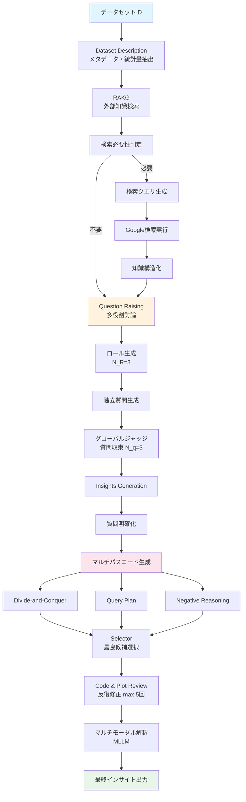
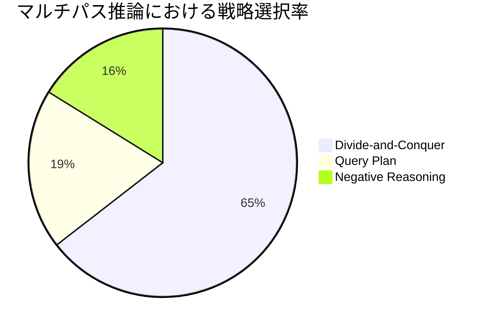
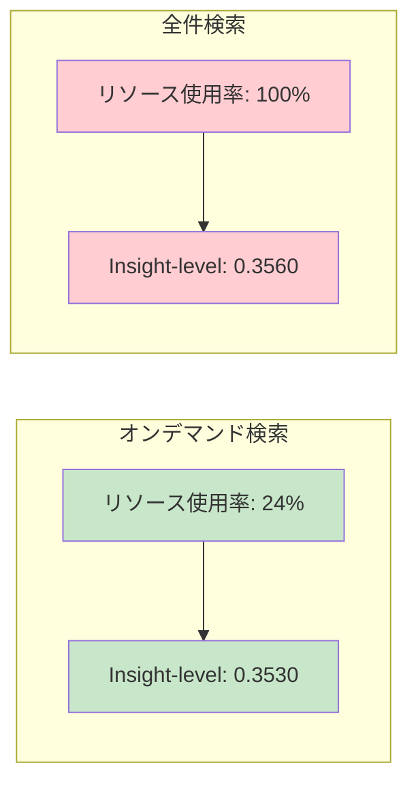
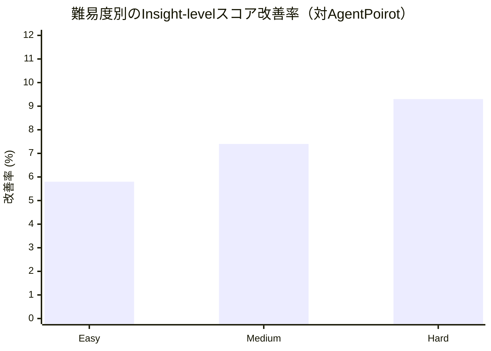

# DataSage: Multi-agent Collaboration for Insight Discovery with External Knowledge Retrieval, Multi-role Debating, and Multi-path Reasoning

- **Link**: https://arxiv.org/abs/2511.14299
- **Authors**: Xiaochuan Liu, Yuanfeng Song, Xiaoming Yin, Xing Chen
- **Year**: 2025
- **Venue**: arXiv (cs.AI / cs.CL / cs.MA)
- **Type**: Academic Paper

## Abstract

Large language models (LLMs) are increasingly applied to automated data analytics and insight discovery. However, existing LLM-driven data agents suffer from three critical limitations: insufficient domain knowledge utilization, shallow analytical depth, and error-prone code generation. DataSage addresses these limitations through a multi-agent framework that incorporates external knowledge retrieval to enhance analytical context, employs a multi-role debating mechanism to represent varied analytical viewpoints and increase analytical rigor, and utilizes multi-path reasoning to enhance code and insight accuracy. Evaluation on InsightBench demonstrates that DataSage outperforms comparable data insight agents across all difficulty levels.

## Abstract（日本語訳）

大規模言語モデル（LLM）は、自動データ分析とインサイト発見に広く適用されつつある。しかし、既存のLLM駆動データエージェントは、ドメイン知識の活用不足、分析の浅さ、コード生成のエラー頻発という3つの重大な限界を抱えている。DataSageは、外部知識検索による分析コンテキストの強化、多役割討論メカニズムによる多角的な分析視点の導入と分析の厳密性向上、マルチパス推論によるコードとインサイトの精度向上を組み合わせたマルチエージェントフレームワークでこれらの課題に取り組む。InsightBenchでの評価により、DataSageが全難易度レベルで既存のデータインサイトエージェントを上回ることが実証された。

## 概要

DataSageは、データ分析におけるインサイト発見を自動化するマルチエージェントフレームワークである。従来のシステムが抱える3つの根本的課題（ドメイン知識不足・分析の浅さ・コードエラー）に対し、外部知識検索（RAKG）、多役割討論（Question Raising）、マルチパス推論（Multi-path Reasoning）の3つの革新的モジュールを統合的に導入する。

主要な貢献：

1. **Retrieval-Augmented Knowledge Generation（RAKG）**: オンデマンド型の外部知識検索により、リソース使用量24%で全検索とほぼ同等の性能を達成
2. **多役割討論メカニズム**: データ駆動で生成された多様な分析ロールが独立に質問を生成し、グローバルジャッジが収束させることで分析の多角性と深度を両立
3. **マルチパス推論**: 分割統治・クエリプラン・ネガティブ推論の3つの相補的CoT戦略でコード品質を大幅に向上
4. **InsightBenchでの最先端性能**: インサイトレベルで+7.5%、サマリーレベルで+13.9%の改善を達成

## 問題と動機

- **ドメイン知識の不足**: 既存のデータ分析エージェントはLLMの内部知識のみに依存しており、専門領域の文脈情報を十分に活用できていない。適切な分析手法の選択や結果の解釈において、ドメイン固有の知識が欠如している

- **分析の浅さ**: 単一エージェントが単一の視点から分析を行うため、データから得られるインサイトの深度と多様性が限定的である。人間のアナリストが持つ多角的な分析アプローチが欠けている

- **コード生成のエラー頻発**: LLMによるコード生成は構文エラーや論理エラーを含みやすく、実行成功率が低い。特に複雑なデータ操作や可視化において、単一の推論パスでは正確なコードの生成が困難

- **既存手法の限界**: AgentPoirotなどの既存マルチエージェントシステムは上記課題を部分的にしか解決しておらず、包括的な解決策が必要

## 提案手法

### 4モジュール構成

DataSageは以下の4つのコアモジュールから構成される。

**1. Dataset Description Module**: データセットのメタデータ抽出、統計量計算、データ品質問題の検出を行い、情報を構造化されたJSON形式に整理する。後続モジュールへの入力コンテキストを構築する基盤モジュール。

**2. Retrieval-Augmented Knowledge Generation（RAKG）**: 4段階プロセスで外部知識を取得する。(a) 検索必要性の判定、(b) Google検索用クエリの生成、(c) リアルタイムWeb検索の実行、(d) 検索結果から構造化された知識アイテムへの変換。オンデマンド方式により計算資源を節約しつつ高品質な知識を供給する。

**3. Question Raising Module（多役割討論）**: 3段階の討論プロセスを実装する。(a) データ駆動でN_R=3個の多様な分析ロールを生成、(b) 各ロールが独立にデータを探索し質問を提起、(c) グローバルジャッジが非自明性・整合性・多様性・相補性の基準で質問を収束させる。

**4. Insights Generation Module**: 質問の明確化、マルチパスコード生成、コードレビュー・修正、マルチモーダル解釈、最終選択の構造化パイプラインでインサイトを生成する。

### マルチパス推論の3戦略

- **Divide-and-Conquer（分割統治）**: 問題を小さなサブ問題に分解して個別に解決（選択率64.50%）
- **Query Plan（クエリプラン）**: 自然言語で論理的な分析手順を記述（選択率19.33%）
- **Negative Reasoning（ネガティブ推論）**: 起こりうるミスを予測し回避（選択率16.17%）

## アルゴリズム / 擬似コード

```
Algorithm: DataSage インサイト発見パイプライン
Input: データセット D, 分析目標 G
Output: インサイト集合 I, 可視化 V

Phase 1: データ記述
1:  desc ← DatasetDescription(D)  // メタデータ・統計量・品質問題

Phase 2: 外部知識取得 (RAKG)
2:  if NeedsRetrieval(G, desc) then
3:      queries ← GenerateSearchQueries(G, desc)
4:      results ← GoogleSearch(queries)
5:      knowledge ← StructureKnowledge(results)
6:  end if

Phase 3: 多役割討論による質問生成
7:  roles ← GenerateRoles(desc, N_R=3)  // データ駆動ロール生成
8:  questions ← ∅
9:  for each role r_i in roles do
10:     q_i ← r_i.ExploreAndQuestion(D, desc, knowledge)
11:     questions ← questions ∪ q_i
12: end for
13: Q_final ← GlobalJudge.Converge(questions, N_q=3)
    // 非自明性・整合性・多様性・相補性で選定

Phase 4: インサイト生成（各質問に対して）
14: for each q in Q_final do
15:     q' ← Clarify(q, desc)  // スキーマ対応の質問明確化
16:     // マルチパスコード生成
17:     c_dc ← DivideAndConquer(q', D)
18:     c_qp ← QueryPlan(q', D)
19:     c_nr ← NegativeReasoning(q', D)
20:     c_0 ← Selector(c_dc, c_qp, c_nr)  // 最良候補選択
21:     // 反復的コード修正
22:     for iter = 1 to N_fix=5 do
23:         feedback ← CodeReviewer(c_0) + PlotReviewer(c_0)
24:         if feedback.is_acceptable then break
25:         c_0 ← Refine(c_0, feedback)
26:     end for
27:     insight_i ← MultimodalInterpret(c_0.output, c_0.plot)
28: end for
29: return AggregateInsights(), Visualizations()
```

## アーキテクチャ / プロセスフロー



## Figures & Tables

### Table 1: 主要ベースラインとの性能比較（InsightBench）

| 手法 | カテゴリ | Insight-level | Summary-level |
|------|---------|---------------|---------------|
| GPT-4o (直接) | LLM-only | -- | -- |
| CodeGen | Single-agent | -- | -- |
| ReAct | Single-agent | -- | -- |
| Data-to-Dashboard | Multi-agent | -- | -- |
| Pandas Agent | Multi-agent | -- | -- |
| AgentPoirot | Multi-agent | 0.3284 | 0.3565 |
| **DataSage** | **Multi-agent** | **0.3530** | **0.4059** |
| 改善率 | -- | +7.5% | +13.9% |

### Table 2: アブレーション実験結果

| 構成 | Insight-level | 変化 |
|------|---------------|------|
| DataSage（フル） | 0.3530 | -- |
| w/o RAKG（外部知識なし） | 0.3316 | -6.1% |
| w/o Multi-path Reasoning | 0.3417 | -3.2% |
| w/o Question Raising | 0.3475 | -1.6% |

### Figure 1: マルチパス推論の戦略選択分布



### Table 3: コード品質の比較

| 指標 | DataSage | ベースライン |
|------|----------|-------------|
| 実行成功率 | 99.50% | 95.17% |
| 平均修正回数 | 1.36 | 1.63 |
| 必要イテレーション数 | 4 | 9 |

### Figure 2: RAKG のリソース効率性



### Figure 3: 難易度別性能改善



### Table 4: 質問生成の多様性比較

| 手法 | 生成質問数 | カバレッジ | 多様性 |
|------|-----------|-----------|--------|
| ベースライン | 12 | 低 | 低 |
| DataSage | 6 | 高 | 高 |

## 実験と評価

### 実験設定

- **データセット**: InsightBench（100個の表形式データセット、Easy/Medium/Hardの3難易度レベル）
- **評価指標**: G-Eval（GPT-4oベースのインサイトレベル・サマリーレベルの自動評価）
- **ハイパーパラメータ**: N_q=3（最終質問数）、N_R=3（ロール数）、N_fix=5（最大修正回数）、N_iter=6（イテレーション数）、temperature=0.0

### 主要結果

1. **全体性能**: DataSageはInsight-levelで0.3530、Summary-levelで0.4059を達成し、最強ベースライン（AgentPoirot）に対してそれぞれ+7.5%、+13.9%の改善を示した

2. **難易度別分析**: Hard難易度での改善が最大（+9.3%）であり、DataSageの各モジュールが複雑なタスクほど効果的に機能することを示している

3. **アブレーション結果**: RAKGの除去が最大の性能低下（-6.1%）を引き起こし、外部知識の重要性を裏付けた。マルチパス推論の除去（-3.2%）、質問生成の除去（-1.6%）と続く

4. **コード品質**: 実行成功率99.50%を達成し、ベースラインの95.17%を大幅に上回った。また、競争力のある性能に到達するまでの必要イテレーション数が9から4に削減された

5. **RAKG効率性**: オンデマンド検索はリソースの24%のみを使用しながら、全件検索（0.3560）に匹敵する0.3530の性能を達成した

### 可視化品質

DataSageはRelevance（関連性）、Clarity（明瞭性）、Annotation（注釈）、Interpretability（解釈可能性）の4次元すべてでベースラインを上回る可視化品質を達成した。

## 備考

- 外部知識検索のオンデマンド方式は、効率性と性能のトレードオフにおいて優れたバランスを実現しており、実用的なシステム設計として参考になる
- マルチパス推論において分割統治戦略が64.50%の選択率で最も頻繁に使用されたことは、データ分析タスクではモジュール的なアプローチが特に有効であることを示唆
- 多役割討論メカニズムは、少ない質問数（6問 vs 12問）でより高い多様性とカバレッジを達成しており、量よりも質を重視した設計の有効性を実証
- 人間のデータアナリストとの性能ギャップは依然として存在しており、今後はタスク難易度に応じたモジュールの適応的な有効化メカニズムの開発が課題
- InsightBenchのみでの評価であり、他のデータ分析ベンチマークでの汎化性能の検証が必要
