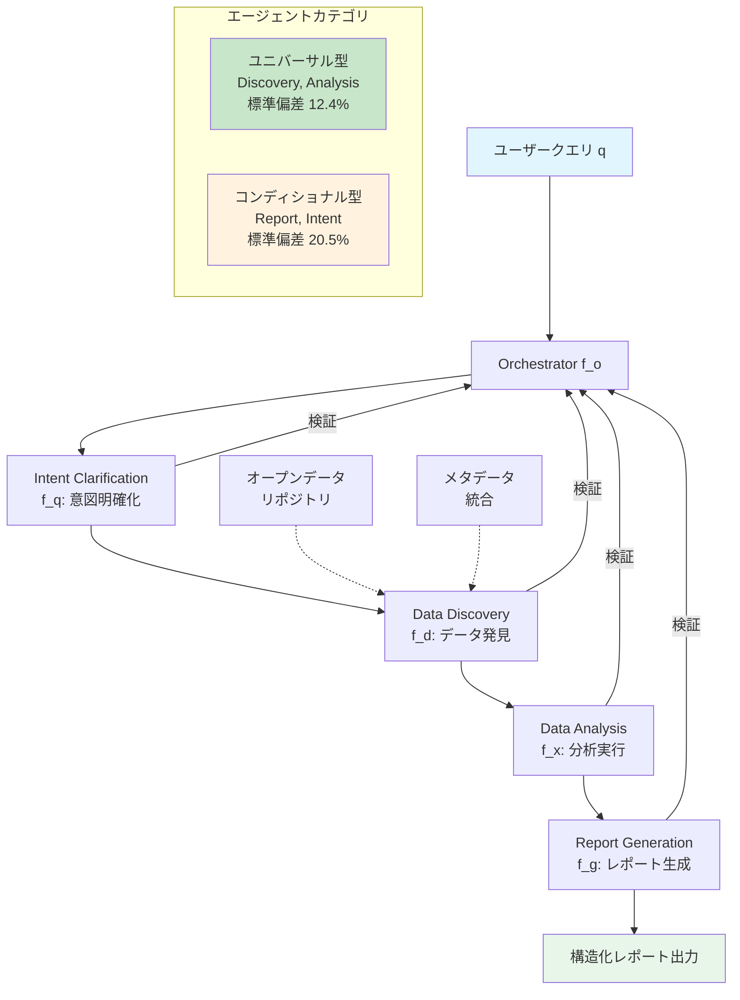
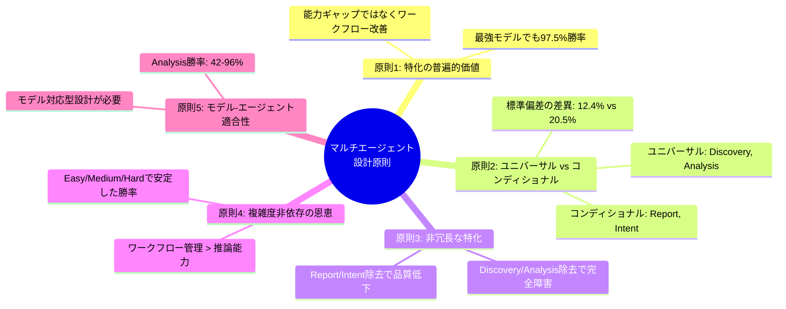

# PublicAgent: Multi-Agent Design Principles From an LLM-Based Open Data Analysis Framework

- **Link**: https://arxiv.org/abs/2511.03023
- **Authors**: Sina Montazeri, Yunhe Feng, Kewei Sha
- **Year**: 2025
- **Venue**: arXiv (cs.AI)
- **Type**: Academic Paper

## Abstract

Open data repositories hold potential for evidence-based decision-making, yet remain inaccessible to non-experts who lack expertise in dataset discovery, schema mapping, and statistical analysis. This paper presents PublicAgent, a multi-agent framework that decomposes analytical tasks into specialized agents handling intent clarification, dataset discovery, analysis, and reporting. Evaluation across five models and 50 queries identifies five core design principles: (1) specialization benefits all models, even the strongest; (2) agents split into universal and conditional categories; (3) different agents mitigate distinct failure modes; (4) architectural benefits persist across task complexity; and (5) significant variance in agent effectiveness across models requires model-aware architecture design. The framework achieves 97.5% agent win rates even with the strongest model.

## Abstract（日本語訳）

オープンデータリポジトリは、エビデンスに基づく意思決定の潜在的な基盤であるが、データセット発見、スキーママッピング、統計分析の専門知識を持たない非専門家にとっては依然としてアクセス困難である。本論文では、分析タスクを意図明確化、データセット発見、分析、レポート生成を担当する特化エージェントに分解するマルチエージェントフレームワークPublicAgentを提案する。5つのモデルと50のクエリにわたる評価により、5つの核心的な設計原則を特定した：(1) 特化は最強モデルにも有益、(2) エージェントはユニバーサル型とコンディショナル型に分類される、(3) 各エージェントは異なる障害モードを軽減する、(4) アーキテクチャの恩恵はタスク複雑度に依存しない、(5) モデル間のエージェント有効性の大きなばらつきがモデル対応型アーキテクチャ設計を要求する。

## 概要

PublicAgentは、オープンデータの民主化を目指すマルチエージェントフレームワークであり、その主眼はシステム性能の最大化ではなく、マルチエージェント設計の原則論的な知見の導出にある。5つのLLMモデルと50の多様なクエリを用いた体系的な実験とアブレーション分析により、エージェント特化の普遍的な有効性、エージェントカテゴリの二分法、障害モードの独立性など、モデルやタスクを超えた一般化可能な設計原則を抽出している。

主要な貢献：

1. **5つの設計原則の実証的導出**: マルチエージェントアーキテクチャの設計に関する一般化可能な知見を、広範な実験から体系的に導出
2. **ユニバーサル vs. コンディショナルエージェントの発見**: エージェントを「全モデルで安定的に有効な型」と「モデル依存で効果が変動する型」に二分する新たな分類法を提案
3. **モデル対応型設計の必要性の実証**: 分析エージェントの勝率が42%〜96%とモデル間で大きく変動することを示し、固定アーキテクチャの限界を指摘
4. **オープンデータ分析の包括的パイプライン**: 意図明確化からレポート生成までの端到端の自動化フレームワーク

## 問題と動機

- **オープンデータのアクセシビリティ**: data.govなどのオープンデータリポジトリは膨大なデータを提供しているが、データセットの発見、スキーマの理解、統計分析の実行には専門知識が必要であり、非専門家は活用できていない

- **単一LLMの限界**: 単一のLLMプロンプトでデータ発見から分析、レポート生成まで一貫して処理させると、各段階で特有の障害が発生し、全体の品質が低下する。特にデータ発見と分析の失敗は致命的（出力なし）となる

- **設計原則の欠如**: マルチエージェントシステムの研究は増加しているが、エージェント特化がいつ・なぜ有効なのか、どのエージェントが必須でどれが条件付きかといった設計原則の体系的な実証研究が不足している

- **モデル依存性の問題**: 同一のマルチエージェントアーキテクチャが全LLMで均一に機能するという暗黙の前提が、実際にはモデルごとに大きく異なる有効性を示すことが検証されていない

## 提案手法

### システムアーキテクチャ

PublicAgentはオーケストレーション関数 f_o が4つの特化エージェントを逐次的に調整する構成をとる。

**Intent Clarification Agent（f_q）**: ユーザークエリの曖昧性を3ステップで解消する。不正確な用語、不明確なスコープ、時間的・地理的境界を特定し、口語表現を科学的仕様に変換する（例：「大人」→「18歳以上の個人」）。

**Data Discovery Agent（f_d）**: 異種リポジトリにわたるセマンティック検索を実行する。出版者スキーマ、統計サマリー、カラム情報、サンプル抜粋、データセット来歴を統合した拡張メタデータを生成する。初期マッチングの失敗時には適応的に検索範囲を拡大する。

**Data Analysis Agent（f_x）**: クエリを離散的な計算実験に分解し、データセット構造にマッピングされた実行可能なPythonコードを生成する。異常値（ゼロ値、フィルタリングエラー）の検証チェックを実装し、変数の持続を防ぐために各実験を分離実行する。

**Report Generation Agent（f_g）**: タイトル、非専門家サマリー、分析仮定、定義、実験結果、限界、結論、データセットリンクの8セクション構成のレポートを合成する。対象読者に応じた適応的な言語モデリングを採用する。

### オーケストレータ

情報依存関係を尊重した逐次的呼び出しを管理し、各段階で出力を検証する。リトライメカニズムと再評価による障害回復を実装する。

## アルゴリズム / 擬似コード

```
Algorithm: PublicAgent マルチエージェント分析パイプライン
Input: ユーザークエリ q, オープンデータリポジトリ R
Output: 構造化レポート report

1:  // Phase 1: 意図明確化
2:  q' ← f_q(q)
3:      // 曖昧な用語の特定と変換
4:      // スコープ・時間・地理の境界明確化
5:      // 確認質問による仕様の精緻化

6:  // Phase 2: データセット発見
7:  D ← f_d(q', R)
8:      // セマンティック検索の実行
9:      // 拡張メタデータの生成（8要素統合）
10:     // 初期マッチ失敗時の検索範囲拡大

11: // Phase 3: データ分析
12: results ← f_x(q', D)
13:     // クエリの計算実験への分解
14:     for each experiment e_i do
15:         code_i ← GeneratePython(e_i, D.schema)
16:         output_i ← IsolatedExecution(code_i)
17:         Validate(output_i)  // 異常値検出
18:     end for

19: // Phase 4: レポート生成
20: report ← f_g(q', D.metadata, results)
21:     // 8セクション構造のレポート合成
22:     // 対象読者への適応的言語調整

23: // オーケストレーション: 各段階で出力検証
24: f_o.validate(q', D, results, report)
25: return report
```

## アーキテクチャ / プロセスフロー



## Figures & Tables

### Table 1: モデル別全体性能スコア

| モデル | Factual | Complete | Relevant | Coherent | Overall |
|--------|---------|----------|----------|----------|---------|
| GPT OSS 120B | 7.1 | 7.9 | 8.5 | 9.2 | 8.2 |
| Gemini 2.5 Pro | 6.8 | 6.3 | 7.4 | 8.2 | 7.2 |
| GPT-4o Mini | 5.5 | 5.6 | 7.9 | 8.1 | 6.8 |
| Grok 3 Mini | 5.1 | 4.8 | 5.2 | 7.8 | 5.8 |
| Llama 3.3 70B | 4.7 | 3.3 | 4.1 | 6.7 | 4.7 |

### Table 2: 難易度別性能スコア

| モデル | Easy | Medium | Hard | Overall |
|--------|------|--------|------|---------|
| GPT OSS 120B | 8.1 | 8.2 | 8.2 | 8.2 |
| Gemini 2.5 Pro | 7.3 | 7.4 | 6.5 | 7.2 |
| GPT-4o Mini | 7.1 | 7.1 | 5.8 | 6.8 |
| Grok 3 Mini | 5.2 | 6.4 | 5.1 | 5.8 |
| Llama 3.3 70B | 4.5 | 5.3 | 3.9 | 4.7 |

### Figure 1: 5つの設計原則の概念マップ



### Table 3: アブレーション実験 - エージェント除去時の勝率（GPT OSS 120B）

| 除去エージェント | Factual | Complete | Relevant | Coherent |
|-----------------|---------|----------|----------|----------|
| Analysis | 96% | 96% | 80% | 92% |
| Discovery | 94% | 100% | 100% | 100% |
| Report | 96% | 100% | 100% | 100% |
| Intent | 98% | 98% | 98% | 98% |

### Figure 2: 障害モードの分類

```mermaid
graph TD
    subgraph 致命的障害（出力なし）
        A[Discovery除去] --> A1[243件の完全障害]
        B[Analysis除去] --> B1[280件の完全障害]
    end

    subgraph 品質劣化（出力あり）
        C[Report除去] --> C1[詳細不足・論理的不整合]
        D[Intent除去] --> D1[スコープ逸脱・曖昧さ残存]
    end

    style A fill:#ffcdd2
    style B fill:#ffcdd2
    style C fill:#fff9c4
    style D fill:#fff9c4
```

### Table 4: エージェント勝率のモデル間変動

| エージェント | 最小勝率 | 最大勝率 | カテゴリ |
|-------------|---------|---------|---------|
| Analysis | 42% | 96% | ユニバーサル |
| Discovery | 61% | 100% | ユニバーサル |
| Report | 44% | 100% | コンディショナル |
| Intent | 61% | 98% | コンディショナル |

## 実験と評価

### 実験設定

- **モデル**: GPT OSS 120B、Gemini 2.5 Pro、GPT-4o Mini、Grok 3 Mini、Llama 3.3 70B Instruct（各モデルで温度パラメータを調整）
- **クエリ**: 健康、環境、交通、選挙資金、COVID-19の5ドメインにわたる50の多様なクエリ（Easy/Medium/Hardに層別化）
- **データソース**: data.govの実際のオープンデータセット（検証済みスキーマ付き）
- **評価指標**: 1-10のルーブリックベーススコアリング（Factual Consistency, Completeness, Relevance, Coherence）。全体品質 Q(R) = 1/4(F+C+V+H)
- **アブレーション**: LLM-as-Judgeによるペアワイズ比較（位置ランダム化、長さ正規化、構造化JSON出力）

### 主要結果

1. **モデル性能の階層**: GPT OSS 120B（8.2）> Gemini 2.5 Pro（7.2）> GPT-4o Mini（6.8）> Grok 3 Mini（5.8）> Llama 3.3 70B（4.7）の順に全体品質が低下

2. **原則1の実証**: 最強モデル（GPT OSS 120B）でも各エージェントの勝率が92-100%であり、特化の恩恵がモデル能力に依存しないことを確認

3. **原則2の実証**: Discovery・Analysisの除去は243-280件の致命的障害を引き起こすのに対し、Report・Intentの除去は品質劣化のみ。前者をユニバーサル型、後者をコンディショナル型と分類

4. **原則5の実証**: GPT-4o MiniのAnalysis除去時の勝率は42%（最低）であるのに対し、GPT OSS 120Bでは96%。同一アーキテクチャでもモデルにより恩恵の度合いが大きく異なる

5. **難易度非依存性**: GPT OSS 120BはEasy/Medium/Hardで8.1/8.2/8.2と安定した性能を示し、アーキテクチャの恩恵がタスク複雑度に依存しないことを確認

## 備考

- 本論文の最大の価値はシステム性能そのものよりも、5つの設計原則の実証的導出にある。特に「ユニバーサル vs. コンディショナル」エージェントの分類は、マルチエージェントシステム設計において実用的な指針を提供する
- 「モデル対応型アーキテクチャ設計」という知見は、固定アーキテクチャを全モデルに適用する従来のアプローチの限界を明示しており、今後のマルチエージェント研究に重要な示唆を与える
- 50クエリという評価規模は著者ら自身が認める限界であり、より大規模な検証が今後の課題
- LLM-as-Judgeの信頼性は位置ランダム化と構造化出力で担保されているが、人間評価との整合性は未検証
- オープンデータ分析に特化しているが、設計原則自体はデータ分析全般に適用可能な汎用性を持つ
