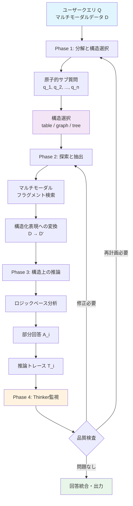
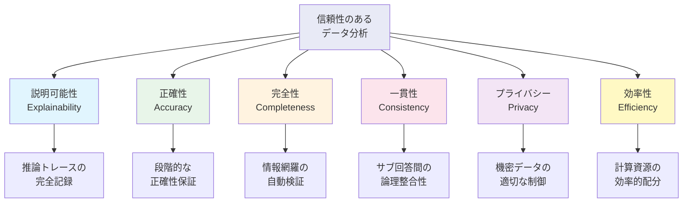

# DataPuzzle: Breaking Free from the Hallucinated Promise of LLMs in Data Analysis

- **Link**: https://arxiv.org/abs/2504.10036
- **Authors**: Zhengxuan Zhang, Zhuowen Liang, Yin Wu, Teng Lin, Yuyu Luo, Nan Tang
- **Year**: 2025
- **Venue**: arXiv (cs.CL)
- **Type**: Academic Paper (Conceptual Framework)

## Abstract

Large language models (LLMs) are increasingly applied to multi-modal data analysis, yet the prevailing "Prompt-to-Answer" paradigm treats them as opaque black-box analysts. This approach produces brittle, unverifiable, and frequently misleading results. DataPuzzle proposes a fundamental paradigm shift from monolithic generation to structured extraction, where LLMs serve as specialized collaborators in modular workflows enabling step-by-step reasoning and verification rather than producing opaque end-to-end answers. The framework decomposes complex questions into atomic sub-questions, selects appropriate data structures for each, and employs a meta-level orchestrator (the Thinker) for continuous oversight, achieving trustworthy and transparent data analytics.

## Abstract（日本語訳）

大規模言語モデル（LLM）はマルチモーダルデータ分析に広く適用されつつあるが、主流の「Prompt-to-Answer」パラダイムはLLMを不透明なブラックボックスアナリストとして扱っている。このアプローチは脆弱で検証不可能、かつ頻繁に誤解を招く結果を生成する。DataPuzzleは、モノリシックな生成から構造化された抽出への根本的なパラダイムシフトを提案する。LLMはモジュール化されたワークフロー内の特化協働者として機能し、不透明なエンドツーエンドの回答ではなく、段階的な推論と検証を可能にする。フレームワークは複雑な質問を原子的なサブ質問に分解し、各サブ質問に適切なデータ構造を選択し、メタレベルのオーケストレータ（Thinker）による継続的な監視を実装することで、信頼性と透明性のあるデータ分析を実現する。

## 概要

DataPuzzleは、LLMベースのデータ分析における根本的な設計哲学の転換を提唱する概念的フレームワークである。「生成（Generation）」から「抽出（Extraction）」への移行を中核に据え、LLMが自由形式のテキストを生成するのではなく、構造化されたデータ表現（テーブル、グラフ、ツリー）上で検証可能な推論を実行するアーキテクチャを提案する。

主要な貢献：

1. **パラダイム転換の提唱**: Prompt-to-Answer型の「LLM as Analyst」から、構造化抽出型の「LLM as Collaborator」への設計哲学の根本的転換を明確に定式化
2. **6つの信頼性要件の定義**: 説明可能性、正確性、完全性、一貫性、プライバシー、効率性の6次元で信頼性のあるデータ分析を定義
3. **Thinkerオーケストレータ**: フィデリティ評価、修正トリガー、再計画を継続的に行うメタレベル監視機構の設計
4. **オープンプロブレムの体系化**: 構造化抽出パラダイムにおける6つの未解決問題を特定

**注意**: 本論文は概念的フレームワークの提案であり、実験的評価やベンチマーク結果は含まれていない。

## 問題と動機

- **Prompt-to-Answerの脆弱性**: 現在主流のアプローチでは、LLMに自然言語プロンプトを与えて直接回答を生成させる。しかし、この「ブラックボックス分析」は中間ステップが不透明であり、結果の検証が困難で、ハルシネーションによる誤りが検出されにくい

- **マルチモーダルデータの複雑性**: 現実のデータ分析は、テーブル、テキスト、画像、グラフなど異種のデータモダリティを統合的に扱う必要があるが、単一のLLMプロンプトではこの複雑性に対応できない

- **検証可能性の欠如**: 生成ベースのアプローチでは、回答が正しいかどうかを段階的に検証する手段がない。「もっともらしいが誤った」回答が高い信頼度で提示される問題（ハルシネーション）が深刻

- **既存マルチエージェントシステムの限界**: 既存のマルチエージェントフレームワークはワークフローの自動化に焦点を当てているが、各ステップの構造化と検証可能性という根本的な問題に十分に取り組んでいない

## 提案手法

### 設計哲学: 抽出 vs. 生成

DataPuzzleの核心的洞察は、「データがテーブル、グラフ、ツリーに整理されると、LLMは比較、経路探索、参照解決などのタスクをより効果的に実行できる」という点にある。自由形式のテキスト生成ではなく、制約された構造化フォーマットへの変換を行うことで、検証可能な推論を実現する。

### 4段階パイプライン

**1. Decomposition & Structure Selection（分解と構造選択）**: ユーザーの複雑なクエリを原子的なサブ質問 {q_1, q_2, ..., q_n} に分解し、各サブ質問に適切なデータ構造を選択する。比較タスクにはテーブル、関係・因果クエリにはグラフを割り当てる。

**2. Seek & Extract（探索と抽出）**: 関連するマルチモーダルフラグメントを検索し、構造化表現（D'_i）に変換する。生データから構造化された中間表現への変換が核心。

**3. Reasoning over Structures（構造上の推論）**: 構造化データ上でロジックベースの分析を実行し、部分回答（A_i）を導出する。構造化されたデータにより、推論の各ステップが追跡・検証可能になる。

**4. Thinker Oversight（Thinkerによる監視）**: メタレベルのオーケストレータが、フィデリティ（忠実性）を継続的に評価し、必要に応じて修正や再計画をトリガーする。サブ質問の明確性、構造の適合性、データの十分性、論理的一貫性を検査する。

### 6つの信頼性要件（Desiderata）

1. **説明可能性（Explainability）**: 分析の各ステップが透明で追跡可能
2. **正確性（Accuracy）**: 抽出と推論の各段階で正確性を保証
3. **完全性（Completeness）**: 必要な情報が網羅されていることを検証
4. **一貫性（Consistency）**: 複数のサブ回答間の論理的整合性
5. **プライバシー（Privacy）**: 機密データの適切な取り扱い
6. **効率性（Efficiency）**: 計算資源の効率的な利用

## アルゴリズム / 擬似コード

```
Algorithm: DataPuzzle 構造化抽出パイプライン
Input: ユーザークエリ Q, マルチモーダルデータソース D = {D_1, ..., D_m}
Output: 検証済み回答 A, 推論トレース T

Phase 1: 分解と構造選択
1:  {q_1, ..., q_n} ← Decompose(Q)
2:  for each q_i do
3:      S_i ← SelectStructure(q_i)
4:      // S_i ∈ {table, graph, tree, list, ...}
5:      // 比較タスク → table, 関係クエリ → graph
6:  end for

Phase 2: 探索と抽出
7:  for each (q_i, S_i) do
8:      fragments_i ← Seek(q_i, D)  // マルチモーダル検索
9:      D'_i ← Extract(fragments_i, S_i)  // 構造化表現に変換
10:     // 生データ → 制約された構造化フォーマット
11: end for

Phase 3: 構造上の推論
12: for each (q_i, D'_i) do
13:     A_i ← Reason(q_i, D'_i)  // 構造化データ上の論理推論
14:     T_i ← RecordTrace(q_i, D'_i, A_i)  // 推論トレース記録
15: end for

Phase 4: Thinker監視（継続的）
16: while not Thinker.IsSatisfied({A_i}, {T_i}) do
17:     issues ← Thinker.Evaluate({A_i}, {T_i})
18:     // 明確性、構造適合性、データ十分性、論理一貫性を検査
19:     if issues.require_replan then
20:         goto Phase 1 with refined Q
21:     else if issues.require_revision then
22:         Revise(affected_steps)
23:     end if
24: end while

25: A ← Synthesize({A_1, ..., A_n})
26: T ← Aggregate({T_1, ..., T_n})
27: return A, T
```

## アーキテクチャ / プロセスフロー



## Figures & Tables

### Table 1: Prompt-to-Answer vs. DataPuzzle アプローチの比較

| 特性 | Prompt-to-Answer | DataPuzzle |
|------|-----------------|------------|
| LLMの役割 | ブラックボックスアナリスト | 特化協働者 |
| 推論過程 | 不透明（エンドツーエンド） | 透明（段階的） |
| 検証可能性 | 低（最終出力のみ） | 高（各ステップ検証可） |
| ハルシネーション対策 | 限定的 | 構造的に抑制 |
| マルチモーダル対応 | 単一プロンプト | モダリティ別構造化 |
| エラー局所化 | 困難 | 容易（ステップ単位） |

### Figure 1: 6つの信頼性要件（Desiderata）



### Figure 2: 構造選択の適用例

```mermaid
graph LR
    subgraph タスク→構造マッピング
        Q1[比較タスク<br/>製品性能比較] --> S1[テーブル構造<br/>行: 製品, 列: 指標]
        Q2[関係分析<br/>因果関係調査] --> S2[グラフ構造<br/>ノード: 変数, エッジ: 関係]
        Q3[階層分析<br/>組織構造調査] --> S3[ツリー構造<br/>親子関係の階層]
        Q4[時系列分析<br/>トレンド把握] --> S4[リスト構造<br/>時系列順序データ]
    end

    style Q1 fill:#e1f5fe
    style Q2 fill:#e8f5e9
    style Q3 fill:#fff3e0
    style Q4 fill:#fce4ec
```

### Table 2: DataPuzzleの応用シナリオ

| シナリオ | データモダリティ | 主要課題 | DataPuzzleの対応 |
|---------|----------------|---------|-----------------|
| 医療診断 | テキスト + 画像 + 表 | 誤診リスク | 段階的検証 + トレース |
| 事故解析 | センサー + テキスト + 映像 | 因果推定の複雑性 | グラフ構造化 + Thinker |
| ビジネス分析 | 表 + テキスト + チャート | 多面的評価 | 分解 + 構造選択 |

### Table 3: 未解決研究課題

| 課題 | 説明 | 難易度 |
|------|------|-------|
| 新規モダリティからの情報抽出 | 3Dポイントクラウド、センサーストリーム | 高 |
| ドメイン非依存スキーマ学習 | ラベルなしデータからの自動構造化 | 高 |
| 新規構造の抽出文法 | ハイパーグラフ、位相マップ | 中 |
| "未知の未知"の検出 | 完全性チェックにおける盲点 | 高 |
| 異種モダリティ横断の因果理解 | マルチモーダル因果推論 | 高 |
| 動的変換を伴う人間誘導推論 | インタラクティブな構造操作 | 中 |

## 実験と評価

### 実験の位置づけ

本論文は概念的フレームワークの提案であり、著者ら自身が「DataPuzzle is a conceptual and early-stage framework that prioritizes structural clarity over task-specific benchmarks」と明記している。したがって、従来の意味での実験的評価（ベンチマーク比較、精度スコア、アブレーション分析）は含まれていない。

### 理論的根拠

代わりに、以下の理論的論拠が提示されている：

1. **構造化データ上の推論優位性**: 先行研究により、LLMはテーブル、グラフ、ツリーに整理されたデータ上で、比較・経路探索・参照解決などのタスクをより正確に実行できることが示されている

2. **3つの応用シナリオ**: 医療診断、事故解析、ビジネス分析の3つのケーススタディにより、DataPuzzleのアプローチが実世界の複雑なデータ分析課題に適用可能であることを概念的に示している

3. **概念的比較**: 従来のPrompt-to-Answerアプローチ（D_i → A_i）と、DataPuzzleの構造化アプローチ（D_i → S_i → D'_i → A'_i）を対比し、後者が検証可能性と正確性において理論的に優れることを議論している

### 限界

- エージェントベースの設計は計算オーバーヘッドと協調の課題を導入する
- 有効性はドメインにより異なり、ドメイン固有の適応が必要
- 完全なソリューションではなく、構造的明確性を優先した初期段階のフレームワーク

## 備考

- 本論文は実験結果を持たない概念的提案であるが、「生成から抽出へ」というパラダイム転換の提唱は、LLMベースのデータ分析研究に重要な方向性を示している
- 6つの信頼性要件（Desiderata）の定式化は、今後のシステム評価におけるフレームワークとして参考になる
- Thinkerオーケストレータの設計は、既存のマルチエージェントシステムにおける品質保証機構の設計に直接応用可能
- 未解決研究課題として挙げられた6項目（特にドメイン非依存スキーマ学習と「未知の未知」の検出）は、構造化抽出パラダイムの実用化における核心的課題を的確に捉えている
- 実装・評価がないため、提案アーキテクチャの実際の有効性は未検証であり、今後の実証研究が不可欠
- 同時期に発表された他のマルチエージェントフレームワーク（DataSage、PublicAgentなど）が実験的検証を含むのに対し、本論文は設計哲学の深い考察に特化しており、相補的な位置づけにある
