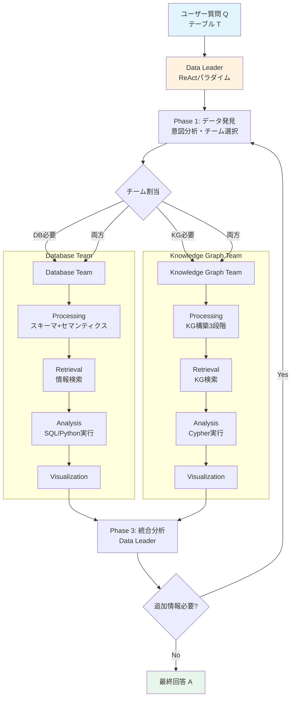
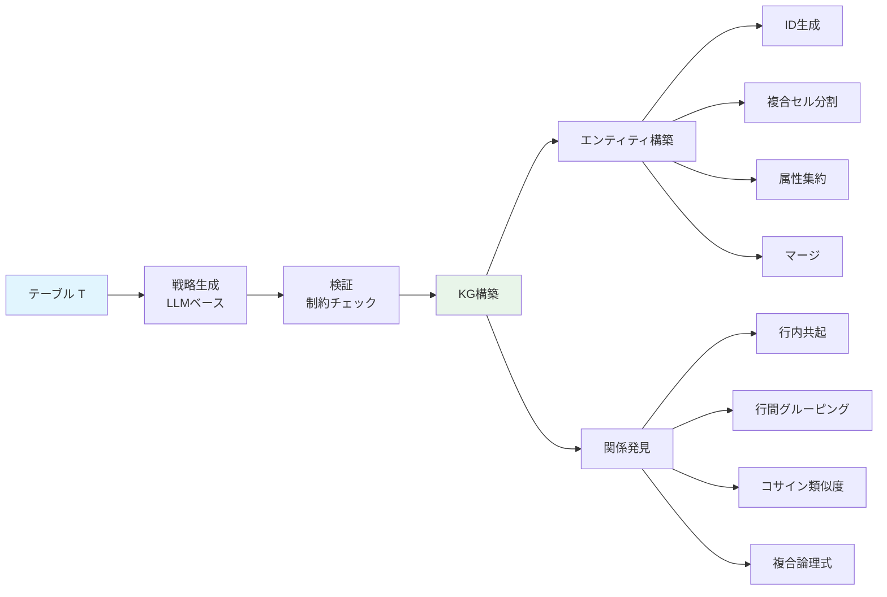
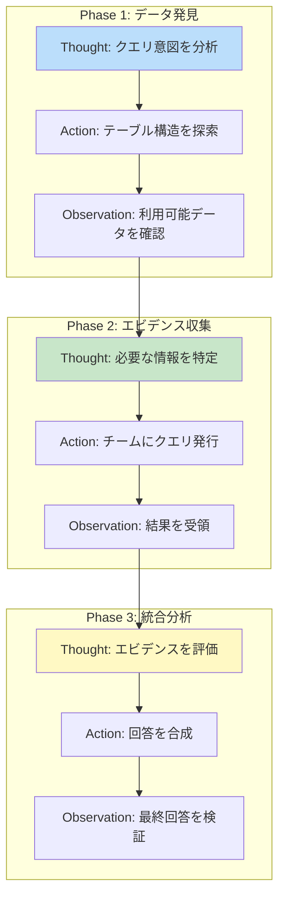

# DataFactory: Collaborative Multi-Agent Framework for Advanced Table Question Answering

- **Link**: https://arxiv.org/abs/2603.09152
- **Authors**: Tong Wang, Chi Jin, Yongkang Chen, Huan Deng, Xiaohui Kuang, Gang Zhao
- **Year**: 2026
- **Venue**: Information Processing & Management, Vol. 63, No. 6, pp. 104723
- **Type**: Academic Paper

## Abstract

Table Question Answering (TableQA) enables natural language interaction with structured tabular data, but existing Large Language Model approaches face context length constraints, hallucination issues, and single-agent architectural weaknesses. DataFactory addresses these limitations through a collaborative multi-agent framework featuring specialized team coordination. The system employs a Data Leader using the ReAct paradigm for orchestration, alongside a Database Team and a Knowledge Graph Team, each composed of four specialized agents. A key innovation is the automated data-to-knowledge graph transformation and flexible natural language-based agent consultation. Evaluation demonstrates 20.2% accuracy improvement on TabFact and 23.9% on WikiTableQuestions over prior methods.

## Abstract（日本語訳）

テーブル質問応答（TableQA）は構造化された表形式データとの自然言語インタラクションを可能にするが、既存の大規模言語モデルアプローチはコンテキスト長の制約、ハルシネーション問題、単一エージェントアーキテクチャの弱点に直面している。DataFactoryは、特化チーム間の協調を特徴とするマルチエージェントフレームワークでこれらの制限に対処する。システムはReActパラダイムを用いるData Leaderによるオーケストレーション、および各4エージェントで構成されるDatabase TeamとKnowledge Graph Teamを採用する。主要な革新は、自動的なデータからナレッジグラフへの変換と、柔軟な自然言語ベースのエージェント間コンサルテーションである。評価により、TabFactで20.2%、WikiTableQuestionsで23.9%の精度改善が実証された。

## 概要

DataFactoryは、テーブル質問応答タスクにおいて、データベースとナレッジグラフの2つの知識表現を統合的に活用するマルチエージェントフレームワークである。従来のTableQAシステムが単一のデータ表現に依存していたのに対し、DataFactoryは構造化データ（テーブル）と関係性データ（ナレッジグラフ）を相補的に利用することで、より深い推論と高い精度を実現する。

主要な貢献：

1. **デュアルチーム・アーキテクチャ**: Database TeamとKnowledge Graph Teamの2チーム構成により、構造化データと関係性データを統合的に分析
2. **自動KG変換**: テーブルからナレッジグラフへの自動変換関数 T: D x S x R → G を定式化し、テーブルの暗黙的な関係性を明示的に表現
3. **自然言語ベースのエージェント間コンサルテーション**: 構造化APIではなく自然言語を介したエージェント間通信により、曖昧なクエリの処理と柔軟な協調を実現
4. **3ベンチマークでの大幅改善**: TabFact（+20.2%）、WikiTQ（+23.9%）での従来手法を大幅に上回る性能向上

## 問題と動機

- **コンテキスト長制約**: LLMのコンテキストウィンドウは限られており、大規模テーブルの全内容を入力プロンプトに含めることが困難。特に数百行以上のテーブルでは情報の欠落が避けられない

- **ハルシネーション**: LLMがテーブルに存在しないデータを「もっともらしく」生成する問題。特に数値データや固有名詞において深刻で、ファクトチェックタスクの信頼性を損なう

- **単一エージェントの限界**: 単一のLLMエージェントがデータ発見、検索、分析、可視化のすべてを担当する構成では、各段階での特化した処理が不十分になり、複雑なクエリへの対応力が制限される

- **暗黙的関係性の未活用**: テーブルデータには行間・列間の暗黙的な関係性が豊富に存在するが、従来手法はこれらを明示的にモデル化していない

## 提案手法

### 3層アーキテクチャ

**Data Leader（データリーダー）**: ReActパラダイムに基づくオーケストレーションエージェント。3段階の分析原則に従い、ユーザークエリを適切なチームにルーティングする。(1) データ発見・探索フェーズ、(2) エビデンスベースのクエリ計画フェーズ、(3) 包括的分析・統合フェーズ。自然言語によるセマンティック意図分析を用いて動的なチーム割り当てを行う。

**Database Team（4エージェント）**:
- Processing Agent: ルールベーススキーマとLLMセマンティクスを組み合わせたデータ前処理
- Retrieval Agent: スキーマ、ドメイン知識、過去のQAペアを統合した情報検索
- Analysis Agent: SQL/Pythonベースのクエリ実行と結果分析
- Visualization Agent: 分析結果の可視化出力

**Knowledge Graph Team（4エージェント）**:
- Processing Agent: テーブルからKGへの3段階パイプライン（戦略生成、検証、構築）
- Retrieval Agent: スキーマ、過去のペア、ドメイン知識を組み合わせたKG検索
- Analysis Agent: Cypherクエリベースの関係分析
- Visualization Agent: グラフ構造の可視化

### 自動KG変換

写像関数 T: D x S x R → G を定式化：
- **エンティティ構築**: ID生成、複合セルの分割戦略、属性集約、エンティティマージ
- **関係発見**: 行内共起関係、行間グルーピング関係、セマンティック類似度（コサイン類似度）によるマルチパターンルール評価

## アルゴリズム / 擬似コード

```
Algorithm: DataFactory テーブル質問応答パイプライン
Input: テーブル T, 自然言語質問 Q
Output: 回答 A

Phase 0: データ準備（初回のみ）
1:  DB ← DatabaseTeam.Process(T)    // テーブル→DB変換
2:  KG ← KGTeam.Process(T)          // テーブル→KG変換
    // T: D × S × R → G
    // エンティティ構築 + 関係発見

Phase 1: データ発見・探索（Data Leader）
3:  intent ← DataLeader.AnalyzeIntent(Q)  // ReAct: Thought
4:  teams ← DataLeader.SelectTeams(intent)  // ReAct: Action
5:  // セマンティック意図分析による動的チーム割当

Phase 2: エビデンス収集（チーム並列実行）
6:  if DB_TEAM in teams then
7:      db_schema ← DB.Retrieval.GetSchema()
8:      db_evidence ← DB.Retrieval.Search(Q, db_schema)
9:      db_result ← DB.Analysis.Execute(Q, db_evidence)
10: end if
11: if KG_TEAM in teams then
12:     kg_schema ← KG.Retrieval.GetSchema()
13:     kg_evidence ← KG.Retrieval.Search(Q, kg_schema)
14:     kg_result ← KG.Analysis.Execute(Q, kg_evidence)
15: end if

Phase 3: 統合分析（Data Leader）
16: observation ← Merge(db_result, kg_result)  // ReAct: Observation
17: if DataLeader.NeedsMoreInfo(observation) then
18:     // 追加コンサルテーション（自然言語ベース）
19:     follow_up ← DataLeader.FormulateQuery(observation)
20:     goto Phase 2 with follow_up
21: end if
22: A ← DataLeader.Synthesize(observation)
23: return A
```

## アーキテクチャ / プロセスフロー



## Figures & Tables

### Table 1: ベースライン手法との性能比較

| 手法 | カテゴリ | TabFact (Acc%) | WikiTQ (Acc%) |
|------|---------|---------------|---------------|
| TAPAS-large | DNNベース | -- | -- |
| TAPEX-large | DNNベース | -- | -- |
| End-to-End | プロンプト最適化 | -- | -- |
| TableCoT | プロンプト最適化 | -- | -- |
| TabSQLify | コードベース | -- | -- |
| StructGPT | 単一エージェント | -- | -- |
| ReAcTable | 単一エージェント | -- | -- |
| MACT | マルチエージェント | -- | -- |
| AutoPrep | マルチエージェント | -- | -- |
| **DataFactory** | **マルチエージェント** | **84.0** | **72.8** |
| 改善率 | -- | +20.2% | +23.9% |

### Table 2: モデル別クロスパフォーマンス

| モデル | FeTaQA (ROUGE-1 F) | WikiTQ (Acc%) | TabFact (Acc%) |
|--------|-------------------|---------------|----------------|
| Claude 4.0 Sonnet | 0.6234 | 83.2 | 90.8 |
| Gemini 2.5 Flash | 0.6107 | 77.9 | 87.9 |
| Qwen3-235B-A22B | 0.5972 | 73.2 | 91.2 |
| DeepSeek-V3 | 0.5403 | 73.6 | 84.2 |
| GPT-4o mini | 0.5576 | 67.8 | 79.3 |
| Qwen3-32B | 0.5662 | 61.0 | 79.8 |
| Qwen3-30B-A3B | 0.5063 | 48.1 | 75.0 |
| Qwen3-14B | 0.5289 | 53.7 | 75.7 |

### Figure 1: KG変換パイプライン



### Table 3: トークン消費量の比較

| 手法カテゴリ | トークン数 |
|-------------|-----------|
| プロンプト最適化手法 | 546-1,084 |
| コードベース手法 | 2,194 |
| 単一エージェント (ReAcTable) | 3,050-4,400 |
| DataFactory | 3,464-4,982 |

### Figure 2: Data Leaderの3段階ReActワークフロー



## 実験と評価

### 実験設定

- **データセット**: TabFact（12,779文、1,695テーブル、二値分類）、WikiTableQuestions（4,344質問、完全一致精度）、FeTaQA（2,003インスタンス、ROUGE-1/2/L Fスコア）
- **モデル**: 商用3種（Claude 4.0 Sonnet, Gemini 2.5 Flash, GPT-4o mini）+ オープンソース5種（DeepSeek-V3, Qwen3シリーズ4種）の計8モデル
- **ベースライン**: DNNベース2種、プロンプト最適化3種、コードベース1種、エージェントベース2種、マルチエージェント2種の計10手法

### 主要結果

1. **大幅な精度改善**: TabFactで84.0%（+20.2%）、WikiTQで72.8%（+23.9%）を達成。Cohen's d > 1で統計的に有意な効果量

2. **モデルスケーラビリティ**: Claude 4.0 Sonnetが最高性能（TabFact 90.8%, WikiTQ 83.2%）を示す一方、Qwen3-14B（最小モデル）でもTabFact 75.7%を達成し、フレームワークのスケーラビリティを実証

3. **チーム協調の有効性**: Database Teamのみ（KG Teamなし）の構成と比較して、フルフレームワークが5.5-17.1%の改善を示し、デュアルチーム構成の有効性を確認

4. **トークン効率性のトレードオフ**: DataFactoryのトークン消費量（3,464-4,982）はプロンプト手法（546-1,084）の約4倍だが、精度改善がこの追加コストを正当化

5. **Graceful Degradation**: 小規模モデル（Qwen3-14B）でも75%以上の精度を維持しており、システマティックなタスク分解によるフレームワークの堅牢性を示した

### 自由記述回答（FeTaQA）

ROUGE-1 Fスコアでは、Claude 4.0 Sonnet（0.6234）が最高スコアを達成。自由記述形式の回答生成においても、マルチエージェント構成がテーブルの文脈を適切に理解し、流暢な回答を生成できることを示した。

## 備考

- Information Processing & Management誌（IF: 8.6）に掲載されたジャーナル論文であり、高い査読品質が担保されている
- テーブルからナレッジグラフへの自動変換は、TableQAに限らずデータ統合やナレッジマネジメント分野への応用可能性がある
- 自然言語ベースのエージェント間コンサルテーションは、構造化APIに比べて柔軟性が高い一方、通信の曖昧性というリスクも内包している
- 8つのLLMモデルでの網羅的評価は、フレームワークのモデル依存性を理解する上で重要な実験設計
- Qwen3-235BがTabFactでClaude 4.0 Sonnet（90.8%）を上回る91.2%を記録した点は注目に値し、タスク特性とモデル特性の相互作用を示唆
- トークン消費量の増加（3,464-4,982）は実運用コストの観点から考慮が必要だが、精度改善の幅（+20-24%）がこのトレードオフを十分に正当化している
