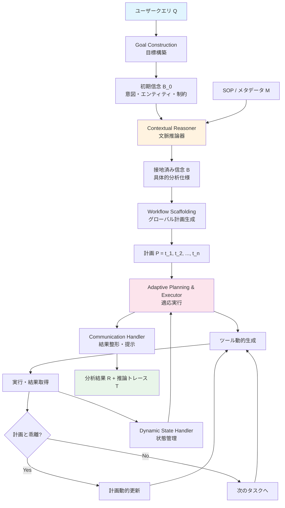
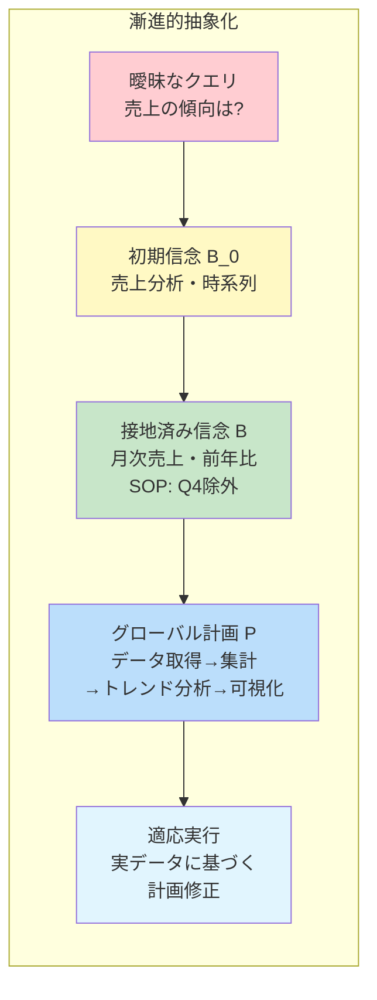
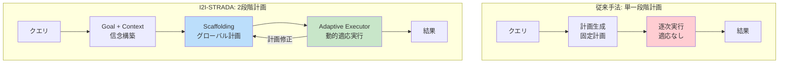

# I2I-STRADA: Information to Insights via Structured Reasoning Agent for Data Analysis

- **Link**: https://arxiv.org/abs/2507.17874
- **Authors**: SaiBarath Sundar, Pranav Satheesan, Udayaadithya Avadhanam
- **Year**: 2025
- **Venue**: arXiv (cs.AI)
- **Type**: Academic Paper

## Abstract

Current multi-agent data analysis systems handle tasks like query translation and visualization but lack structured reasoning processes that underlie effective analytical thinking. I2I-STRADA proposes an agentic architecture that formalizes cognitive workflows for data analysis through modular sub-tasks. The approach models interpreting vague goals, grounding them in contextual knowledge, constructing abstract plans, and adapting execution based on intermediate outcomes. Evaluation on DABstep and DABench benchmarks demonstrates improvements in planning coherence and insight alignment compared to prior systems, with particular strengths in procedural constraint adherence.

## Abstract（日本語訳）

現在のマルチエージェントデータ分析システムは、クエリ変換や可視化などのタスクを処理できるが、効果的な分析思考の基盤となる構造化された推論プロセスが欠如している。I2I-STRADAは、モジュール化されたサブタスクを通じてデータ分析のための認知ワークフローを形式化するエージェンティックアーキテクチャを提案する。曖昧な目標の解釈、文脈知識への接地、抽象的計画の構築、中間結果に基づく実行の適応をモデル化する。DABstepおよびDABenchベンチマークでの評価により、計画の一貫性とインサイトの整合性において先行システムに対する改善が実証された。特に手続き的制約への適合性において強みを示す。

## 概要

I2I-STRADAは、データ分析における「推論」をブラックボックスではなく、明示的な認知ワークフローとして形式化するアーキテクチャである。既存のマルチエージェントシステムがタスク実行の自動化に焦点を当てる中、I2I-STRADAは「なぜそのように分析するか」という推論プロセス自体をモジュール化・構造化することで、計画の一貫性と分析の質を向上させる。

主要な貢献：

1. **認知ワークフローの形式化**: データ分析の思考プロセスを、目標構築→文脈接地→計画立案→適応実行の明示的な段階に分解
2. **2段階計画システム**: グローバルなワークフロースキャフォールディングとローカルな適応実行の分離により、計画の一貫性と実行の柔軟性を両立
3. **信念状態の漸進的精緻化**: 初期信念B_0を文脈知識（SOP・メタデータ）で接地してBに変換する明示的なプロセス
4. **DABstepでの最先端性能**: Easy 80.56%、Hard 28.04%を達成し、DICEやReACTベースラインを上回る

## 問題と動機

- **推論のブラックボックス化**: 既存のマルチエージェントデータ分析システムは、推論をオーケストレーション層の背後に隠蔽された暗黙的なモジュールとして扱っている。結果として、推論プロセスの透明性、一貫性、再現性が損なわれている

- **曖昧な目標への対処不足**: ユーザーのデータ分析要求はしばしば曖昧で不完全である。「売上の傾向を教えて」のような漠然とした目標を、具体的な分析計画に変換するための体系的なメカニズムが不足している

- **文脈知識の未活用**: Standard Operating Procedures（SOP）、データスキーマ、ビジネスルールなどの文脈知識が、分析計画の立案と実行に十分に反映されていない

- **計画と実行の乖離**: 静的な計画はデータ探索の中間結果に基づく適応が困難であり、計画段階の仮定と実際のデータの齟齬が品質低下を引き起こす

## 提案手法

### 6コンポーネント・アーキテクチャ

**1. Goal Construction Module（目標構築）**: ユーザークエリから分析意図を抽出する。質問の理解、関連エンティティ、一般的な解法アプローチ、制約条件を特定し、クエリ内容のみから初期信念状態 B_0 を構築する。

**2. Contextual Reasoner（文脈推論器）**: 初期信念 B_0 をメタデータとSOPを用いて接地し、B_0 → B に変換する。手続き的要件と制約条件への整合性を確保する。ここで「曖昧な目標」が「具体的な分析仕様」に変換される。

**3. Workflow Scaffolding（ワークフロー足場構築）**: データとのインタラクション前に、グローバルな高レベル計画 P = {t_1, t_2, ..., t_n} を生成する。計画全体の一貫性と論理的整合性を保証する抽象的なロードマップ。

**4. Adaptive Planning & Executor（適応計画・実行器）**: 実際のデータ探索結果に基づいて、実行レベルの計画を反復的に精緻化する。中間結果が初期計画の仮定と異なる場合、動的に後続ステップを調整する。

**5. Context-Aware Tool Creation（文脈対応ツール生成）**: メタデータと実行指示を用いて、異種データソースに対応するデータ処理スクリプトを動的に生成する。固定ツールセットではなく、タスクに応じたカスタムツールを作成。

**6. Communication Handler（通信ハンドラ）**: ユーザーの目標と要求される出力仕様に沿った形式で結果を整形・提示する。

### 2段階計画の設計思想

I2I-STRADAの計画システムは「漸進的抽象化（Progressive Abstraction）」と「多段階精緻化（Multi-step Refinement）」の2つの原則に基づく。

- **漸進的抽象化**: 各段階で重要な情報を保持しつつノイズをフィルタリングし、推論の精度を段階的に向上
- **多段階精緻化**: グローバル計画（Scaffolding）とローカル計画（Adaptive）の2段階で計画品質を反復的に改善

## アルゴリズム / 擬似コード

```
Algorithm: I2I-STRADA 構造化推論パイプライン
Input: ユーザークエリ Q, データソース D, SOP/メタデータ M
Output: 分析結果 R, 推論トレース T

Phase 1: 目標構築
1:  intent ← ExtractIntent(Q)
2:  entities ← IdentifyEntities(Q)
3:  approach ← InferApproach(Q)
4:  constraints ← ExtractConstraints(Q)
5:  B_0 ← BuildInitialBelief(intent, entities, approach, constraints)
    // クエリ内容のみから構築

Phase 2: 文脈接地
6:  B ← ContextualReasoner(B_0, M)
    // B_0 → B: SOP・メタデータで接地
    // 手続き的要件・制約への整合性確保
    // 曖昧な目標 → 具体的分析仕様

Phase 3: ワークフロー足場構築
7:  P ← WorkflowScaffolding(B)
    // P = {t_1, t_2, ..., t_n}: グローバル高レベル計画
    // データインタラクション前に生成

Phase 4: 適応実行
8:  for each t_i in P do
9:      tool_i ← CreateTool(t_i, D.metadata)  // 文脈対応ツール生成
10:     result_i ← Execute(tool_i, D)
11:     state ← UpdateState(result_i)
12:     if state.diverges_from(P) then
13:         // 中間結果が計画と乖離
14:         P_remaining ← AdaptPlan(P[i+1:], state)
15:         P ← P[:i] ∪ P_remaining  // 動的計画更新
16:     end if
17:     if result_i.has_error then
18:         result_i ← Debug(tool_i, result_i.error)
19:     end if
20: end for

Phase 5: 結果整形
21: R ← CommunicationHandler(results, B, Q)
22: T ← AggregateTrace(all_phases)
23: return R, T
```

## アーキテクチャ / プロセスフロー



## Figures & Tables

### Table 1: DABstepベンチマーク結果

| 手法 | Easy (%) | Hard (%) | 特徴 |
|------|---------|---------|------|
| ReACT (ベースライン) | 77.78 | 9.26 | 単純なReAct |
| DICE | 75.00 | 27.25 | -- |
| **I2I-STRADA** | **80.56** | **28.04** | 構造化推論 |
| 改善（対ReACT） | +2.78 | +18.78 | Hardで大幅改善 |

### Table 2: DABenchベンチマーク結果

| 手法 | Accuracy (%) | バックエンドLLM |
|------|-------------|----------------|
| Data Interpreter | 94.93 | GPT-4o |
| DatawiseAgent | 85.99 | -- |
| **I2I-STRADA** | **90.27** | Claude 3.5 Sonnet |
| 他の手法 | < 85.99 | 各種 |

### Figure 1: 認知ワークフローの段階的精緻化



### Table 3: I2I-STRADAの6コンポーネント機能一覧

| コンポーネント | 入力 | 出力 | 主要機能 |
|-------------|------|------|---------|
| Goal Construction | クエリ Q | 初期信念 B_0 | 意図・エンティティ・制約の抽出 |
| Contextual Reasoner | B_0, SOP, メタデータ | 接地済み信念 B | 文脈知識による接地 |
| Workflow Scaffolding | B | グローバル計画 P | 高レベル計画の生成 |
| Adaptive Executor | P, データ D | 実行結果 | 動的計画調整と実行 |
| Tool Creation | タスク, メタデータ | カスタムスクリプト | 文脈対応ツール生成 |
| Communication Handler | 結果, B, Q | 最終出力 R | 結果の整形・提示 |

### Figure 2: 2段階計画の対比



## 実験と評価

### 実験設定

- **ベンチマーク**: DABstep（Easy/Hardの2難易度レベル）、DABench（多様なドメインのデータ分析タスク）
- **バックエンドLLM**: Claude 3.5 Sonnet
- **評価指標**: 精度（Accuracy）、Easy/Hard別のタスク成功率
- **ベースライン**: ReACTベースライン、DICE、Data Interpreter、DatawiseAgentなど

### 主要結果

1. **DABstepでの性能**: Easy 80.56%、Hard 28.04%を達成。特にHard難易度でReACTベースライン（9.26%）に対して+18.78ポイントの大幅改善を示し、構造化推論が複雑なタスクで特に有効であることを実証

2. **DABenchでの汎化性能**: 90.27%の精度を達成。Data Interpreter（94.93%, GPT-4o使用）には及ばないが、DatawiseAgent（85.99%）を上回る。Claude 3.5 Sonnetという比較的小さいモデルで高い性能を達成した点が注目される

3. **計画一貫性の改善**: ワークフロースキャフォールディングにより、複数ステップにわたるタスクでの計画の論理的一貫性が向上。特にSOPに対する感度（手続き的制約への適合性）で強みを示した

4. **適応実行の有効性**: 中間結果に基づく計画の動的調整が、特にHard難易度のタスクでの性能改善に寄与。静的計画では対応困難な予期しないデータパターンへの適応を実現

5. **ドメイン横断の堅牢性**: DABenchの多様なドメインにわたり、ワークフローの修正なしで安定した性能を示した

### 弱点と課題

- NULL値の解釈における一貫性の欠如が一部のタスクで精度低下を引き起こした
- 手続き的ガイダンスがない場合の機械学習ハイパーパラメータ選択が不安定
- DABstep Hardでの精度（28.04%）は依然として低く、根本的な推論能力の限界を示唆

## 備考

- 「認知ワークフローの形式化」というアプローチは、既存のマルチエージェントシステムが見落としていた推論の透明性と構造化に焦点を当てており、独自性が高い
- 2段階計画（Scaffolding + Adaptive）の設計は、ソフトウェアエンジニアリングにおけるアーキテクチャ設計と詳細設計の分離に類似しており、直感的に理解しやすい
- SOPやメタデータによる文脈接地は、企業内データ分析での実用性が高い。ビジネスルールや手続き的制約を明示的に推論に組み込む点は実務的に重要
- DABstep Hardでの28.04%という数値は、現在のLLMベース推論の根本的限界を示しており、ファインチューニングされた推論モデルの必要性を示唆
- Data Interpreter（94.93%）との差は、バックエンドLLMの差（GPT-4o vs. Claude 3.5 Sonnet）が一因と考えられ、同一モデルでの比較が今後の課題
- 6コンポーネント構成はモジュール性が高く、個別コンポーネントの改良や差し替えが容易な設計となっている
