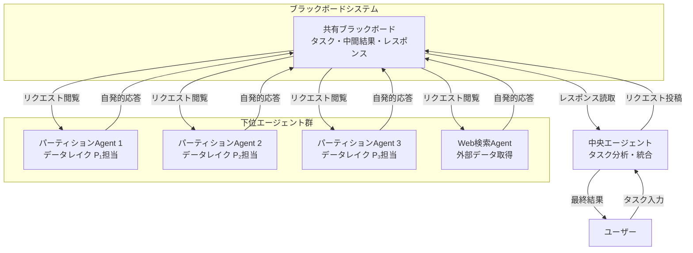
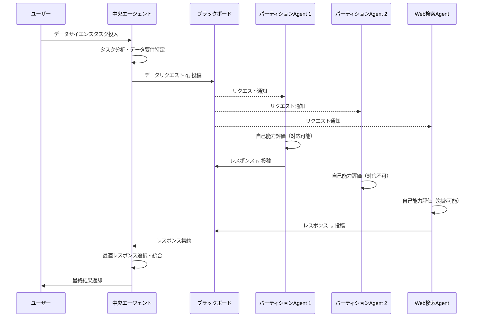

# LLM-Based Multi-Agent Blackboard System for Information Discovery in Data Science

- **Link**: https://arxiv.org/abs/2510.01285
- **Authors**: Alireza Salemi, Mihir Parmar, Palash Goyal, Yiwen Song, Jinsung Yoon, Hamed Zamani, Tomas Pfister, Hamid Palangi
- **Year**: 2025
- **Venue**: arXiv preprint (cs.MA, cs.AI, cs.CL, cs.IR, cs.LG)
- **Type**: Academic Paper

## Abstract

Advances in large language models (LLMs) have created new opportunities in data science, but their deployment is often limited by the challenge of finding relevant data in large data lakes. Existing methods struggle with this: both single- and multi-agent systems are quickly overwhelmed by large, heterogeneous files, and master-slave multi-agent systems rely on a rigid central controller that requires precise knowledge of each sub-agent's capabilities, which is not possible in large-scale settings where the main agent lacks full observability over sub-agents' knowledge and competencies. This paper proposes a multi-agent paradigm inspired by the blackboard architecture, where a central agent posts requests to a shared blackboard, and autonomous subordinate agents — either responsible for a partition of the data lake or retrieval from the web — volunteer to respond based on their capabilities. This design improves scalability and flexibility by removing the need for a central coordinator to know each agent's expertise. Testing on three benchmarks showed the approach achieved 13%–57% relative improvements in end-to-end success and up to a 9% relative gain in data discovery F1 over the best baseline.

## Abstract（日本語訳）

大規模言語モデル（LLM）の進歩はデータサイエンスに新たな機会を創出しているが、大規模データレイクにおける関連データの発見という課題により、その展開はしばしば制限される。既存手法はこの課題に苦戦しており、単一エージェントおよびマルチエージェントシステムは大規模で異質なファイル群に圧倒され、マスター・スレーブ型マルチエージェントシステムは各サブエージェントの能力に関する正確な知識を必要とする硬直的な中央コントローラに依存している。本論文は、ブラックボードアーキテクチャに着想を得たマルチエージェントパラダイムを提案する。中央エージェントが共有ブラックボードにリクエストを投稿し、自律的な下位エージェントが自身の能力に基づいて自発的に応答する設計である。3つのベンチマークでのテストにおいて、エンドツーエンド成功率で13%〜57%の相対的改善、データ発見F1で最大9%の相対的向上を達成した。

## 概要

本論文は、大規模データレイクからの情報発見（Information Discovery）という課題に対し、古典的AIアーキテクチャである「ブラックボードシステム」をLLMベースマルチエージェントシステムに適用した研究である。従来のマスター・スレーブ型マルチエージェントアーキテクチャが抱える「中央コントローラが全サブエージェントの専門性を把握する必要がある」という制約を解消し、スケーラブルかつ柔軟なデータ発見パイプラインを実現する。

主要な貢献：

1. **ブラックボードアーキテクチャの導入**: 中央エージェントがタスクを「掲示」し、下位エージェントが自律的に「立候補」する非同期型協調メカニズムの提案
2. **データレイクのパーティション管理**: 大規模異質データを分割し、各下位エージェントに割り当てる分散型情報管理
3. **Web検索エージェントの統合**: データレイク内のデータに加え、Web からの情報取得も統合した包括的情報発見
4. **3ベンチマークでの包括的評価**: KramaBench、Modified DSBench、Modified DA-Code での実証的検証

## 問題と動機

- **大規模データレイクの課題**: 企業や研究機関が保有するデータレイクは数千〜数万のファイルを含み、異種フォーマット（CSV、JSON、Parquet等）が混在する。単一のLLMエージェントではこの規模のデータを効率的に探索・発見することが困難である。

- **マスター・スレーブ型の限界**: 既存のマルチエージェントシステム（例：AutoGen等）は、中央の制御エージェントが各サブエージェントの能力や担当データを正確に把握している前提に立つ。しかし、大規模環境では「完全な可観測性（full observability）」を確保することが現実的に不可能であり、タスクの誤配分やボトルネックが発生する。

- **スケーラビリティの欠如**: 従来手法はデータレイクのサイズが増大するにつれて性能が急激に劣化する。エージェント数を増やしても、中央コントローラの負荷が比例的に増大するため、線形以上のスケーリングが困難である。

## 提案手法

**ブラックボードアーキテクチャに基づくマルチエージェントシステム**

本手法の中核は、古典的AIの「ブラックボードシステム」パターンをLLMマルチエージェント環境に適応させたアーキテクチャである。

### 基本メカニズム

1. **共有ブラックボード**: 全エージェントがアクセス可能な共有ワークスペース。タスクリクエスト、中間結果、最終出力が投稿される
2. **中央エージェント（Central Agent）**: データサイエンスタスクを分析し、必要なデータや情報のリクエストをブラックボードに投稿する
3. **下位エージェント（Subordinate Agents）**: データレイクの特定パーティションまたはWeb検索を担当し、自身の能力・担当範囲に基づいてリクエストに自発的に応答する

### エージェントの自発的参加（Volunteering）

```
Input: タスク記述 T, データレイク DL = {P₁, P₂, ..., Pₙ}
Output: タスク結果 R

1. Central Agent がタスク T を分析
2. 必要なデータ要件 Q = {q₁, q₂, ..., qₘ} を生成
3. FOR each qᵢ IN Q:
4.   Central Agent が qᵢ をブラックボードに投稿
5.   FOR each Subordinate Agent SAⱼ:
6.     IF SAⱼ.canRespond(qᵢ):  // 自身の担当範囲を自己評価
7.       SAⱼ がレスポンス rⱼ をブラックボードに投稿
8.   Central Agent が最適なレスポンスを選択・統合
9. Central Agent が統合結果から最終回答 R を生成
```

### 下位エージェントの種類

- **パーティションエージェント**: データレイクの特定部分集合を担当。ファイルのメタデータ、スキーマ、内容を把握し、関連性の高いデータを返却
- **Web検索エージェント**: データレイク外の情報が必要な場合にWebから関連データを検索・取得

## アーキテクチャ / プロセスフロー



```
┌─────────────────────────────────────────────────────────────────┐
│                    処理フロー概要                                 │
├─────────────────────────────────────────────────────────────────┤
│                                                                 │
│  1. ユーザータスク入力                                            │
│       ↓                                                         │
│  2. 中央エージェント：タスク分析・データ要件生成                    │
│       ↓                                                         │
│  3. ブラックボードにリクエスト投稿                                 │
│       ↓                                                         │
│  4. 各下位エージェントが自己評価・立候補                           │
│       ↓                                                         │
│  5. 立候補エージェントがレスポンスを投稿                           │
│       ↓                                                         │
│  6. 中央エージェント：レスポンス統合・タスク実行                    │
│       ↓                                                         │
│  7. 最終結果出力                                                 │
│                                                                 │
└─────────────────────────────────────────────────────────────────┘
```

## Figures & Tables

### Table 1: アーキテクチャパターンの比較

| アーキテクチャ | 中央制御の知識要件 | スケーラビリティ | 柔軟性 | 障害耐性 |
|--------------|:---:|:---:|:---:|:---:|
| 単一エージェント | N/A | 低 | 低 | 低 |
| マスター・スレーブ型 | 全エージェント能力の把握が必要 | 中 | 低 | 低 |
| **ブラックボード型（提案）** | **不要** | **高** | **高** | **高** |

### Table 2: ベンチマーク別エンドツーエンド成功率の改善

| ベンチマーク | 最良ベースライン | 提案手法 | 相対改善率 |
|------------|:---:|:---:|:---:|
| KramaBench | — | — | 13%–57% |
| Modified DSBench | — | — | 13%–57% |
| Modified DA-Code | — | — | 13%–57% |
| **データ発見F1** | — | — | **最大9%向上** |

### Figure 1: ブラックボードシステムのインタラクションパターン



### Table 3: 従来手法との比較分析

| 特性 | 単一LLM | マスター・スレーブ型MAS | ブラックボード型MAS（提案） |
|------|---------|----------------------|--------------------------|
| データレイク探索範囲 | 限定的（コンテキスト長制約） | 中程度（中央制御に依存） | 広範（パーティション並列探索） |
| エージェント追加 | 不可 | 中央制御の再設計が必要 | プラグイン的に追加可能 |
| 障害時の影響 | 全体停止 | 中央障害で全体停止 | 個別エージェント障害に限定 |
| 通信パターン | N/A | 1対多（中央集権的） | 多対多（ブラックボード経由） |
| Web情報の統合 | 手動 | 明示的な設計が必要 | Web検索エージェントとして自然統合 |

## 実験と評価

### 使用ベンチマーク

本研究では3つのベンチマークを使用して評価を実施した：

1. **KramaBench**: データサイエンスにおけるデータ発見と分析の総合ベンチマーク
2. **Modified DSBench**: データサイエンスタスクのベンチマークを本研究の情報発見設定に適応させたもの
3. **Modified DA-Code**: データ分析コード生成ベンチマークをデータレイク環境に拡張したもの

### 主要結果

- **エンドツーエンド成功率**: 最良ベースラインに対して **13%〜57%の相対的改善** を達成。タスクの種類やデータレイクの規模によって改善幅が異なるが、全ベンチマークで一貫した優位性を示した
- **データ発見F1スコア**: 最良ベースラインに対して **最大9%の相対的向上**。データ発見の精度（Precision）と再現率（Recall）の両方が改善
- **スケーラビリティ**: データレイクの規模が増大しても性能劣化が小さく、パーティション数に応じた準線形スケーリングを実現

### 分析的知見

- ブラックボードアーキテクチャの「自発的参加」メカニズムにより、中央エージェントは関連性の低い情報にさらされることなく、高品質なレスポンスのみを処理できる
- Web検索エージェントの統合により、データレイクに存在しない補完情報の取得が可能となり、特に複合的なデータサイエンスタスクで顕著な改善が見られた
- パーティションの粒度がシステム全体の性能に影響を与えるため、適切なデータレイク分割戦略が重要である

## 備考

- 古典的AI（1980年代のブラックボードアーキテクチャ）とモダンLLMの融合は、マルチエージェントシステム設計における有望なアプローチである。既知の設計パターンをLLM環境に再解釈することの価値を示している
- データレイクの「パーティション」概念は、分散データベースのシャーディングに類似しており、データ工学とAIエージェント設計の交差点に位置する研究である
- 「自発的参加（volunteering）」メカニズムは、サービス指向アーキテクチャ（SOA）のサービスディスカバリと概念的に類似しており、エージェントの自律性を重視した設計思想が特徴的
- 本アプローチは「完全な可観測性が確保できない環境」での運用を前提としており、現実世界の大規模データ環境に対する実用性が高い
- cs.IR（情報検索）分野との関連が深く、データ発見（Data Discovery）をエージェント協調の文脈で再定義している点が独自の学術的貢献である
