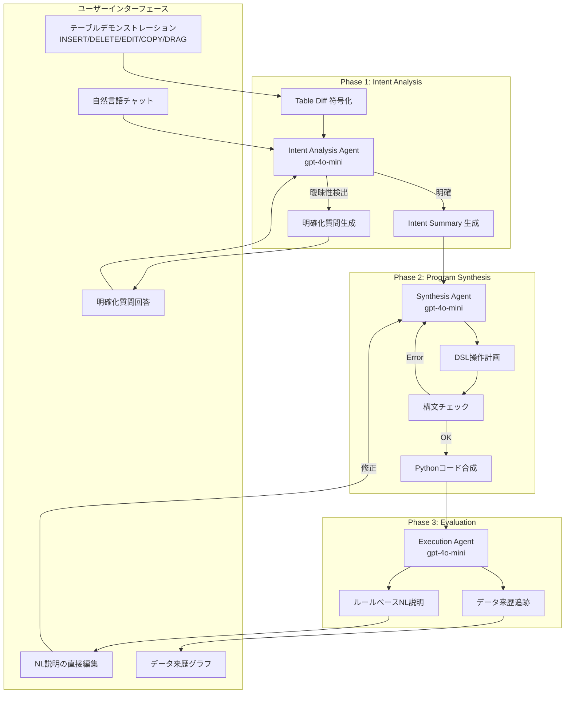
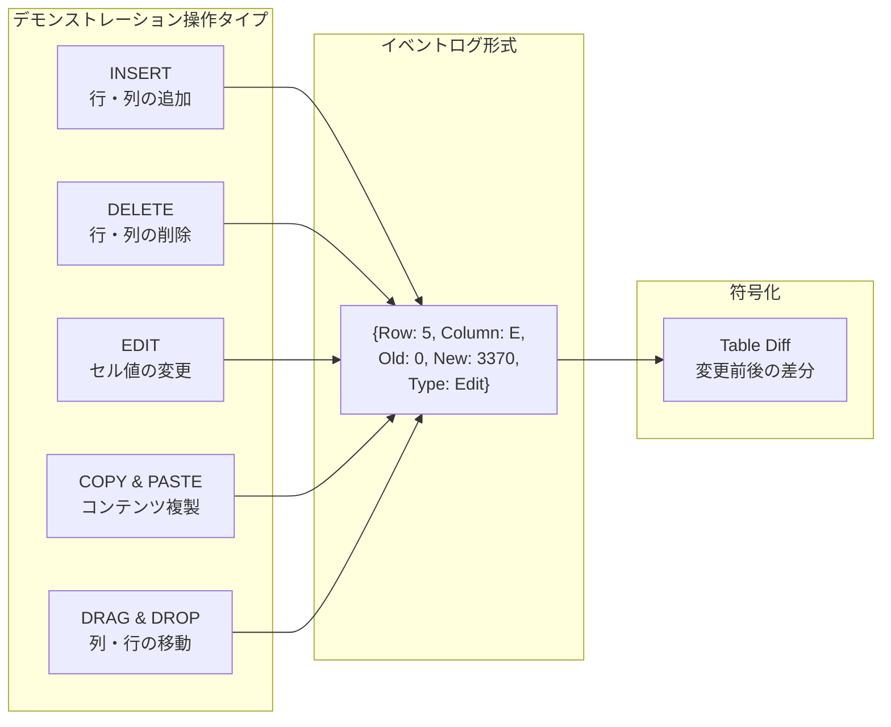
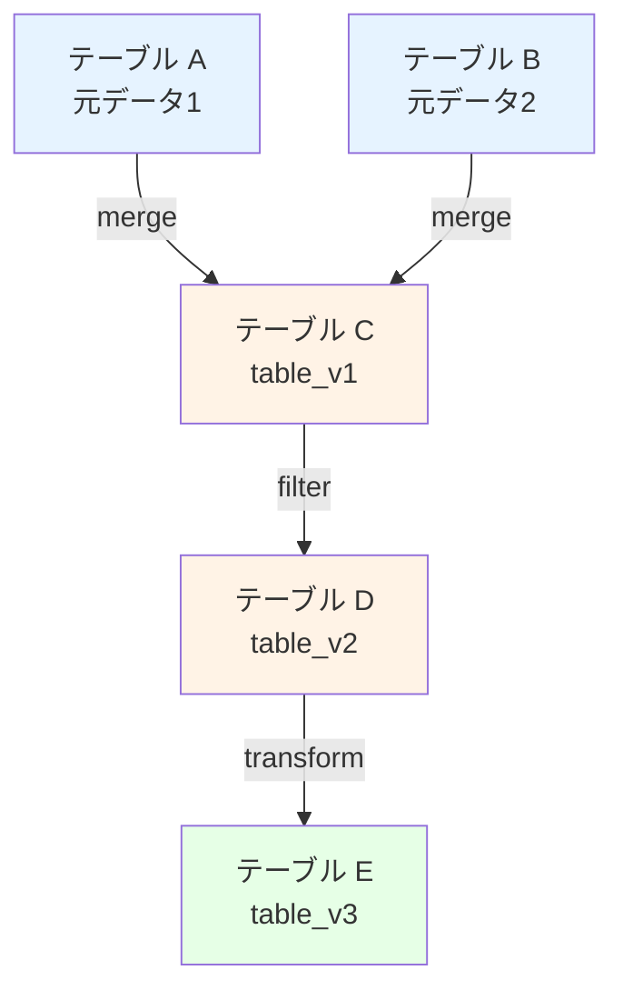

# Dango: A Mixed-Initiative Data Wrangling System using Large Language Model

- **Link**: https://arxiv.org/abs/2503.03154
- **Authors**: Wei-Hao Chen, Weixi Tong, Amanda Case, Tianyi Zhang
- **Year**: 2025
- **Venue**: CHI Conference on Human Factors in Computing Systems (CHI '25), Yokohama, Japan
- **Type**: Academic Paper (HCI / Data Wrangling)

## Abstract

Data wrangling is a time-consuming and challenging task in a data science pipeline. While many tools have been proposed to automate or facilitate data wrangling, they often misinterpret user intent, especially in complex tasks. We propose Dango, a mixed-initiative multi-agent system for data wrangling. Compared to existing tools, Dango enhances user communication of intent by allowing users to demonstrate on multiple tables and use natural language prompts in a conversation interface, enabling users to clarify their intent by answering LLM-posed multiple-choice clarification questions, and providing multiple forms of feedback such as step-by-step natural language explanations and data provenance to help users evaluate the data wrangling scripts. We conducted a within-subjects user study with 38 participants and demonstrated that Dango's features can significantly improve intent clarification, accuracy, and efficiency in data wrangling. Furthermore, we demonstrated the generalizability of Dango by applying it to a broader set of data wrangling tasks.

## Abstract（日本語訳）

データラングリングはデータサイエンスパイプラインにおける時間のかかる困難なタスクである。自動化や支援のために多くのツールが提案されてきたが、特に複雑なタスクにおいてユーザーの意図を誤解することが多い。本研究では、データラングリングのためのミクストイニシアティブ・マルチエージェントシステム「Dango」を提案する。既存ツールと比較して、Dangoは複数テーブルでのデモンストレーションと自然言語プロンプトによる意図伝達の強化、LLMが生成する多肢選択式の明確化質問によるユーザー意図の明確化、ステップバイステップの自然言語説明やデータ来歴（provenance）などの多様なフィードバック形式を提供する。38名の参加者による被験者内実験を実施し、Dangoの機能がデータラングリングにおける意図明確化、精度、効率を有意に改善することを実証した。

## 概要

Dangoは、LLMを活用したデータラングリング（データの前処理・変換・整理）のためのミクストイニシアティブ（mixed-initiative）型マルチエージェントシステムである。「ミクストイニシアティブ」とは、人間とAIが適切なタイミングで交互に主導権を取りながら協働する対話パラダイムを指す。

主要な貢献：

1. **マルチモーダルな意図伝達**: テーブル上のデモンストレーション操作と自然言語プロンプトの組み合わせにより、従来の単一チャネル方式を超えた意図表現を実現
2. **明確化質問（Clarification Questions）メカニズム**: 曖昧な意図に対してLLMが多肢選択式の質問を生成し、対話的に意図を精緻化
3. **ルールベース自然言語説明**: LLMの幻覚を防ぐため、DSL文法に基づくルールベースの変換でステップバイステップ説明を生成
4. **データ来歴の可視化**: テーブル間の依存関係と変換履歴を有向グラフで視覚化

## 問題と動機

- **ユーザー意図の誤解**: 既存のデータラングリングツール（Wrangler、FlashFill等）は、特に複雑な変換操作においてユーザーの意図を正確に解釈できないことが多い。自然言語のみ、またはデモンストレーションのみでは、複合的な変換意図を十分に伝達できない。

- **ブラックボックス問題**: LLMベースのコード生成ツールは、生成されたスクリプトの意図を人間が検証・理解することが困難であり、信頼性に課題がある。

- **フィードバックループの欠如**: 既存ツールは一方向的なコード生成に偏っており、生成結果に対するユーザーの評価・修正を効果的に組み込むフレームワークが不足している。

## 提案手法

### 3段階マルチエージェントパイプライン

Dangoのシステムは3つの専門エージェントによる段階的処理で構成される。各エージェントはOpenAI gpt-4o-miniを使用し、temperature=0で再現性を確保する。

### アルゴリズム / 処理フロー

```
Algorithm: Dango ミクストイニシアティブ・データラングリング

Input: テーブル集合 T = {t₁, ..., tₖ}, デモンストレーション操作 D, 自然言語指示 NL
Output: データラングリングスクリプト S

Phase 1: Intent Analysis（意図分析）
  1. デモンストレーション D をイベントログとしてキャプチャ
     - 操作タイプ: INSERT, DELETE, EDIT, COPY_AND_PASTE, DRAG_AND_DROP
     - 例: {Row:5, Column:E, Old:0, New:3370, Type:Edit}
  2. デモンストレーションを「Table Diff」として符号化
  3. NL指示を「User Instruction」として符号化
  4. Intent Analysis Agent がコンテキスト分析:
     IF 曖昧性を検出:
       多肢選択式明確化質問 CQ を生成（"Other" オプション含む）
       ユーザー回答を会話履歴に追加
       Phase 1 を再実行
     ELSE:
       Intent Summary IS を生成

Phase 2: Program Synthesis（プログラム合成）
  5. Synthesis Agent が IS に基づき合成計画を生成
     - ステップ記述 + DSL操作の対応付け
  6. DSL文法に従い引数をキュレーション
  7. 構文チェック実行（エラー時はフィードバックループ）
  8. Pythonコードスニペット合成・実行
     - バージョン管理: table_v1, table_v2, ...

Phase 3: Evaluation & Refinement（評価・改善）
  9. DSL文をルールベースでNL説明に変換（幻覚防止）
  10. ユーザーがNL説明を直接編集・ステップ削除・追加可能
  11. データ来歴グラフの可視化
  12. ユーザーフィードバックに基づく反復的改善

Return: 最終スクリプト S
```

### DSL（ドメイン固有言語）設計

Dangoは独自のDSLを定義し、データラングリング操作を構造化する。これにより、自由形式のコード生成ではなく、文法制約のある合成が可能となる。

## アーキテクチャ / プロセスフロー



## Figures & Tables

### Table 1: ユーザースタディ実験条件の比較

| 条件 | デモ+チャット | NL要約 | ステップバイステップ説明 | 明確化質問 |
|:---:|:---:|:---:|:---:|:---:|
| A | ✓ | LLM生成 | ✗ | ✗ |
| B | ✓ | ✓ | ルールベース | ✗ |
| C (Dango) | ✓ | ✓ | ルールベース | ✓ |

### Table 2: 定量的結果の比較

| 指標 | 条件A | 条件B | 条件C (Dango) | p値 |
|------|:---:|:---:|:---:|:---:|
| 平均タスク完了時間 | 約6分22秒 | 約5分9秒 | **3分30秒** | 1.76e-05 |
| 平均試行回数 | 2.00 | 1.66 | **1.43** | 2.89e-02 |
| タスク成功率 | 95% | 100% | **100%** | — |
| 幻覚発生率（/セッション） | 0.65 | 0.59 | **0.18** | 1.32e-02 |
| ユーザー信頼度（7点満点） | 5.31 | 6.18 | **6.34** | 1.64e-04 |
| エラー修正時間 | 4分06秒 | 2分41秒 | **2分25秒** | — |
| 初回成功率 | 43-51% | 43-51% | **62%** | — |

### Figure 1: デモンストレーション操作のイベントログ構造



### Table 3: ユーザー体験評価（主観的指標）

| フィーチャー | 肯定的評価率 | 主なユーザーコメント |
|------------|:---:|:---|
| 自然言語チャットルーム | 89% | 意図の補足説明に便利 |
| 明確化質問 | 89% | 曖昧性の解消に効果的 |
| ステップバイステップ説明 | 95% | 処理の理解と検証に有用 |
| NL説明の直接編集 | 66% | 修正操作が直感的 |
| データ来歴グラフ | 66-71% | 複雑な変換の追跡に有用 |

### Figure 2: データ来歴の可視化概念



## 実験と評価

### ユーザースタディ設計

- **参加者**: 38名（女性11名、男性27名）。プログラミング経験なし/最小32%、1-5年37%、5年以上31%。学部生42%、修士11%、博士47%
- **タスク**: 7つの代表的ラングリングタスク（単一テーブル2、マルチテーブル5）。31候補からドメイン専門家と共に選定
- **被験者内デザイン**: 3条件（A/B/C）× 3タスクをランダム割当。タスクと条件の順序効果を相殺するカウンターバランス設計
- **制限時間**: タスクあたり10分
- **評価指標**: タスク完了時間、試行回数、成功率、幻覚発生率、ユーザー信頼度、NASA TLX認知負荷

### 主要な知見

1. **効率性の大幅改善**: 条件C（Dango完全版）は条件Aに比べてタスク完了時間を45%短縮。明確化質問の導入が試行回数の削減に直接寄与
2. **幻覚の劇的削減**: LLM生成要約の幻覚率0.65/セッション → ルールベース説明 + 明確化質問で0.18/セッションに72%削減
3. **認知負荷の軽減**: NASA TLXスケールにおいてPerformance（達成感）とFrustration（挫折感）で有意な改善（p<0.05）
4. **ユーザー選好**: 82%の参加者が条件C（Dango完全版）を最も好ましいと回答

### 汎用性検証

追加の24タスクでの検証では、全タスクが成功裏に完了。平均完了時間62.67-75.90秒、DSL文分布分析によりタスクカバレッジの妥当性を確認。

## 備考

- CHI 2025（HCIのトップ会議）に採択された研究であり、エージェントシステムの技術的側面だけでなく、人間中心設計（HCD）の観点からの評価が充実している
- 「ミクストイニシアティブ」の概念は、完全自動化と完全手動の間のスイートスポットを探る重要なデザインパラダイムであり、データサイエンスの実務に即したアプローチである
- ルールベースのNL説明生成は、LLMの幻覚問題に対するシンプルだが効果的な対策であり、DSLの文法規則を活用して確定的な変換を実現している点が実用的
- データ来歴（Data Provenance）の可視化はテーブルレベルの粒度に限定しており、行・列レベルの細粒度追跡は情報過多を避けるため意図的に除外している
- 本研究は「データラングリング」に特化しているが、ミクストイニシアティブ + マルチエージェント + 明確化質問の設計パターンは、EDA（探索的データ分析）やモデル構築など他のデータサイエンスフェーズにも応用可能
