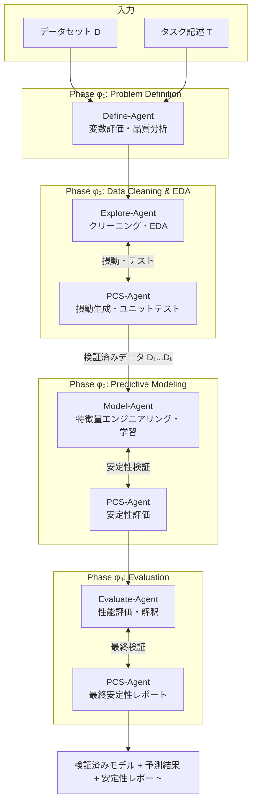
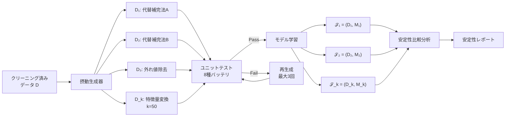

# VDSAgents: A PCS-Guided Multi-Agent System for Veridical Data Science Automation

- **Link**: https://arxiv.org/abs/2510.24339
- **Authors**: Yunxuan Jiang, Silan Hu, Xiaoning Wang, Yuanyuan Zhang, Xiangyu Chang
- **Year**: 2025
- **Venue**: Stat (under review, manuscript ID: STAT-25-0222.R1)
- **Type**: Academic Paper (データサイエンス自動化 / マルチエージェント)

## Abstract

This paper presents VDSAgents, a multi-agent system grounded in the Predictability-Computability-Stability (PCS) principles from the Veridical Data Science framework. The system implements a modular workflow for data cleaning, feature engineering, modeling, and evaluation, with each phase handled by specialized agents. It incorporates perturbation analysis, unit testing, and model validation to ensure the reliability and trustworthiness of automated data science pipelines. Evaluation on nine datasets shows VDSAgents consistently outperforms the results of AutoKaggle and DataInterpreter using DeepSeek-V3 and GPT-4o backends.

## Abstract（日本語訳）

本論文は、Veridical Data Scienceフレームワークの予測可能性・計算可能性・安定性（PCS）原則に基づくマルチエージェントシステム「VDSAgents」を提案する。本システムはデータクリーニング、特徴量エンジニアリング、モデリング、評価の各フェーズをモジュラーワークフローとして実装し、各フェーズを専門エージェントが担当する。摂動分析、ユニットテスト、モデル検証を組み込むことでパイプラインの信頼性を確保する。9つのデータセットでの評価において、VDSAgentsはDeepSeek-V3およびGPT-4oバックエンドを使用してAutoKaggleおよびDataInterpreterの結果を一貫して上回ることを示した。

## 概要

VDSAgentsは、統計学の理論的基盤である「Veridical Data Science（真正データサイエンス）」のPCS原則をLLMベースマルチエージェントシステムに組み込んだ先駆的研究である。従来のLLMベースデータサイエンスエージェントが「LLMの内在的推論能力」に依存するのに対し、VDSAgentsは理論的原則に基づいて各処理段階を制約・検証することで、信頼性の高い自動化を実現する。

主要な貢献：

1. **PCS原則のエージェントシステムへの組み込み**: 予測可能性・計算可能性・安定性の3原則をマルチエージェントワークフローの各段階に体系的に適用
2. **5エージェント構成**: Define・Explore・Model・Evaluate・PCS の5つの専門エージェントによる段階的処理
3. **摂動分析による堅牢性検証**: データの複数摂動バージョンを生成し、結果の安定性を定量的に評価
4. **ユニットテストバッテリ**: 8種類の自動テストによるデータ品質保証
5. **AutoKaggle・DataInterpreterを上回る性能**: 9データセットでの一貫した優位性を実証

## 問題と動機

- **理論的基盤の欠如**: 既存のLLMベースデータサイエンスエージェント（AutoKaggle、DataInterpreter等）は、LLMの推論能力に全面的に依存しており、統計的に健全な分析を保証するメカニズムが欠けている。「グローバルな手法を適用し、データの潜在的階層構造を見落とす」傾向がある。

- **パイプラインの脆弱性**: 自動生成されたパイプラインが実行時にエラーを起こす、または統計的に無効な結果を出力するケースが頻発。既存手法のValid Submission率はAutoKaggleで0.534、DataInterpreterで0.672に留まる。

- **データ安定性の無視**: データの前処理方法（欠損値補完、外れ値処理等）の選択が最終結果に大きく影響するにもかかわらず、既存手法はこの感度分析を行わない。

## 提案手法

### PCS原則の定義と適用

| 原則 | 定義 | VDSAgentsでの具体的適用 |
|------|------|----------------------|
| **Predictability（予測可能性）** | モデルが新しいデータに対して汎化すること | 交差検証、テストデータでの性能評価 |
| **Computability（計算可能性）** | 分析ステップが実行可能であること | ユニットテスト、コード実行検証 |
| **Stability（安定性）** | データや手法の摂動に対して結果が安定すること | 摂動分析（k=50バリアント生成） |

### アルゴリズム

```
Algorithm: VDSAgents PCS-Guided Data Science Automation

Input: データセット D, タスク記述 T
Output: 検証済みモデルと予測結果

Phase φ₁: Problem Definition & Data Quality（Define-Agent）
  1. 変数の関連性評価
  2. 観測単位の検出
  3. データ品質レポート生成

Phase φ₂: Data Cleaning & EDA（Explore-Agent + PCS-Agent）
  4. Explore-Agent: 無効値検出、構造分析、探索的質問
  5. PCS-Agent: クリーニング結果に対して摂動バージョン生成
     FOR i = 1 to k (k=50):
       D_i = perturb(D, strategy_i)
       // strategy: 代替的補完法、外れ値処理、特徴量変換
     RUN unit_tests(D_i) for each variant
     // 8種テスト: ファイル読取可能性、空データセット検出、
     //            未処理欠損値、重複特徴量/行、データ整合性、
     //            データ保持率検証（閾値 > 85%）
     IF test_failed:
       コード削除 → 再生成（最大 N_max = 3 回）

Phase φ₃: Predictive Modeling（Model-Agent + PCS-Agent）
  6. Model-Agent: 特徴量エンジニアリング、アルゴリズム選択、学習
  7. 各摂動データセット D_i でモデル M_i を学習
     ℱ_i = (D_i, M_i)  // 予測適合ペア
  8. PCS-Agent: 予測適合ペア間の安定性評価

Phase φ₄: Result Evaluation（Evaluate-Agent + PCS-Agent）
  9. Evaluate-Agent: 性能評価、結果の解釈
  10. PCS-Agent: 安定性レポート生成、最終検証

Return: 最終モデル M*, 予測結果, 安定性レポート
```

### ツールセット割当

各フェーズで使用可能なツールが条件付きで割り当てられる：
- φ₁: コードエグゼキュータ + デバッグツール
- φ₂: 上記 + MLツール + 画像テキスト変換
- φ₃: MLツール
- φ₄: 基本ツール

## アーキテクチャ / プロセスフロー



## Figures & Tables

### Table 1: 5エージェントの役割と担当フェーズ

| エージェント | 担当フェーズ | 役割 | 入力 | 出力 |
|------------|:---:|------|------|------|
| Define-Agent | φ₁ | 問題定式化、データ品質評価 | データセット、タスク記述 | 品質レポート、変数分類 |
| Explore-Agent | φ₂ | データクリーニング、EDA | 品質レポート、生データ | クリーニング済みデータ |
| Model-Agent | φ₃ | 特徴量設計、モデル学習、予測 | クリーニング済みデータ群 | 予測適合ペア ℱ_i |
| Evaluate-Agent | φ₄ | 性能評価、結果解釈 | 予測結果、メトリクス | 評価レポート |
| **PCS-Agent** | **φ₂-φ₄** | **横断的監視、摂動分析、安定性検証** | **各フェーズ出力** | **安定性レポート** |

### Table 2: 主要実験結果（Comprehensive Score = 0.5×VS + 0.5×ANPS）

| 手法 | Valid Submission (VS) | ANPS | Comprehensive Score (CS) |
|------|:---:|:---:|:---:|
| AutoKaggle (GPT-4o) | 0.534 | 0.497 | 0.515 |
| DataInterpreter (GPT-4o) | 0.672 | 0.569 | 0.621 |
| **VDSAgents (DeepSeek-V3)** | **0.894** | — | — |
| **VDSAgents (GPT-4o)** | **0.950** | **0.692** | **0.821** |

### Table 3: ユニットテストバッテリ（8種類）

| テスト項目 | 検証内容 | 失敗時の処理 |
|----------|---------|------------|
| ファイル読取可能性 | データファイルの正常読込 | コード削除→再生成 |
| 空データセット検出 | 処理後データの非空確認 | コード削除→再生成 |
| 未処理欠損値 | 欠損値処理の完了確認 | コード削除→再生成 |
| 重複特徴量 | 同一特徴量の重複排除 | コード削除→再生成 |
| 重複行 | 同一行の重複排除 | コード削除→再生成 |
| データ整合性 | スキーマの一貫性確認 | コード削除→再生成 |
| データ保持率 | 保持率 > 85%の確認 | コード削除→再生成 |
| 型一致 | データ型の期待値一致 | コード削除→再生成 |

### Figure 1: PCS-Agentの摂動分析フロー



### Table 4: データセット分類と特性

| カテゴリ | データセット | ソース | タスク型 |
|---------|------------|--------|---------|
| Clean | bank_churn, titanic, obesity_risks | Kaggle | 分類 |
| Raw | adult, in-vehicle_coupon, parkinsons, seoul_bike | UCI | 分類/回帰 |
| Complex | ames_houses, online_shopping | vdsbook.com | 回帰/分類 |

## 実験と評価

### 実験設定

- **データセット**: 9つ（Clean 3、Raw 4、Complex 2）。Kaggle、UCI Machine Learning Repository、vdsbook.comから選定
- **LLMバックエンド**: GPT-4o、DeepSeek-V3
- **摂動パラメータ**: k=50（摂動バリアント数）、N_max=3（最大リトライ回数）
- **ベースライン**: AutoKaggle（GPT-4o）、DataInterpreter（GPT-4o）
- **評価指標**:
  - Valid Submission (VS) = T_s / T（成功試行比率、目標5回の有効出力）
  - Average Normalized Performance Score (ANPS): 分類=Accuracy+F1+Precision+Recall の正規化、回帰=1/(1+RMSE)+1/(1+MAE)+R² の正規化
  - Comprehensive Score (CS) = 0.5×VS + 0.5×ANPS

### 主要結果

1. **実行安定性（VS）**: VDSAgents-GPT4o が0.950を達成し、AutoKaggle（0.534）の1.78倍、DataInterpreter（0.672）の1.41倍の安定性
2. **予測性能（ANPS）**: VDSAgents-GPT4o が0.692を達成し、AutoKaggle（0.497）に対して39%、DataInterpreter（0.569）に対して22%の改善
3. **回帰タスクでの顕著な優位**: Parkinson'sデータセットでVDSAgentsは0.947のANPSを達成、AutoKaggleは負のスコア
4. **アブレーション結果**: PCS-Agentを除去すると、Online ShoppingデータセットでVS↓20%、ANPS↓49%、CS↓31%と大幅な性能低下

### DeepSeek-V3バックエンドの結果

VDSAgents-DeepSeek（平均VS: 0.894）は、GPT-4o（0.950）には及ばないものの、ベースラインのAutoKaggle-GPT4o（0.534）を大幅に上回り、オープンソースLLMの実用性を示した。

## 備考

- Veridical Data Scienceは統計学者Bin Yu（UC Berkeley）が提唱したフレームワークであり、本研究はその理論をLLMエージェントに実装した最初の試みの一つとして位置づけられる
- 摂動分析にk=50バリアントを使用するため、計算コストが高い点は実用上の課題である。ただし付録のパラメータスタディによれば、k=5程度で安定性評価は飽和する傾向がある
- PCS-Agentが「横断的監視者」として全フェーズに関与する設計は、品質保証の専門エージェントというアーキテクチャパターンとして他のシステムにも応用可能
- ユニットテストバッテリの導入は、ソフトウェアエンジニアリングの品質保証手法をデータサイエンスパイプラインに適用したものであり、MLOps の文脈でも参考になる
- 「クリーニングプロセスを意味的変数役割に沿った推論ステップに分解する」アプローチは、LLMの推論能力と統計的知識を効果的に組み合わせる設計方針として注目に値する
