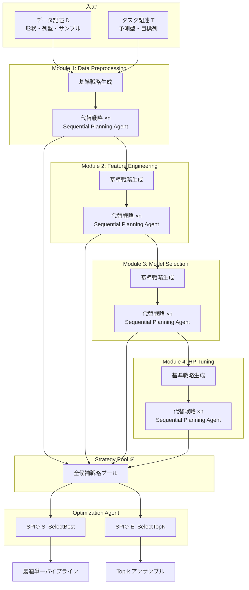
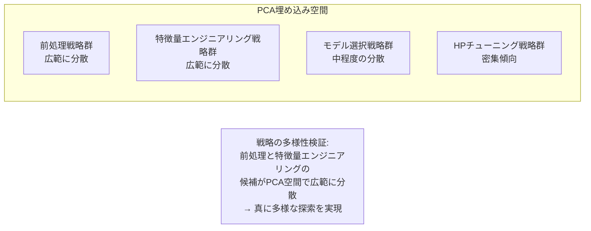

# SPIO: Ensemble and Selective Strategies via LLM-Based Multi-Agent Planning in Automated Data Science

- **Link**: https://arxiv.org/abs/2503.23314
- **Authors**: Wonduk Seo, Juhyeon Lee, Yanjun Shao, Qingshan Zhou, Seunghyun Lee, Yi Bu
- **Year**: 2025
- **Venue**: arXiv preprint (cs.AI), Under Review
- **Type**: Academic Paper (自動データサイエンス / マルチエージェント計画)

## Abstract

Current multi-agent systems for automated data analytics often follow rigid, single-path workflows, limiting adaptability across diverse datasets and tasks. This paper presents SPIO (Sequential Plan Integration and Optimization), a framework that employs adaptive, multi-path planning across four core modules: data preprocessing, feature engineering, model selection, and hyperparameter tuning. Specialized agents generate diverse strategies that are refined by an optimization agent. The framework offers two modes: SPIO-S for selecting an optimal single pipeline, and SPIO-E for ensembling top-k pipelines. Testing on Kaggle and OpenML benchmarks demonstrated consistent improvements, with an average performance gain of 5.6% compared to existing approaches.

## Abstract（日本語訳）

自動データ分析のための現行マルチエージェントシステムは、硬直的な単一パスワークフローに従うことが多く、多様なデータセットやタスクに対する適応性が制限されている。本論文は、データ前処理、特徴量エンジニアリング、モデル選択、ハイパーパラメータチューニングの4つのコアモジュールにわたる適応的マルチパス計画を採用するフレームワーク「SPIO（Sequential Plan Integration and Optimization）」を提案する。専門エージェントが多様な戦略を生成し、最適化エージェントがそれを精錬する。SPIOは最適な単一パイプラインを選択するSPIO-Sモードと、上位kパイプラインをアンサンブルするSPIO-Eモードの2つを提供する。KaggleおよびOpenMLベンチマークでの評価で、既存手法に対して平均5.6%の性能改善を達成した。

## 概要

SPIOは、自動データサイエンスにおける「単一パス問題」—— 1つのパイプラインのみを生成し実行する従来手法の限界 —— を解決するために設計されたマルチエージェント計画フレームワークである。各処理モジュールで複数の代替戦略を探索し、LLMベースの最適化エージェントが最終的な戦略選択またはアンサンブルを行う。

主要な貢献：

1. **マルチパス計画**: 各モジュールで複数の代替戦略を並行生成し、単一パスの硬直性を解消
2. **2つの運用モード**: 最適単一パイプライン選択（SPIO-S）と上位kアンサンブル（SPIO-E）
3. **Sequential Planning Agent**: 過去の出力を条件として逐次的に代替戦略を提案するエージェント
4. **12ベンチマークでの包括的評価**: Kaggle 8 + OpenML 4 データセットでの7手法との比較
5. **専門家評価**: 100ペアでの人手による品質評価

## 問題と動機

- **単一パスワークフローの限界**: 既存のマルチエージェントシステム（Data Interpreter、AutoKaggle等）は、各処理段階で1つの戦略のみを生成・実行する。データセットの特性によっては、その戦略が最適でない場合があるが、代替案を探索するメカニズムが欠けている。

- **戦略の多様性不足**: 同一のLLMプロンプトから生成される戦略は類似しやすく、真に多様なアプローチを探索できない。温度パラメータの調整だけでは不十分である。

- **パイプライン全体の最適化の欠如**: 個別モジュールの局所最適化は行われるが、パイプライン全体としてのシナジー効果を考慮した選択メカニズムが不在である。

## 提案手法

### SPIOフレームワーク

SPIOは4つのコアモジュールを逐次的に処理し、各モジュールで複数の戦略候補を生成・評価する。

### コード生成関数 𝒢

各モジュールの処理は統一的なコード生成関数 𝒢 で定式化される：

```
Preprocessing:    (C_pre, D_pre)     = 𝒢(D, T)
Feature Eng.:     (C_feat, D_feat)   = 𝒢(C_pre, D_pre, T)
Model Selection:  (C_model, V_model) = 𝒢(C_feat, D_feat, T)
HP Tuning:        (C_hp, V_hp)       = 𝒢(C_model, D_feat, T)
```

ここで C はコード、D はデータ記述、V は検証スコア、T はタスク記述。

### アルゴリズム

```
Algorithm: SPIO - Sequential Plan Integration and Optimization

Input: データ記述 D（形状、列型、サンプル）, タスク記述 T（予測型、目標列）
Output: 最適パイプライン（SPIO-S）またはアンサンブル（SPIO-E）

--- Phase 1: Baseline Generation ---
FOR each module m ∈ {preprocessing, feature_eng, model_select, hp_tune}:
  (C_m, output_m) = 𝒢(context_m, D, T)  // 基準コードと出力を生成

--- Phase 2: Alternative Strategy Generation ---
FOR each module m:
  FOR i = 1 to n:  // n = 最大2候補
    P_m^i = SequentialPlanningAgent(C_m, output_m, D, T, P_<m)
    // 過去の出力とコンテキストを条件として代替戦略を提案

--- Phase 3: Strategy Selection ---
𝒫 = {全モジュールの候補戦略プール}

IF mode == SPIO-S:
  P* = SelectBest_LLM(𝒫, D, T)
  // LLMが全候補を評価し最適な単一パスを選択
  C_final = 𝒢(P*, D, T)

IF mode == SPIO-E:
  {P*₁, ..., P*_k} = SelectTopK_LLM(𝒫, D, T)  // 経験的に k=2 が最適
  FOR each P*ᵢ:
    C_final^i = 𝒢(P*ᵢ, D, T)
  // 分類: arg max_c(1/k Σ p_i(c))  [ソフト投票]
  // 回帰: 1/k Σ ŷ_i              [平均]

Return: C_final（SPIO-S）または ensemble(C_final^1, ..., C_final^k)（SPIO-E）
```

## アーキテクチャ / プロセスフロー



## Figures & Tables

### Table 1: SPIO-S と SPIO-E の比較

| 特性 | SPIO-S（選択モード） | SPIO-E（アンサンブルモード） |
|------|:---:|:---:|
| 出力 | 最適な単一パイプライン | 上位k個のアンサンブル |
| 選択方法 | SelectBest_LLM | SelectTopK_LLM |
| 透明性 | 高（単一パス追跡可能） | 中（複数パス統合） |
| 分類集約 | N/A | ソフト投票: arg max_c(1/k Σ p_i(c)) |
| 回帰集約 | N/A | 平均: 1/k Σ ŷ_i |
| 最適k | N/A | k=2（経験的最適値） |
| 計算コスト | 低 | 中（k倍の推論コスト） |

### Table 2: GPT-4o バックエンドでの主要結果（分類タスク）

| データセット | ZeroShot | CoT | Agent K | AutoKaggle | Data Interp. | AIDE | **SPIO-S** | **SPIO-E** |
|------------|:---:|:---:|:---:|:---:|:---:|:---:|:---:|:---:|
| Titanic | — | — | — | — | — | 0.7775 | — | **0.7871** |
| Spaceship | — | — | — | — | — | 0.7949 | — | **0.8034** |
| Monsters | — | — | — | — | 0.7289 | — | — | **0.7410** |

### Table 3: GPT-4o バックエンドでの主要結果（回帰タスク）

| データセット | AIDE (RMSE) | **SPIO-S (RMSE)** | **SPIO-E (RMSE)** |
|------------|:---:|:---:|:---:|
| House Price | 0.1310 | — | **0.1298** |
| Boston | 3.0312 | **2.9192** | — |

### Figure 1: 戦略多様性のPCA可視化



### Table 4: アブレーションスタディ結果

| 除去モジュール | 性能への影響 | 備考 |
|-------------|:---:|------|
| 特徴量エンジニアリング除去 | 顕著な低下 | SPIO性能の主要ドライバー |
| ハイパーパラメータチューニング除去 | 顕著な低下 | SPIO性能の主要ドライバー |
| モデル選択除去 | 中程度の低下 | — |
| 前処理除去 | 軽微な低下 | — |

### Table 5: 専門家評価スコア（100評価ペア）

| 評価基準 | SPIO-S | SPIO-E |
|---------|:---:|:---:|
| 妥当性（Plausibility） | 4.24 | **4.45** |
| 解釈可能性（Interpretability） | 4.24 | **4.45** |
| 多様性/カバレッジ | 4.24 | **4.45** |
| 使いやすさ（Usability） | 4.24 | **4.45** |
| Top-1計画選択への同意率 | — | **72%** |

*スコアは5段階評価（± 標準偏差: S=0.18, E=0.15）*

## 実験と評価

### 実験設定

- **ベンチマーク**: Kaggle 8データセット（分類7、回帰1）、OpenML 4データセット（回帰3、二値分類1）、計12データセット
- **データ分割**: OpenML=70/10/20（train/val/test）、Kaggle=70/30（train/val、テストはリーダーボード）
- **LLMバックエンド**: GPT-4o、Claude 3.5 Haiku、LLaMA3-8B
- **サンプリング設定**: temperature=0.5, top_p=1.0, max_tokens=4096
- **ベースライン**: ZeroShot、CoT、Agent K v1.0、AutoKaggle、OpenHands、Data Interpreter、AIDE（計7手法）
- **評価指標**: 分類=Accuracy/ROC-AUC、回帰=RMSE

### 主要結果

1. **平均性能改善**: 12ベンチマーク全体で **平均5.6%の性能改善** を達成
2. **アンサンブルの優位性**: SPIO-Eがほぼ全てのデータセットでSPIO-Sを上回り、k=2が最適バランス
3. **統計的有意性**: 複数の結果で対応t検定 + Holm-Bonferroni補正でp<0.05
4. **マルチバックエンド検証**: GPT-4o、Claude 3.5 Haiku、LLaMA3-8Bの全てで一貫した改善傾向
5. **専門家評価**: SPIO-Eが妥当性・解釈可能性・多様性・使いやすさの全基準でSPIO-Sを上回り、72%の同意率でTop-1計画選択の妥当性を確認

### 戦略多様性の分析

PCA可視化により、前処理と特徴量エンジニアリングの候補戦略がPCA埋め込み空間で広範に分散していることが確認された。これは生成された戦略が単なる表面的バリエーションではなく、実質的に異なるアプローチであることを示している。

## 備考

- SPIOの「Sequential Plan Integration and Optimization」という名称は、各モジュールの計画を逐次的に統合し、パイプライン全体として最適化するという設計思想を反映している
- k=2のアンサンブルが最適という知見は、「多様性と精度のトレードオフ」の実践的なガイドラインとして重要。k>2では過度の多様性が精度を劣化させる
- LLMベースの戦略選択（SelectBest_LLM / SelectTopK_LLM）は、従来のAutoMLにおけるメタ学習やベイズ最適化とは本質的に異なるアプローチであり、LLMの「暗黙的なドメイン知識」を活用している
- オープンウェイトモデル（LLaMA3-8B）でも改善傾向が見られる点は、SPIOのアーキテクチャがLLMの能力に依存しすぎていないことを示唆する
- 候補戦略数が「各モジュール最大2候補」に限定されている点は、探索空間の拡大とコストのトレードオフとして明示的に認識されており、今後の拡張の余地がある
- 「検証・フィードバック駆動の計画選択」を今後の方向性として挙げており、現在のLLMベース選択の限界を自覚している点が誠実な研究態度である
