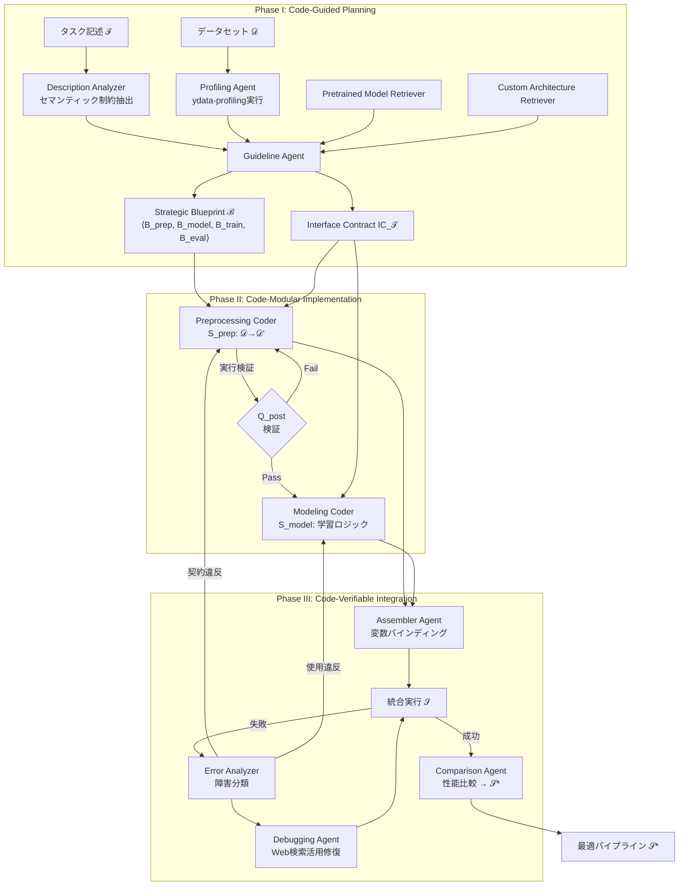
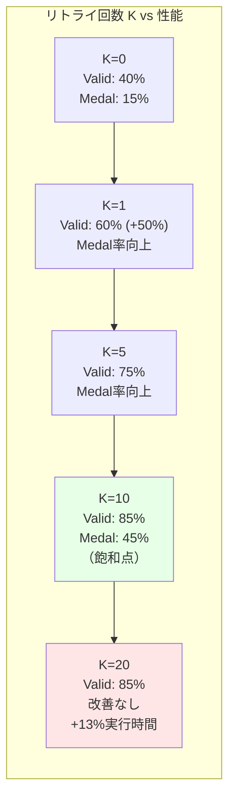

# iML: A Multi-Agent Framework for Code-Guided, Modular, and Verifiable Automated Machine Learning

- **Link**: https://arxiv.org/abs/2602.13937
- **Authors**: Dat Le, Duc-Cuong Le, Anh-Son Nguyen, Tuan-Dung Bui, Thu-Trang Nguyen, Son Nguyen, Hieu Dinh Vo
- **Year**: 2026
- **Venue**: arXiv preprint (cs.LG)
- **Type**: Academic Paper (AutoML / マルチエージェント)

## Abstract

Traditional AutoML frameworks often function as "black boxes", lacking the flexibility and transparency required for complex, real-world engineering tasks. This paper introduces iML, a multi-agent framework that addresses these limitations through three core strategies: empirical profiling-based planning to reduce hallucination, separation of preprocessing and modeling components with interface contracts, and verification mechanisms for physical feasibility. Results demonstrate strong performance metrics: 85% valid submission rate and 45% competitive medal rate on MLE-BENCH, with an average standardized performance score of 0.77, plus 38%–163% performance improvements on iML-BENCH. The framework maintains a 70% success rate even under stripped task descriptions.

## Abstract（日本語訳）

従来のAutoMLフレームワークは「ブラックボックス」として機能することが多く、複雑な現実世界のエンジニアリングタスクに必要な柔軟性と透明性が欠けている。本論文は、3つのコア戦略によりこれらの限界に対処するマルチエージェントフレームワーク「iML」を提案する。経験的プロファイリングに基づく計画によるハルシネーション削減、インターフェース契約を伴う前処理とモデリングコンポーネントの分離、物理的実現可能性のための検証メカニズムである。MLE-BENCHにおいて85%の有効提出率と45%の競争的メダル率、平均標準化性能スコア0.77を達成し、iML-BENCHにおいて38%〜163%の性能改善を示した。タスク記述が削減された条件下でも70%の成功率を維持する。

## 概要

iMLは、LLMベースAutoMLの3つの根本的弱点 —— モノリシックな硬直性、幻覚的ロジック、ラッパー的制約 —— を体系的に解決するマルチエージェントフレームワークである。「コード駆動（Code-Guided）」「モジュラー（Modular）」「検証可能（Verifiable）」の3つの設計原則に基づき、9つの専門エージェントが階層的に協働する。

主要な貢献：

1. **経験的プロファイリングによる計画**: LLMの推論だけでなく、実際のデータプロファイリング結果に基づいて戦略的ブループリントを生成し、幻覚を削減
2. **Design by Contractに基づくモジュール分離**: 前処理とモデリングをインターフェース契約で厳密に分離し、エラー伝播を防止
3. **中間実行検証**: コードの物理的実行可能性を各段階で検証し、意味的に無効なロジックの伝播を阻止
4. **iML-BENCHの提供**: 2021-2025年のKaggleコンペティション9件からなる新ベンチマークの構築
5. **MLE-BENCHでのSOTA**: 85%有効提出率、45%メダル率、APS 0.77を達成

## 問題と動機

- **モノリシックな硬直性**: 既存のAutoMLフレームワーク（AutoGluon等）は前処理からモデル学習までを一体的に処理し、個別コンポーネントの柔軟な差替えや拡張が困難。

- **幻覚的ロジック（Hallucinated Logic）**: LLMベースのコード生成において、存在しないカラム名の参照、互換性のないテンソル形状、論理的に無効な前処理手順など、「一見正しそうだが実行不可能な」コードが頻繁に生成される。

- **ラッパー的制約**: MLZero等のシステムは既存AutoMLツール（AutoGluon）をLLMでラップするだけであり、LLMの能力を活かしたカスタムパイプライン設計ができない。

- **低い有効提出率**: 既存のLLMベースAutoML（MLE-STAR: 55%、AutoML-Agent: 40%）は、生成したパイプラインの過半数が実行エラーを起こす。

## 提案手法

### 3フェーズ階層型アーキテクチャ

iMLは3つのフェーズで構成される階層型マルチエージェントシステムである。

### Phase I: Code-Guided Planning（コード駆動型計画）

```
Input: タスク記述 𝒯, データセット 𝒟
Process:
  1. Description Analyzer: 𝒯 からセマンティック制約 Sum_𝒯 を抽出
  2. Profiling Agent: ydata-profiling を実行し経験的メタ特徴量 F_meta を生成
     // スキーマ、データ品質、分布情報を検証済みツールで取得
     // LLMの推論ではなく実データに基づく
  3. Pretrained Model Retriever: 事前学習モデルの候補を検索
  4. Custom Architecture Retriever: カスタムアーキテクチャの候補を検索
  5. Guideline Agent: ℬ = ⟨B_prep, B_model, B_train, B_eval⟩ を合成
     // Strategic Blueprint: 各フェーズの制約と推奨を定義
Output: Strategic Blueprint ℬ, Interface Contract IC_𝒯
```

### Phase II: Code-Modular Implementation（コードモジュラー実装）

```
Input: ℬ, IC_𝒯, F_meta
Process:
  6. Preprocessing Coder: 生データ 𝒟 → テンソル準備済み特徴量 𝒟'
     // Post-condition Q_post を満たすコード S_prep を生成
  7. S_prep を 𝒟 上で実行 → 𝒟' の形状・型を検証
  8. Modeling Coder: 学習ロジック S_model を合成
     // Pre-condition R_pre（= IC_𝒯 で定義）を満たすことを保証
     // F_meta とインターフェース契約に基づく
Output: S_prep, S_model（検証済み）
```

### Phase III: Code-Verifiable Integration（コード検証可能統合）

```
Input: S_prep, S_model
Process:
  9. Assembler Agent: 変数バインディングでモジュール統合
     // 𝒟' の出力形状・型が S_model の入力期待に一致するか動的検証
  10. 統合パイプライン 𝒮 を実行
  11. IF 実行失敗:
        Error Analyzer: 障害を分類
          - 契約履行失敗 → Preprocessing Coder に差戻し
          - 使用方法違反 → Modeling Coder に差戻し
        Debugging Agent: Web検索を活用した反復修復
        // 最大 K=10 回のリトライ（K=10 で飽和）
  12. Comparison Agent: 複数トラックの性能比較
      𝒮* = argmax_𝒮 ℳ_𝒯(𝒮)
Output: 最適パイプライン 𝒮*
```

### インターフェース契約（Interface Contract）

```
IC_𝒯 = {
  data_schema: {
    types: [pandas.DataFrame | torch.DataLoader | .yaml config],
    constraints: [non-null, specific_tensor_shapes, data_types]
  },
  binding_invariants: {
    variable_mappings: S_prep.output → S_model.input
  },
  post_conditions: Q_post,  // S_prep が満たすべき事後条件
  pre_conditions: R_pre      // S_model が期待する事前条件
}
```

## アーキテクチャ / プロセスフロー



## Figures & Tables

### Table 1: 9エージェントの役割一覧

| エージェント | フェーズ | 役割 | 主要な入出力 |
|------------|:---:|------|------------|
| Description Analyzer | I | タスクからセマンティック制約を抽出 | 𝒯 → Sum_𝒯 |
| Profiling Agent | I | データプロファイリングツール実行 | 𝒟 → F_meta |
| Pretrained Model Retriever | I | 事前学習モデル候補の検索 | キーワード → モデル候補 |
| Custom Architecture Retriever | I | カスタムアーキテクチャ候補の検索 | キーワード → アーキテクチャ候補 |
| Guideline Agent | I | 戦略的ブループリント合成 | Sum_𝒯 + F_meta → ℬ + IC_𝒯 |
| Preprocessing Coder | II | データ前処理コード生成 | ℬ + IC_𝒯 → S_prep |
| Modeling Coder | II | モデル学習コード生成 | ℬ + IC_𝒯 + F_meta → S_model |
| Assembler Agent | III | モジュール統合・変数バインディング | S_prep + S_model → 𝒮 |
| Error Analyzer + Debugging Agent | III | 障害分類・反復修復 | 実行エラー → 修復コード |
| Comparison Agent | III | 複数トラック性能比較 | {𝒮₁, ..., 𝒮ₙ} → 𝒮* |

### Table 2: MLE-BENCH 主要結果

| 手法 | %Valid | %Above Median | %Any Medal | APS |
|------|:---:|:---:|:---:|:---:|
| AutoGluon | 80% | 55% | 40% | 0.66 |
| MLZero | 60% | 45% | 30% | 0.54 |
| MLE-STAR | 55% | 40% | 15% | 0.43 |
| AutoML-Agent | 40% | 25% | 5% | 0.22 |
| **iML** | **85%** | **80%** | **45%** | **0.77** |

### Table 3: アブレーションスタディ結果

| 除去要素 | APS | %Valid | %Above Median | 影響 |
|---------|:---:|:---:|:---:|------|
| 完全版iML | **0.77** | **85%** | **80%** | — |
| Guideline除去 | 0.69 (-0.08) | — | 40% (-40%) | 計画なしでの性能低下 |
| モノリシックコード | 0.69 (-0.08) | 80% (-5%) | — | モジュール分離の効果 |
| 検証除去 | 0.67 (-0.10) | — | 45% (-35%) | 検証の重要性 |

### Figure 1: 自己修正（Self-Correction）の効果



### Table 4: iML-BENCH詳細結果

| データセット | ドメイン | タスク型 | iML APS | AutoGluon APS | 改善率 |
|------------|---------|---------|:---:|:---:|:---:|
| PetFinder | 生活 | 分類 | 0.67 | 0.00 | ∞ |
| Multilabel | 一般 | 多ラベル分類 | 0.69 | 0.00 | ∞ |
| 他7件 | 多様 | 混合 | — | — | 38%–163% |
| **平均** | — | — | **0.58** | **0.42** | **38%** |

### Table 5: 計算コストとリソース

| 指標 | 値 |
|------|:---:|
| 平均実行時間 | 3.5時間/モデル |
| 平均トークン使用量 | 185Kトークン/モデル |
| 平均コスト | $0.20/モデル |
| Phase I（計画）所要時間 | 6分 |
| Phase II（実装）所要時間 | 20分 |
| Phase III（検証）所要時間 | 実行時間の85% |

## 実験と評価

### ベンチマーク

**MLE-BENCH (Lite)**:
- MLE-Bench Liteサブセットの20データセット
- リソース制約: データセットあたり5時間
- Kaggle非公開リーダーボードでの評価

**iML-BENCH（新規提案）**:
- 2021-2025年のKaggleコンペティション9件
- 選定基準: 直近4年以内、1,000件以上のsubmission、データアクセス可能
- ドメイン多様性: 金融、ヘルスケア、科学分野、テーブル/NLP/Vision
- データ分割: 80/20（train/test）

### ベースライン

AutoGluon（従来型AutoML）、MLZero（LLMラッパー）、MLE-STAR（検索as-tool）、AutoML-Agent（検索強化計画）

### 主要結果

1. **有効提出率85%**: 最も近い競合（AutoGluon: 80%）を上回り、AutoML-Agent（40%）の2倍以上
2. **メダル率45%**: 既存最良（AutoGluon: 40%）を上回る
3. **APS 0.77**: MLZero（0.54）の1.43倍、AutoML-Agent（0.22）の3.5倍
4. **iML-BENCHでの38%-163%改善**: 特にPetFinderやMultilabel分類で他手法が完全に失敗するタスクでもiMLは高スコアを達成
5. **堅牢性**: タスク記述を削減した条件でも70%の成功率を維持

### アブレーション分析

- **Guideline除去**: Above Median率が80%→40%に半減。計画フェーズの重要性を実証
- **モノリシック化**: Valid率が85%→80%に低下。モジュール分離のエラー防止効果を確認
- **検証除去**: APSが0.77→0.67に低下（-13%）。中間検証の不可欠性を実証
- **自己修正バジェット**: K=10回で性能飽和。K=0→K=1で最大の改善（+50% Valid率）

## 備考

- 「Design by Contract」はBertrand Meyerが提唱したソフトウェア工学の概念であり、これをLLMベースコード生成に適用した点が本研究の最大の独自性。事前条件・事後条件・不変条件の明示的定義により、モジュール間のエラー伝播を構造的に防止する
- 実行時間の85%がPhase III（検証）に費やされるという結果は、「コード生成よりも検証が本質的に困難」というLLMベースAutoMLの重要な知見を示唆している
- 平均コスト$0.20/モデルは商業的に実用可能な水準であり、特にKaggleコンペティション参加のコストパフォーマンスとして優れている
- マルチモーダルタスク（APS 0.56）での性能低下は、クロスモーダル特徴量エンジニアリングのオーケストレーションが現状の限界であることを示している
- Error Analyzerが障害を「契約履行失敗」と「使用方法違反」に分類する設計は、デバッグの効率化に直結しており、人間のソフトウェアデバッグプロセスを模倣した興味深いアプローチである
- iML-BENCHは2021-2025年のコンペティションから選定されており、LLMの学習データに含まれにくいため、ベンチマーク汚染（data contamination）の問題を一定程度回避している
