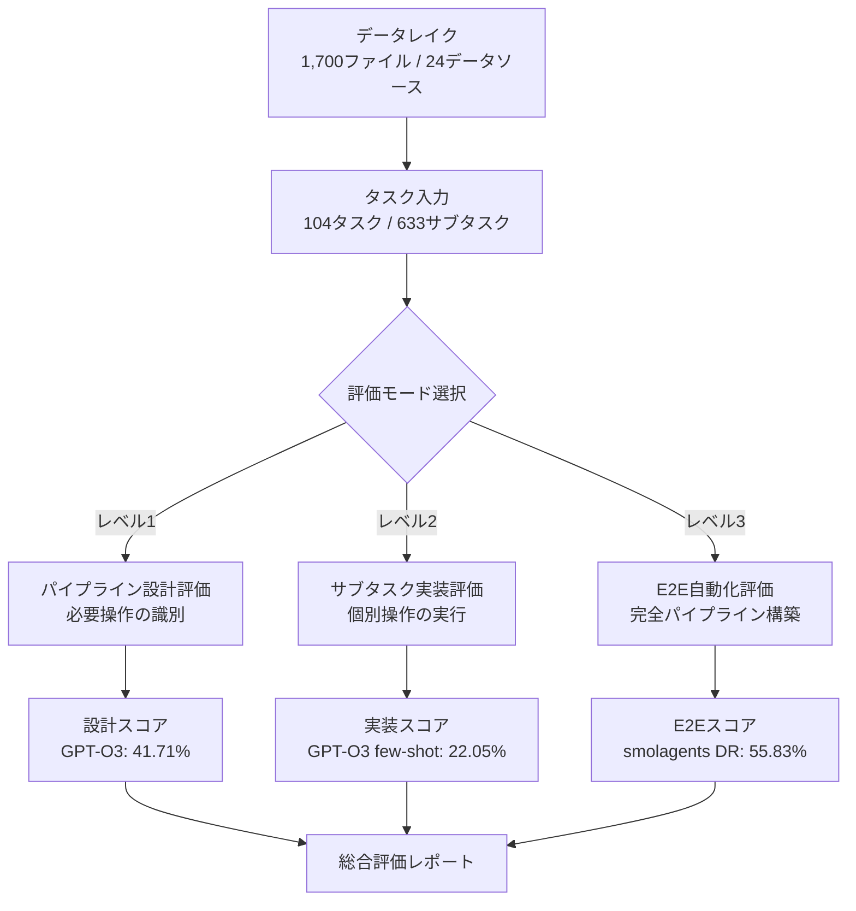
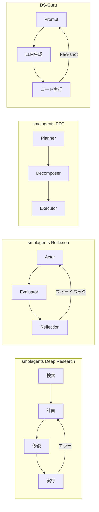
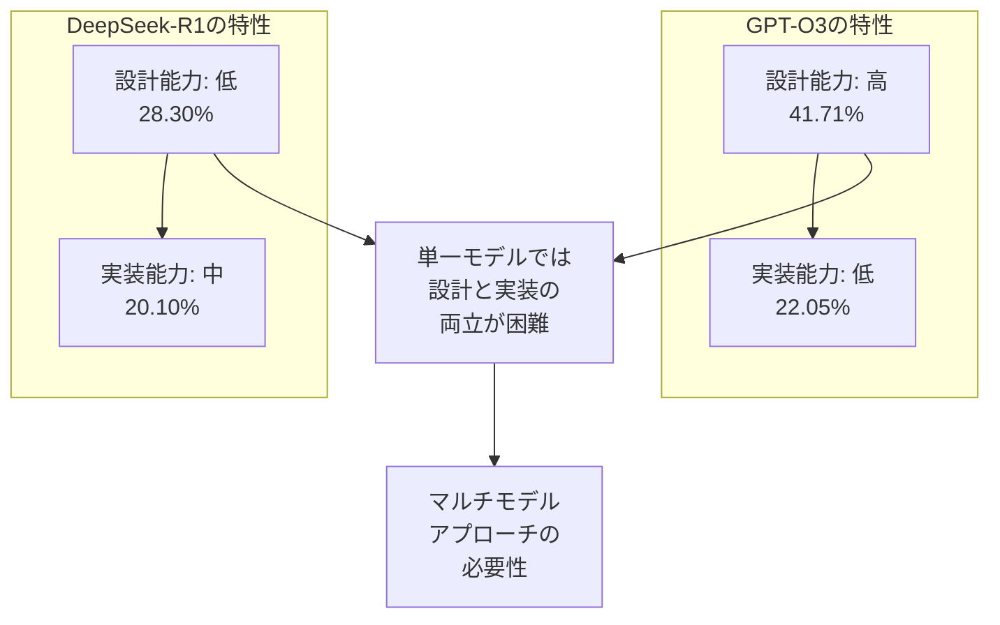

# KramaBench: A Benchmark for AI Systems on Data-to-Insight Pipelines over Data Lakes

- **Link**: https://arxiv.org/abs/2506.06541
- **Authors**: Eugenie Lai, Gerardo Vitagliano, Ziyu Zhang, Om Chabra, Sivaprasad Sudhir, Anna Zeng, Anton A. Zabreyko, Chenning Li, Ferdi Kossmann, Jialin Ding, Jun Chen, Markos Markakis, Matthew Russo, Weiyang Wang, Ziniu Wu, Michael J. Cafarella, Lei Cao, Samuel Madden, Tim Kraska
- **Year**: 2025
- **Venue**: arXiv preprint (cs.DB / cs.AI / cs.MA)
- **Type**: Academic Paper (Benchmark / Data-to-Insight Pipeline)

## Abstract

KramaBench is a benchmark designed to evaluate AI systems on their ability to navigate the complete journey from raw data in data lakes to actionable insights. It comprises 104 curated challenges spanning 1,700 files across 24 data sources in six domains: archaeology, astronomy, biomedical research, environmental science, legal discovery, and wildfire prevention. Evaluation of state-of-the-art systems reveals that the strongest performer achieves only 55% success on end-to-end tasks, with accuracy capped at 62% even under ideal input conditions. While leading language models identify up to 42% of necessary data operations, they fully implement just 20%. The work demonstrates that orchestrating complex multi-step data workflows remains a fundamental challenge despite recent AI advances in reasoning and code generation.

## Abstract（日本語訳）

KramaBenchは、データレイク内の生データからアクション可能なインサイトに至るまでの完全なプロセスにおけるAIシステムの能力を評価するために設計されたベンチマークである。考古学、天文学、生物医学研究、環境科学、法的ディスカバリー、山火事防止の6ドメインにわたる24のデータソースから1,700ファイルを含む104の精選されたタスクで構成される。最先端システムの評価では、最高性能のシステムでもエンドツーエンドタスクで55%の成功率にとどまり、理想的な入力条件下でも精度は62%を上限とする。主要な言語モデルは必要なデータ操作の最大42%を識別するが、完全に実装できるのは20%にすぎない。本研究は、推論やコード生成における近年のAIの進歩にもかかわらず、複雑なマルチステップデータワークフローのオーケストレーションが依然として根本的な課題であることを示している。

## 概要

本論文は、データレイク上でのデータからインサイトへのパイプライン構築能力を包括的に評価するベンチマーク「KramaBench」を提案する。従来のベンチマーク（DS-1000、BIRD、InfiAgent-DABench等）が単一ステップまたは単一ファイルのタスクに限定されていたのに対し、KramaBenchは複数ファイルの統合、多段階パイプライン構築、ドメイン固有の推論を要求する現実的なタスクを提供する。

主要な貢献：

1. **104の精選タスク**: 6ドメインにわたる1,700ファイル、633サブタスクを含む大規模ベンチマーク
2. **3段階の評価フレームワーク**: エンドツーエンド自動化、パイプライン設計、サブタスク実装の3レベルで評価
3. **DS-Guru参照実装**: No-context / One-shot / Few-shot の3バリアントによるスキャフォールディング
4. **エージェントシステムの包括的比較**: 6つのLLM、4つのエージェントフレームワーク、2つのクローズドソースシステムを評価
5. **知識漏洩の検証**: 入力のオブスキュア化によるパラメトリック知識依存の定量化

## 問題と動機

- **既存ベンチマークの単純性**: DS-1000やBIRD等は単一ファイル・単一ステップのタスクに限定され、現実のデータサイエンスワークフローの複雑性を捉えきれない
- **データディスカバリーの欠如**: 既存ベンチマークはデータがすでに整理された状態を前提としており、データレイクからの関連データ発見プロセスを評価しない
- **マルチファイル統合の困難**: 現実のデータ分析では複数ファイルの結合、変換、整合性確保が必要だが、これを評価するベンチマークが存在しなかった
- **ドメイン知識の要求**: データ分析では各ドメイン固有の慣習・定義の理解が不可欠だが、既存のAIシステムはこの点で脆弱
- **パイプライン設計と実装のギャップ**: LLMが設計能力を持っていても、実装段階で大幅な性能低下が発生する現象の定量化が必要

## 提案手法

### 1. タスクキュレーションプロセス（4段階ワークフロー）

1. **タスク策定**: 定量的知見を含む公表済み研究に基づき、再現可能なデータ分析タスクを設計
2. **交差検証**: 独立した貢献者によるソリューション開発と検証
3. **キー機能の識別**: GPT-O3を用いたインストラクションチューニングによる主要機能の抽出
4. **サブタスク生成**: 機能をプロンプトに変換し、個別評価可能なサブタスクに分解

### 2. DS-Guru参照実装

LLMの能力をスキャフォールドする3つのバリアント：

- **No-context**: 問題記述とファイルパスのみを提供
- **One-shot**: ファイルサンプルスニペットを追加
- **Few-shot**: マルチショット例とエラーフィードバック、実行結果を含む

予算制約付きの型アノテーション付きOne-Pass Sampling（OPS）検索によりコンテキストウィンドウを管理する。

### 3. 3段階評価フレームワーク

- **エンドツーエンド自動化**: 完全なパイプラインの自動構築と実行
- **パイプライン設計**: 必要なデータ操作ステップの識別能力
- **サブタスク実装**: 個別の操作ステップの実装精度

## アルゴリズム / 疑似コード

```
Algorithm: KramaBench Evaluation Pipeline
Input: Task T = (description, data_lake, expected_output)
Output: Score S ∈ [0, 1]

1. PIPELINE_DESIGN:
   operations = LLM.identify_operations(T.description, T.data_lake)
   design_score = compare(operations, T.ground_truth_operations)

2. SUBTASK_EVALUATION:
   for each operation op in operations:
       result = LLM.implement(op, context)
       subtask_scores.append(evaluate(result, op.expected))

3. END_TO_END:
   pipeline = Agent.build_pipeline(T)
   output = pipeline.execute(T.data_lake)
   e2e_score = compare(output, T.expected_output)

4. return weighted_average(design_score, subtask_scores, e2e_score)
```

## アーキテクチャ / プロセスフロー



## Figures & Tables

### Table 1: ドメイン別データレイク構成

| ドメイン | タスク数 | データサイズ | ファイル数 | 難易度（Hard%） |
|---------|:---:|:---:|:---:|:---:|
| 考古学 | 12 | 7.5 MB | 少 | 高 |
| 天文学 | 12 | 486 MB | 中 | 高 |
| 生物医学 | 9 | 175 MB | 中 | 高 |
| 環境科学 | 20 | 31 MB | 多 | 中 |
| 法的ディスカバリー | 30 | 1.3 MB | 136 | 高 |
| 山火事防止 | 21 | 1 GB | 多 | 高 |

### Table 2: エンドツーエンド自動化の性能比較

| システム | 全体スコア | 入力モード | 備考 |
|---------|:---:|:---:|------|
| smolagents DR (Claude-3.7) | **55.83%** | Full | 最高性能 |
| smolagents Reflexion (Claude-3.7) | 55.37% | Full | 反復修正型 |
| OpenAI Deep Research | 52.18% | Trimmed | クローズドソース |
| DS-Guru few-shot (GPT-O3) | 24.98% | Full | 参照実装 |
| Human baseline | 76.75% | Full | 人間ベースライン |

### Table 3: パイプライン設計 vs サブタスク実装のギャップ

| LLM | パイプライン設計 | サブタスク実装（few-shot） | 実装ギャップ |
|-----|:---:|:---:|:---:|
| GPT-O3 | 41.71% | 22.05% | -19.66% |
| Claude-3.5 Sonnet | 37.82% | 18.73% | -19.09% |
| GPT-4o | 35.50% | 15.42% | -20.08% |
| DeepSeek-R1-70B | 28.30% | 20.10% | -8.20% |

### Table 4: 知識漏洩テスト（オブスキュア化実験）

| システム | Full入力 | Obscured入力 | 性能低下率 |
|---------|:---:|:---:|:---:|
| Claude-3.5 Sonnet | 62.81% | 12.77% | -79.7% |
| GPT-O3 | 24.98% | 18.20% | -27.1% |
| smolagents DR | 55.83% | 48.50% | -13.1% |

### Figure 1: エージェントフレームワーク別アーキテクチャ比較



### Figure 2: 能力フラグメンテーションの概念図



## 実験と評価

### エンドツーエンド自動化

最高性能のsmolagents Deep Research（Claude-3.7ベース）が55.83%を達成したが、人間ベースライン（76.75%）との間に約21ポイントの差が存在する。エージェント型のアプローチ（smolagents DR/Reflexion）がスクリプト型アプローチ（DS-Guru）を約31ポイント上回り、反復的な検索・計画・修復サイクルの有効性が示された。

### パイプライン設計 vs 実装のギャップ

GPT-O3はパイプライン設計で41.71%の操作を識別できるが、実装段階では22.05%まで低下する。このギャップはすべてのLLMで一貫して観察され、「設計能力と実装能力の乖離」がマルチステップデータパイプラインにおける根本的な課題であることを示す。

### 知識漏洩分析

入力のオブスキュア化（ファイル名・カラム名のランダム化）により、Claudeの性能は62.81%から12.77%へ約80%低下した。これは、LLMがデータパイプラインの汎用的な構築能力ではなく、訓練データに含まれるパラメトリック知識に強く依存していることを示唆する。一方、smolagents DRは13%程度の低下にとどまり、エージェント型の探索的アプローチが汎化性能において優位であることが確認された。

### リトリーバルの影響

Oracleファイル（正解ファイルの直接提供）による性能改善は0〜7%にとどまり、検索がボトルネックではなく、データ依存の推論失敗が主要因であることが判明した。

### 主要な知見

1. **エージェント制御フローの重要性**: 反復的な検索・計画・修復サイクルが構造化されたアプローチを大幅に上回る
2. **能力フラグメンテーション**: 設計と実装の得意分野がモデル間で異なり、単一モデルでは両立困難
3. **知識漏洩の深刻さ**: 多くのLLMがパラメトリック知識に過度に依存しており、真のデータパイプライン構築能力は限定的
4. **ドメイン固有の明確化ギャップ**: タスク失敗の24〜43%が、曖昧な慣習に関する明確化要求の欠如に起因

## 注目ポイント

- **ベンチマークの網羅性**: データディスカバリー、マルチファイル統合、E2E評価を同時にカバーする初のベンチマーク
- **現実世界のタスク設計**: 公表済み研究の再現を基盤とすることで、人工的なタスクではない実用的な評価を実現
- **データ分析エージェント研究との関連**: データ分析エージェントの設計において、パイプライン全体のオーケストレーション能力が最重要課題であることを定量的に示した
- **60.58%がハードタスク**: 3ステップ以上のパイプラインや複数ファイルの統合を要求する「難しい」タスクが過半数を占め、現実的な難易度設定
- **制限事項**: 6ドメインに限定、手動キュレーションによるスケーラビリティの制約、20%のタスクのオブスキュア化にもかかわらずデータソースは公開状態
