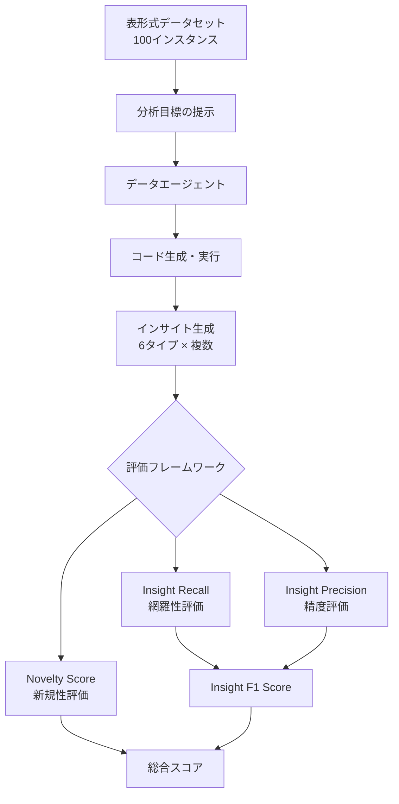
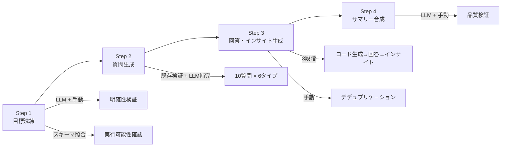
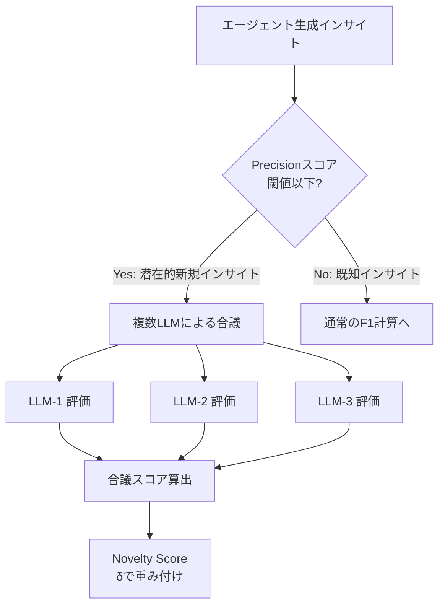

# InsightEval: An Expert-Curated Benchmark for Assessing Insight Discovery in LLM-Driven Data Agents

- **Link**: https://arxiv.org/abs/2511.22884
- **Authors**: Zhenghao Zhu, Yuanfeng Song, Xin Chen, Chengzhong Liu, Yakun Cui, Caleb Chen Cao, Sirui Han, Yike Guo
- **Year**: 2025
- **Venue**: arXiv preprint (cs.AI)
- **Type**: Academic Paper (Benchmark / Insight Discovery Evaluation)

## Abstract

InsightEval is an expert-curated benchmark designed to evaluate how effectively LLM-driven data agents discover meaningful insights from tabular datasets. The authors identify critical flaws in the existing InsightBench framework, including format inconsistencies, poorly conceived objectives, and redundant insights. InsightEval introduces a rigorously curated dataset of 100 instances developed through a multi-stage data-curation pipeline, along with a novel evaluation metric — Insight F1 Score — that measures both recall and precision of discovered insights. Experiments with multiple agent frameworks and LLM backbones reveal that insight discovery remains challenging, with the best system achieving an F1 score of 0.587, and highlight the importance of balancing comprehensive exploration with precision.

## Abstract（日本語訳）

InsightEvalは、LLM駆動のデータエージェントが表形式データセットから意味のあるインサイトを発見する能力を評価するために設計された、専門家キュレーションによるベンチマークである。著者らは既存のInsightBenchフレームワークにおけるフォーマットの不整合、不適切な目標設定、冗長なインサイトなどの重大な欠陥を特定した。InsightEvalは、多段階のデータキュレーションパイプラインを通じて開発された100インスタンスの厳密にキュレーションされたデータセットと、発見されたインサイトのリコールとプレシジョンの両方を測定する新規評価指標「Insight F1 Score」を導入する。複数のエージェントフレームワークとLLMバックボーンによる実験は、インサイト発見が依然として困難であること（最良システムでF1スコア0.587）を明らかにし、包括的な探索と精度のバランスの重要性を強調している。

## 概要

本論文は、LLMベースのデータ分析エージェントにおけるインサイト発見能力を定量的に評価するベンチマーク「InsightEval」を提案する。既存のInsightBenchが抱える品質問題を体系的に分析し、より厳密なキュレーションプロセスと多面的な評価指標を導入することで、インサイト発見タスクの標準的な評価基盤を提供する。

主要な貢献：

1. **InsightBenchの欠陥分析**: フォーマット不整合、存在しないカラムへの参照、冗長なインサイトなどの体系的な問題を特定
2. **4段階キュレーションパイプライン**: 目標洗練、質問生成、回答・インサイト生成、サマリー合成の多段階プロセス
3. **Insight F1 Score**: リコールとプレシジョンを統合した新規評価指標の提案
4. **Novelty Score**: グラウンドトゥルースに含まれない正しいインサイトを識別する新規性スコア
5. **包括的ベンチマーク実験**: 複数エージェント × 複数LLMの組み合わせによる体系的評価

## 問題と動機

- **InsightBenchの品質問題**: 既存ベンチマークにフォーマット不整合（データ型の誤り）、不適切な目標設定（実行不可能なタスク）、スキーマと不一致のカラム参照、冗長なインサイトが多数存在
- **リコール偏重の評価**: 従来の評価指標はリコールのみに着目し、エージェントが生成する冗長・不正確なインサイトを罰しない
- **インサイトの多様性評価不足**: エージェントが特定タイプのインサイトに偏る傾向を捉える指標が欠如
- **新規発見の評価困難**: グラウンドトゥルースに含まれない有用なインサイトを正当に評価する仕組みが存在しなかった
- **探索の深さ vs 広さのトレードオフ**: エージェントが「確信度の高いインサイトのみを出力し、探索的な発見を回避する」傾向の定量化が必要

## 提案手法

### 1. データキュレーションパイプライン（4段階）

**Step 1 — 目標洗練**: LLM評価と手動レビューの組み合わせにより、各データセットの分析目標の明確性・実行可能性・スキーマ整合性を確保

**Step 2 — 質問生成**: 既存質問の手動検証後、LLMによる補完生成。各データセットに6種類のインサイトタイプをカバーする10質問を配置

**Step 3 — 回答・インサイト生成**: 自動コード生成 → 回答合成 → インサイト発見の3段階プロセス。手動でのデデュプリケーションを含む

**Step 4 — サマリー合成**: LLM生成のサマリーを手動検証

### 2. 6種類のインサイトタイプ

- **Descriptive（記述的）**: データの基本的な特徴の要約
- **Diagnostic（診断的）**: 傾向や異常の原因分析
- **Predictive（予測的）**: データパターンに基づく将来予測
- **Prescriptive（処方的）**: アクション可能な推奨事項
- **Exploratory（探索的）**: 予期しないパターンの発見
- **Causal（因果的）**: 変数間の因果関係の特定

### 3. 評価指標

- **Insight Recall**: グラウンドトゥルースの各インサイトに対する最高マッチスコア
- **Insight Precision**: エージェント生成インサイトの各々に対する最高マッチスコア
- **Insight F1 Score**: リコールとプレシジョンの調和平均
- **Novelty Score**: 複数LLMの合議によりグラウンドトゥルースに含まれない正しいインサイトを識別（重みパラメータδによる調整可能）

## アルゴリズム / 疑似コード

```
Algorithm: InsightEval Evaluation Framework
Input: Ground-truth insights G = {g_1, ..., g_n}, Agent insights A = {a_1, ..., a_m}
Output: F1 score, Novelty score

1. RECALL COMPUTATION:
   for each g_i in G:
       recall_i = max_j(similarity(g_i, a_j))
   Recall = mean(recall_1, ..., recall_n)

2. PRECISION COMPUTATION:
   for each a_j in A:
       precision_j = max_i(similarity(a_j, g_i))
   Precision = mean(precision_1, ..., precision_m)

3. F1 = 2 * Recall * Precision / (Recall + Precision)

4. NOVELTY COMPUTATION:
   for each a_j where precision_j < threshold:
       novelty_j = multi_llm_consensus(a_j, dataset)
   Novelty = mean(novelty_scores) * δ

5. return F1, Novelty
```

## アーキテクチャ / プロセスフロー



## Figures & Tables

### Table 1: エージェント × LLMバックボーン別性能比較

| エージェント | LLM | Recall (G-Eval) | Precision (G-Eval) | F1 (G-Eval) |
|------------|-----|:---:|:---:|:---:|
| Pandas Agent | GPT-4o | 0.497 | 0.513 | 0.505 |
| Agent Poirot | GPT-4o | 0.529 | 0.549 | 0.539 |
| Agent Poirot | Claude-3.7 | 0.552 | 0.626 | **0.587** |
| Agent Poirot | Deepseek-V3 | - | - | 0.520 |
| Agent Poirot | GPT-3.5-Turbo | - | - | 0.470 |

### Table 2: データ品質メトリクス（40インスタンスサンプル）

| 品質指標 | 人間評価 | LLM評価 |
|---------|:---:|:---:|
| 正確性 (Correctness) | 95.5% | 92.5% |
| 合理性 (Rationality) | 94.0% | 90.5% |
| 一貫性 (Coherence) | 95.0% | 90.0% |

### Table 3: インサイトタイプ別性能

| インサイトタイプ | 最高スコア | 最も得意なモデル | 備考 |
|---------------|:---:|------|------|
| Prescriptive（処方的） | 0.58 | Claude-3.7 | アクション可能な推奨 |
| Exploratory（探索的） | 0.58 | Claude-3.7 | パターン発見 |
| Descriptive（記述的） | 0.55 | GPT-4o | 基本統計 |
| Diagnostic（診断的） | 0.52 | Claude-3.7 | 原因分析 |
| Predictive（予測的） | 0.48 | GPT-4o | 将来予測 |
| Causal（因果的） | 0.45 | Claude-3.7 | 因果推論 |

### Table 4: データセット多様性指標

| 指標 | インサイト | サマリー |
|------|:---:|:---:|
| TF-IDF類似度 | 0.0528 | 0.0623 |
| Self-BLEU | 0.0897 | 0.1024 |
| Distinct-2 | 0.9157 | 0.8935 |
| 平均トークン長 | 中 | 最長 |

### Figure 1: InsightEvalキュレーションパイプライン



### Figure 2: Novelty Score評価フロー



## 実験と評価

### エージェントフレームワーク比較

Agent Poirot（マルチステップ・マルチラウンドフレームワーク）がPandas Agent（LangChainベース）を全LLMバックボーンで上回った。Agent Poirot + Claude-3.7の組み合わせが最高のF1スコア0.587を達成し、プレシジョンにおいて特に優位性を示した（0.626 vs 0.513）。

### LLMバックボーンの影響

Claude-3.7ベースのAgent Poirotが最高性能を示し、特にNovely Scoreにおいて76.2%の新規インサイトスコアを達成した。Deepseek-V3は最大の改善比率（13.3%）を示し、コード生成能力がインサイト発見の深度と相関することが確認された。

### インサイトタイプ別分析

エージェントはPrescriptive（処方的）とExploratory（探索的）カテゴリで最高スコア（0.58）を達成し、アクション可能な推奨とパターン発見に強みを持つ。一方、Causal（因果的）インサイトでは最も低い性能を示し、因果推論の困難さが浮き彫りとなった。

### 探索の保守性

エージェントは「最も確信度の高いインサイトを生成し、不確実または探索的な出力を回避する」傾向を示した。これにより冗長性は低下するが、包括的な探索が制限される。この保守的な探索戦略は、InsightBenchのリコール偏重評価では見えなかった問題であり、F1スコアによる両面評価の重要性を裏付ける。

### 主要な知見

1. **F1 > Recall**: Insight F1はリコール単独より人間専門家の判断と高い相関を示す
2. **コード生成能力の重要性**: バックボーンLLMのコード生成能力がインサイト深度と直結
3. **新規性はモデル能力に比例**: Novelty Scoreはバックボーンの全般的能力と正の相関
4. **因果推論の困難さ**: すべてのモデルでCausalインサイトの発見が最も困難

## 注目ポイント

- **InsightBenchの批判的分析**: 既存ベンチマークの品質問題を体系的に指摘し、ベンチマーク設計の重要性を再認識させる
- **多面的評価の意義**: リコール・プレシジョン・新規性の3軸評価により、エージェントの探索戦略を包括的に分析可能
- **データ分析エージェント研究との関連**: インサイト発見能力の評価はデータ分析エージェントの中核的課題であり、本ベンチマークはその標準的な評価基盤を提供
- **制限事項**: 100インスタンスの規模制約、表形式データに限定、グラウンドトゥルースの網羅性は保証されず「代表的」にとどまる、外部知識なしの情報天井、新規性評価はLLMの知識に依存
