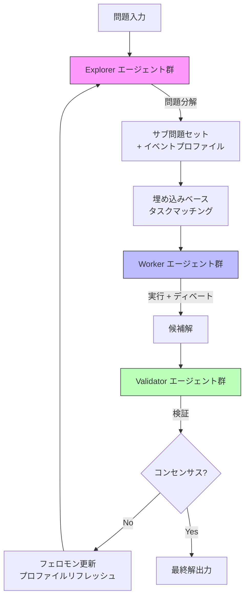
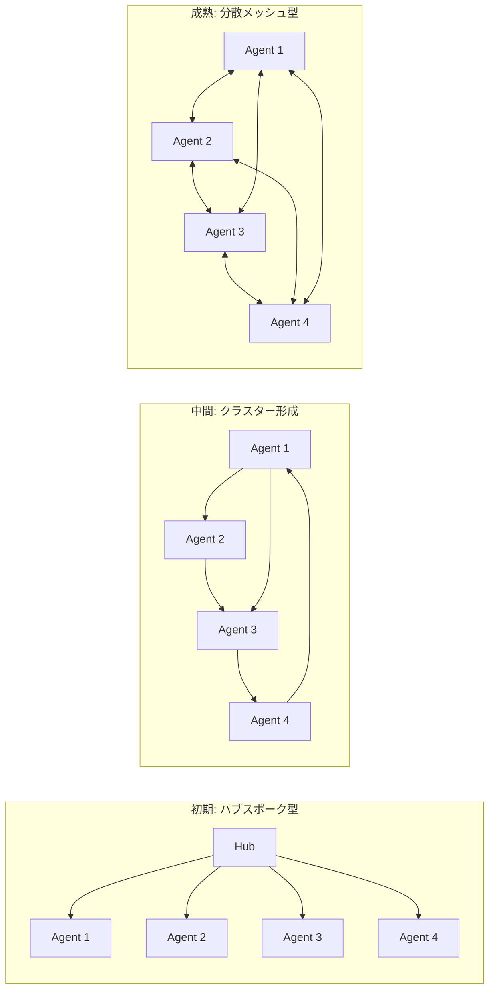
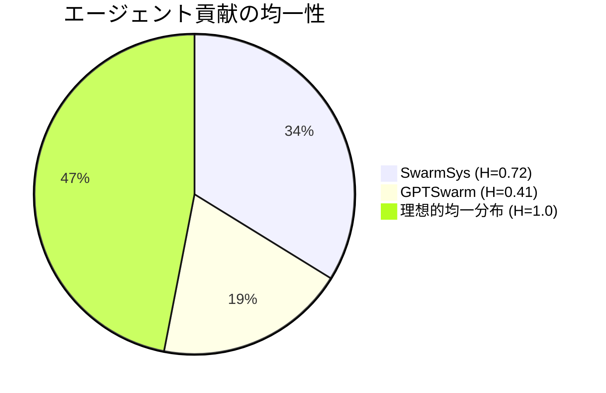

# SwarmSys: Decentralized Swarm-Inspired Agents for Scalable and Adaptive Reasoning

- **Link**: https://arxiv.org/abs/2510.10047
- **Authors**: Ruohao Li, Hongjun Liu, Leyi Zhao, Zisu Li, Jiawei Li, Jiajun Jiang, Linning Xu, Chen Zhao, Mingming Fan, Chen Liang
- **Year**: 2025
- **Venue**: arXiv preprint (cs.AI)
- **Type**: Academic Paper (Multi-Agent Framework / Swarm Intelligence)

## Abstract

SwarmSys presents a distributed multi-agent framework inspired by biological swarm intelligence principles for LLM-based reasoning. The system coordinates through three specialized agent types — Explorers, Workers, and Validators — that engage in iterative cycles of exploration, exploitation, and verification. Key innovations include dynamic agent profiling with adaptive memory, embedding-based task matching, and a pheromone-inspired reinforcement mechanism enabling self-organization without centralized management. Experiments across symbolic reasoning (GaoKao Bench), research synthesis (DeepResearch), and scientific programming (SciCode) demonstrate improved accuracy and stability compared to existing approaches, with SwarmSys-8 achieving 76.2% accuracy on Math Exam versus GPTSwarm's 65.5%. The work suggests that coordination scaling may rival model scaling in advancing LLM intelligence.

## Abstract（日本語訳）

SwarmSysは、LLMベースの推論のために生物学的群知能の原理に触発された分散型マルチエージェントフレームワークを提示する。Explorer、Worker、Validatorの3種類の専門エージェントが、探索・活用・検証の反復サイクルを通じて協調する。適応型メモリを持つ動的エージェントプロファイリング、埋め込みベースのタスクマッチング、中央管理なしの自己組織化を可能にするフェロモン型強化メカニズムが主要な革新である。記号推論（GaoKao Bench）、研究合成（DeepResearch）、科学プログラミング（SciCode）にわたる実験で、SwarmSys-8は数学試験で76.2%の精度を達成し（GPTSwarm: 65.5%）、既存手法を上回った。本研究は、協調のスケーリングがモデルスケーリングに匹敵するLLM知能の進歩をもたらす可能性を示唆する。

## 概要

本論文は、アリやハチなどの社会性昆虫の群行動に着想を得た分散型LLMマルチエージェントフレームワーク「SwarmSys」を提案する。中央管理者を持たず、エージェント間の局所的な相互作用から集合知が創発するアーキテクチャにより、従来の中央集権型アプローチの拡張性と堅牢性の限界を克服する。

主要な貢献：

1. **3種類の専門エージェント**: Explorer（探索）、Worker（実行）、Validator（検証）の役割分担によるスウォーム型協調
2. **フェロモン型強化メカニズム**: 成功した貢献が将来のマッチングを強化し、不成功な経路が自然に減衰する生物模倣的学習
3. **動的エージェントプロファイリング**: 適応型メモリによるエージェントの能力・可用性の継続的更新
4. **埋め込みベースタスクマッチング**: エージェントのコンピテンスとタスク要件の意味的マッチング
5. **協調スケーリング仮説**: モデルサイズの拡大ではなく、協調メカニズムの改善がLLM性能向上に寄与するという新たな視点

## 問題と動機

- **中央集権型アーキテクチャの限界**: GroupChatManager等の中央管理型アプローチはスケーラビリティに制約があり、管理者がボトルネックとなる
- **静的なエージェント割当**: 従来のシステムではタスクとエージェントの割当が固定的であり、タスク複雑度に応じた適応的なリソース配分ができない
- **ハルシネーションの伝播**: 個々のエージェントのハルシネーションが検証なしにシステム全体に伝播するリスク
- **協調の形式化の不足**: マルチエージェント間の協調を生物学的原理に基づいて形式化し、自己組織化特性を獲得する試みが少ない
- **モデルスケーリングへの過度な依存**: LLM性能向上のためにモデルサイズ拡大のみが注目され、協調アーキテクチャの改善という代替経路が軽視されている

## 提案手法

### 1. 3種類の専門エージェント

**Explorer（探索エージェント）**:
- 問題を一貫したサブ問題に分解
- 解法戦略の識別とワークロード分散のモニタリング
- タスクの依存関係と優先順位の決定

**Worker（実行エージェント）**:
- サブタスクの透明性のある正当化を伴う実行
- 解決策のディベート（他のWorkerとの議論）への参加
- フィードバックに基づく作業の精緻化

**Validator（検証エージェント）**:
- 解決策の正確性チェック
- 矛盾の調停
- グループコンセンサスの確認と終了判定

### 2. フェロモン型強化メカニズム

自然界のアリのフェロモン経路に模倣した暗黙的強化・蒸発プロセス：

- **強化**: 検証された貢献がエージェントとイベント間の適合性を強化し、埋め込みを更新して将来の類似マッチングの確率を増加
- **蒸発**: 無効なマッチングは強化されず、競合するプロファイルの進化とともに漸次的に減衰
- **探索と活用のバランス**: デッドロックを防止しつつ収束を維持する探索活用のバランシング

### 3. 動的エージェントプロファイル

各エージェントが保持する適応型メモリユニット：

- アイデンティティ、役割情報、能力記述
- ワークロードステータスと長期的パフォーマンス履歴
- 2種類の埋め込み: **コンピテンス**（能力と過去実績から）と**可用性**（ワークロードと準備状況から）
- 各ラウンド後に埋め込みがリフレッシュされ、状態なし実行者ではなく適応型協力者として機能

## アルゴリズム / 疑似コード

```
Algorithm: SwarmSys Iterative Reasoning
Input: Problem P, Agent set A = {Explorers, Workers, Validators}
Output: Consensus solution S

1. INITIALIZE:
   for each agent a in A:
       a.profile = {identity, role, competence_embed, availability_embed}

2. EXPLORATION PHASE:
   subproblems = Explorers.decompose(P)
   for each subproblem sp:
       sp.event_profile = create_event(sp)

3. MATCHING PHASE:
   for each event e in subproblems:
       candidates = embedding_match(e, Workers)
       assigned_worker = select_best(candidates)

4. EXPLOITATION PHASE:
   for each assigned (worker, event):
       solution = worker.execute(event)
       worker.debate(other_workers, solution)

5. VALIDATION PHASE:
   for each solution s:
       valid = Validators.check(s)
       if valid:
           pheromone_reinforce(worker, event)
       else:
           pheromone_evaporate(worker, event)

6. UPDATE PROFILES:
   for each agent a:
       a.refresh_embeddings()

7. if consensus_reached():
       return final_solution
   else:
       goto step 2  // 次の反復サイクル
```

## アーキテクチャ / プロセスフロー



## Figures & Tables

### Table 1: ベンチマーク構成

| ベンチマーク | サンプル数 | カテゴリ | 評価指標 |
|------------|:---:|------|------|
| GaoKao Bench | 800 | 記号推論 | 精度, 知識網羅率 |
| Omni-Math | 300 | 概念推論 | 精度 |
| DeepResearch | 200 | 分析推論 | 包括性, 深度, 引用精度 |
| SciCode | 338 | 手続的推論 | Pass@Main, Pass@Sub |

### Table 2: 数学試験ベンチマークの性能比較

| システム | 精度 | 知識網羅率 | 改善率 |
|---------|:---:|:---:|:---:|
| GPT-4o (単体) | 58.3% | 62.1% | baseline |
| GPTSwarm | 65.5% | 70.3% | +7.2% |
| **SwarmSys-8** | **76.2%** | **80.2%** | **+17.9%** |
| GPT-5 | 78.5% | 82.0% | 参考値 |

### Table 3: アブレーション実験（エージェント数の影響）

| エージェント数 | 役割あり精度 | 役割なし精度 | 埋め込みマッチング効果 |
|:---:|:---:|:---:|:---:|
| 4 | 68.5% | 56.3% | +12.2% |
| 8 | 76.2% | 62.1% | +14.1% |
| 14 | 77.0% | 63.5% | +13.5% |
| 20 | 76.8% | 63.0% | +13.8% |

### Table 4: 失敗タイプの分布

| 失敗タイプ | 割合 | 説明 |
|-----------|:---:|------|
| Communication Deadlock | 28% | エージェント間の通信停滞 |
| Constraint Omission | 22% | 制約条件の見落とし |
| Reinforcement Bias | 18% | フェロモン強化の偏り |
| Premature Convergence | 17% | 早期収束による解の質低下 |
| その他 | 15% | 各種エラー |

### Figure 1: トポロジー進化の概念図



### Figure 2: 貢献エントロピーの比較



## 実験と評価

### 数学試験ベンチマーク（GaoKao Bench）

SwarmSys-8は76.2%の精度を達成し、GPTSwarmの65.5%を10.7ポイント上回った。知識網羅率でも80.2% vs 70.3%と大幅な改善を示す。特筆すべきは、SwarmSys-8がGPT-5（78.5%）に近い性能を示し、「モデルスケーリングと協調スケーリングの差を70%以上縮小」したことである。

### 科学プログラミング（SciCode）

SwarmSys-14がPass@Main 12.5%（ベースライン8.6%）、Pass@Sub 45.2%（ベースライン29.2%）を達成。科学的プログラミングの複雑な依存関係の処理において、分散型協調の有効性を実証した。

### 研究合成（DeepResearch）

SwarmSys-8が総合スコア42.5（Grok Deeper Search: 40.2）を達成。指示追従性において50.0 vs 46.3と優位性を示した。

### アブレーション研究

- **役割除去**: 精度が76.2%から56.3%に低下し、役割分担の重要性を確認
- **埋め込みマッチング**: 網羅率が最大27.3%改善
- **エージェント数**: 14エージェント付近で性能が頭打ちとなり、協調コストとの最適バランスが存在

### 創発的特性

1. **知識拡散**: 明示的な同期なしに、発見がエージェント間で有機的に伝播
2. **自己正則化**: 個々のハルシネーションがシステム全体の出力を支配することを防止
3. **トポロジー進化**: 中央集権的なハブスポーク型から分散型スモールワールド構造へ自然に進化
4. **貢献エントロピー**: 0.72（GPTSwarm: 0.41）で、より均等な参加分布を実現

## 注目ポイント

- **協調スケーリング仮説**: モデルサイズの拡大ではなく、協調メカニズムの改善がLLM性能向上の有効な代替経路であるという重要な示唆
- **生物模倣の具体化**: フェロモン強化メカニズムを実際のLLMシステムに実装し、その有効性を定量的に実証
- **中央管理不要の自己組織化**: GroupChatManager等の中央管理者なしで、複雑な推論タスクを協調的に解決
- **失敗分析の充実**: Communication Deadlock（28%）やReinforcement Bias（18%）など、失敗モードの詳細な分析が今後の改善方向を示す
- **制限事項**: 14エージェントでの性能頭打ち、フェロモン強化の偏りリスク、早期収束問題が依然として課題
