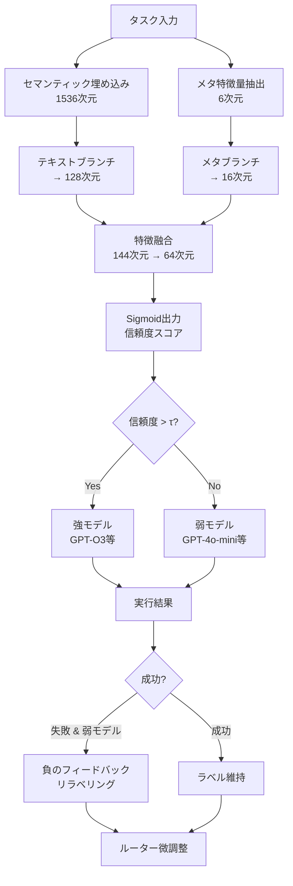
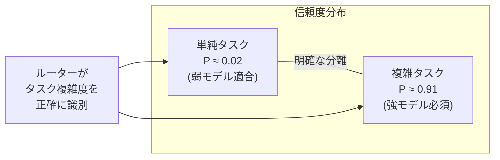
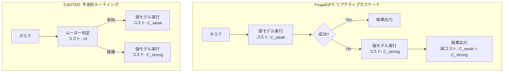

# CASTER: Breaking the Cost-Performance Barrier in Multi-Agent Orchestration

- **Link**: https://arxiv.org/abs/2601.19793
- **Authors**: Shanyv Liu, Xuyang Yuan, Tao Chen, Zijun Zhan, Zhu Han, Danyang Zheng, Weishan Zhang, Shaohua Cao
- **Year**: 2026
- **Venue**: arXiv preprint (cs.AI)
- **Type**: Academic Paper (Multi-Agent Orchestration / Cost Optimization)

## Abstract

CASTER (Context-Aware Strategy for Task Efficient Routing) introduces a dynamic routing mechanism for graph-based multi-agent systems that intelligently selects between strong (expensive, capable) and weak (cheaper, less capable) LLMs at each processing step. The system combines semantic embeddings with structural meta-features through a dual-branch feature fusion network to estimate task difficulty, and learns through negative failure feedback. Evaluation across four domains — software engineering, data analysis, scientific discovery, and cybersecurity — demonstrates that CASTER reduces inference cost by up to 72.4% while maintaining or exceeding performance levels of strong-model-only baselines. Compared to FrugalGPT's reactive cascading approach, CASTER achieves 20.7% to 48.0% additional cost savings with quality improvements.

## Abstract（日本語訳）

CASTER（Context-Aware Strategy for Task Efficient Routing）は、グラフベースのマルチエージェントシステムにおいて、各処理ステップで強力（高コスト・高性能）なLLMと弱い（低コスト・低性能）LLMを動的に選択するルーティングメカニズムを導入する。セマンティック埋め込みと構造的メタ特徴量を二分岐特徴融合ネットワークで統合してタスク難易度を推定し、失敗からの負のフィードバックで学習する。ソフトウェアエンジニアリング、データ分析、科学的発見、サイバーセキュリティの4ドメインでの評価により、CASTERは推論コストを最大72.4%削減しつつ、強モデル単独のベースラインと同等以上の性能を維持することが示された。FrugalGPTのリアクティブカスケード方式と比較して、20.7〜48.0%の追加コスト削減と品質向上を達成する。

## 概要

本論文は、マルチエージェントシステムにおけるコストと性能のトレードオフを解消する動的ルーティングメカニズム「CASTER」を提案する。従来のマルチエージェントシステムでは、全ステップで同一の強力なLLMを使用するか、弱いLLMのみを使用するかの二者択一であり、コストと性能の最適化が困難であった。

主要な貢献：

1. **二分岐特徴融合ネットワーク**: セマンティック埋め込み（1536次元）と構造的メタ特徴量（6次元）を統合する軽量ルーター
2. **負のフィードバック学習**: 弱モデルの失敗を自動検出し、ルーティング境界を漸進的に改善
3. **閾値ベースルーティング**: 信頼度スコアに基づくステップ単位の動的モデル選択（τ=0.5）
4. **FrugalGPTの二重課金問題の解決**: リアクティブカスケードではなく、予測的ルーティングによるコスト最適化
5. **5プロバイダにわたる汎化**: Claude、DeepSeek、Gemini、OpenAI、Qwenで一貫したコスト削減を実証

## 問題と動機

- **コスト-性能のパラドックス**: 強力なLLMの一律使用は不要なコストを発生させ、弱いLLMの一律使用はカスケード的な失敗を招く
- **ステップ単位の難易度差異**: マルチエージェントワークフロー内のステップ間でタスク難易度が大幅に異なるにもかかわらず、同一モデルが使用される
- **FrugalGPTの二重課金**: 弱モデルで試行 → 失敗 → 強モデルにフォールバックする方式では、両方のコストが発生する「二重課金ペナルティ」がある
- **表面的特徴の不十分性**: クエリ長などの表面的特徴はタスク複雑度の信頼できない代理指標であり、より深い意味的・構造的特徴の統合が必要
- **ドメイン固有の脆弱性**: 弱モデルは並行処理、ダーティデータ処理、厳密な科学計算で系統的に失敗するが、これらの予測可能な失敗モードを事前に学習できていない

## 提案手法

### 1. 二分岐特徴融合ネットワーク

**テキストブランチ（セマンティック）**:
- タスク入力をtext-embedding-3-smallで1536次元ベクトルに変換
- Dense層 + ReLU + Dropout(p=0.2)で128次元潜在空間に射影
- `h_sem = Dropout(ReLU(W_t × x_sem + b_t))`

**メタブランチ（構造的）**:
- 4次元one-hotベクトル（エージェント役割: Product Manager, Architect, Engineer, Reviewer）
- 1正規化コンテキスト長スカラー
- 1ハイリスクキーワード指標
- 6次元入力を16次元に射影: `h_meta = ReLU(W_m × v_meta + b_m)`

**融合層**:
- 両ブランチを結合（144次元）→ ボトルネック（64次元）→ Sigmoid出力
- 出力確率 > τ(0.5) なら強モデル、そうでなければ弱モデルを選択

### 2. 負のフィードバック学習

- **成功強化**: 正しくルーティングされたタスクの元ラベルを維持
- **失敗修正**: 弱モデル選択→失敗のケースで、当該サンプルのグラウンドトゥルースを1.0（強モデル必須）にリラベリング
- **学習率**: 1e-4（保守的）、StepLR（γ=0.5, 50エポック毎）
- **損失関数**: Binary Cross Entropy

### 3. LLM-as-a-Judge評価

ドメイン固有の評価プロトコル：
- **ソフトウェア**: 機能正確性40%、セキュリティ30%、効率30%
- **データ分析**: コードロジック40%、データ品質30%、視覚判断30%
- **科学**: 堅牢性、パラメータ精度、妥当性
- **サイバーセキュリティ**: コンプライアンス、エクスプロイト検出、リスク定量化

## アルゴリズム / 疑似コード

```
Algorithm: CASTER Dynamic Routing
Input: Multi-agent workflow W = {step_1, ..., step_n}, threshold τ = 0.5
Output: Cost-optimized execution results

1. INITIALIZE Router:
   router = DualBranchNetwork(text_dim=1536, meta_dim=6)

2. FOR each step s_i in W:
   a. ENCODE:
      h_sem = text_branch(embed(s_i.input))  // 128-dim
      h_meta = meta_branch(s_i.role, s_i.context_len, s_i.risk)  // 16-dim
   
   b. FUSE & PREDICT:
      h_fused = concat(h_sem, h_meta)  // 144-dim
      confidence = sigmoid(bottleneck(h_fused))  // scalar
   
   c. ROUTE:
      if confidence > τ:
          result = strong_model.execute(s_i)
      else:
          result = weak_model.execute(s_i)

3. FEEDBACK LEARNING (after workflow completion):
   for each step s_i:
       if s_i.model == "weak" AND s_i.failed:
           relabel(s_i, target=1.0)  // 強モデル必須に修正
       fine_tune(router, updated_labels, lr=1e-4)

4. return aggregated_results
```

## アーキテクチャ / プロセスフロー



## Figures & Tables

### Table 1: ドメイン別コスト削減と品質スコア

| ドメイン | CASTER品質 | 強モデル品質 | 弱モデル品質 | コスト削減率 |
|---------|:---:|:---:|:---:|:---:|
| ソフトウェアエンジニアリング | 85.0 | 87.5 | 83.8 | 38.5% |
| データ分析 | 78.0 | 78.5 | 76.8 | 42.1% |
| 科学的発見 | **95.3** | 95.2 | 90.2 | 38.1% |
| サイバーセキュリティ | **86.2** | 85.5 | 83.5 | 54.4% |

### Table 2: FrugalGPT vs CASTER比較

| 指標 | FrugalGPT | CASTER | 差分 |
|------|:---:|:---:|:---:|
| 平均コスト削減 | 28.3% | 54.4% | +26.1% |
| 品質スコア（平均） | 83.5 | 86.1 | +2.6 |
| 二重課金発生率 | 35% | 0% | -35% |
| ドメイン間安定性 | 低 | 高 | 改善 |

### Table 3: プロバイダ別コスト削減率

| プロバイダ | コスト削減率 | 品質維持率 | 備考 |
|-----------|:---:|:---:|------|
| OpenAI (GPT) | **72.4%** | 97.1% | 最大削減 |
| Claude | 51.3-71.5% | 98.2% | プレミアムモデルで高効果 |
| Gemini | 45.8% | 96.5% | 安定的 |
| DeepSeek | 38.2% | 95.8% | 元々低コスト |
| Qwen | 35.1% | 94.3% | 元々低コスト |

### Figure 1: 信頼度スコアの二極化分布



### Figure 2: CASTER vs FrugalGPT コストモデル比較



## 実験と評価

### コスト削減の実証

CASTERはOpenAI GPTモデルで最大72.4%のコスト削減を達成した。ソフトウェアエンジニアリングドメインでは単位コストが$0.039から$0.018に低下し、全4ドメインで23.1〜54.4%のコスト削減を実現した。この削減は品質の犠牲を伴わず、科学的発見（95.3 vs 95.2）とサイバーセキュリティ（86.2 vs 85.5）では強モデルベースラインを上回った。

### FrugalGPTとの比較

FrugalGPTのリアクティブカスケード方式に対し、CASTERは20.7〜48.0%の追加コスト削減を達成した。FrugalGPTの「二重課金ペナルティ」（弱モデル失敗→強モデルフォールバックで両方のコスト発生）を完全に回避し、全ドメインでパレート優位を示した。

### ドメイン固有の脆弱性

弱モデルが系統的に失敗するパターンが識別された：
- **並行処理タスク**: 品質67.0 → CASTER適用後83.0に改善
- **ダーティデータ処理**: 欠損値・外れ値の処理で弱モデルが脆弱
- **厳密な科学計算**: 微分方程式、モンテカルロシミュレーションで精度低下

CASTERはこれらの予測可能な失敗モードを事前に学習し、該当タスクを強モデルにルーティングすることで品質を維持する。

### 信頼度スコアの分析

ルーターの出力する信頼度スコアは明確な二極化を示し、単純タスク（P≈0.02）と複雑タスク（P≈0.91）を高い分離度で識別できることが確認された。これは、ルーターがタスクの表面的特徴ではなく潜在的な論理的依存関係を捉えていることを示唆する。

### 主要な知見

1. **予測的ルーティングの優位性**: リアクティブなカスケード方式より予測的なルーティングが経済的に優位
2. **セマンティック複雑度 ≠ 表面的特徴**: クエリ長はタスク複雑度の信頼できない指標であり、二分岐アーキテクチャの必要性を裏付ける
3. **ハイブリッドルーティングの超越**: 一部ドメインでは弱モデルの特定次元の強みを活用し、単一強モデル戦略を上回る
4. **プロバイダ間汎化**: 5プロバイダで一貫した削減を実現し、ドメイン非依存の実用性を実証

## 注目ポイント

- **実用的なコスト最適化**: 最大72.4%のコスト削減は、マルチエージェントシステムの本番運用におけるコスト障壁を大幅に低下
- **軽量ルーターの効率性**: 推論コストがほぼゼロのルーターで大幅なコスト削減を実現
- **FrugalGPTの二重課金問題の明示化**: リアクティブ方式の経済的非効率性を定量的に示し、予測的ルーティングの優位性を確立
- **データ分析エージェントへの示唆**: データ分析ドメインでの42.1%コスト削減と品質維持は、大規模データ分析パイプラインの実用化を後押し
- **制限事項**: 各ドメイン20タスク（Easy10+Hard10）という比較的小規模な評価セット、LLM-as-a-Judge評価の信頼性への依存、ルーター訓練には初期データ収集が必要
