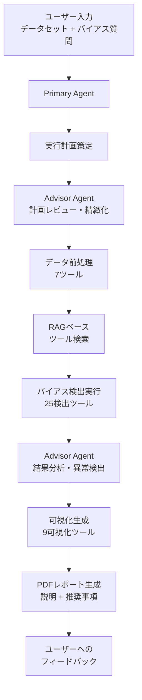
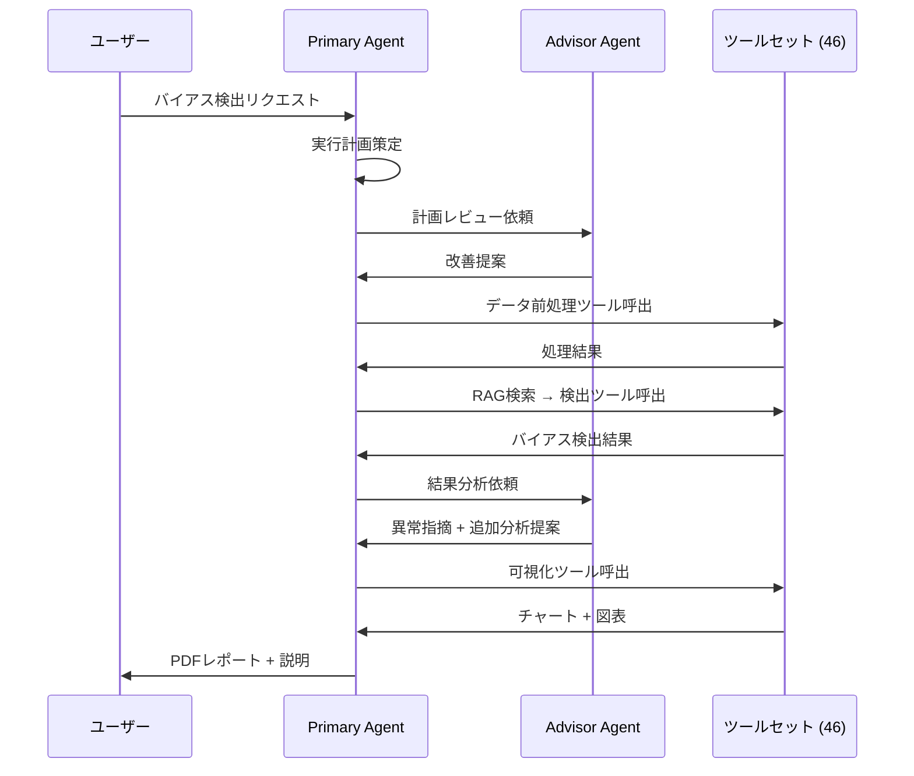
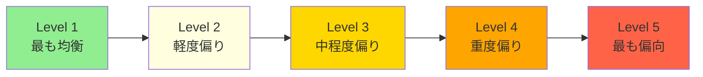

# BIASINSPECTOR: Detecting Bias in Structured Data through LLM Agents

- **Link**: https://arxiv.org/abs/2504.04855
- **Authors**: Haoxuan Li, Mingyu Derek Ma, Jen-tse Huang, Zhaotian Weng, Wei Wang, Jieyu Zhao
- **Year**: 2025
- **Venue**: arXiv preprint (cs.AI)
- **Type**: Academic Paper (Multi-Agent System / Bias Detection)

## Abstract

BIASINSPECTOR is a multi-agent framework for automated bias detection in structured datasets. The system employs a collaborative two-agent architecture — Primary Agent and Advisor Agent — that formulates multi-stage execution plans to analyze user-specified bias detection tasks. It provides interpretable results with explanations and visualizations through a comprehensive toolset of 46 functional tools and 100 detection methods. The authors also introduce BiasBenchmark, comprising 100 tasks across five datasets covering distribution bias, correlation bias, and implication bias with five severity levels. Experiments demonstrate that BIASINSPECTOR achieves 77.53% overall accuracy with GPT-4o, with exceptional intermediate-process quality scores exceeding 90 in communication, planning, and summarization dimensions.

## Abstract（日本語訳）

BIASINSPECTORは、構造化データセットにおけるバイアス検出を自動化するマルチエージェントフレームワークである。Primary AgentとAdvisor Agentの協調的二エージェントアーキテクチャを採用し、ユーザー指定のバイアス検出タスクに対する多段階実行計画を策定する。46の機能ツールと100の検出手法を含む包括的なツールセットを通じて、説明と可視化を伴う解釈可能な結果を提供する。著者らはまた、分布バイアス・相関バイアス・含意バイアスの3カテゴリと5段階の重大度を含む5データセット100タスクからなるBiasBenchmarkを導入した。実験ではGPT-4oを用いてBIASINSPECTORが77.53%の全体精度を達成し、コミュニケーション・計画・要約の中間プロセス品質スコアが90を超える優れた性能を示した。

## 概要

本論文は、構造化データにおけるバイアスを自動検出するLLMベースのマルチエージェントフレームワーク「BIASINSPECTOR」を提案する。既存の自動バイアス検出技術がデータ型の多様性に限界があること、専門知識を持たないユーザーにとってバイアス検出が困難であることを問題とし、自然言語インタラクションによるアクセシブルなバイアス検出を実現する。

主要な貢献：

1. **二エージェント協調アーキテクチャ**: Primary AgentとAdvisor Agentの認知負荷分散による高品質な計画・実行
2. **46機能ツール + 100検出手法**: 前処理（7）、バイアス検出（25）、可視化（9）、その他（5）の包括的ツールセット
3. **BiasBenchmark**: 5データセット、100タスク、3バイアスカテゴリ、5重大度レベルの標準化ベンチマーク
4. **RAGベースツール検索**: 手動の専門家選択に代わる自動的な手法発見メカニズム
5. **解釈可能な出力**: 可視化と自然言語説明を含むPDFレポートの自動生成

## 問題と動機

- **自動バイアス検出の多様性不足**: 既存技術は特定のデータ型（例：テキスト、画像）に限定され、構造化データ全般への対応が不十分
- **非専門家のアクセシビリティ**: バイアス検出は統計的専門知識を要求し、技術的バックグラウンドを持たないユーザーにとって障壁が高い
- **LLMの計画・解釈負荷**: バイアス検出に必要な計画、結果解釈、フィードバック、意思決定のすべてを単一LLMで処理することの認知負荷
- **手法選択の困難**: 100以上の検出手法から最適なものを選択するには深い専門知識が必要
- **バイアス検出ベンチマークの不在**: LLMエージェントのバイアス検出能力を体系的に評価するベンチマークが存在しなかった

## 提案手法

### 1. 二エージェント協調アーキテクチャ

**Primary Agent**:
- ユーザーとの直接的インタラクション
- 実行計画の策定とツール呼び出し
- 結果の解釈とレポート生成
- 重要な判断ポイントでAdvisor Agentに相談

**Advisor Agent**:
- 計画のレビューと精緻化
- 見落としの識別とツール選択の推奨
- 結果分析と異常検出への対応
- Primary Agentへの改善提案

### 2. 5段階ワークフロー

1. **ユーザー入力**: 構造化データセットとバイアスに関する質問（抽象度の異なるレベルに対応）
2. **データ前処理**: データ読み込み、特徴識別、欠損値処理、サブセット構築の計画策定
3. **バイアス検出・分析**: 検出計画の策定、ツールセットからの適切な手法選択、逐次実行
4. **結果可視化・要約**: 可視化作成、メトリクス分析、推奨事項策定、PDFレポート統合
5. **ユーザーへのフィードバック**: 自然言語と詳細レポートによる結果提示

### 3. バイアスカテゴリと検出手法

**分布バイアス（Distribution Bias）**:
- カテゴリカル: Shannon エントロピー、最大/最小比率、Gini指数
- 数値: 歪度、尖度、Cohen's d

**相関バイアス（Correlation Bias）**:
- カテゴリ × カテゴリ: 統計的パリティ、Lipschitz関数
- カテゴリ × 数値: 標準化差分、因果効果
- 数値 × 数値: Pearson相関、相互情報量

**含意バイアス（Implication Bias）**:
- 曖昧なユーザークエリの解釈を必要とするバイアス検出

### 4. RAGベースツール検索

100の検出手法をバイアスタイプ、データタイプ、方法論、ドメインでアノテーションし、RAG（Retrieval-Augmented Generation）によりタスクに最適な手法を自動選択する。

## アルゴリズム / 疑似コード

```
Algorithm: BIASINSPECTOR Workflow
Input: Dataset D, User query Q (bias-related question)
Output: Bias report R with visualizations and recommendations

1. PARSE USER INPUT:
   task = interpret(Q, D.schema)
   bias_type = classify(task)  // distribution | correlation | implication

2. DATA PREPROCESSING (Primary + Advisor):
   plan = Primary.create_plan(task, D)
   plan = Advisor.review_and_refine(plan)
   processed_data = execute_preprocessing(plan, D)

3. TOOL SELECTION (RAG-based):
   candidate_tools = RAG.retrieve(bias_type, D.feature_types)
   selected_tools = Advisor.recommend(candidate_tools, task)

4. BIAS DETECTION:
   for each tool t in selected_tools:
       result = t.execute(processed_data)
       severity = classify_severity(result)  // Level 1-5
       findings.append({result, severity, explanation})

5. VISUALIZATION & REPORTING:
   charts = generate_visualizations(findings)
   recommendations = generate_recommendations(findings)
   R = compile_pdf(findings, charts, recommendations)

6. return R
```

## アーキテクチャ / プロセスフロー



## Figures & Tables

### Table 1: BiasBenchmarkのデータセット構成

| データセット | ドメイン | タスク数 | 主な保護属性 |
|------------|--------|:---:|------|
| Adult | 社会経済 | 20 | 性別, 人種, 年齢 |
| COMPAS | 刑事司法 | 20 | 人種, 性別 |
| Statlog | 金融 | 20 | 年齢, 外国人労働者 |
| MIMIC-IV | 医療 | 20 | 性別, 民族, 保険 |
| Student Performance | 教育 | 20 | 性別, 住所, 家族サイズ |

### Table 2: バイアスカテゴリ別検出精度（GPT-4o）

| バイアスカテゴリ | 精度 | 検出手法例 |
|---------------|:---:|------|
| 分布バイアス | **84.46%** | Shannon エントロピー, Gini指数 |
| 相関バイアス | 72.70% | Cramér's V, Wasserstein距離 |
| 含意バイアス | 76.04% | コンテキスト解釈 + 複合手法 |
| **全体** | **77.53%** | — |

### Table 3: 中間プロセス品質スコア

| 評価次元 | GPT-4o | Llama 3.3 70B | 差分 |
|---------|:---:|:---:|:---:|
| Communication | >90 | ~80 | ~10 |
| Planning | >90 | ~80 | ~10 |
| Summarization | >90 | ~80 | ~10 |
| Tooling | ~88 | ~78 | ~10 |
| Adaptivity | ~87 | ~77 | ~10 |

### Table 4: ツールセット構成

| カテゴリ | ツール数 | 手法数 | 代表的手法 |
|---------|:---:|:---:|------|
| データ前処理 | 7 | — | 欠損値処理, 特徴識別 |
| バイアス検出 | 25 | 100 | Shannon エントロピー, Cohen's d, Cramér's V |
| 可視化 | 9 | — | ヒートマップ, 分布プロット |
| その他 | 5 | — | PDFレポート生成 |

### Figure 1: マルチエージェント協調フロー



### Figure 2: バイアス重大度レベルの5段階分類



## 実験と評価

### エンドリザルト評価

BIASINSPECTORはGPT-4oバックエンドで全体77.53%の精度を達成した。分布バイアスで最高精度（84.46%）を示し、相関バイアス（72.70%）と含意バイアス（76.04%）が続いた。相関バイアスの精度が相対的に低いのは、変数間の複雑な関係性の解析がより困難であることを反映している。

### 中間プロセス評価

GPT-4oバックエンドのBIASINSPECTORは、Communication、Planning、Summarizationの各次元で90を超えるスコアを達成し、LLMエージェントの計画・推論・要約能力の高さを実証した。ToolingとAdaptivityでは若干のギャップ（1〜2ポイント）があり、ツール選択と適応的な対応の改善余地を示す。

### モデル比較

GPT-4oはLlama 3.3 70Bを全次元で約10ポイント上回った。特に、複雑な相関バイアスの検出においてGPT-4oの優位性が顕著であり、基盤モデルの能力がバイアス検出の品質に直結することが確認された。

### マルチエージェント vs シングルエージェント

マルチエージェント版BIASINSPECTORはシングルエージェント版を複雑な相関タスクでわずかに上回った。Advisor Agentの計画レビューと異常検出が、エッジケースにおける品質向上に寄与している。ただし、改善幅は限定的であり、基盤モデルの能力がより支配的な要因であることを示唆する。

### ツーリング評価の課題

ツーリング次元では自動評価と人間評価の間に最大31.8ポイントの乖離が確認された。これは、ツール選択の「正しさ」の評価が文脈に強く依存し、自動評価指標では捉えきれない側面があることを示す。

### 主要な知見

1. **分布バイアスが最も検出容易**: 単一特徴量の分布分析は相対的に単純で高精度
2. **相関バイアスが最大の課題**: 変数間の複雑な関係性の解析にはLLMの高度な推論能力が必要
3. **RAGベースツール検索の有効性**: 手動の専門家選択に代わる自動手法発見が実用レベルで機能
4. **非専門家アクセシビリティ**: 自然言語インタラクションと解釈可能なレポートにより、技術的バックグラウンドなしでのバイアス検出が可能

## 注目ポイント

- **公平性とAIの交差点**: データのバイアス検出を自動化することで、AI開発における公平性担保のボトルネックを解消
- **100手法のライブラリ**: 文献から収集した100の検出手法をRAGで自動選択する仕組みは、専門知識の民主化を実現
- **データ分析エージェント研究との関連**: バイアス検出はデータ分析の重要なサブタスクであり、マルチエージェントアーキテクチャの適用事例として示唆に富む
- **制限事項**: 100タスク×5データセットの比較的小規模な評価、ツーリング評価における自動-人間評価の乖離（最大31.8ポイント）、基盤モデル能力への強い依存、含意バイアスの主観性
