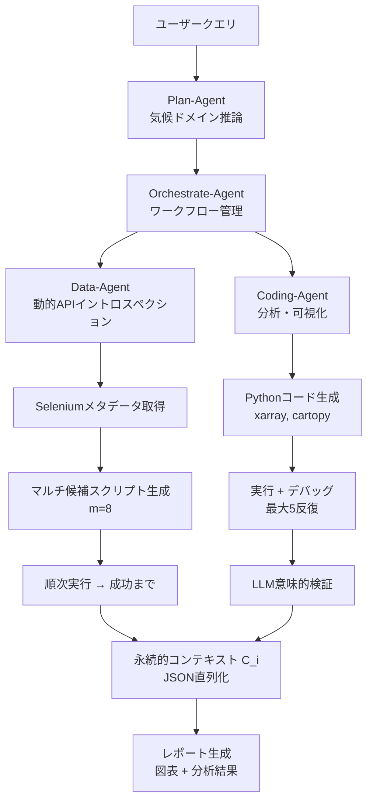
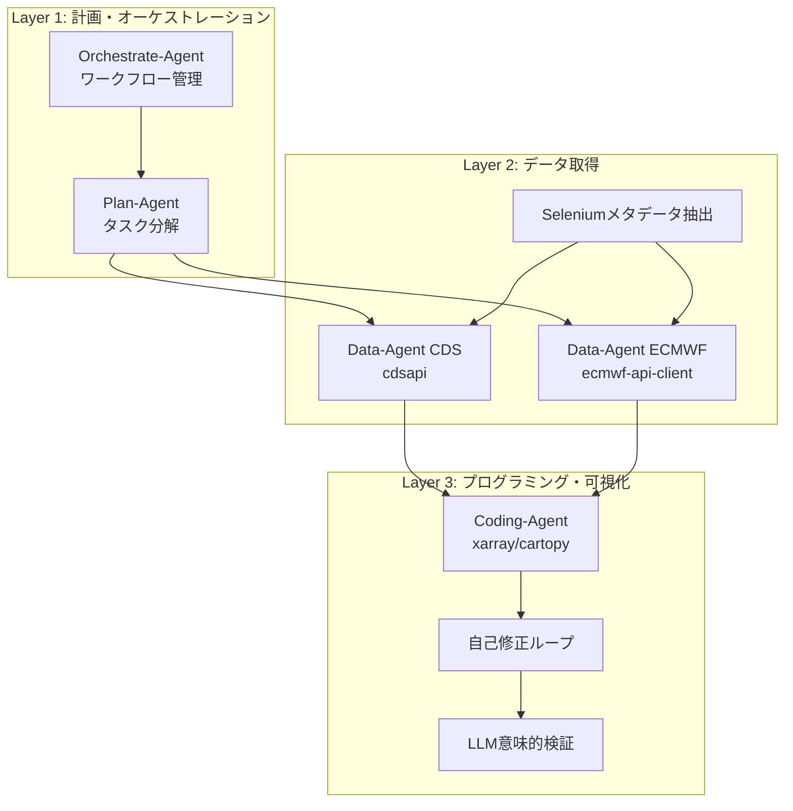
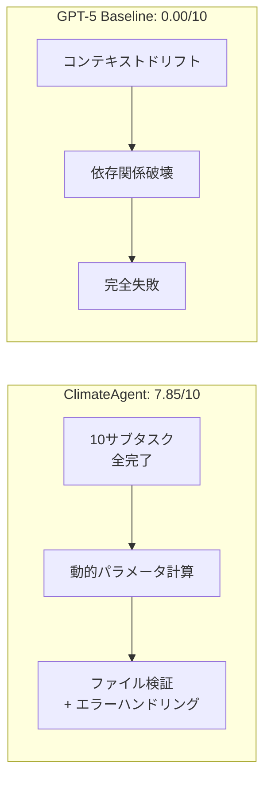

# CLIMATEAGENT: Multi-Agent Orchestration for Complex Climate Data Science Workflows

- **Link**: https://arxiv.org/abs/2511.20109
- **Authors**: Hyeonjae Kim, Chenyue Li, Wen Deng, Mengxi Jin, Wen Huang, Mengqian Lu, Binhang Yuan
- **Year**: 2025
- **Venue**: arXiv preprint (cs.LG)
- **Type**: Academic Paper (Domain-Specific Multi-Agent System / Climate Science)

## Abstract

CLIMATEAGENT introduces an autonomous multi-agent framework designed to automate complex climate science data analysis workflows. The system employs a hierarchical three-layer architecture: a planning and orchestration layer (Orchestrate-Agent, Plan-Agent), a data acquisition layer (Data-Agents with dynamic API introspection), and a programming and visualization layer (Coding-Agents with self-correction). Evaluation on Climate-Agent-Bench-85, a benchmark of 85 real-world climate tasks across six domains, demonstrates 100% task completion with a report quality score of 8.32/10, substantially outperforming GitHub Copilot (6.27) and GPT-5 baseline (3.26). The framework achieves superior scientific rigor (8.72/10) through persistent workflow context and multi-layered error recovery strategies.

## Abstract（日本語訳）

CLIMATEAGENTは、複雑な気候科学データ分析ワークフローの自動化を目的とした自律型マルチエージェントフレームワークを導入する。計画・オーケストレーション層（Orchestrate-Agent、Plan-Agent）、データ取得層（動的APIイントロスペクション付きData-Agents）、プログラミング・可視化層（自己修正機能付きCoding-Agents）の階層的三層アーキテクチャを採用する。6ドメイン85タスクの実世界気候タスクベンチマーク「Climate-Agent-Bench-85」での評価では、100%のタスク完了率とレポート品質スコア8.32/10を達成し、GitHub Copilot（6.27）とGPT-5ベースライン（3.26）を大幅に上回った。永続的なワークフローコンテキストと多層的なエラー回復戦略により、優れた科学的厳密性（8.72/10）を実現している。

## 概要

本論文は、気候科学における複雑なデータ分析ワークフローの完全自動化を実現するマルチエージェントフレームワーク「CLIMATEAGENT」を提案する。気候科学では、異種データソースの統合、ドメイン固有のツール（TempestExtremes、CDO等）の使用、科学的厳密性を持つ分析・可視化が要求されるが、既存のAIアシスタントではこれらを一貫して処理することが困難であった。

主要な貢献：

1. **階層的三層アーキテクチャ**: 計画、データ取得、プログラミングの明確な責務分離
2. **動的APIイントロスペクション**: 実行時にAPIパラメータを検証する適応型データ取得
3. **多層的エラー回復**: マルチ候補生成（m=8）、反復的精緻化（最大3回）、LLMベース意味的検証
4. **Climate-Agent-Bench-85**: 6ドメイン85タスクの実世界ベンチマーク（Easy/Medium/Hard 3段階）
5. **永続的ワークフローコンテキスト**: JSON直列化によるタスク間のコンテキスト保持と再現性確保

## 問題と動機

- **気候データの異種性**: CDS、ECMWF等の複数データソースからのデータ取得には、ソースごとに異なるAPI仕様への対応が必要
- **データ取得の脆弱性**: 既存ベースラインの失敗の26%がデータ/配列形状エラー、17%がデータリクエストエラーに起因
- **コンテキストドリフト**: 単一モデルの長い実行で、後半のコード変更が前半のロジックを上書きし、依存関係を破壊する現象
- **科学的厳密性の要求**: 気候学的に正しい統計検定、気候学的期間の設定、適切な空間解析が必要
- **外部ツール統合**: TempestExtremes、CDO等のドメイン固有ツールの動的パラメータ化が必要

## 提案手法

### 1. 階層的三層アーキテクチャ

**計画・オーケストレーション層**:
- **Orchestrate-Agent**: ワークフロー全体の管理、タイムスタンプ付きディレクトリ作成、コンテキスト永続化、エージェント呼び出しの調整
- **Plan-Agent**: ユーザークエリの気候ドメイン推論に基づく分解。「気候学→異常→極端現象→レポート」のような分析パターンの認識

**データ取得層**:
- **Data-Agents**: CDS（cdsapi）、ECMWF（ecmwf-api-client）等の異なるデータソースに対する特化実装
- 実行時APIイントロスペクションにより変数、時間範囲、空間ドメインを検証
- Seleniumベースのブラウザ自動化でデータポータルから最新メタデータを抽出

**プログラミング・可視化層**:
- **Coding-Agents**: xarray、cartopy、cf-python等の気候ライブラリの専門知識を持つPythonコード生成
- 自己修正ループによるデバッグ（最大5回のデバッグ反復/候補）

### 2. 動的APIイントロスペクション

- 静的設定ではなく、実行時にAPIパラメータを検証
- Seleniumによるデータポータルメタデータの自動抽出 → JSON保存
- LLMガイドのコード生成でメタデータを活用
- 自動READMEドキュメント生成

### 3. 多層的エラー回復

**マルチ候補生成**: Data-Agentsが8つのダウンロードスクリプトバリアントを異なるパラメータ解釈で生成し、成功するまで順次実行

**反復的精緻化**: Coding-Agentsが最大3回のリトライ、候補ごとに最大5回のデバッグ反復、前回の失敗の診断フィードバックを組み込み

**LLMベース意味的検証**: 実行時エラーを引き起こさないが科学的に無効な結果（誤った統計検定、不正な気候学的期間等）を検出

### 4. 永続的ワークフローコンテキスト

各エージェントの出力後にコンテキスト C_i をJSON直列化：
- タスク (T)、計画 (P)、コードアーティファクト (c_j)
- データファイル (d_j)、結果 (r_j)、実行ログ (l_j)
- 単調増加的蓄積により全情報をエージェント間遷移で保持

## アルゴリズム / 疑似コード

```
Algorithm: ClimateAgent Workflow Execution
Input: User query Q, Data sources S = {CDS, ECMWF, ...}
Output: Scientific report R with figures and analysis

1. PLANNING:
   plan = Plan-Agent.decompose(Q)
   subtasks = [t_1, ..., t_n]  // 気候学的分析パターンに基づく分解

2. ORCHESTRATION:
   context = C_0 = {task: Q, plan: plan}
   workspace = create_timestamped_dir()
   
   for i = 1 to n:
       agent = select_agent(subtasks[i].type)
       
       if subtasks[i].type == "data_acquisition":
           // マルチ候補データ取得
           metadata = selenium_introspect(S)
           for j = 1 to m=8:
               script_j = Data-Agent.generate_script(subtasks[i], metadata)
               result = execute(script_j)
               if result.success: break
       
       elif subtasks[i].type == "analysis":
           // 反復的コード生成・修正
           for attempt = 1 to 3:
               code = Coding-Agent.generate(subtasks[i], C_{i-1})
               for debug = 1 to 5:
                   output = execute(code)
                   if output.valid: break
                   code = Coding-Agent.debug(code, output.error)
       
       C_i = C_{i-1} ∪ {artifacts, logs}  // コンテキスト蓄積

3. SEMANTIC VALIDATION:
   validate_scientific_rigor(C_n)

4. REPORT GENERATION:
   R = compile_report(C_n.figures, C_n.analysis)
   return R
```

## アーキテクチャ / プロセスフロー



## Figures & Tables

### Table 1: Climate-Agent-Bench-85 ドメイン別性能

| ドメイン | タスク数 | ClimateAgent | Copilot | GPT-5 |
|---------|:---:|:---:|:---:|:---:|
| Atmospheric River | 15 | 7.32 | 6.78 | 3.05 |
| Drought | 15 | **8.57** | 6.87 | 7.87 |
| Extreme Precipitation | 15 | **8.43** | 5.58 | 0.62 |
| Heatwave | 10 | **9.15** | 8.30 | 3.98 |
| Sea Surface Temperature | 15 | **8.88** | 8.10 | 4.28 |
| Tropical Cyclone | 15 | **7.85** | 2.65 | 0.00 |
| **全体** | **85** | **8.32** | **6.27** | **3.26** |

### Table 2: 品質次元別スコア

| 次元 | ClimateAgent | 説明 |
|------|:---:|------|
| 可読性 (Readability) | 8.40 | レポートの構造と明瞭さ |
| 科学的厳密性 (Scientific Rigor) | **8.72** | 統計手法と分析の正確性 |
| 完全性 (Completeness) | 7.75 | 要求されたすべての分析の網羅 |
| 視覚品質 (Visual Quality) | 8.41 | 図表の品質と情報伝達力 |

### Table 3: ベースラインエラータイプ分布

| エラータイプ | 割合 | 説明 |
|------------|:---:|------|
| Data/Array Shape or Key Errors | 26% | データ形状・キーの不整合 |
| Data Request Errors | 17% | API リクエストの失敗 |
| Syntax/Indentation Errors | 11% | コード構文エラー |
| Timeout Errors | 11% | 実行タイムアウト |
| Type Errors | 11% | 型不整合エラー |
| Miscellaneous | 23% | その他のエラー |

### Table 4: タスク複雑度の分布

| 難易度 | タスク数 | 割合 | 特徴 |
|-------|:---:|:---:|------|
| Easy | 25 | 30% | 単一ソース取得、単純処理 |
| Medium | 30 | 35% | マルチソース統合、多段ワークフロー |
| Hard | 30 | 35% | 外部ツール統合、動的パラメータ化 |

### Figure 1: 三層アーキテクチャの詳細構成



### Figure 2: Tropical Cyclone タスクにおける性能差異



## 実験と評価

### 全体性能

ClimateAgentは85タスク全体でレポート品質スコア8.32/10を達成し、100%のタスク完了率を記録した。GitHub Copilot（6.27）を33%上回り、GPT-5ベースライン（3.26）を155%上回った。特にTropical Cyclone（7.85 vs 0.00）とExtreme Precipitation（8.43 vs 0.62）で、ベースラインが完全に失敗するタスクでも安定した品質を維持した。

### 科学的厳密性

ClimateAgentは科学的厳密性次元で最高スコア8.72/10を達成した。これは、Plan-Agentによる気候学的分析パターンの認識と、LLMベース意味的検証による科学的に無効な結果の検出が寄与している。

### コンテキストドリフトの回避

GPT-5ベースラインは長い単一スクリプトの後半で前半のロジックを上書きする「コンテキストドリフト」により深刻な品質低下を示した。ClimateAgentの明示的なサブタスク分解と永続的コンテキスト管理により、この問題を回避している。

### 自己修正能力

多層的なエラー回復戦略（マルチ候補生成、反復的精緻化、意味的検証）により、ベースラインのエラータイプ（データ形状エラー26%、リクエストエラー17%等）を自律的に処理。Typhoon Noruケーススタディでは、10サブタスクのワークフローを動的パラメータ計算、ファイル検証、各ステップでのエラーハンドリングを通じて完遂した。

### ドメイン別分析

Heatwave（9.15）とSST（8.88）で最高性能を示し、Atmospheric River（7.32）とTropical Cyclone（7.85）で相対的に低い性能となった。後者は外部ツール統合の複雑さが影響しているが、ベースラインとの差は最も大きい。

### 主要な知見

1. **明示的な分解が単一モデルを上回る**: マルチエージェント分解がすべてのドメインで一貫して改善をもたらす
2. **コンテキスト永続化が品質保証**: JSON直列化によるコンテキスト管理がコンテキストドリフトを防止
3. **多層的回復が自律実行を可能に**: 8候補生成×3リトライ×5デバッグの多層回復が100%完了率を実現
4. **ドメイン特化の知識が不可欠**: 気候ライブラリ（xarray、cartopy）の専門知識がCoding-Agentの品質に直結

## 注目ポイント

- **ドメイン特化型マルチエージェントの好例**: 気候科学という高度に専門的なドメインでのマルチエージェント適用成功例
- **100%タスク完了率**: 多層的エラー回復戦略による完全な自律実行の実証
- **動的APIイントロスペクション**: 静的設定ではなく実行時パラメータ検証という実用的なアプローチ
- **データ分析エージェント研究との関連**: データ取得→分析→可視化→レポートの完全なパイプライン自動化は、汎用データ分析エージェントのアーキテクチャ設計に示唆を提供
- **GPT-5を大幅に凌駕**: 単一の強力なモデルよりも、ドメイン特化のマルチエージェントオーケストレーションが優位であることの明確な実証
- **制限事項**: 85タスクの規模、気候科学に特化したアーキテクチャの汎用性、Seleniumベースのメタデータ取得の脆弱性
