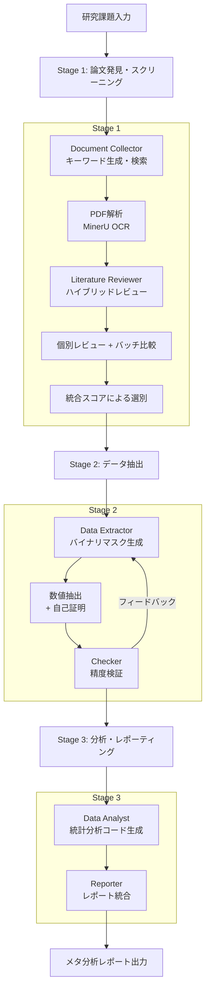
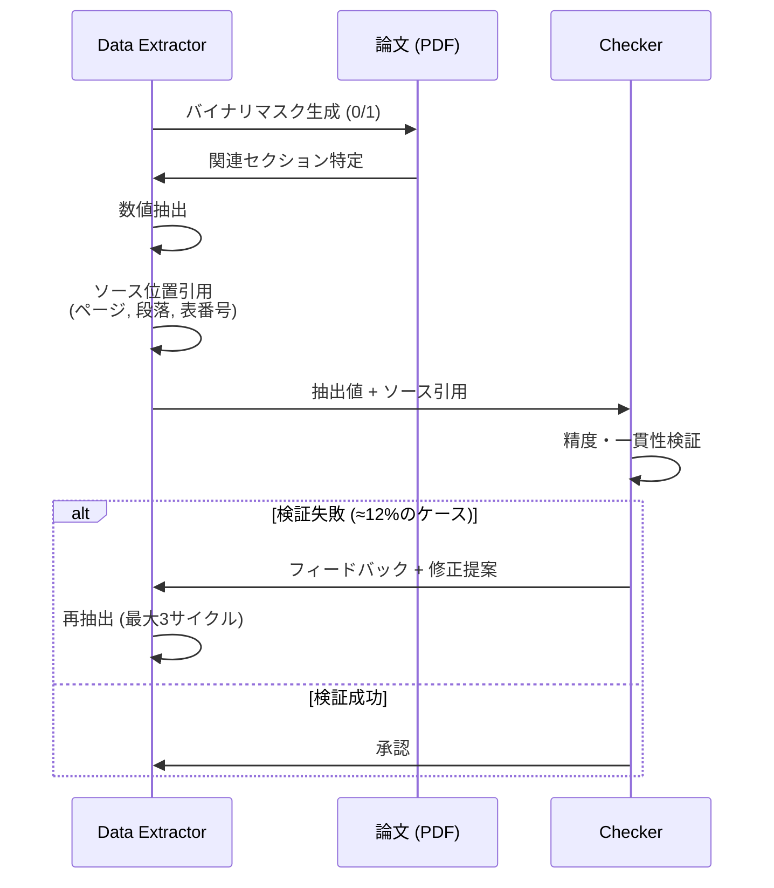

# Manalyzer: End-to-end Automated Meta-analysis with Multi-agent System

- **Link**: https://arxiv.org/abs/2505.20310
- **Authors**: Wanghan Xu, Wenlong Zhang, Fenghua Ling, Ben Fei, Yusong Hu, Runmin Ma, Bo Zhang, Fangxuan Ren, Jintai Lin, Wanli Ouyang, Lei Bai
- **Year**: 2025
- **Venue**: arXiv preprint (cs.AI / cs.MA)
- **Type**: Academic Paper (Multi-Agent System / Automated Meta-Analysis)

## Abstract

Manalyzer is a multi-agent framework that achieves end-to-end automated meta-analysis through specialized tool calls. The system comprises six agents across three sequential stages: paper discovery and screening (Document Collector, Literature Reviewer), data extraction (Data Extractor, Checker), and analysis and reporting (Data Analyst, Reporter). Key innovations include a hybrid review mechanism combining individual assessment with batch-based comparative scoring to mitigate screening hallucinations, and a hierarchical extraction pipeline with self-proving and feedback mechanisms to reduce data extraction hallucinations. Evaluation on a benchmark of 729 papers across 3 domains with over 10,000 data points demonstrates significant improvements: +30% F1 in paper screening and +50% hit rate in data extraction over LLM baselines.

## Abstract（日本語訳）

Manalyzerは、専門的なツール呼び出しを通じてエンドツーエンドの自動メタ分析を実現するマルチエージェントフレームワークである。6つのエージェントが3つの逐次的ステージで構成される：論文発見・スクリーニング（Document Collector、Literature Reviewer）、データ抽出（Data Extractor、Checker）、分析・レポーティング（Data Analyst、Reporter）。主要な革新には、スクリーニングハルシネーションを軽減するための個別評価とバッチベース比較スコアリングを組み合わせたハイブリッドレビューメカニズム、およびデータ抽出ハルシネーションを削減するための自己証明とフィードバック機構を備えた階層的抽出パイプラインが含まれる。3ドメイン729論文、10,000以上のデータポイントを含むベンチマークでの評価により、論文スクリーニングでF1 +30%、データ抽出でヒット率+50%のLLMベースラインからの有意な改善を実証した。

## 概要

本論文は、文献検索からデータ抽出、統計分析、レポート生成に至るメタ分析の全プロセスを自動化するマルチエージェントフレームワーク「Manalyzer」を提案する。従来のメタ分析は数百〜数千の論文の手動スクリーニング、データ抽出、統計分析を要求する非常に労働集約的なプロセスであり、既存のLLMベースアプローチは特定ステージに限定されるか、ハルシネーションにより信頼性が不足していた。

主要な貢献：

1. **6エージェント3ステージアーキテクチャ**: エンドツーエンドのメタ分析パイプラインの完全自動化
2. **ハイブリッドレビューメカニズム**: 個別評価 + バッチ比較によるスクリーニングハルシネーションの軽減
3. **階層的データ抽出**: バイナリマスク → 数値抽出の2段階プロセスで抽出精度を向上
4. **自己証明（Self-Proving）**: 抽出値のソース位置引用を要求することでデータ捏造を防止
5. **729論文ベンチマーク**: テキスト・画像・表のマルチモーダルコンテンツを含む3ドメイン10,000+データポイントの標準化評価

## 問題と動機

- **メタ分析の労働集約性**: 数百〜数千の論文のスクリーニング、データ抽出、統計分析は研究者に膨大な時間と労力を要求する
- **LLMのスクリーニングハルシネーション**: LLMによる論文スクリーニングでスコアが収束し、関連・非関連論文の識別が困難（低識別性スコア問題）
- **データ抽出のハルシネーション**: LLMが論文に存在しないデータ値を生成する捏造問題
- **既存ツールの部分的対応**: 既存のLLMベースツールはメタ分析の一部ステージにのみ対応し、エンドツーエンドの自動化が未達成
- **マルチモーダルデータの処理**: メタ分析では論文中のテキスト、表、図からのデータ抽出が必要だが、統合的な処理が困難

## 提案手法

### Stage 1: 論文発見・スクリーニング

**Document Collector**:
- LLMベースのキーワード生成と概念拡張
- CrossRef / arXiv APIによる学術論文の検索・ダウンロード
- MinerU OCRベースのPDF解析（テキストリスト L_tx、図リスト L_fg、表リスト L_tb）

**Literature Reviewer（ハイブリッドレビュー）**:
- **個別レビュー**: 各論文に対する詳細な多次元スコアリング
- **バッチ比較**: n=20論文のバッチで相対スコアを生成し差異を強調
- **統合スコア**: `s_r × (s_1 + s_2)` で個別・バッチスコアを統合
- この方式により、従来の単一論文評価で発生するスコア収束（低識別性）を解消

### Stage 2: データ抽出

**Data Extractor（階層的抽出）**:
1. **バイナリマスク生成**: 各データフィールドの関連性を0/1で判定
2. **数値抽出**: フラグされたセクションから具体的数値を抽出
3. **自己証明（Self-Proving）**: 抽出した各値のソース位置（ページ、段落、表番号）の引用を要求

**Checker**:
- 抽出データの精度・一貫性を独立評価
- 修正提案の生成（最大3サイクル、約12%のケースで発動）
- 品質閾値を満たすまで反復

### Stage 3: 分析・レポーティング

**Data Analyst**:
- scikit-learn関数を用いたクラスタリング、分類、回帰分析のコード自動生成
- 統計的メタ分析の実行

**Reporter**:
- 知見を包括的なレポートに統合
- 可視化と統計結果の整理

### 補助的ツール

- **段落スコアリング**: 動的計画法（ナップサック問題）による高価値段落の選択（コンテキストウィンドウ超過時）
- **Markdown変換**: VLMベースの表→テキスト変換（脚注付き説明を含む）

## アルゴリズム / 疑似コード

```
Algorithm: Manalyzer Meta-Analysis Pipeline
Input: Research question RQ, Search criteria SC
Output: Meta-analysis report R

STAGE 1: PAPER DISCOVERY & SCREENING
1. keywords = Document_Collector.expand_keywords(RQ)
2. papers = Document_Collector.search(keywords, [CrossRef, arXiv])
3. for each paper p:
       p.parsed = MinerU_OCR(p.pdf)  // → (L_tx, L_fg, L_tb)
4. for each paper p:
       s_individual = Reviewer.individual_review(p)
5. for each batch B of 20 papers:
       s_batch = Reviewer.batch_compare(B)
6. for each paper p:
       p.score = s_batch * (s_individual_1 + s_individual_2)
7. selected = filter(papers, threshold)

STAGE 2: DATA EXTRACTION
8. for each selected paper p:
       mask = Extractor.binary_mask(p.parsed, SC.fields)  // 0/1
       values = Extractor.extract_values(p.parsed, mask)
       sources = Extractor.self_prove(values)  // ソース引用
9. for each extraction:
       valid = Checker.validate(values, sources)
       if not valid and attempts < 3:
           values = Extractor.refine(values, Checker.feedback)

STAGE 3: ANALYSIS & REPORTING
10. analysis = Analyst.generate_code(extracted_data)
11. results = execute(analysis)
12. R = Reporter.compile(results, visualizations)
13. return R
```

## アーキテクチャ / プロセスフロー



## Figures & Tables

### Table 1: ベンチマークデータセット構成

| ドメイン | 論文数 | 表数 | 画像数 | データポイント数 |
|---------|:---:|:---:|:---:|:---:|
| 大気科学（中国のPM2.5） | 111 | 331 | 754 | 1,030 |
| 農業（世界の作物生産） | 507 | 2,452 | 1,377 | 9,082 |
| 環境（水中重金属） | 111 | 553 | 461 | 1,330 |
| **合計** | **729** | **3,336** | **2,592** | **10,442** |

### Table 2: 論文スクリーニング性能（Task 1）

| システム | 精度 | F1スコア | 改善率 |
|---------|:---:|:---:|:---:|
| **Manalyzer** | **80.8%** | **76.8%** | — |
| GPT-4o (最良LLMベースライン) | 60.9% | 59.3% | +30% F1 |
| Qwen-2.5-72B | 58.2% | 64.3% | +19% F1 |
| Claude-3.7 | 55.4% | 52.1% | +47% F1 |

### Table 3: データ抽出ヒット率（Task 2 — 農業ドメイン）

| 難易度 | Manalyzer | 最良ベースライン | 改善率 |
|-------|:---:|:---:|:---:|
| Level 1（テキスト） | **60.84%** | 40.37% (Claude-3.7) | +51% |
| Level 2（表/画像） | **64.37%** | 47.75% (Claude-3.5) | +35% |
| Level 3（計算値） | **30.46%** | 18.31% (Claude-3.7) | +66% |

### Table 4: アブレーション実験（抽出パイプライン）

| 構成 | Level 1 ヒット率 | 累積改善 |
|------|:---:|:---:|
| ベースライン（単純抽出） | 44.6% | — |
| + 階層的抽出 | 65.9% | +21.3% |
| + 自己証明 | 71.3% | +5.4% |
| + フィードバックチェッカー | **77.7%** | +6.4% |

### Figure 1: ハイブリッドレビューのスコア分布比較

```mermaid
graph LR
    subgraph "従来: 単一論文評価"
        A1[スコア収束<br>識別困難<br>狭い分布]
    end
    subgraph "Manalyzer: ハイブリッドレビュー"
        B1[分散したスコア<br>明確な識別<br>広い分布]
    end
    A1 -->|ハイブリッド化| B1
    C[個別レビュー<br>s_individual] --> D[統合スコア<br>s_r × (s_1 + s_2)]
    E[バッチ比較<br>s_batch] --> D
```

### Figure 2: 自己証明メカニズム



## 実験と評価

### 論文スクリーニング（Task 1）

Manalyzerは182論文のスクリーニングタスクで精度80.8%、F1スコア76.8%を達成し、最良LLMベースライン（GPT-4o: 60.9%/59.3%）を大幅に上回った。ハイブリッドレビューメカニズムにより、LLMベースラインが示す「スコア収束」問題を解消し、関連・非関連論文の明確な識別を実現した。

### データ抽出（Task 2）

農業ドメインでLevel 1（テキスト抽出）60.84%、Level 2（表/画像抽出）64.37%、Level 3（計算値抽出）30.46%のヒット率を達成した。最良ベースラインに対してそれぞれ+51%、+35%、+66%の改善を示し、特に計算値の推論が必要なLevel 3での改善が顕著である。

### アブレーション実験

抽出パイプラインの各コンポーネントの累積的効果を検証：
- **階層的抽出**: 44.6% → 65.9%（+21.3%）— バイナリマスクによるノイズ除去が最大の改善要因
- **自己証明**: 65.9% → 71.3%（+5.4%）— ソース引用要求によるデータ捏造の抑制
- **フィードバックチェッカー**: 71.3% → 77.7%（+6.4%）— 独立検証による品質保証

### ハルシネーション軽減

スクリーニングにおけるハイブリッドレビューは、個別評価のみの場合と比較してスコア分布を大幅に拡散させ、識別能力を向上させた。データ抽出における3つのメカニズム（階層的抽出、自己証明、フィードバック）の組み合わせにより、LLMのデータ捏造傾向を効果的に抑制した。

### スケーラビリティ

729論文、10,000以上のデータポイントを処理し、既存の汎用エージェント（「検索・処理可能な論文数がメタ分析には不十分」という問題）を克服した。CrossRef/arXiv APIの活用とOCRベースの自動解析により、大規模な文献処理を実現している。

### 主要な知見

1. **ハルシネーション軽減の体系的アプローチ**: スクリーニングと抽出の両段階で異なるハルシネーション対策を適用
2. **バッチ比較の有効性**: 個別評価のスコア収束問題をバッチ内比較で解消
3. **自己証明による捏造防止**: ソース位置の引用要求がデータ品質を担保
4. **階層的抽出の効果**: バイナリマスク→数値抽出の2段階が最大の改善要因

## 注目ポイント

- **メタ分析の完全自動化**: 文献検索からレポート生成まで、研究者の数か月の作業を自動化する野心的なシステム
- **ハルシネーション対策の独自性**: スクリーニングと抽出で異なるタイプのハルシネーションに対する具体的な対策を提案
- **マルチモーダル対応**: テキスト、表、画像からのデータ抽出を統合的に処理
- **データ分析エージェント研究との関連**: メタ分析は構造化された大規模データ分析の一形態であり、マルチエージェントアーキテクチャの有効性を実証
- **自己証明の応用可能性**: ソース引用要求によるハルシネーション抑制は、メタ分析以外のデータ抽出タスクにも適用可能
- **制限事項**: 3ドメインに限定された評価、Level 3（計算値）の精度30.46%は実用にはさらなる改善が必要、OCR精度への依存、フィードバックサイクルが12%のケースでのみ発動する閾値の妥当性
