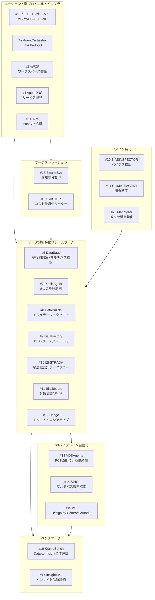

# マルチエージェント協調 & ワークフロー自動化 — 追加詳細レポート

## パラメータ

- **分析リソース数**: 22件
- **リソースタイプ**: 学術論文
- **生成日**: 2026-04-12
- **入力元**: 追加 gather 出力 (`20260412_multi_agent_workflow/resources-multi-agent-workflow-supplemental.md`)
- **既存 retrieval との関係**: 2026-04-05 の retrieval（25件）を補完する追加調査
- **重点セクション**: 全セクション（コア手法・結果・動機・応用）
- **詳細レベル**: 詳細（200-400行/レポート）

## レポート一覧

### エージェント間プロトコル・インフラ（#1-5）

| # | タイトル | 著者 | 年 | Venue | 概要 | レポート |
|---|---------|------|-----|-------|------|---------|
| 1 | A Survey of Agent Interoperability Protocols: MCP, ACP, A2A, and ANP | Ehtesham et al. | 2025 | arXiv | 4主要プロトコルの多次元比較と段階的採用ロードマップ | [詳細](01-survey-agent-interoperability-protocols.md) |
| 2 | AgentOrchestra: TEA Protocol | Zhang et al. | 2025 | arXiv | Tool-Environment-Agent統一抽象化による階層的オーケストレーション、GAIA 89.04% | [詳細](02-agent-orchestra-tea-protocol.md) |
| 3 | AWCP: Workspace Delegation Protocol | Nie et al. | 2026 | arXiv | ファイルシステムレベルのワークスペース委任による深い協調パラダイム | [詳細](03-awcp-workspace-delegation.md) |
| 4 | AgentDNS: Root Domain Naming System for LLM Agents | Cui et al. | 2025 | arXiv | DNS着想のエージェントサービス発見・命名・認証システム | [詳細](04-agentdns.md) |
| 5 | RAPS: Adaptive Coordination via Ad-Hoc Networking | Li et al. | 2026 | arXiv | Pub/Sub型調整+ベイズ的レピュテーションで敵対環境下でも83%維持 | [詳細](05-raps-adaptive-coordination.md) |

### データ分析特化フレームワーク（#6-12）

| # | タイトル | 著者 | 年 | Venue | 概要 | レポート |
|---|---------|------|-----|-------|------|---------|
| 6 | DataSage: Insight Discovery with Multi-role Debating | Liu et al. | 2025 | arXiv | 外部知識検索+多役割討論+マルチパス推論、InsightBench +13.9% | [詳細](06-datasage.md) |
| 7 | PublicAgent: Multi-Agent Design Principles | Montazeri et al. | 2025 | arXiv | オープンデータ分析から5つの設計原則を実証的に導出 | [詳細](07-publicagent.md) |
| 8 | DataPuzzle: Breaking Free from Hallucinated Promise | Zhang et al. | 2025 | arXiv | モノリシック→モジュラーへのパラダイム転換、6つの信頼性要件を定式化 | [詳細](08-datapuzzle.md) |
| 9 | DataFactory: Collaborative Table QA | Wang et al. | 2026 | arXiv | DB+KGデュアルチーム構成、TabFact +20.2%, WikiTQ +23.9% | [詳細](09-datafactory.md) |
| 10 | I2I-STRADA: Structured Reasoning for Data Analysis | Sundar et al. | 2025 | arXiv | 認知ワークフローの形式化、DABstep Hard +18.78pt | [詳細](10-i2i-strada.md) |
| 11 | Blackboard System for Information Discovery | Salemi et al. | 2025 | arXiv | 分散協調型ブラックボードアーキテクチャ、13-57%改善 | [詳細](11-blackboard-system.md) |
| 12 | Dango: Mixed-Initiative Data Wrangling | Chen et al. | 2025 | CHI 2025 | デモベース仕様+明確化質問、完了時間45%短縮・幻覚72%削減 | [詳細](12-dango.md) |

### DSパイプライン自動化（#13-15）

| # | タイトル | 著者 | 年 | Venue | 概要 | レポート |
|---|---------|------|-----|-------|------|---------|
| 13 | VDSAgents: PCS-Guided DS Automation | Jiang et al. | 2025 | arXiv | PCS原則に基づく科学的信頼性担保、5エージェント+横断的安定性検証 | [詳細](13-vdsagents.md) |
| 14 | SPIO: Ensemble and Selective Multi-Agent Planning | Seo et al. | 2025 | arXiv | 適応的マルチパス計画、12ベンチマークで平均5.6%改善 | [詳細](14-spio.md) |
| 15 | iML: Code-Guided Modular AutoML | Le et al. | 2026 | arXiv | Design by Contract型AutoML、Kaggle有効提出率85%・メダル率45% | [詳細](15-iml-automl.md) |

### ベンチマーク・評価（#16-17）

| # | タイトル | 著者 | 年 | Venue | 概要 | レポート |
|---|---------|------|-----|-------|------|---------|
| 16 | KramaBench: Data-to-Insight Pipeline Benchmark | Lai et al. | 2025 | arXiv | 104タスク・6ドメインのデータレイクベンチマーク、最高性能55.83% | [詳細](16-kramabench.md) |
| 17 | InsightEval: Expert-Curated Insight Discovery Benchmark | Zhu et al. | 2025 | arXiv | InsightBench欠陥を修正、Insight F1+Noveltyの多面評価 | [詳細](17-insighteval.md) |

### 汎用オーケストレーション（#18-19）

| # | タイトル | 著者 | 年 | Venue | 概要 | レポート |
|---|---------|------|-----|-------|------|---------|
| 18 | SwarmSys: Decentralized Swarm-Inspired Agents | Li et al. | 2025 | arXiv | Explorer/Worker/Validator+フェロモン強化の群知能フレームワーク | [詳細](18-swarmsys.md) |
| 19 | CASTER: Cost-Performance Barrier Breaking | Liu et al. | 2026 | arXiv | 二分岐ルーターで推論コスト最大72.4%削減 | [詳細](19-caster.md) |

### ドメイン特化応用（#20-22）

| # | タイトル | 著者 | 年 | Venue | 概要 | レポート |
|---|---------|------|-----|-------|------|---------|
| 20 | BIASINSPECTOR: Bias Detection in Structured Data | Li et al. | 2025 | arXiv | 二エージェント協調+46ツール+100検出手法、精度77.53% | [詳細](20-biasinspector.md) |
| 21 | CLIMATEAGENT: Climate Data Science Workflows | Kim et al. | 2025 | arXiv | 三層階層+動的APIイントロスペクション、100%タスク完了率 | [詳細](21-climateagent.md) |
| 22 | Manalyzer: Automated Meta-analysis | Xu et al. | 2025 | arXiv | 6エージェント3ステージ、F1 +30%・ヒット率+50%改善 | [詳細](22-manalyzer.md) |

## リソース間の関係マップ



### 研究の構造的発展

```
プロトコル層（通信・発見・認証）
  │
  ├── メッセージパッシング: MCP/ACP/A2A/ANP (#1)
  ├── ワークスペース共有: AWCP (#3)
  ├── サービス発見: AgentDNS (#4)
  └── 信頼性担保: RAPS (#5)
  │
オーケストレーション層（構造・ルーティング・コスト）
  │
  ├── 階層型: AgentOrchestra/TEA (#2), CLIMATEAGENT (#21)
  ├── 分散型: SwarmSys (#18), Blackboard (#11)
  └── 動的ルーティング: CASTER (#19)
  │
アプリケーション層（データ分析特化）
  │
  ├── インサイト発見: DataSage (#6), I2I-STRADA (#10)
  ├── パイプライン自動化: VDSAgents (#13), SPIO (#14), iML (#15)
  ├── データ品質: DataPuzzle (#8), Dango (#12), BIASINSPECTOR (#20)
  ├── テーブルQA: DataFactory (#9)
  └── ドメイン特化: CLIMATEAGENT (#21), Manalyzer (#22)
  │
評価層（ベンチマーク）
  │
  ├── パイプライン全体: KramaBench (#16)
  └── インサイト品質: InsightEval (#17)
```

## 手法比較テーブル

### エージェント間プロトコルの比較

| プロトコル | 抽象化レベル | 通信方式 | スケーラビリティ | セキュリティ | 標準化状態 |
|-----------|------------|---------|---------------|------------|-----------|
| MCP | ツール/リソース | クライアント-サーバ | 中 | TLS | Anthropic主導 |
| ACP | メッセージ | 非同期メッセージ | 高 | 暗号化 | IBM主導 |
| A2A | エージェント | Agent Card + タスク | 高 | OAuth 2.0 | Google主導 |
| ANP | ネットワーク | DID + P2P | 最高 | DID認証 | コミュニティ |
| TEA (#2) | 環境+ツール+エージェント | 階層型 | 高 | — | 研究段階 |
| AWCP (#3) | ワークスペース | ファイル委任 | 中 | サンドボックス | 研究段階 |

### データ分析フレームワークの比較

| 手法 | エージェント数 | 協調方式 | 主要革新 | 主要結果 |
|------|-------------|---------|---------|---------|
| DataSage (#6) | 3+ | 多役割討論 | 外部知識+マルチパス推論 | InsightBench +13.9% |
| PublicAgent (#7) | 4 | パイプライン | 5設計原則の実証的導出 | オープンデータ分析 |
| DataPuzzle (#8) | モジュラー | ワークフロー | 生成→抽出パラダイム転換 | 6信頼性要件定式化 |
| DataFactory (#9) | DB+KGチーム | デュアルチーム | ReAct Data Leader | TabFact +20.2% |
| I2I-STRADA (#10) | 1(構造化) | 2段階計画 | 認知ワークフロー形式化 | DABstep Hard +18.78pt |
| Blackboard (#11) | N | ブラックボード | 中央制御なし分散協調 | 13-57%改善 |
| Dango (#12) | 3 | ミクストイニシアティブ | デモベース仕様+明確化質問 | 幻覚72%削減 |

### DSパイプライン自動化の比較

| 手法 | アプローチ | 信頼性担保 | 評価 |
|------|----------|----------|------|
| VDSAgents (#13) | PCS原則+横断的安定性検証 | 科学的理論原則 | CS 0.821 (GPT-4o) |
| SPIO (#14) | マルチパス選択/アンサンブル | 多経路探索 | 12ベンチ平均+5.6% |
| iML (#15) | Design by Contract+9エージェント | インターフェース契約 | Kaggle Valid 85% |

## 既存 retrieval（2026-04-05）との統合ビュー

本追加調査（22件）と既存 retrieval（25件）を合わせると、**計47件**のマルチエージェントデータ分析レポートが利用可能です。

| カテゴリ | 既存(04-05) | 追加(04-12) | 合計 |
|---------|------------|------------|------|
| サーベイ | 7 | 1 | 8 |
| フレームワーク | 4 | 7 | 11 |
| オーケストレーション | 3 | 2 | 5 |
| データ分析応用 | 6 | 7 | 13 |
| エンタープライズ | 2 | 0 | 2 |
| プロトコル・インフラ | 0 | 5 | 5 |
| ベンチマーク | 0 | 2 | 2 |
| ドメイン特化 | 0 | 3 | 3 |
| 補足 | 3 | 0 | 3 |

## 追加調査候補

| タイトル | 理由 |
|---------|------|
| OpenAI Swarm (GitHub OSS) | 軽量マルチエージェントフレームワーク、学術論文なし（技術情報として調査可能） |
| Claude Agent SDK (Anthropic) | エージェント開発SDK、学術論文なし（技術情報として調査可能） |
| Google Agent Development Kit (ADK) | A2Aプロトコル実装基盤、学術論文なし |
| MetaGPT (Hong et al., 2024) | ソフトウェア工学向けMAS、既存retrieval #7で言及 |
| ChatDev (Qian et al., 2024) | ソフトウェア開発MAS、既存retrieval #7で言及 |
| DABench / DABstep | データ分析ベンチマーク、I2I-STRADAが使用 |
