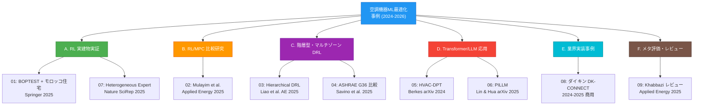

# 空調機器の機械学習最適化 — 論文事例サーベイ

## 調査パラメータ

- **調査タイプ**: 学術論文・業界事例サーベイ（事例ベース）
- **対象期間**: 2024年〜2026年（直近2年に重点）
- **生成日**: 2026-04-27
- **入力キーワード**: 空調機器, HVAC, 機械学習最適化, DRL, MPC, LLM, エネルギー最適化
- **検索言語**: 英語 + 日本語
- **位置付け**: `20260330_general` の後続調査。3月時点のクラスタマップを踏まえ、**最新（2025年）の代表的な論文事例**にフォーカスして詳細を抽出する。

## サマリ

空調機器の機械学習最適化は、2025年に入って **シミュレーション中心の研究から実建物フィールド実証への移行**が顕著になった。代表的な傾向は以下の通り。

1. **強化学習 (RL) の実建物展開**: 米国インディアナ州の住宅、モロッコ・メクネスの住宅、シンガポール・トリノのオフィスなど、実環境で 17〜26% の省エネを達成する事例が複数報告された。
2. **MPC との実証比較**: 30日規模のフィールド比較で、RL が省エネ率では MPC を上回る一方、快適性正規化後では MPC が優位という、トレードオフを定量化した研究が登場。
3. **トランスフォーマー / LLM の応用**: HVAC 専用の Decision Pretrained Transformer (HVAC-DPT) が in-context RL で再学習なしに 45% 削減を達成。LLM を異常検知ルール生成に使う物理情報付き手法 (PILLM) も登場。
4. **業界実装の本格化**: ダイキン工業の "Remote Automatic Energy-Saving Control" が 2024年秋〜2025年春に商用展開され、ヤマハ・BMW Thailand の現場で 16〜21% の電力削減を実証。

ただし、2025年3月のレビュー論文 (Khabbazi et al.) は **104件のフィールド実証のうち 71% が信頼性に問題のある実験プロトコル**を採用しており、報告されている省エネ率を割り引いて見る必要があると警告している。信頼性の高い 29% の実証研究で重み付け平均すると、住宅 16%、商業 13% に留まる。

## 論文事例マップ

## 論文・事例一覧

| # | カテゴリ | タイトル / 事例 | 年 | 種別 | 省エネ率 | レポート |
|---|---------|----------------|------|------|--------|---------|
| 01 | A | RL for HVAC control in residential buildings with BOPTEST and real-case validation | 2025 | Journal | 26.3% | [報告](./01-rl-residential-boptest.md) |
| 02 | B | Comparative Field Deployment of RL and MPC for Residential HVAC | 2025 | Journal | 22% (RL) / 20% (MPC) | [報告](./02-rl-mpc-field-comparison.md) |
| 03 | C | Year-round optimization with Hierarchical DRL for IAQ + energy | 2025 | Journal | 階層型 | [報告](./03-hierarchical-drl-iaq.md) |
| 04 | C | DRL for Low-Level HVAC Control vs ASHRAE G36 (Politecnico Torino) | 2025 | Journal | 17% | [報告](./04-drl-vs-ashrae-g36.md) |
| 05 | D | HVAC-DPT: Decision Pretrained Transformer for HVAC Control | 2024 | arXiv | 45% (sim) | [報告](./05-hvac-dpt-transformer.md) |
| 06 | D | PILLM: Physics-Informed LLM for HVAC Anomaly Detection | 2025 | arXiv | F1=0.926 | [報告](./06-pillm-llm-anomaly.md) |
| 07 | A | Heterogeneous Expert-Guided RL with Runtime Shielding | 2025 | Nature SciRep | 安全性向上 | [報告](./07-expert-guided-rl-shielding.md) |
| 08 | E | Daikin Remote Automatic Energy-Saving Control / DK-CONNECT | 2024-25 | 商用 | 16-21% | [報告](./08-daikin-dk-connect.md) |
| 09 | F | Lessons Learned: Field Demonstrations Review (104件メタ分析) | 2025 | Review | 16% / 13% (信頼性高分のみ) | [報告](./09-field-demo-review.md) |

## 論文事例から見える共通テーマ

| テーマ | 関連論文 | 観察事項 |
|-------|---------|---------|
| **シミュレーション to 実環境ギャップ** | 01, 02, 09 | sim での >40% 省エネが実環境では 13-26% に低下するケースが多い |
| **快適性 vs 省エネのトレードオフ** | 02, 03, 04 | RL は省エネ率で勝つが、快適性正規化後は MPC が優位という結論が複数 |
| **信頼性のある実験プロトコル不足** | 09 | 71% の実証が問題ある手法。比較ベースラインや観測期間に課題 |
| **学習効率・汎化** | 05, 07 | Decision Pretrained Transformer や Expert-guided RL でサンプル効率改善 |
| **物理知識との融合** | 02, 06 | RC モデル / 物理情報プロンプト / 安全シールドの併用が増加 |
| **商用化の進展** | 08 | ダイキンが BMW・ヤマハで 16-21% 実証、商用サービスとして展開中 |

## 主要な研究グループ・キープレイヤー

| 機関 / 著者 | 論文番号 | 研究フォーカス |
|------------|---------|--------------|
| Purdue / CMU / Boulder (Kircher, Bergés ら) | 02, 09 | 実建物 RL/MPC 比較・メタ評価 |
| Politecnico di Torino (Capozzoli ら) | 04 | ASHRAE 標準との比較・ルール抽出 |
| University of Tokyo (Miyata, Akashi ら) | 03 | 階層型 DRL・IAQ 統合 |
| University of Cambridge (Berkes) | 05 | Decision Transformer による in-context RL |
| NUS / KAIST | 06 | LLM × 物理情報の異常検知 |
| Daikin Industries | 08 | 商用 AI 制御サービス |

## 結論と推奨アクション

1. **新規プロジェクトに着手するなら**: 01, 02, 04 が手法・データセット・ベースライン (BOPTEST / ASHRAE G36 / Modelica) の参考になる。
2. **論文の再現性を見極めるなら**: 09 のレビューを最初に読み、報告された省エネ率を批判的に評価する。
3. **実装に進むなら**: 08 のダイキン事例が商用化の到達点を示す。学術論文の数値とのギャップを理解する材料になる。
4. **次世代手法を追うなら**: 05, 06 がトランスフォーマー / LLM の HVAC 応用の最先端。

## 参考: 既存の関連 run

- [`20260330_general/`](../20260330_general/index.md): MPC, DRL, FDD, デジタルツインなど 6 クラスタの俯瞰
- [`20260330_datacenter/`](../20260330_datacenter/index.md): データセンター冷却特化（液浸冷却含む）
