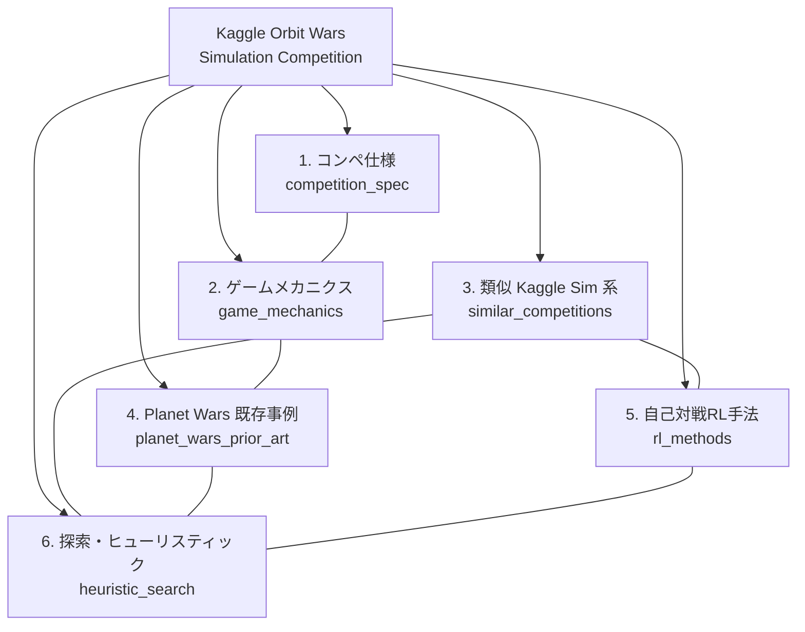

# Kaggle Orbit Wars — 調査クラスタリング

## 研究パラメータ

- **調査タイプ**: Kaggle Simulation コンペ参戦準備調査
- **対象コンペ**: [Orbit Wars](https://www.kaggle.com/competitions/orbit-wars)
- **生成日**: 2026-04-19
- **入力キーワード**: Kaggle Orbit Wars, Planet Wars RTS, self-play RL, MCTS, game AI, Simulation competition
- **検索言語**: 英語 / 日本語

## 対象の概要（暫定）

Orbit Wars は Kaggle の **Simulation 系コンペティション**（ConnectX / Lux AI / Halite / Hungry Geese と同系列）と見られる。公開情報によれば、2 人または 4 人のリアルタイム戦略 (RTS) ゲームで、連続 2D 空間上で太陽の周りを公転する惑星を征服することが目的。参加者は対戦用エージェント（bot）を提出し、他参加者の bot とリーグ戦形式で対戦してレーティングを競う。

ゲームメカニクスは既存研究の Planet Wars / Galcon 系 RTS（Google AI Challenge 2010, SimonLucas/planet-wars-rts 等）に近く、軌道力学を扱う点で OrbitZoo（Multi-Agent RL 環境）とも関連する。

## 調査目的

本調査では、以下 3 点に資する情報を体系的に収集する。

1. **コンペ仕様の把握**: 公式ルール・評価方式・提出形式・タイムラインなどの確定情報
2. **ゲーム理解**: 軌道力学・勝利条件・行動空間など Orbit Wars 固有のメカニクス
3. **解法アプローチの設計**: 類似 Kaggle Simulation コンペの勝者解法、および Planet Wars / RTS 系 AI の手法（RL / 探索 / ヒューリスティクス）

## ドメインマップ

## クラスタサマリ

| # | クラスタID | クラスタ名 | 概要 | 詳細 |
|---|-----------|-----------|------|------|
| 1 | `competition_spec` | コンペ公式仕様 | ルール・評価指標・タイムライン・提出形式・API | [cluster-01-competition-spec.md](cluster-01-competition-spec.md) |
| 2 | `game_mechanics` | ゲームメカニクス | 軌道力学・惑星/太陽の挙動・勝利条件・行動/観測空間 | [cluster-02-game-mechanics.md](cluster-02-game-mechanics.md) |
| 3 | `similar_competitions` | 類似 Kaggle Simulation コンペ | ConnectX / Lux AI / Halite / Hungry Geese 等の勝者解法 | [cluster-03-similar-competitions.md](cluster-03-similar-competitions.md) |
| 4 | `planet_wars_prior_art` | Planet Wars 既存事例 | Google AI Challenge 2010, planet-wars-rts 等の bot 戦略 | [cluster-04-planet-wars-prior-art.md](cluster-04-planet-wars-prior-art.md) |
| 5 | `rl_methods` | 自己対戦強化学習 | PPO / AlphaZero / MuZero / self-play / league training | [cluster-05-rl-methods.md](cluster-05-rl-methods.md) |
| 6 | `heuristic_search` | 探索・ヒューリスティック | MCTS / minimax / rule-based / evolutionary / imitation | [cluster-06-heuristic-search.md](cluster-06-heuristic-search.md) |

## 次フェーズの想定

- `gather` phase: 各クラスタ単位で、公式ドキュメント・論文・GitHub リポジトリ・Kaggle discussion / notebook・ブログ記事を収集
- `retrieval` phase: 収集リソース単位で詳細レポートを生成（参戦時の設計判断に使える粒度）

## 備考

- 本クラスタリング時点で Kaggle 公式ページ本文は reCAPTCHA により直接取得できていない。gather phase で discussion / data タブ / rules タブを個別に WebFetch または手動取得して補完する必要がある。
- 「コンペ仕様」クラスタは他クラスタの前提となるため、最優先で gather / retrieval を実施することを推奨。
