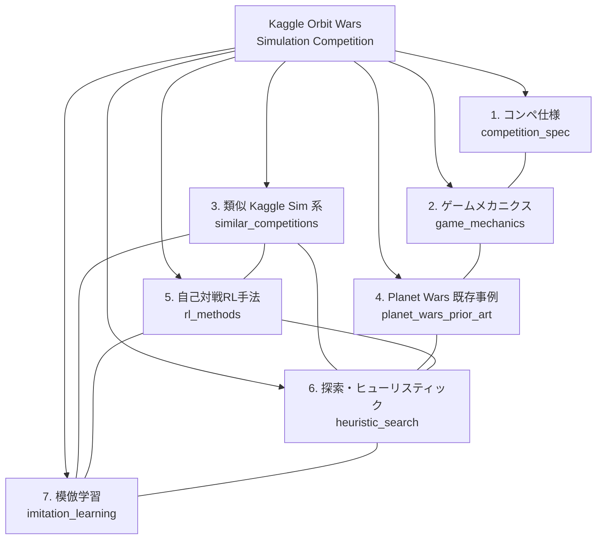

# Kaggle Orbit Wars — 調査クラスタリング (v2: 模倣学習追加版)

## 研究パラメータ

- **調査タイプ**: Kaggle Simulation コンペ参戦準備調査
- **対象コンペ**: [Orbit Wars](https://www.kaggle.com/competitions/orbit-wars)
- **生成日**: 2026-04-20
- **前回 run**: `20260419/`（6 クラスタ版）
- **変更点**: `heuristic_search` 内に埋もれていた「模倣学習 (Imitation Learning)」を独立クラスタ `imitation_learning` として分離・強化
- **入力キーワード**: Kaggle Orbit Wars, Planet Wars RTS, self-play RL, MCTS, game AI, Simulation competition, behavioral cloning, meta kaggle episodes
- **検索言語**: 英語 / 日本語

## 変更の背景

過去の Kaggle Simulation コンペ（Hungry Geese / Lux AI / Kore / Halite IV 等）の上位解法を再確認した結果、**模倣学習 (IL) による bootstrap は単独で上位入賞実績があり、RL と並ぶ主要戦略**であることが判明。cluster-06 (heuristic_search) の一項目としてではなく、独立クラスタとして gather / retrieval を走らせる必要があると判断した。

## 対象の概要

Orbit Wars は Kaggle の **Simulation 系コンペ**（ConnectX / Lux AI / Halite / Hungry Geese と同系列）。2〜4 人のリアルタイム戦略で、連続 2D 空間上で太陽の周りを公転する惑星を征服する。bot をリーグ戦形式で対戦させレーティングを競う。

## 調査目的

1. **コンペ仕様の把握**: 公式ルール・評価方式・提出形式・タイムライン
2. **ゲーム理解**: 軌道力学・勝利条件・行動空間
3. **解法アプローチの設計**: 類似 Kaggle Sim 系の勝者解法と、RL / 探索 / ヒューリスティクス / **模倣学習**

## ドメインマップ

## クラスタサマリ

| # | クラスタID | クラスタ名 | 概要 | 詳細 |
|---|-----------|-----------|------|------|
| 1 | `competition_spec` | コンペ公式仕様 | ルール・評価指標・タイムライン・提出形式・API | [cluster-01-competition-spec.md](cluster-01-competition-spec.md) |
| 2 | `game_mechanics` | ゲームメカニクス | 軌道力学・惑星/太陽の挙動・勝利条件・行動/観測空間 | [cluster-02-game-mechanics.md](cluster-02-game-mechanics.md) |
| 3 | `similar_competitions` | 類似 Kaggle Simulation コンペ | ConnectX / Lux AI / Halite / Hungry Geese 等の勝者解法 | [cluster-03-similar-competitions.md](cluster-03-similar-competitions.md) |
| 4 | `planet_wars_prior_art` | Planet Wars 既存事例 | Google AI Challenge 2010, planet-wars-rts 等の bot 戦略 | [cluster-04-planet-wars-prior-art.md](cluster-04-planet-wars-prior-art.md) |
| 5 | `rl_methods` | 自己対戦強化学習 | PPO / AlphaZero / MuZero / self-play / league training | [cluster-05-rl-methods.md](cluster-05-rl-methods.md) |
| 6 | `heuristic_search` | 探索・ヒューリスティック | MCTS / minimax / rule-based / evolutionary | [cluster-06-heuristic-search.md](cluster-06-heuristic-search.md) |
| 7 | `imitation_learning` | **模倣学習** | **BC / DAgger / 上位bot replay学習 / IL→RL hybrid** | **[cluster-07-imitation-learning.md](cluster-07-imitation-learning.md)** |

## 次フェーズの想定

- `gather` phase: 特に `imitation_learning` クラスタを優先的に gather（本 run と同時に着手）
- `retrieval` phase: 各 IL 事例ごとに詳細レポートを生成（Lux S3 3rd, Kore 2022, Hungry Geese 1st, Halite IV, AlphaStar, AlphaGo, DAgger 論文）

## 備考

- cluster-06 (heuristic_search) 内の `Imitation Learning` 行は cluster-07 へ実質委譲。cluster-06 は MCTS / ルールベース / 進化計算に集中させる設計。
- 20260419 run は保全されており、過去の判断履歴は `runs/kaggle_orbit_wars/clustering/20260419/` で参照可能。
