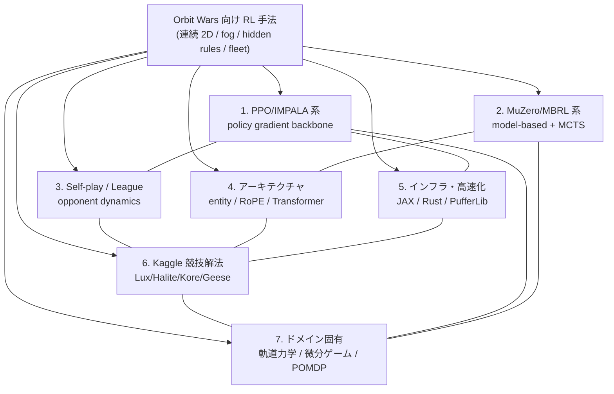

# Orbit Wars 向け強化学習手法 — 多角的クラスタリング

## 研究パラメータ

- **調査タイプ**: 学術論文サーベイ + Kaggle 競技解法調査
- **対象テーマ**: Orbit Wars (Kaggle Simulation) のような連続2D RTS / 部分観測 / マルチユニット fleet コンペに適用可能な強化学習手法
- **時間範囲**: 2022–2026（古典 AlphaStar 2019 / OpenAI Five 2018 は適宜参照）
- **検索言語**: 英語 + 日本語
- **生成日**: 2026-05-22
- **入力キーワード**: Orbit Wars, Lux AI Season 3, self-play RL, PPO, MuZero, AlphaStar, MARL, JAX RL, pursuit-evasion
- **粒度**: Detailed（各クラスタに代表論文 / リポジトリ / writeup を seed として明記）
- **前回クラスタリング**: [20260419](../20260419/index.md)（Orbit Wars 参戦準備全般を6クラスタで俯瞰）
- **本実行の差分**: 前回の `rl_methods` / `heuristic_search` を **RL 手法そのものに特化して 7 クラスタへ深掘り**。コンペ仕様・ゲームメカニクス系は前回担当のため割愛し、Lux S3 NeurIPS 2024 と直近 4 年の論文を重点化。

## 全体像

Orbit Wars は **1v1 または 2v2 のリアルタイム戦略コンペ**で、連続 2D 平面上を公転する惑星を fleet で征服する。Kaggle Simulation 系統では Lux AI Season 3 (NeurIPS 2024) と最も近く、**(a) 部分観測 (fog of war)**, **(b) 隠れ規則 / ランダム化パラメータ**, **(c) 可変数ユニット fleet の同時制御**, **(d) 連続位置 + 離散/連続行動の混在**, **(e) 100MB submission・100ms 推論制約** が技術的制約となる。

過去 4 年の強化学習研究では、**(i) IMPALA/PPO + 自前高速 sim** という古典スタックを **(ii) JAX/Rust によるエンドツーエンド GPU 化** で 1,000–10,000 倍高速化する潮流が主流。同時に **(iii) Sampled MuZero / EfficientZero V2 / UniZero** がモデルベース RL の sample efficiency を Atari100k で SOTA 化、**(iv) MAGPO / HASAC / FACMAC** が連続行動マルチエージェントを ICLR 2024–2025 で押し上げ、**(v) DreamerV3 (Nature 2025)** が POMDP world model の Mastery を示した。Orbit Wars の解法設計は、これら 5 系統のどれを基盤に選ぶかで構成が大きく分岐する。

Kaggle 競技側では **Lux S3 1位 Flat Neurons (IMPALA + ResNet + ConvLSTM + Transformer 200M params on 8×H100)**、**2位 Frog Parade (vanilla PPO + 8-block CNN + Rust 自前 sim 110k step/s)**、**3位 adg4b (Imitation Only)** という多様な勝ち筋が並立しており、絶対的な「正解」は存在しない。本クラスタリングは、これらの選択肢を 7 軸に整理し、ユーザーが自分の制約 (GPU 枚数、習熟言語、開発期間) に応じて最適な技術スタックを構築できる「地図」を提供する。

## 参考サーベイ / レビュー論文

| Title | Year | Summary | Link |
|-------|------|---------|------|
| A Survey on Self-play Methods in Reinforcement Learning | 2024 | PSRO / PFSP / MAESTRO 等の自己対戦パラダイムを体系的分類 | [arXiv 2408.01072](https://arxiv.org/abs/2408.01072) |
| Multi-agent Reinforcement Learning: A Comprehensive Survey | 2024 | CTDE / 価値分解 / 通信学習の最新分類、240+ 論文を包含 | [arXiv 2312.10256](https://arxiv.org/pdf/2312.10256) |
| Lux AI Season 3: Multi-Agent Meta Learning at Scale | NeurIPS 2024 | Lux S3 公式論文。JAX GPU 並列、5 ゲーム sequence での hidden rule 探索/活用が要諦 | [OpenReview 7t8kWYbOcj](https://openreview.net/forum?id=7t8kWYbOcj) |
| PufferLib 2.0: Making RL Libraries and Environments Play Nice | RLC 2025 | C 環境 + PuffeRL で **1M–4M steps/s on RTX 4090** | [arXiv 2406.12905](https://arxiv.org/abs/2406.12905) |
| Mastering diverse domains through world models (DreamerV3) | Nature 2025 | RSSM + symlog/free-bits/percentile return 正規化で POMDP を制覇 | [Nature s41586-025-08744-2](https://www.nature.com/articles/s41586-025-08744-2) |
| EfficientZero V2 | ICML 2024 | 連続・離散行動を統一サポート、DreamerV3 越え on Atari100k/DMControl | [arXiv 2403.00564](https://arxiv.org/abs/2403.00564) |
| Artificial Generals Intelligence: Mastering Generals.io with RL | 2025 | fog-of-war + tile 争奪 RTS で上位 0.003% (H100×36h)。Orbit Wars に**最も類似** | [arXiv 2507.06825](https://arxiv.org/abs/2507.06825) |

## ドメインマップ

## クラスタサマリ

| # | クラスタID | クラスタ名 | キーワード数 | 一行サマリ | 詳細 |
|---|-----------|-----------|-------------|-----------|------|
| 1 | `policy_gradient_backbone` | PPO/IMPALA 系 ポリシー勾配バックボーン | 12 | Frog Parade / Toad Brigade / DeNA HandyRL の主流路線。PPO + GAE + 補助損失で確実に動く | [cluster-01-policy-gradient-backbone.md](cluster-01-policy-gradient-backbone.md) |
| 2 | `model_based_mcts` | モデルベース RL & MCTS (MuZero 系) | 11 | EfficientZero V2 / Sampled MuZero / UniZero / LightZero — sample efficiency の本命 | [cluster-02-model-based-mcts.md](cluster-02-model-based-mcts.md) |
| 3 | `self_play_league` | Self-play / League Training | 13 | AlphaStar PFSP / MAESTRO / Fusion-PSRO / LOQA — opponent dynamics 制御 | [cluster-03-self-play-league.md](cluster-03-self-play-league.md) |
| 4 | `network_architecture` | ネットワーク・観測表現アーキテクチャ | 14 | CNN+SE / Entity Transformer / RoPE-ViT / Decision Transformer / GNN — 可変ユニット表現 | [cluster-04-network-architecture.md](cluster-04-network-architecture.md) |
| 5 | `training_infra` | 訓練インフラ・高速化 | 13 | PufferLib / PureJaxRL / JaxMARL / Sample-Factory / envpool — 桁違いの throughput | [cluster-05-training-infra.md](cluster-05-training-infra.md) |
| 6 | `kaggle_solutions` | Kaggle Simulation 競技勝者解法 | 12 | Lux S1/S2/S3 / Halite IV / Kore 2022 / Hungry Geese — 即戦力の reference design | [cluster-06-kaggle-solutions.md](cluster-06-kaggle-solutions.md) |
| 7 | `domain_specific_rl` | ドメイン固有 RL (軌道/微分ゲーム/POMDP) | 14 | 軌道 pursuit-evasion / HJI Nash / DreamerV3 / GHP-MDP / Generals.io | [cluster-07-domain-specific-rl.md](cluster-07-domain-specific-rl.md) |

## 次フェーズの想定

- **gather** phase: 各クラスタ単位で `runs/kaggle_orbit_wars/gather/20260522_<cluster_id>/` に詳細リソース一覧（論文・GitHub・blog・YouTube 動画）を収集
- **retrieval** phase: 個別リソース単位で詳細レポートを生成（参戦時の設計判断に使える 1500-3000 字レベル）

優先度の高い deep-dive 候補（個人的推奨順）:
1. `cluster-06-kaggle-solutions` (Lux S3 Flat Neurons / Frog Parade) — **即戦力 reference**
2. `cluster-05-training-infra` (PufferLib / PureJaxRL) — **計算効率の上限を上げる前提条件**
3. `cluster-07-domain-specific-rl` (Lux S3 OpenReview / DreamerV3) — **Orbit Wars 固有性のフィット**
4. `cluster-01-policy-gradient-backbone` — まず動かす baseline
5. `cluster-03-self-play-league` — 強化段階での opponent diversity
6. `cluster-04-network-architecture` — 学習が回ってから順次最適化
7. `cluster-02-model-based-mcts` — 高度路線、submission 100ms 制約との両立は要検証

## 備考

- 本クラスタリングは「**手法軸**」で切っているため、前回 [20260419](../20260419/index.md) の「コンペ仕様 / ゲームメカニクス」軸とは直交関係。両方を併用するのが推奨。
- `cluster-06-kaggle-solutions` は Flat Neurons (1位) の writeup や Toad Brigade S1 解法など、Orbit Wars に直接効きそうな**実戦事例の即戦力データベース**として最も時間対効果が高い。
- Submission サイズ (100MB) と推論時間 (100ms 程度) 制約下では、MuZero/EfficientZero 系の MCTS 推論コストが問題化しうるため、`cluster-02-model-based-mcts` は事前に検証必須。
- `cluster-07-domain-specific-rl` の軌道 pursuit-evasion 文献は中国系研究者が支配的（清華大 / 北京理工大 / 哈工大）。ScienceDirect / Springer 経由の paywall が多いため、可能なら arXiv 版を優先。
