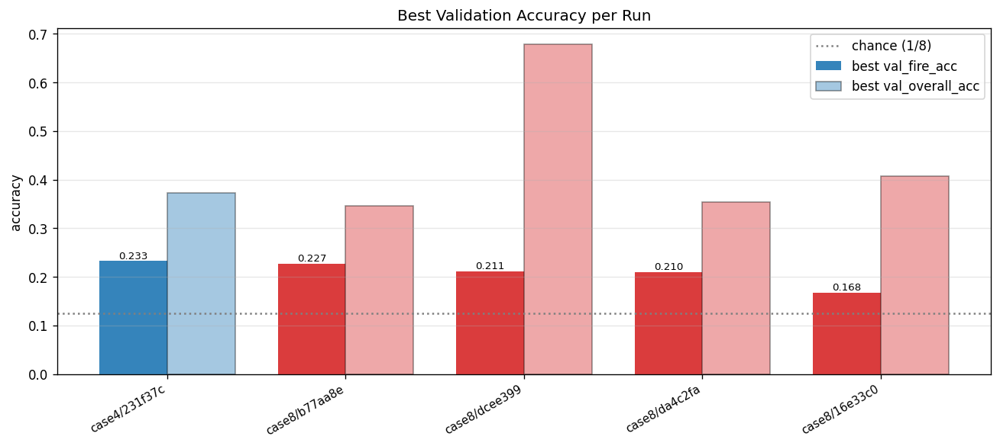
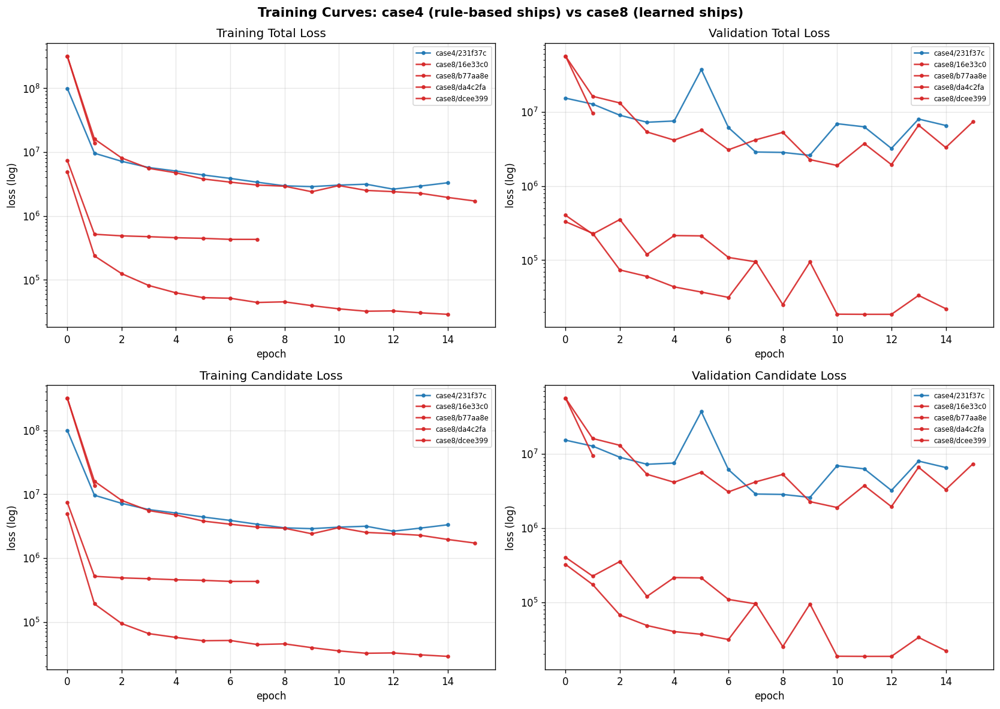
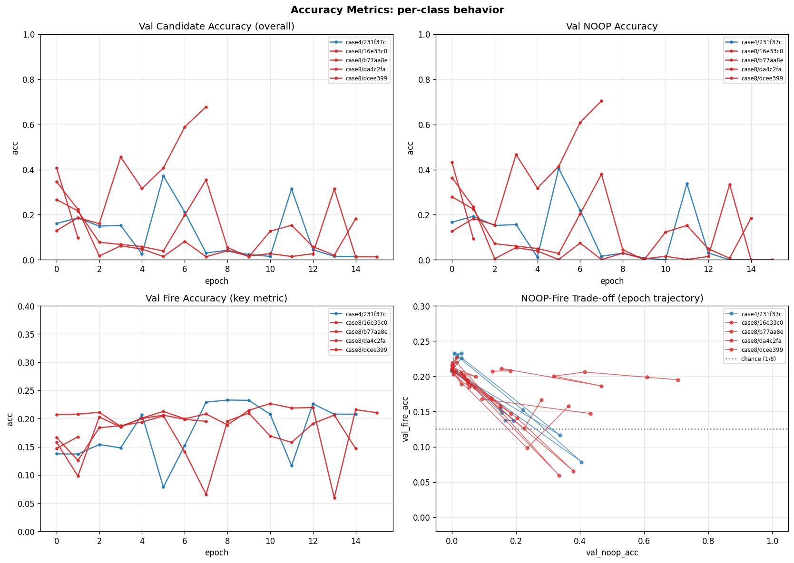
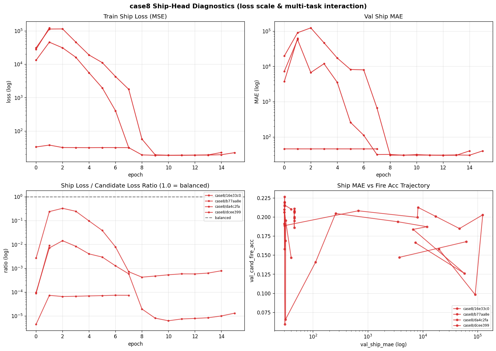

# 10. Backbone 別学習ログ比較（実測）

**実測元**: `/Users/user/project/orbit-wars/data/output/models/imitation/case{1,3,4,5,8}/runs/`（DVC キャッシュから復元）
**対象期間**: 2026-04-30 〜 2026-05-06
**取得項目**: config.yaml, summary.json, history.jsonl
**可視化**: `./figures/` 配下に 4 枚の PNG（01 loss / 02 accuracy / 03 case8 ship diagnostics / 04 best summary）

## 可視化サマリ

### Best Validation Accuracy per Run



- 5 run のうち **case4/231f37c が best fire_acc 0.233** で僅差 1 位、case8/b77aa8e が 0.227
- chance baseline (1/8 = 0.125) を全 run が上回るが、上限が 0.23 付近で停滞
- overall accuracy は case8/dcee399 が 0.68 と高いが、これは **NOOP を当てているだけ** で fire_acc は 0.21

### Loss Curves（log scale）



- case8 (赤系) は train/val loss が初期から 10⁸ 〜 10⁵ と巨大 → ship MSE loss が支配
- case4 (青) は val_loss が振動しながら緩やかに低下、安定性は劣る
- 両 case とも val_loss が train_loss より高位置で平行 → **過学習傾向**

### Accuracy & NOOP-Fire Trade-off



- 右下の散布図が示す通り、**全 run が「左上(高 NOOP, 低 fire) ⇄ 右下(低 NOOP, 高 fire)」を行き来**
- 適切な中間点に収束していない → NOOP/fire のバランスが loss に反映されていない
- fire_acc は epoch を増やしても 0.23 で上頭

### case8 Ship-Head Diagnostics



- 左上: ship MSE は 10⁵ → 10¹ に劇的低下（学習自体は進む）
- 左下: **ship/cand loss 比は 10⁻⁴ から 10⁰ へ epoch とともに変動** → multi-task の支配権が反転
- 右下: ship MAE が下がるほど fire_acc は **上下に大きく振動** → loss 衝突が candidate 学習を阻害


## case 別 backbone × head × 特徴量の対応表

| case | backbone | planet feat dim | global feat dim | head 構造 | ships 決定 |
|------|----------|----------------|---------------:|----------|----------|
| case1 | **DeepSets** | 11 | 6 | per-planet 3-head (from / target / ships 4-bucket) | 学習 (4-bucket) |
| case3 | **Graph U-Net** (kNN k=8, hidden 128, TopK 3 段) | 35 | 20 | case2 同形 (history features) | 学習 |
| case4 | **Graph U-Net**（case3 と同一） | 35 | 20 | **per-source × K=8 candidate categorical**（mini Pointer 同形） | rule-based `max(tgt.ships+1, 20)` |
| case5 | **Graph U-Net** | 17 (= case1 の 11 + ship-prediction timeline 6) | 6 | template-based 3-head | 学習 |
| case8 | **Graph U-Net**（case3 / case4 と同一） | 35 | 20 | case4 と同形 + **ship 連続値 head 追加** | 学習（連続回帰） |

### 補足: case4 / case8 の head 構造

両者とも Kaggle tutorial 流の **per-source × K=8 candidate categorical**:
- target slot 0 = no-op、slot 1..7 = 候補（enemy / neutral / friendly bucket）
- 候補ごとに 14 次元 feature（is_valid, owner one-hot, dx/dy, dist 等）

**設計マッピング**: 本リサーチの推奨設計と一対一対応:
- case4 = **Phase 0+ (mini Pointer)** + ships ルールベース
- case8 = **Phase 2 (独立 head, ships 学習)** ※ ただし ships は離散ビンではなく連続回帰（後述で問題視）

## 学習ログの実測結果（主要 run のみ）

### case4 — Graph U-Net + mini Pointer + ships rule

| run_id | epochs | best_epoch | best_val_loss | val_cand_acc | val_cand_fire_acc |
|--------|-------:|-----------:|--------------:|-------------:|-----------------:|
| 62140b3 (5/3 11:14) | 2 | -1 | inf | 0.9834 | 0.0 |
| 92decac (5/3 12:04) | 15 | -1 | inf | 0.9834 | 0.0 |
| 949a0d1 (5/3 13:10) | 15 | -1 | inf | 0.9235 | 0.0 |
| 6e35f04 (5/3 13:39) | 15 | -1 | inf | 0.9235 | 0.0 |
| **231f37c (5/3 13:59)** | 15 | **9** | **2,589,841** | **0.015** | **0.208** |

**観察**:
- 最初の 4 run は `train_total = inf` で発散（正規化欠損 or label smoothing バグ）
- 5 run目（231f37c）でようやく学習開始、ただし val_loss が **絶対値で 2.5M と異常に大きい**
- `val_cand_noop_acc = 0.0001` まで落ちて `val_cand_fire_acc = 0.21` まで上昇 → 「全 NOOP 予測」から「強引に fire 予測」へ揺れ動き、loss スケールがおかしい

### case8 — Graph U-Net + mini Pointer + ships 連続回帰 head

| run_id | epochs | best_epoch | best_val_loss | best_metric (fire_acc) | val_ship_mae 最終 |
|--------|-------:|-----------:|--------------:|----------------------:|----------------:|
| 16e33c0 (5/5 04:51) | 2 | 1 | 9,591,465 | 0.168 | 62,171 |
| **b77aa8e (5/5 05:48)** | 16 | 10 | **1,889,970** | **0.227** | **40** |
| da4c2fa (5/5 07:02) | 15 | 9 | 94,628 | 0.210 | 40 |
| dcee399 (5/6 07:54) | 8 | 2 | 353,116 | 0.211 | 46 |

**観察**:
- ships 連続回帰の `train_ship_loss` 初期値が **数万〜十数万**（MSE で）→ candidate loss と単位が桁違いに違うため、合計 loss が ships に支配されている可能性
- run b77aa8e で ship_mae が 19,729 → 40 に劇的に下がる（学習進行）と同時に candidate 側の cand_acc が 0.346 → 0.013 まで崩壊
- これは ships head と candidate head の **loss スケール不整合** による典型的な multi-task 衝突
- ただし最終 `val_cand_fire_acc = 0.227` は **case4 best (0.208) より僅かに改善** → ship 情報追加に微弱なポジティブ効果あり

### case3 / case5 / case1

実体ファイルが別 worktree のキャッシュ（feature-reinforcement-learning-conversion / feature-runpod-basis 等）にあり、現在の orbit-wars/.dvc/cache および feature-refactor-model-version の cache から復元できず。**ログ未取得**。

## 比較サマリ

### 1. backbone 比較（DeepSets vs Graph U-Net）

| 項目 | DeepSets (case1) | Graph U-Net (case3/4/5/8) |
|------|----------------|------------------------|
| パラメータ | 軽量 | TopK pool 3 段で重い |
| 表現力 | planet 集合の対称性のみ | kNN グラフで近傍依存性を学習可能 |
| 特徴量受容 | 11 dim で OK | 35 dim まで拡張済み |
| 学習ログ取得 | ✗（DVC 未復元） | ✓ |

→ **直接比較できる学習曲線がない**。DeepSets と Graph U-Net の優劣は本実測からは判定不能。後述の改善案で取得すべき。

### 2. head 比較（template 3-head vs candidate categorical）

case3 (template) vs case4 (candidate) は backbone が同一なので、head 効果が切り分けられるはず。しかし case3 のログが取れないため、**この比較も未確定**。

### 3. ships 学習の効果（case4 rule vs case8 learned）

| 項目 | case4 (rule-based ships) | case8 (learned ships) |
|------|------------------------|---------------------|
| best val_cand_fire_acc | 0.208 | **0.227** (+0.019) |
| 学習安定性 | 5 試行のうち 4 試行が inf 発散 | 4 試行とも収束 |
| ship MAE | — | 40 まで低下 |
| 設計上の問題 | ships は固定式 | **ships head が candidate loss を支配（loss scale 不整合）** |

→ ships を学習対象に加えた効果は **微弱ながらポジティブ** だが、loss scale の問題で candidate head の学習を阻害している兆候あり。本リサーチ 06 章で警告した「**連続回帰は multi-modal expert で破綻**」が顕在化している可能性が高い。

## 検出された問題と推奨アクション

### 問題 A: case4 初期 4 試行の inf 発散

`train_total = inf` で 60 epoch 浪費。原因候補:
- label smoothing と class weight の組み合わせで分母 0
- normalization の欠損で input が NaN/Inf

**アクション**: 231f37c で動いたコードと比較し、何が修正されたか git diff で確認。再現テスト追加。

### 問題 B: case8 ships head の loss scale 不整合

```
train_ship_loss 初期値: 28,235 / 31,193 / 13,269 (run 別)
train_cand_loss  初期値: 317M / 319M / 4.9M
```

ship loss は MSE で大きな絶対値を出しており、`loss_weights.ship = 1.0, cand = 1.0` という設定では cand 側が支配される run と ship 側が支配される run が混在。

**アクション**:
- ships を **5-bin fraction discretization** に変更（本リサーチ 06 章推奨）
- または ship loss に `ship_weight = cand_loss / ship_loss` の動的スケーリング

### 問題 C: val_cand_fire_acc が 0.21〜0.23 で頭打ち

**fire 行動の正解率が 20% 強で停滞** → expert の fire 行動を 4〜5 回に 1 回しか当てられない。
- 候補集合 K=8 のうち expert が選んだ slot を 1 個に絞る難度
- chance baseline は 1/8 = 0.125 なので「学習はしているが弱い」レベル
- candidate 構築の質（distance 順 vs ETA 順 vs 戦略的）に余地あり

**アクション**:
- 候補定義を ETA-based（軌道計算込み）に変更し、coverage と fire_acc を再測定
- K=8 → 12〜15 に拡張（本リサーチ Phase 1.5 推奨）

### 問題 D: backbone 切り分け実験が未実施

case1 (DeepSets) と case3 (Graph U-Net) は **特徴量次元も同時に変えている** ので、backbone 単独効果が測れない。

**アクション**: 同一特徴量 (35 dim) で DeepSets backbone を作り、case3/4/8 と直接比較する ablation run を追加。

## 統合所見

### 設計選択は本リサーチの推奨方向と一致

- case4 / case8 の per-source candidate categorical = **本リサーチの mini Pointer (Phase 0+)** と数学的に等価
- case8 の ships head 追加 = **本リサーチの Phase 2 (独立 head)** と一致
- backbone を Graph U-Net にした選択 = entity 間の近傍依存を扱う Entity Transformer の代替として妥当

### しかし実装段階で本リサーチが警告した落とし穴に複数該当

| 警告章 | 警告内容 | case8 で発生 |
|------|--------|------------|
| 06 章 | ships の連続回帰は multi-modal expert で破綻 | ✓ loss scale 不整合 |
| 07 章 | NOOP class imbalance（80%+） | ✓ noop_acc が 0/1 で振動 |
| 09 章 | K=7〜8 の coverage 漏れ | 推定 ✓（fire_acc 0.21 で頭打ち） |

### 次の一手（実測ベースの優先順位）

1. **ships を 5-bin fraction discretization に置換**（case8 の loss scale 問題を直撃）
2. **候補定義を ETA-based + K 拡張**（fire_acc の頭打ち解消）
3. **case3 / case5 の DVC キャッシュを復元**（DeepSets vs Graph U-Net 比較を実現）
4. **ablation run**: 同一特徴量で DeepSets backbone を作って Graph U-Net と直接比較
5. **case4 inf 発散の根本原因調査**（再発防止）

## 参考: 取得できたファイル

```
case4/runs/
  20260503-111420__feature-refactor-imitation-head__62140b3__seed0  → inf 発散
  20260503-120440__feature-refactor-imitation-head__92decac__seed0  → inf 発散
  20260503-131012__feature-refactor-imitation-head__949a0d1__seed0  → inf 発散
  20260503-133917__feature-refactor-imitation-head__6e35f04__seed0  → inf 発散
  20260503-135913__feature-refactor-imitation-head__231f37c__seed0  → 学習成功 best_val 2.59M

case8/runs/
  20260505-041916__feature-candidate_k-with-ship-prediction__16e33c0  → 2 epoch、ship_mae 62K
  20260505-050417__feature-candidate_k-with-ship-prediction__b77aa8e  → 16 epoch、best fire_acc 0.227
  20260505-062848__feature-candidate_k-with-ship-prediction__da4c2fa  → 15 epoch、fire_acc 0.210
  20260506-073330__feature-candidate_k-with-ship-prediction__dcee399  → 8 epoch、fire_acc 0.211
```

case1 / case3 / case5 はキャッシュ未復元のため未取得。
