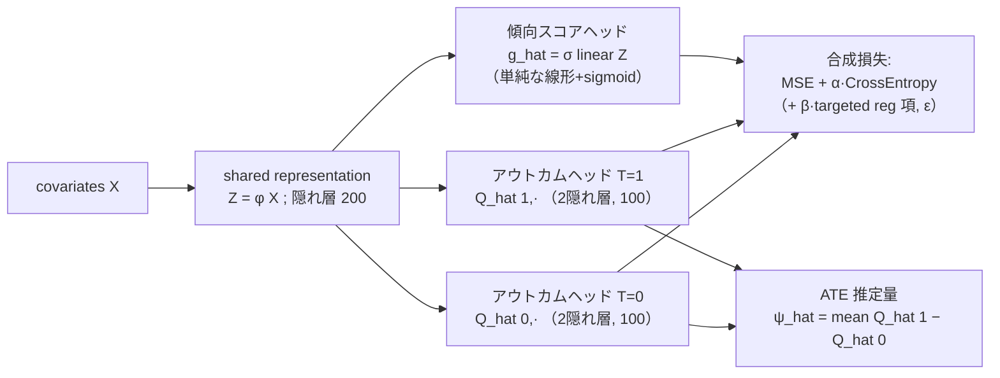

# Dragonnet: 因果効果推定のためのニューラルネット適応

- **Link**: https://arxiv.org/abs/1906.02120 （NeurIPS 版 PDF: https://proceedings.neurips.cc/paper/2019/file/8fb5f8be2aa9d6c64a04e3ab9f63feee-Paper.pdf）
- **Authors**: Claudia Shi, David M. Blei, Victor Veitch（Columbia University）
- **Year**: 2019
- **Venue**: 33rd Conference on Neural Information Processing Systems (NeurIPS 2019), Vancouver, Canada
- **Type**: 学術論文（因果推論 / 表現学習 / semiparametric estimation）
- **Code**: https://github.com/claudiashi57/dragonnet （著者公式実装。PyTorch 版・uber/causalml への移植も存在）

---

## Abstract (English)

This paper addresses the use of neural networks for the estimation of treatment effects from observational data. Generally, estimation proceeds in two stages. First, we fit models for the expected outcome and the probability of treatment (propensity score) for each unit. Second, we plug these fitted models into a downstream estimator of the effect. Neural networks are a natural choice for the models in the first step. The question we address is: how can we adapt the design and training of the neural networks used in the first step in order to improve the quality of the final estimate of the treatment effect? We propose two adaptations based on insights from the statistical literature on the estimation of treatment effects. The first is a new architecture, the Dragonnet, that exploits the sufficiency of the propensity score for estimation adjustment. The second is a regularization procedure, targeted regularization, that induces a bias towards models that have non-parametrically optimal asymptotic properties `out-of-the-box`. Studies on benchmark datasets for causal inference show these adaptations outperform existing methods.

## Abstract (日本語)

本論文は、観察データからの処置効果（treatment effect）推定にニューラルネットワークを用いる問題を扱う。一般に推定は二段階で進む。第一段階では、各ユニットについて期待アウトカムと処置確率（傾向スコア, propensity score）のモデルを当てはめる。第二段階では、これらの当てはめモデルを下流の効果推定量に代入する。第一段階のモデルとしてニューラルネットは自然な選択肢である。本論文が扱う問いは、「最終的な処置効果推定の質を高めるために、第一段階で用いるニューラルネットの設計と学習をどう適応させればよいか」である。処置効果推定の統計文献から得られる知見に基づき、二つの適応を提案する。第一は新しいアーキテクチャ **Dragonnet** であり、推定調整における傾向スコアの十分性（sufficiency）を活用する。第二は正則化手続き **targeted regularization** であり、追加の後処理なしに（out-of-the-box で）ノンパラメトリックに最適な漸近的性質を持つモデルへとバイアスを誘導する。因果推論のベンチマークデータでの実験は、これらの適応が既存手法を上回ることを示す。

---

## Overview（概要）

Dragonnet は、観察データからの平均処置効果（ATE）および個別処置効果（CATE）推定を、ニューラルネットで「推定の質」を最適化する形に再設計した手法である。従来のニューラルネット因果推定（TARNet, CFR など）は「アウトカム予測精度」を最適化するが、Dragonnet は「下流の効果推定量に良い入力を与えること」を目的とする。

貢献は以下の三点である。

1. **Dragonnet アーキテクチャ**: 共有表現層から三つのヘッド（傾向スコア 1 本 + アウトカム 2 本）を分岐させる three-headed network。Rosenbaum & Rubin (1983) の「傾向スコアの十分性」定理に基づき、共有表現を傾向スコア予測に強く結合させることで、交絡調整に無関係な covariate 情報を捨てさせる。
2. **Targeted regularization**: semiparametric 推定理論（TMLE、efficient influence curve）に着想を得た学習目的への追加正則化項。ε という 1 パラメータの摂動を導入し、当てはめモデルが non-parametric estimating equation を満たすよう誘導する。これにより、下流の推定量が double robustness と漸近的効率性を持つ。
3. **経験的検証**: IHDP と ACIC 2018 という二つの semi-synthetic ベンチマークで、既存のニューラルネット手法および TMLE を上回ることを示す。

## Problem（課題）

- 観察データからの因果推論では、処置・アウトカム双方に影響する交絡因子（confounder）を調整しないと誤った結論に至る。本論文は「no hidden confounding（隠れた交絡なし）」設定を仮定する。
- ニューラルネット研究は **予測（predictive）性能** に注力してきたが、因果推論で重要なのは下流の **推定（estimation）** の質である。予測が良くても推定が良いとは限らない。
- 単純な二段階手続き（アウトカム net と傾向スコア net を別々に学習）は cumbersome であり、有限標本では傾向スコアモデルの推定誤差がアウトカムモデルへ伝播しうる。
- アウトカム予測に有用だが処置予測に無関係な covariate（＝交絡に無関係な「ノイズ」）を条件付けすると、有限標本性能が悪化する。これを捨てる仕組みが必要。
- A-IPTW のような効率的推定量は傾向スコア $\hat g$ を分母に持つため、有限標本で不安定になりやすい。安定した有限標本挙動と強い漸近保証を両立する枠組みが求められる。

## Proposed Method（提案手法）

### コアアイデア

- **傾向スコアの十分性（Theorem 2.1, Rosenbaum-Rubin 1983）**: ATE が $X$ による調整で識別可能なら、傾向スコア $g(X)$ による調整だけでも十分である。すなわち $\psi = \mathbb{E}[\mathbb{E}[Y\mid g(X), T=1] - \mathbb{E}[Y\mid g(X), T=0]]$。
- したがって、共有表現層 $Z=\phi(X)$ を「傾向スコア予測に十分な情報」に絞り込めば、交絡調整に無関係な covariate を自然に排除できる。Dragonnet はこの絞り込みを end-to-end 学習で実現する。

### 手順（numbered steps）

1. 深いネットで covariate $X$ から共有表現 $Z(X)\in\mathbb{R}^p$ を生成する（隠れ層サイズ 200）。
2. 共有表現から **傾向スコアヘッド** $\hat g$ を分岐。ここは **単純な線形写像 + sigmoid** に制限する。この「単純さ」が表現層を傾向スコアに tightly couple させる鍵。
3. 共有表現から **2 本のアウトカムヘッド** $\hat Q(0,\cdot)$, $\hat Q(1,\cdot)$ を分岐（それぞれ 2 隠れ層 NN、サイズ 100）。処置群・対照群で別ヘッド。
4. アウトカム損失（MSE）+ $\alpha\cdot$ 傾向スコア損失（cross-entropy）の合成目的で end-to-end 学習する（式 2.2）。
5. **（任意）targeted regularization**: 追加パラメータ $\varepsilon$ と正則化項 $\gamma$ を目的関数に加え（式 3.2）、当てはめモデルを non-parametric estimating equation に整合させる。
6. 当てはめた $\hat Q$ を式 1.2 の推定量 $\hat\psi^Q$ に代入して ATE を得る。targeted regularization 使用時は摂動後モデル $\hat Q^{\mathrm{treg}}$ から $\hat\psi^{\mathrm{treg}}$（式 3.3, 3.4）を用いる。

### Key Formulas

平均処置効果（ATE）の観察分布パラメータとしての表現（式 1.1）と naive plug-in 推定量（式 1.2）:

$$
\psi = \mathbb{E}\big[\mathbb{E}[Y\mid X, T=1] - \mathbb{E}[Y\mid X, T=0]\big],
\qquad
\hat\psi^{Q} = \frac{1}{n}\sum_i \big[\hat Q(1,x_i) - \hat Q(0,x_i)\big].
$$

Dragonnet の学習目的（式 2.1–2.2）。$\alpha\in\mathbb{R}_+$ はハイパーパラメータ:

$$
\hat\theta = \arg\min_{\theta}\ \hat R(\theta;\boldsymbol{X}),
\qquad
\hat R(\theta;\boldsymbol{X}) = \frac{1}{n}\sum_i\Big[\big(Q^{\mathrm{nn}}(t_i,x_i;\theta)-y_i\big)^2 + \alpha\,\mathrm{CrossEntropy}\big(g^{\mathrm{nn}}(x_i;\theta), t_i\big)\Big].
$$

Non-parametric estimating equation と efficient influence curve $\varphi$（式 3.1）:

$$
0 = \frac{1}{n}\sum_i \varphi(y_i,t_i,x_i;\hat Q,\hat g,\hat\psi),
\qquad
\varphi(y,t,x;Q,g,\psi) = Q(1,x)-Q(0,x) + \Big(\frac{t}{g(x)}-\frac{1-t}{1-g(x)}\Big)\{y-Q(t,x)\} - \psi.
$$

**Targeted regularization**。摂動アウトカム $\tilde Q$ と正則化項 $\gamma$（追加パラメータ $\varepsilon$）:

$$
\tilde Q(t_i,x_i;\theta,\varepsilon) = Q^{\mathrm{nn}}(t_i,x_i;\theta) + \varepsilon\left[\frac{t_i}{g^{\mathrm{nn}}(x_i;\theta)} - \frac{1-t_i}{1-g^{\mathrm{nn}}(x_i;\theta)}\right],
$$

$$
\gamma(y_i,t_i,x_i;\theta,\varepsilon) = \big(y_i - \tilde Q(t_i,x_i;\theta,\varepsilon)\big)^2.
$$

修正目的関数（式 3.2, $\beta\in\mathbb{R}_+$ はハイパーパラメータ）と targeted 推定量（式 3.3–3.4）:

$$
\hat\theta,\hat\varepsilon = \arg\min_{\theta,\varepsilon}\left[\hat R(\theta;\boldsymbol{X}) + \beta\,\frac{1}{n}\sum_i \gamma(y_i,t_i,x_i;\theta,\varepsilon)\right],
$$

$$
\hat\psi^{\mathrm{treg}} = \frac{1}{n}\sum_i\big[\hat Q^{\mathrm{treg}}(1,x_i)-\hat Q^{\mathrm{treg}}(0,x_i)\big],
\qquad
\hat Q^{\mathrm{treg}} = \tilde Q(\cdot,\cdot;\hat\theta,\hat\varepsilon).
$$

鍵となる観察（式 3.5）: この項の停留条件が estimating equation（式 3.1）を強制する。

$$
0 = \left.\partial_\varepsilon\Big(\hat R(\theta;\boldsymbol{X}) + \beta\frac{1}{n}\sum_i\gamma(y_i,t_i,x_i;\theta,\varepsilon)\Big)\right|_{\hat\varepsilon} = \beta\frac{1}{n}\sum_i \varphi(y_i,t_i,x_i;\hat Q^{\mathrm{treg}},\hat g,\hat\psi^{\mathrm{treg}}).
$$

これにより $\hat\psi^{\mathrm{treg}}$ は、$\hat Q^{\mathrm{treg}}$ か $\hat g$ のいずれかが一致推定量なら整合する **double robustness** を持つ。

## Algorithm（擬似コード）

```
入力: 観察データ {(x_i, t_i, y_i)}_{i=1..n}, ハイパーパラメータ α, β
出力: ATE 推定値 ψ_hat

1. モデル初期化:
     共有表現 Z = φ(X; θ_φ)                      # deep net, 隠れ200
     傾向スコアヘッド g_hat(x) = σ(linear(Z))     # 線形 + sigmoid（単純に制限）
     アウトカムヘッド Q_hat(0,·), Q_hat(1,·)       # 各2隠れ層NN, サイズ100
     （targeted 使用時）摂動パラメータ ε ← 0

2. for each minibatch until 収束:
     L_out = mean over i of (Q_hat(t_i, x_i) - y_i)^2
     L_prop = α * CrossEntropy(g_hat(x_i), t_i)
     L = L_out + L_prop
     if targeted_regularization:
         Q_tilde = Q_hat(t_i,x_i) + ε*(t_i/g_hat - (1-t_i)/(1-g_hat))
         L = L + β * mean over i of (y_i - Q_tilde)^2   # ε も同時に最適化
     θ, ε ← SGD-with-momentum で L を最小化

3. 推定:
     if targeted_regularization:
         ψ_hat = (1/n) Σ_i [Q_tilde(1,x_i) - Q_tilde(0,x_i)]      # ψ^treg
     else:
         ψ_hat = (1/n) Σ_i [Q_hat(1,x_i) - Q_hat(0,x_i)]          # ψ^Q
     # 推定時は g_hat(x) ∈ [0.01, 0.99] の点のみ使用（overlap 除外）

4. return ψ_hat
```

## Architecture / Process Flow

three-headed network（共有表現 → 傾向スコアヘッド 1 本 + アウトカムヘッド 2 本）。「Dragon（竜）」の名は「頭が三つ」に由来する。



ポイント: 傾向スコアヘッドを **あえて単純な線形写像に制限** することで、共有表現層 $Z$ を「傾向スコアを説明できる情報」に強制的に絞り込む。傾向スコアヘッドを取り除くと、本質的に TARNet（Shalit et al. 2016）と同一のアーキテクチャになる。

## Figures & Tables

### 図1: Dragonnet アーキテクチャ（本文 Figure 1 の記述）

covariates $X$ → 共有表現 $Z$ → 3 ヘッド $\hat Q(1,\cdot)$, $\hat g(\cdot)$, $\hat Q(0,\cdot)$ に分岐する構造。$t=1$ 側と $t=0$ 側でアウトカムヘッドが分かれる。（画像 URL は arXiv HTML 版が 404 のため埋め込み不可。上記 Mermaid 図で代替。）

### 表1: IHDP ベンチマークでの平均絶対誤差（本文 Table 1）

各エントリは平均絶対誤差（および標準誤差）。$\Delta_{in}$=学習/検証データ上、$\Delta_{out}$=ホールドアウト上、$\Delta_{all}$=全データ使用時。t-reg = targeted regularization。

| Method | $\Delta_{in}$ | $\Delta_{out}$ | $\Delta_{all}$ |
|---|---|---|---|
| BNN [JSS16] | 0.37 ± .03 | 0.42 ± .03 | — |
| TARNET [SJS16] | 0.26 ± .01 | 0.28 ± .01 | — |
| CFR Wass [SJS16] | 0.25 ± .01 | 0.27 ± .01 | — |
| CEVAEs [Lou+17] | 0.34 ± .01 | 0.46 ± .02 | — |
| GANITE [YJS18] | 0.43 ± .05 | 0.49 ± .05 | — |
| baseline (TARNET, 著者実装) | 0.16 ± .01 | 0.21 ± .01 | 0.13 ± .00 |
| baseline + t-reg | 0.15 ± .01 | 0.20 ± .01 | 0.12 ± .00 |
| **Dragonnet** | **0.14 ± .01** | 0.21 ± .01 | 0.12 ± .00 |
| **Dragonnet + t-reg** | **0.14 ± .01** | **0.20 ± .01** | **0.11 ± .00** |

Dragonnet + t-reg が $\Delta_{all}=0.11$ で最良。全データを学習・推定の双方に再利用する方が data splitting より良い（$\Delta_{all} < \Delta_{out}$）。

### 表2: ACIC 2018 全データセット平均絶対誤差（本文 Table 2）

| Method | $\Delta_{all}$ |
|---|---|
| baseline (TARNET) | 1.45 |
| baseline + t-reg | 1.40 |
| Dragonnet | 0.55 |
| **Dragonnet + t-reg** | **0.35** |

Dragonnet がベースライン（1.45 → 0.55）を大きく改善し、targeted regularization がさらに改善（0.35）。

### 表3: ACIC 2018 でベースライン比の改善率（本文 Table 3, アブレーション的比較）

$\%_{improve}$=ベースライン対比で改善したデータセット割合、$\uparrow_{avg}$=改善時の平均改善量、$\downarrow_{avg}$=悪化時の平均悪化量。

| $\psi^Q$ | $\%_{improve}$ | $\uparrow_{avg}$ | $\downarrow_{avg}$ |
|---|---|---|---|
| baseline | 0% | 0 | 0 |
| + t-reg | 42% | 0.30 | 0.11 |
| + dragon | 63% | 1.42 | 0.01 |
| + dragon & t-reg | 46% | 2.37 | 0.01 |

改善する場合の効果は大きく（$\uparrow_{avg}$ 大）、悪化する場合の劣化は軽微（$\downarrow_{avg}$ 小）。約半分のケースで改善する。

### 表4: Dragonnet vs NEDnet（end-to-end vs 多段階、本文 Table 4）

NEDnet = Dragonnet を傾向スコアで先に学習 → 頭を落として（beheaded）アウトカムヘッドを付け直す多段階版。$\hat\psi^Q$ と $\hat\psi^{\mathrm{TMLE}}$ の両推定量で比較。

| IHDP | $\hat\psi^Q$ | $\hat\psi^{\mathrm{TMLE}}$ | ACIC | $\hat\psi^Q$ | $\hat\psi^{\mathrm{TMLE}}$ |
|---|---|---|---|---|---|
| Dragonnet | 0.12 ± 0.00 | 0.12 ± 0.00 | Dragonnet | 0.55 | 1.97 |
| NEDnet | 0.15 ± 0.01 | 0.12 ± 0.00 | NEDnet | 1.49 | 2.80 |

end-to-end の Dragonnet の方が多段階 NEDnet より正確（ACIC で 0.55 対 1.49）。

### 図2・図3（本文 Figure 2, 3 の記述）

- **図2**: Dragonnet はホールドアウトでの予測損失（regression loss）はベースラインより悪いが、推定誤差（estimation error）は良い。「予測精度を犠牲にして傾向スコアの良い表現を獲得している」ことの証拠。
- **図3**: ACIC データセットを「アウトカム $Y$ のみに影響し処置に無関係な covariate（irrelevant covariates）の数」で層別化。無関係 covariate が増えるほど Dragonnet（緑）が TARNET（青）に対し median MAE で優位になる。

（図2・図3の画像 URL は arXiv HTML 版が 404 のため埋め込み不可。）

## Experiments & Evaluation

### Setup

- **ベンチマーク**: 二つの semi-synthetic データ。
  - **IHDP** (Hill 2011): Infant Health and Development Program 由来。747 観測、covariate 25 次元。NPCI パッケージから 1000 realization。学習/検証/テスト = 63/27/10 分割、および全データ使用の両方を報告。
  - **ACIC 2018** (Shimoni et al.): IBM causal inference benchmarking framework。63 の異なるデータ生成過程設定。各設定から 3 データセット（サイズ 5k または 10k）をランダム抽出。overlap 違反（Dragonnet のホールドアウト処置分類精度 >90%）のデータは除外し、101 データセットが残る。各推定を 25 回再実行し平均を報告。
- **ハイパーパラメータ**: $\alpha=1$, $\beta=1$。共有表現層 200 隠れユニット、アウトカムヘッド 100。最適化は momentum 付き SGD（最適化手法の選択が性能に大きく影響）。
- **推定量・指標**: ACIC は $\Delta=|\hat\psi-\psi|$（ATE 平均絶対誤差）。IHDP は $\Delta=|\hat\psi - \frac{1}{n}\sum_i (Q(1,x_i)-Q(0,x_i))|$（標本 ATE との平均絶対差）。既定推定量は $\hat\psi^Q$、targeted regularization 使用時は $\hat\psi^{\mathrm{treg}}$。推定時は傾向スコア $\in[0.01,0.99]$ の点のみ使用。

### Main Results（数値付き）

- IHDP: **Dragonnet + t-reg が $\Delta_{all}=0.11 \pm .00$ で全手法中最良**。既存ニューラルネット手法（TARNET 0.28, CFR Wass 0.27, GANITE 0.49 いずれも $\Delta_{out}$）を大きく下回る。
- ACIC 2018: **Dragonnet + t-reg が $\Delta_{all}=0.35$**。baseline TARNET 1.45、Dragonnet 単体 0.55 と比べ最良。

### Ablation

- **傾向スコアヘッドの有無**: 除去すると TARNET（baseline）と等価。ACIC で baseline 1.45 → Dragonnet 0.55 と、傾向スコアヘッドの寄与が大きい。
- **targeted regularization の有無**: IHDP で Dragonnet 0.12 → Dragonnet+t-reg 0.11、ACIC で 0.55 → 0.35 と一貫して改善。
- **end-to-end vs 多段階（NEDnet）**: 表4 の通り end-to-end が優位（ACIC 0.55 対 1.49）。共有表現が処置予測タスクに適応していることを支持。
- **TMLE との比較（表3・5.4）**: 初期推定が良い時は TMLE と targeted regularization は同様。初期推定が悪い時、TMLE は推定を大きく劣化させるが targeted regularization は劣化させない。TMLE が助けにならない場面でも targeted regularization は性能を改善しうる。
- **予測 vs 推定のトレードオフ（図2）**: Dragonnet は予測損失が悪化しても推定誤差は改善。無関係 covariate が多いほど優位（図3）。

## 本テーマへの適用可能性

想定シナリオ: あるデータサイエンティストが **頻度の低いマーケティング施策（クーポン配布・メール送信など）** を運用しており、施策ごとにユーザー単位の増分効果（uplift / CATE）を推定したい。個々の施策はサンプルが疎（sparse campaigns）で、施策間で情報を pool / share できる **ベース推定器（base estimator）** が欲しい。Dragonnet はこのベース uplift 推定器として次のように機能する。

- **three-headed 構造が uplift 推定にそのまま適合**: マーケティング施策は「処置 $T$=クーポン配布/メール送信の有無」「アウトカム $Y$=購入/コンバージョン」「covariate $X$=ユーザー属性・行動履歴」という因果推論の型に自然に写像できる。2 本のアウトカムヘッド $\hat Q(1,\cdot)$, $\hat Q(0,\cdot)$ が「配布時/非配布時の期待コンバージョン」を与え、その差 $\hat Q(1,x)-\hat Q(0,x)$ が **ユーザー単位 uplift（CATE）** そのものになる。傾向スコアヘッド $\hat g$ は「そのユーザーが施策対象になった確率」を推定し、非ランダムな配信ロジック（過去施策のターゲティングバイアス）を交絡調整に取り込む。
- **傾向スコア十分性による頑健性**: マーケティングデータは購買予測に効くが配信可否に無関係な covariate（ノイズ）が大量にある。Dragonnet はこれを共有表現層で捨てるため、疎な施策データでも過学習しにくく、有限標本での uplift 推定が安定する（図3 の「無関係 covariate が多いほど優位」がまさにこの状況）。
- **targeted regularization による安定した ATE/uplift**: 施策効果を経営報告する際の全体 ATE（キャンペーン全体の増分売上）は double robustness で頑健化される。$\hat g$ か $\hat Q$ の一方が正しければ整合するため、配信ロジックが完全にモデル化できなくても効果推定が崩れにくい。IPTW 系のように傾向スコアを分母に持たない摂動なので、疎データで傾向スコアが極端になっても不安定化しにくい。
- **共有表現の pool / share（疎施策への転移）**: 各施策のサンプルが疎でも、共有表現層 $\phi(X)$ を施策横断で共有（pool）し、施策固有のヘッドだけを施策ごとに差し替える構成が自然に考えられる。共有表現は「傾向スコア・アウトカム双方に効くユーザー表現」を学習しているため、施策共通の潜在表現として再利用でき、新規・低頻度施策では少数サンプルでヘッドだけを fine-tune すれば足りる。これはマルチタスク／転移学習の基盤として Dragonnet の end-to-end 構造が有利に働く点（表4 が end-to-end の優位を示す）。
- **後続手法との接続**: Dragonnet はベース推定器であり、より高度な meta-learner や施策間プーリング（階層モデル・埋め込み共有）の下部モジュールとして組み込みやすい。傾向スコアと CATE を単一ネットで同時に出すため、施策横断のプーリング層を上に載せる設計に適している。

留意点: 本論文は「no hidden confounding」を前提とする。マーケティングでは未観測の交絡（キャンペーン外の外部要因、季節性など）が残りうるため、観測 covariate が交絡を十分カバーしているかの検証が前提となる。また overlap（全ユーザーが配信/非配信の双方に一定確率で該当）が必要で、確定的ターゲティング（特定セグメントに必ず配信）は overlap 違反として推定を歪める（論文でも傾向スコア $\in[0.01,0.99]$ 外を除外）。

## Notes

- **名称の由来**: 「頭が三つあるから Dragonnet（竜には頭が三つ）」（本文脚注）。
- **アーキテクチャの位置づけ**: 傾向スコアヘッドを外すと Shalit et al. (2016) の TARNET と等価。CFR / BNN 等の「balanced representation」系とは別アプローチ（傾向スコア十分性の活用）で、これらと組み合わせも可能と述べる。
- **理論的裏付け**: targeted regularization は TMLE（van der Laan & Rose 2011）と Chernozhukov et al. の double machine learning、Farrell et al. (2018) のニューラルネット収束速度に基づく。VC 次元を保つ（追加パラメータは $\varepsilon$ の 1 個のみ）ため、極限モデルは真のリスクの argmin。
- **未解決点（Discussion）**: TMLE と targeted regularization は概念的に類似するが経験的挙動が異なる理由は未解明。ATT（treated 上の効果）版の targeted regularization、data-splitting が不要である理由の理論的解明が今後の課題。
- **数値の欠落**: efficient influence curve に関する具体的な収束レートの数値、および各手法の計算時間・パラメータ数は本文に **記載なし**。arXiv HTML 版（https://arxiv.org/html/1906.02120）は取得時点で **404（利用不可）** のため、図の画像 URL は埋め込んでいない。数値・式はすべて NeurIPS 版 PDF 本文から取得。
