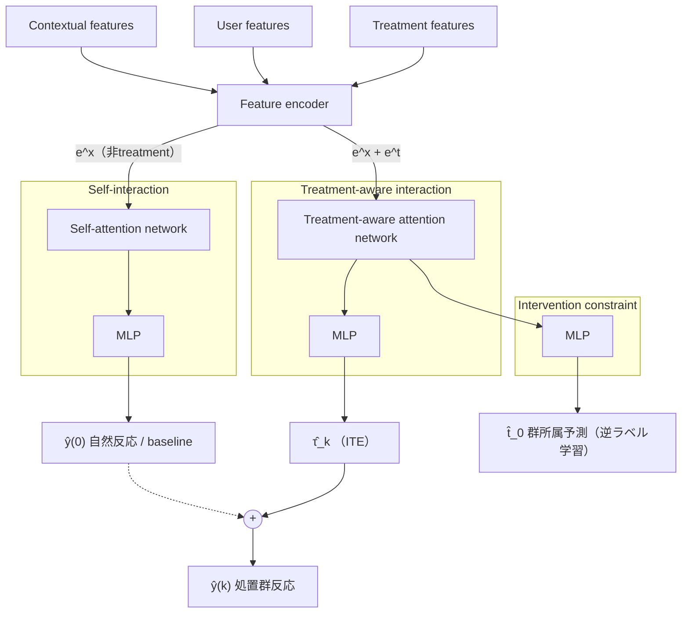

# EFIN: Explicit Feature Interaction-aware Uplift Network for Online Marketing

- **Link**: https://arxiv.org/abs/2306.00315
- **Authors**: Dugang Liu, Xing Tang, Han Gao, Fuyuan Lyu, Xiuqiang He
- **Year**: 2023
- **Venue**: Proceedings of the 29th ACM SIGKDD Conference on Knowledge Discovery and Data Mining (KDD '23), Applied Data Science Track（DOI: 10.1145/3580305.3599820）
- **Type**: 論文（応用データサイエンス実応用論文、Tencent FiT）
- **Code**: https://github.com/dgliu/KDD23_EFIN （PyTorch 1.13.1、Optuna によるハイパラ探索）

---

## Abstract (English)

As a key component in online marketing, uplift modeling aims to accurately capture the degree to which different treatments motivate different users, such as coupons or discounts, also known as the estimation of individual treatment effect (ITE). In an actual business scenario, the options for treatment may be numerous and complex, and there may be correlations between different treatments. In addition, each marketing instance may also have rich user and contextual features. However, existing methods still fall short in both fully exploiting treatment information and mining features that are sensitive to a particular treatment. In this paper, we propose an explicit feature interaction-aware uplift network (EFIN) to address these two problems. Our EFIN includes four customized modules: 1) a feature encoding module encodes not only the user and contextual features, but also the treatment features; 2) a self-interaction module aims to accurately model the user's natural response with all but the treatment features; 3) a treatment-aware interaction module accurately models the degree to which a particular treatment motivates a user through interactions between the treatment features and other features, i.e., ITE; and 4) an intervention constraint module is used to balance the ITE distribution of users between the control and treatment groups so that the model would still achieve accurate uplift ranking on data collected from a non-random intervention marketing scenario. We conduct extensive experiments on two public datasets and one product dataset to verify the effectiveness of our EFIN. In addition, our EFIN has been deployed in a credit card bill payment scenario of a large online financial platform with a significant improvement.

## Abstract (日本語)

Uplift モデリングはオンラインマーケティングの中核構成要素であり、クーポンや割引といった異なる treatment（施策）が異なるユーザーをどの程度動機づけるか、すなわち個別処置効果（ITE: Individual Treatment Effect）を正確に捉えることを目的とする。実ビジネスでは treatment の選択肢は多数かつ複雑で、異なる treatment 間に相関が存在し得る。加えて各マーケティングインスタンスは豊富なユーザー特徴・コンテキスト特徴を持つ。しかし既存手法は、(1) treatment 情報の完全な活用、(2) 特定 treatment に感応的な特徴の発掘、の両面で不十分である。本論文はこの 2 課題に対処する明示的特徴交互作用考慮型 uplift ネットワーク EFIN を提案する。EFIN は 4 つのカスタムモジュールから成る: (1) ユーザー・コンテキスト特徴に加えて treatment 特徴も符号化する feature encoding モジュール、(2) treatment 特徴を除いた特徴からユーザーの自然反応を正確にモデル化する self-interaction モジュール、(3) treatment 特徴と他特徴の交互作用を通じて特定 treatment がユーザーを動機づける度合い（ITE）を正確にモデル化する treatment-aware interaction モジュール、(4) 非ランダム介入で収集されたデータでも正確な uplift ランキングを実現するために処置群・対照群間の ITE 分布をバランスさせる intervention constraint モジュール。2 つの公開データセットと 1 つの製品データセットで有効性を検証し、さらに大規模オンライン金融プラットフォームのクレジットカード請求支払いシナリオに実導入して有意な改善を得た。

---

## Overview（概要）

EFIN は Tencent FiT（金融技術部門）が開発したニューラルネットワークベースの uplift モデルで、KDD 2023 の応用データサイエンストラックで発表された。従来の uplift 手法（メタ学習ベース、ツリーベース、ニューラルネットベース）が抱える 2 つの根本的欠陥、すなわち **treatment 情報の過小活用（underutilization of treatment features）** と **特徴交互作用の過小活用（underutilization of feature interactions）** に着目する。

多くの既存手法は treatment を単なるインデックス（1 次元の離散特徴）や分岐スイッチとしてしか扱わず、treatment 自体が持つ豊富な属性（例: クーポンの金額、最低利用額）や treatment 同士の相関（例: 1000 円クーポンと 900 円クーポンへの反応は近いはず）を捉えない。EFIN は treatment 特徴を非 treatment 特徴と同様に埋め込み、attention による明示的交互作用でこれらを活用する。これにより binary / multi-valued / continuous のいずれの treatment シナリオにもモデルサイズを大きく増やすことなく対応できる。

---

## Problem（課題）

- **treatment 情報の過小活用（underutilization of treatment features）**: 既存手法の多くは treatment を index（1 次元離散特徴）や分岐条件として扱うだけで、treatment が持つリッチな属性（クーポン金額・最低消費額など）や treatment 間の相関を明示的にモデル化しない。
- **特徴交互作用の過小活用（underutilization of feature interactions）**: treatment 特徴と非 treatment 特徴の交互作用を明示的にモデル化しないため、特定 treatment に感応的なユーザー特徴（sensitive features）を正確に捉えられない。
- **非ランダム介入バイアス（non-random intervention）**: 実マーケティングでは treatment の割り当てが非ランダムで、対照群と処置群の間に分布差（selection bias）が生じる。各群では 1 種類の反応しか観測できないため、この分布差が ITE 推定を困難にし精度を損なう。
- **観測不能な反実仮想**: 各インスタンスで $y_i(k)$ か $y_i(0)$ のどちらかしか観測できず、真の uplift $y_i(k) - y_i(0)$ が得られないという uplift モデリング固有の課題。
- **treatment シナリオの多様性**: 実務では treatment が binary だけでなく multi-valued（複数種のクーポン）や continuous（金額）にもなり得るため、モデルサイズを膨張させずにこれらへ対応する必要がある。

---

## Proposed Method（提案手法）

### Core idea（中心的アイデア）

treatment 特徴 $t_i$ を非 treatment 特徴 $x_i$ と同様に明示的に埋め込み、(A) treatment を除いた特徴による self-attention でユーザーの自然反応 $\hat{y}_i(0)$（対照群反応、baseline）を推定し、(B) treatment 特徴と非 treatment 特徴の treatment-aware attention で ITE $\hat{\tau}_k(x_i)$ を推定する。処置群の反応は $\hat{y}_i(k) = \hat{y}_i(0) + \hat{\tau}_k(x_i)$ として合成する。非ランダム介入の分布差は intervention constraint モジュールで補正する。

### Numbered steps（手順）

1. **Feature Encoding**: 非 treatment 特徴 $x_i$ と treatment 特徴 $t_i$ を別々に符号化し、埋め込み表現 $e^x$ と $e^t$ を得る。連続特徴は重み行列＋バイアスで、スパース特徴は埋め込みテーブルの lookup で符号化する。
2. **Self-interaction**: $e^x$（treatment を含まない）を self-attention ネットワーク＋MLP に通し、対照群での自然反応 $\hat{y}_i(0)$ を推定する。教師あり損失 $\mathcal{L}_S$ で学習。
3. **Treatment-aware interaction**: $e^x$ と $e^t$ を treatment-aware attention ネットワークに通して交互作用を捉え、非 treatment 特徴の treatment 感応度を attention 重みで表現し、ITE $\hat{\tau}_k(x_i)$ を推定する。処置群反応 $\hat{y}_i(k) = \hat{y}_i(0) + \hat{\tau}_k(x_i)$ を合成し、損失 $\mathcal{L}_T$ で学習。
4. **Intervention constraint**: 交互作用後の表現 $e^{xt}$ から所属群 $\hat{t}_{i0}$ を予測し、逆ラベルで摂動を与えて群間の ITE 分布をバランスさせる（損失 $\mathcal{L}_C$）。
5. **Inference**: 推論時は treatment-aware interaction モジュールのみを用いて ITE を直接計算し、ランキング・意思決定を行う。

### Key Formulas

**ITE の定義（Neyman-Rubin potential outcome）**:

$$\tau_k(x_i) = \mathbb{E}[y_i(k) - y_i(0) \mid x_i] = \mathbb{E}[y_i(k) \mid t_{i0}=k, x_i] - \mathbb{E}[y_i(0) \mid t_{i0}=0, x_i]$$

**全体最適化目的（式 2）**:

$$\min_{\theta} \; \mathcal{L}_{EFIN} = \mathcal{L}_S + \mathcal{L}_T + \mathcal{L}_C + \lambda \|\theta\|$$

ここで $\lambda$ はトレードオフパラメータ、$\|\theta\|$ は正則化項。

**Feature encoding（式 3）** — 連続特徴とスパース特徴の符号化:

$$
e^t_{ij} =
\begin{cases}
\mathbf{W}_j * t_{ij} + \mathbf{b}_j, & t_{ij} \text{ が連続特徴の場合} \\
\text{lookup}(\mathbf{E}_j, e_{ij}), & t_{ij} \text{ がスパース特徴の場合}
\end{cases}
$$

**Self-interaction module（式 4〜7）** — self-attention による自然反応推定:

$$Q = K = V = \left(e^x_{i0}; e^x_{i1}; \ldots; e^x_{i2}; \ldots; e^x_{id_x}\right)$$

$$\bar{e}^x_i = \text{softmax}\!\left(\frac{QK^T}{\sqrt{K_d}}\right) V$$

$$\hat{y}_i(0) = \mathbf{W}_s * \text{concat}(\bar{e}^x_i) + \mathbf{b}_s$$

$$\mathcal{L}_S = \mathcal{L}(\hat{y}_i(0), y_i(0))$$

ここで $K_d$ は出力埋め込みの次元。$\mathcal{L}_S$ は対照群インスタンスに対する教師あり損失。

**Treatment-aware interaction module（式 8〜12）** — treatment-aware attention による ITE 推定:

$$\alpha^i_j = \text{Softmax}\!\left(\mathbf{W}_{t0}^T \, \text{Relu}\!\left(\mathbf{W}_{t1} e^t_i + \mathbf{W}_{t2} e^x_{ij} + \mathbf{b}_{t2}\right)\right)$$

$$e^{xt}_i = \sum_{j=1}^{d_x} \alpha^i_j \, e^x_{ij}$$

$$\hat{\tau}_k(x_i) = \mathbf{W}_{t3} * e^{xt}_i + \mathbf{b}_{t3}$$

$$\hat{y}_i(k) = \hat{y}_i(0) + \hat{\tau}_k(x_i)$$

$$\mathcal{L}_T = \mathcal{L}(\hat{y}_i(k), y_i(k))$$

attention 重み $\alpha^i_j$ が「非 treatment 特徴 $j$ が当該 treatment に対してどれだけ感応的か」を表す。

**Intervention constraint module（式 13〜14）** — 群所属予測による分布バランス:

$$\hat{t}_{i0} = \mathbf{W}_c * e^{xt}_i + \mathbf{b}_c$$

$$\mathcal{L}_C = \mathcal{L}(\hat{t}_{i0}, \bar{t}_{i0})$$

binary treatment では $\bar{t}_{i0}$ は反転ラベル（opposite label）。multi-valued では 0-1 マスクベクトルを生成してラベルを反転させる。逆ラベルで学習することで群間の ITE 分布に類似性を持たせ、非ランダム介入下でのランキング精度を保つ。

---

## Algorithm（擬似コード）

```
入力: 訓練集合 {(x_i, t_i, y_i)}, 学習率 lr, 損失重み λ, 埋め込み次元 rank
出力: 学習済み EFIN パラメータ θ

for epoch in 1..max_iterations(=20):          # AdamW, early stopping patience=5
  for 各ミニバッチ (x, t, y):
    # 1) Feature encoding
    e^x = Encode(x)                            # 非 treatment 特徴（式3）
    e^t = Encode(t)                            # treatment 特徴（式3）

    # 2) Self-interaction（自然反応, 対照群 baseline）
    ē^x = SelfAttention(e^x)                   # 式4,5
    ŷ(0) = MLP_s(ē^x)                          # 式6
    L_S  = Loss(ŷ(0), y(0))                    # 式7（対照群インスタンス）

    # 3) Treatment-aware interaction（ITE）
    α    = TreatmentAwareAttention(e^x, e^t)   # 式8
    e^xt = Σ_j α_j · e^x_j                      # 式9
    τ̂_k = MLP_τ(e^xt)                          # 式10
    ŷ(k) = ŷ(0) + τ̂_k                          # 式11
    L_T  = Loss(ŷ(k), y(k))                    # 式12

    # 4) Intervention constraint（群分布バランス）
    t̂_0 = MLP_c(e^xt)                          # 式13
    L_C  = Loss(t̂_0, t̄_0)                      # 式14（逆ラベル t̄_0）

    # 5) 統合更新
    L = L_S + L_T + L_C + λ·‖θ‖                 # 式2
    θ ← θ - lr · ∇_θ L

# 推論: treatment-aware interaction のみで ITE = τ̂_k を直接計算し
#       uplift ランキング・意思決定を実施
```

---

## Architecture / Process Flow

4 モジュール（feature encoding / self-interaction / treatment-aware interaction / intervention constraint）の構成（Figure 2 に対応）:



損失: $\mathcal{L}_S$（self-interaction）＋ $\mathcal{L}_T$（treatment-aware interaction）＋ $\mathcal{L}_C$（intervention constraint）＋ $\lambda\|\theta\|$。推論時は treatment-aware interaction 経路のみで ITE を算出。

---

## Figures & Tables

### Table 1: 公開データセット統計

| Dataset                         | CRITEO-UPLIFT | EC-LIFT     |
|---------------------------------|---------------|-------------|
| Size                            | 13,979,592    | 196,084,380 |
| Ratio of Treatment to Control   | 5.67:1        | 3.11:1      |
| Average Visit Ratio             | 4.70%         | 3.25%       |
| Relative Average Uplift         | 27.07%        | 464.46%     |
| Average Uplift                  | 1.03%         | 3.56%       |
| Conversion Target               | Visit         | Visit       |

- CRITEO-UPLIFT: Criteo AI Labs 公開、大規模広告シナリオ、約 1,400 万インスタンス、連続特徴 12・binary treatment。
- EC-LIFT: Alimama 公開、大規模広告シナリオ、離散特徴 25・multi-valued 特徴 9・binary treatment（原データから約 40% を抽出して使用）。
- いずれも 8:2 で train/test 分割。

### Table 2: ハイパーパラメータ探索範囲（Optuna）

| Name | Range | Functionality |
|------|-------|---------------|
| rank | {2^5, 2^6, 2^7} | 埋め込み次元 |
| bs | {2^8, 2^9, 2^10, 2^11} | バッチサイズ |
| lr | {1e-4, 1e-3, 1e-2, 1e-1} | 学習率 |
| λ | {1e-5, 1e-4, 1e-3, 1e-2, 1e-1} | 損失重み |

### Table 3: 2 公開データセットでの主要結果（太字=最良、下線=次点、* は p ≤ 0.05 の有意差）

| Method | CRITEO LIFT@30 | CRITEO QINI | CRITEO AUUC | CRITEO WAU | EC-LIFT LIFT@30 | EC-LIFT QINI | EC-LIFT AUUC | EC-LIFT WAU |
|-----------|--------|--------|--------|--------|--------|--------|--------|--------|
| S-Learner | 0.0328 | 0.0857 | 0.0332 | 0.0092 | 0.0080 | 0.0414 | 0.0073 | 0.0031 |
| T-Learner | 0.0425 | 0.1083 | 0.0430 | 0.0093 | 0.0086 | 0.0440 | 0.0079 | 0.0032 |
| TarNet | 0.0339 | 0.1027 | 0.0406 | 0.0087 | 0.0081 | 0.0422 | 0.0076 | 0.0031 |
| CFRNet | 0.0379 | 0.1052 | 0.0414 | 0.0101 | 0.0087 | 0.0422 | 0.0078 | 0.0031 |
| DragonNet | 0.0464 | 0.1096 | 0.0437 | 0.0093 | 0.0096 | 0.0459 | 0.0092 | 0.0033 |
| GANITE | 0.0447 | 0.1170 | 0.0468 | 0.0101 | 0.0080 | 0.0409 | 0.0068 | 0.0029 |
| CEVAE | 0.0365 | 0.0951 | 0.0375 | 0.0106 | 0.0077 | 0.0373 | 0.0068 | 0.0031 |
| FlexTENet | 0.0448 | 0.1108 | 0.0441 | 0.0093 | 0.0084 | 0.0435 | 0.0078 | 0.0031 |
| SNet | 0.0442 | 0.1112 | 0.0442 | 0.0083 | 0.0084 | 0.0441 | 0.0079 | 0.0032 |
| EUEN | 0.0425 | 0.1153 | 0.0457 | 0.0108 | 0.0090 | 0.0446 | 0.0084 | 0.0033 |
| DESCN | 0.0456 | 0.1129 | 0.0455 | **0.0131*** | 0.0082 | 0.0435 | 0.0075 | 0.0034（下線） |
| **EFIN** | **0.0468*** | **0.1285*** | **0.0514*** | 0.0122（下線） | **0.0100*** | **0.0468*** | **0.0097*** | 0.0034 |

要点: EFIN は WAU（CRITEO で DESCN、EC-LIFT で同値）を除くほぼ全指標で最良。主要指標 QINI で顕著に改善（CRITEO 0.1285、EC-LIFT 0.0468）。

### Table 4: 製品データセット（クレジットカード返済、7 treatment）での結果

| Method | Average QINI | Average AUUC |
|-----------|--------|--------|
| S-Learner | 0.0155 | **0.0094*** |
| T-Learner | 0.0158（下線） | 0.0034 |
| TarNet | 0.0118 | 0.0001 |
| CFRNet | 0.0110 | 0.0066 |
| DragonNet | 0.0136 | 0.0004 |
| GANITE | 0.0101 | 0.0047 |
| CEVAE | -（未報告） | -（未報告） |
| FlexTENet | 0.0143 | 0.0076 |
| SNet | 0.0122 | 0.0064 |
| EUEN | 0.0088 | 0.0003 |
| DESCN | 0.0128 | 0.0003 |
| **EFIN** | **0.0172*** | 0.0085（下線） |

- 製品データ: FiT Tencent のオンラインクーポンマーケティング 2 週間分、200+ 特徴、200 万インスタンス（90% train）、multi-valued treatment（7 種）。
- baseline は元々 binary 用のため two-head を multi-head に拡張して評価。CEVAE は分布推定を multi-head へ直接拡張困難のため未報告。

### Table 5: CRITEO-UPLIFT でのアブレーション（各モジュール除去）

| 構成 | LIFT@30 | QINI | AUUC | WAU |
|------|---------|------|------|-----|
| w/o Self-Interactive Module | 0.0467 | 0.1266 | 0.0506 | 0.0104 |
| w/o Treatment-aware Interaction | **0.0484** | 0.1254 | 0.0501 | 0.0107 |
| w/o Intervention Constraint Module | 0.0442 | 0.1172 | 0.0465 | 0.0109 |
| **EFIN（full）** | 0.0468 | **0.1285** | **0.0514** | **0.0122** |

要点: いずれのモジュール除去でも主要指標（QINI/AUUC/WAU）が劣化し、各モジュールの有効性を確認。特に intervention constraint 除去で QINI が最も落ちる（0.1285 → 0.1172）。

### Table 6: オンラインデプロイ結果（クレジットカード支払いシナリオ、A/B テスト）

| Metrics | ROI | MAU |
|---------|-----|-----|
| Base (T-Learner + XGBoost) | 0.0% | 0.0% |
| **EFIN** | **+10%** | **+8%** |

- 数億ユーザー規模、1 か月間のオンライン実験。ROI（marketing return on investment）+10%、MAU（monthly active users）+8%。

### 図（本文中で確認したもの）

- Figure 1: ニューラルネットベース uplift 代表手法（S-Learner, TARNet, DragonNet, FlexTENet, T-Learner, CFRNet, EUEN, SNet, GANITE, CEVAE, DESCN）のアーキテクチャ比較図。
- Figure 2: EFIN のアーキテクチャ図（feature encoder → self-attention/treatment-aware attention → 各 MLP → ŷ(0), τ̂_k, ŷ(k), t̂_0）。
- Figure 3: intervention constraint モジュールの考え方（対照群 $(x, t_0=0)$ と処置群 $(x, t_0=1)$ の ITE 分布 $\tau'_k \sim D(\hat{y}_1 - \hat{y}_0)$ と $\tau^*_k$ を近づける）。
- Figure 4: クレジットカードシナリオの例示（現金クーポン、無利息クーポン、複数 treatment のスマホ画面）。
- Figure 5: FiT Tencent のプロモーションシステム全体図（Promoter platform ⇄ Uplift model EFIN、Apache Spark で特徴生成）。

（注: arXiv HTML 版が 404 のため画像 URL は取得できず。図の内容は PDF から直接確認した記述のみを記載し、外部画像 URL の埋め込みは行わない。）

---

## Experiments & Evaluation

### Setup（実験設定）

- **データセット**: 公開 2 件（CRITEO-UPLIFT, EC-LIFT）＋製品 1 件（FiT Tencent クレジットカード）。
- **評価指標**: LIFT@h（h=30, 第 h パーセンタイルでの uplift）、AUUC（normalized area under the uplift curve）、QINI（normalized area under the qini curve、**主要指標**）、WAU（weighted average uplift）。`scikit-uplift` で計算。
- **実装**: PyTorch 1.13.1、AdamW、最大反復 20、early stopping patience=5、ハイパラ探索は Optuna。
- **baseline**: S-Learner, T-Learner, TarNet, CFRNet, DragonNet, GANITE, CEVAE, SNet, FlexTENet, EUEN, DESCN（いずれもニューラルネットベース uplift の代表手法）。

### Main Results（主要結果、数値）

- **CRITEO-UPLIFT**: EFIN は QINI 0.1285、AUUC 0.0514、LIFT@30 0.0468 で最良（WAU のみ DESCN 0.0131 に次ぐ 0.0122）。次点の GANITE（QINI 0.1170）を大きく上回る。
- **EC-LIFT**: EFIN は LIFT@30 0.0100、QINI 0.0468、AUUC 0.0097 で最良（WAU 0.0034 は DESCN と同値）。高次元スパース特徴が多い設定でも明示的な treatment 特徴・特徴交互作用のモデル化により優位を維持。
- **製品データ（7 treatment）**: EFIN は Average QINI 0.0172 で最良（Average AUUC 0.0085 は S-Learner 0.0094 に次ぐ次点）。multi-valued treatment でも安定。共有アーキテクチャ型 baseline（TarNet 等）は「学習ショック」で性能ボトルネックが生じるのに対し、EFIN は各ユーザーの treatment 感応特徴を抽出可能。
- **オンライン**: ROI +10%、MAU +8%（対 Base = T-Learner + XGBoost）。

### Ablation（アブレーション）

Table 5 の通り、self-interaction / treatment-aware interaction / intervention constraint のいずれを除いても主要指標が劣化。full EFIN が QINI 0.1285・AUUC 0.0514・WAU 0.0122 で最良。intervention constraint 除去時の QINI 劣化（0.1172）が最大で、非ランダム介入補正の寄与が大きいことを示す（w/o treatment-aware interaction は LIFT@30 のみ 0.0484 とわずかに高いが他指標は劣化）。

---

## 本テーマへの適用可能性

**想定シナリオ**: データサイエンティストが、頻度の低いマーケティングキャンペーン（クーポン配布・メール送付など）を散発的に実施し、ユーザー単位の uplift/CATE を推定したい。各キャンペーンの観測データはスパースで、複数キャンペーンをまたいで共有・プールできる **base uplift estimator（基礎推定器）** が必要、という状況。

EFIN はこの用途に対して以下の点で有力な base 手法候補となる。

- **treatment を特徴として符号化するプーリング適性**: EFIN は treatment を分岐スイッチではなく埋め込み可能な特徴 $e^t$ として扱う。これにより「クーポン金額」「最低利用額」「配布チャネル」といったキャンペーン属性を treatment 特徴に含められ、**異なるキャンペーンを同一モデルにプール**して学習できる。散発的で各々サンプルが少ないキャンペーンでも、treatment 特徴を共有次元に埋め込むことで統計的強度を借用（borrow strength）でき、キャンペーンごとに個別モデルを組む必要がない。binary/multi-valued/continuous treatment を統一的に扱える設計（7 treatment の製品データで実証）は、多様なキャンペーンをまたぐプーリングにそのまま適合する。
- **観測データの treatment バイアス対処**: 実マーケティングでは施策対象の割り当てが非ランダム（例: 過去に反応が良かったセグメントに偏って配布）で、対照群・処置群に分布差が生じる。EFIN の **intervention constraint モジュール**は逆ラベル学習で群所属を予測し群間 ITE 分布をバランスさせるため、観測（observational）データ上でも uplift ランキング精度を保てる。アブレーションで本モジュール除去時の QINI 劣化が最大だったことから、この selection bias 補正が実データ適用の要となる。
- **base estimator としての位置づけ**: EFIN は self-interaction で baseline 反応 $\hat{y}(0)$ を、treatment-aware interaction で ITE $\hat{\tau}_k$ を分離推定し、$\hat{y}(k)=\hat{y}(0)+\hat{\tau}_k$ と合成する。この分離構造により、**共通の baseline（自然反応）表現を複数キャンペーン間で共有**しつつ、キャンペーン固有の効果を treatment-aware attention で上乗せする、という pooled/shared 推定に自然に対応する。個別キャンペーンでは、この共有 base 推定器の上に少数の追加パラメータ（treatment 埋め込み・attention）だけを当てるファインチューニングや、複数キャンペーンの同時学習が可能。
- **感応特徴の解釈性**: treatment-aware attention の重み $\alpha^i_j$ が「どのユーザー特徴が当該キャンペーンに感応的か」を示すため、スパースなキャンペーンでも「誰にどのクーポンが効くか」の解釈的知見を得やすく、ターゲティング設計にフィードバックできる。

**留意点**: EFIN は 8 GPU 分散学習・数百万〜数億インスタンス規模での運用を前提とした実装であり、小規模・散発キャンペーンにそのまま適用する場合はモデル容量・正則化・early stopping の調整が必要。また ITE ラベルは観測できないため、評価は QINI/AUUC 等のランキング指標に依存する点は他の uplift 手法と共通。

---

## Notes

- **Venue**: KDD '23 Applied Data Science Track（DOI: 10.1145/3580305.3599820）。第一著者 Dugang Liu は Tencent FiT でのインターン中に本研究を実施（脚注に明記）。
- **公開コード**: https://github.com/dgliu/KDD23_EFIN （Python 3.8.5 / PyTorch 1.13.1+cu117 / Optuna 2.10.0、8 GPU 分散学習）。CRITEO データは容量の都合でリポジトリ非同梱、`get_criteo.py` で前処理。
- **主要指標は QINI**。ハイパラ探索も QINI を第一指標として実施。
- arXiv HTML 版（`/html/2306.00315`）は 404 で利用不可のため、本レポートの数値・数式・図の記述はすべて arXiv PDF（v1, 2023-06-01）から直接確認した内容に基づく。外部画像 URL は確認できなかったため埋め込んでいない。
- **EC-LIFT** データセットは本文脈での CRITEO-UPLIFT v2 相当の第 2 公開データセット（Alimama 提供）。指示にあった「CRITEO-UPLIFT v2」という名称は本論文には登場せず、公開データセットは CRITEO-UPLIFT と EC-LIFT の 2 件。
- 製品データの treatment 数は 7（現金クーポン、無利息クーポンなど、請求金額の制約に応じたクーポン種）。
- 記載されていない指標・値については本文中に存在しないため補完していない。
