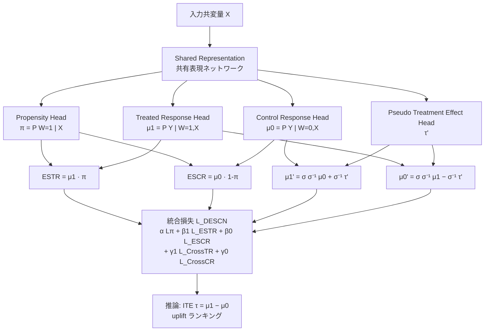

# DESCN: Deep Entire Space Cross Networks for Individual Treatment Effect Estimation

- **Link**: https://arxiv.org/abs/2207.09920
- **Authors**: Kailiang Zhong, Fengtong Xiao, Yan Ren, Yaorong Liang, Wenqing Yao, Xiaofeng Yang, Ling Cen
- **Year**: 2022
- **Venue**: KDD '22（Proceedings of the 28th ACM SIGKDD Conference on Knowledge Discovery and Data Mining, Applied Data Science Track, 2022年8月14〜18日, Washington DC）
- **Type**: 学術論文（査読付き国際会議）／産業応用（Alibaba・Lazada の e-commerce プラットフォーム由来）
- **Code**: https://github.com/kailiang-zhong/DESCN

---

## Abstract (English)

Effective decision-making in fields such as personalized incentive/marketing relies on accurate Individual Treatment Effect (ITE) estimation. Conventional ITE estimators that model treated and control responses separately suffer from two problems: (1) a *treatment bias* caused by the divergent distributions between the treated and control groups, and (2) a *sample imbalance* problem, since in real-world applications the treated group is often much smaller than the control group. To address these issues, the authors propose the Deep Entire Space Cross Networks (DESCN) to model the treatment effects from an end-to-end perspective. DESCN captures the integrated information of the treatment propensity, the response, and the hidden treatment effect through a cross network in a multi-task learning manner. The method jointly learns the treatment and response functions over the *entire sample space* to avoid treatment bias, and employs an intermediate *pseudo treatment effect* prediction network to relieve sample imbalance. Extensive experiments on a synthetic dataset and a large-scale production dataset from an e-commerce voucher distribution business demonstrate that DESCN consistently outperforms state-of-the-art ITE estimation methods in both prediction accuracy and uplift ranking performance.

## Abstract (日本語)

パーソナライズドインセンティブ／マーケティングのような分野で有効な意思決定を行うには、Individual Treatment Effect（ITE, 個体処置効果）の正確な推定が不可欠である。処置群（treated）と対照群（control）のレスポンスを別々にモデル化する従来の ITE 推定手法には、(1) 処置群と対照群の分布が乖離することで生じる *treatment bias（処置バイアス）* と、(2) 実世界では処置群が対照群より大幅に少ないために生じる *sample imbalance（サンプル不均衡）* という 2 つの問題がある。これらに対処するため、本論文は end-to-end の観点から処置効果をモデル化する Deep Entire Space Cross Networks（DESCN）を提案する。DESCN は cross network をマルチタスク学習の枠組みで用い、treatment propensity（処置傾向スコア）・response（レスポンス）・隠れた treatment effect（処置効果）の統合情報を捉える。処置関数とレスポンス関数を *entire sample space（全サンプル空間）* 上で同時に学習することで treatment bias を回避し、中間的な *pseudo treatment effect（擬似処置効果）* 予測ネットワークを用いて sample imbalance を緩和する。合成データセットと e-commerce のバウチャー配布業務から得た大規模な本番データセットでの広範な実験により、DESCN は予測精度と uplift ランキング性能の双方で最先端の ITE 推定手法を一貫して上回ることが示された。

---

## Overview（概要）

DESCN は、クーポン／バウチャー配布などのターゲティング施策における「誰に介入すると効果が最大化されるか」を推定する ITE（＝CATE / uplift）推定モデルである。中核となるアイデアは 2 つある。

1. **Entire Space Network（ESN）**: 処置群・対照群でそれぞれ別モデルを学習するのではなく、propensity（処置傾向 π）を明示的にモデル化し、`P(Y, W|X)` の同時確率として *全サンプル空間* 上で学習する。これにより処置群だけ・対照群だけの限定空間で学習することによる treatment bias（選択バイアス）を緩和する。
2. **X-Network（Cross Network）**: 擬似処置効果 `τ'`（pseudo treatment effect, PTE）を中間変数として導入し、logit 空間で treated / control のレスポンスを相互に「クロス」させて再構成する。これにより少数派の処置群サンプルからの学習信号を対照群側にも伝播させ、sample imbalance を緩和する。

この 2 つを共有表現（shared representation）上で統合したものが DESCN であり、propensity・response・treatment effect をマルチタスクで同時最適化する。ITE 推定タスク（causal inference）を、レコメンド分野で ESMM（Entire Space Multi-task Model, CTR/CVR 推定）が採った「全サンプル空間モデリング」の発想と橋渡しした点に新規性がある。

---

## Problem（課題）

従来の ITE / uplift 推定手法（two-model / meta-learner / TARNet 系）が抱える主要課題は次の通り。

- **Treatment bias（処置バイアス）**: 観察データでは処置割当がランダムでないため、処置群 `X|W=1` と対照群 `X|W=0` の共変量分布が乖離する。処置群のみ・対照群のみの部分空間で response 関数を学習すると、その部分空間に過適合し、全空間へ外挿したときにバイアスが生じる。
- **Sample imbalance（サンプル不均衡）**: 実運用では処置群が対照群より圧倒的に少ない（本論文の本番データでは処置 0.92M に対し対照 3.25M）。処置群レスポンス関数 `μ₁` は少数サンプルからしか学習できず、推定が不安定になる。
- **正例（コンバージョン）の希少性**: バウチャー業務では正例率が低い（本番学習データで 2.0%）。treatment × 正例の交差セルはさらに希薄で、処置効果の信号が埋もれる。
- **効果の直接観測不可能性（causal inference の根本問題）**: 各個体で処置・非処置の一方の結果しか観測できないため、真の ITE は学習ラベルとして与えられない。モデル構造・損失設計で間接的に効果を捉える必要がある。

---

## Proposed Method（提案手法）

### コアアイデア

DESCN は「propensity（π）× response（μ）」の同時確率を全空間で学習する ESN と、擬似処置効果 τ' を介して treated / control レスポンスを相互再構成する X-Network を、共有表現ネットワーク上で統合し、マルチタスク損失で end-to-end 学習する。

### 手順（numbered steps）

1. **共有表現の抽出**: 入力共変量 `X` を共有の表現ネットワーク（shared bottom）に通し、下流の各ヘッドで共通利用する潜在表現を得る。
2. **Propensity ヘッド（π）**: `P(W=1|X)=π` を推定するヘッドを設ける。処置割当（W）をラベルに学習する（`L_π`）。
3. **Response ヘッド（μ₁, μ₀）**: treated response `μ₁ = P(Y|W=1,X)` と control response `μ₀ = P(Y|W=0,X)` を推定する 2 ヘッドを設ける。
4. **Entire Space モデリング（ESN）**: 観測可能な同時確率 `P(Y,W=1|X)=μ₁·π`（ESTR）と `P(Y,W=0|X)=μ₀·(1−π)`（ESCR）を構成し、これらを *全サンプルに対して* 学習する（`L_ESTR`, `L_ESCR`）。個々の μ を部分空間ではなく全空間の観測信号で間接的に学習することで treatment bias を緩和する。
5. **Pseudo Treatment Effect（PTE, τ'）ヘッド**: 擬似処置効果 `τ̂'` を出力する中間ネットワークを追加する。これが treated / control を橋渡しする「クロス」の要となる。
6. **X-Network（クロス再構成）**: logit 空間で τ' を用い、control response から treated response を、treated response から control response を相互再構成する（`μ₁'`, `μ₀'`）。少数派 treated の情報を control 側の勾配へ、その逆へと流し、sample imbalance を緩和する。
7. **マルチタスク統合損失で最適化**: propensity・ESTR・ESCR・クロス TR・クロス CR の各損失を重み付き和で結合し、end-to-end に同時最適化する。
8. **推論時の ITE 算出**: 学習済みモデルから各個体の `τ = μ₁ − μ₀`（あるいは τ' 経由の効果）を得て、uplift スコアとしてランキング／ターゲティングに用いる。

### Key Formulas

**Entire Space モデリング（同時確率の分解）**

$$
P(Y, W=1 \mid X) = P(Y \mid W=1, X)\cdot P(W=1 \mid X) = \mu_1 \cdot \pi \quad (\text{ESTR})
$$

$$
P(Y, W=0 \mid X) = P(Y \mid W=0, X)\cdot P(W=0 \mid X) = \mu_0 \cdot (1-\pi) \quad (\text{ESCR})
$$

**ESN 損失（全サンプル空間上）**

$$
\mathcal{L}_{\text{ESN}} = \alpha\,\mathcal{L}_{\pi} + \beta_1\,\mathcal{L}_{\text{ESTR}} + \beta_0\,\mathcal{L}_{\text{ESCR}}
$$

ここで `L_π` は propensity（処置割当 W）を学習し、`L_ESTR` / `L_ESCR` は上記同時確率を全サンプルに対して当てはめる。

**Pseudo Treatment Effect によるクロス再構成（logit 空間）**

$$
\mu_1' = \sigma\!\left(\sigma^{-1}(\hat\mu_0) + \sigma^{-1}(\hat\tau')\right) \quad (\text{Cross Treated Response})
$$

$$
\mu_0' = \sigma\!\left(\sigma^{-1}(\hat\mu_1) - \sigma^{-1}(\hat\tau')\right) \quad (\text{Cross Control Response})
$$

σ は sigmoid、σ⁻¹ は logit。logit 空間で加減算することで出力が `[0,1]` を超えず、数値的にも安定する。τ' が「treated と control の logit 差」として処置効果を表現する。

**X-Network の各損失項**

$$
\mathcal{L}_{\text{TR}} = \frac{1}{|T|}\sum_{i\in T} l\big(y_i, \hat\mu_1(x_i)\big), \qquad
\mathcal{L}_{\text{CR}} = \frac{1}{|C|}\sum_{i\in C} l\big(y_i, \hat\mu_0(x_i)\big)
$$

$$
\mathcal{L}_{\text{CrossTR}} = \frac{1}{|T|}\sum_{i\in T} l\big(y_i, \hat\mu_1'(x_i)\big), \qquad
\mathcal{L}_{\text{CrossCR}} = \frac{1}{|C|}\sum_{i\in C} l\big(y_i, \hat\mu_0'(x_i)\big)
$$

`T` は処置群、`C` は対照群、`l(·)` は損失（クロスエントロピー）。

**DESCN 統合損失**

$$
\mathcal{L}_{\text{DESCN}} = \alpha\,\mathcal{L}_{\pi} + \beta_1\,\mathcal{L}_{\text{ESTR}} + \beta_0\,\mathcal{L}_{\text{ESCR}} + \gamma_1\,\mathcal{L}_{\text{CrossTR}} + \gamma_0\,\mathcal{L}_{\text{CrossCR}}
$$

`α, β₁, β₀, γ₁, γ₀` はタスク間の重みハイパーパラメータ。

---

## Algorithm（擬似コード）

```text
入力: 学習データ D = {(x_i, w_i, y_i)}  （w: 処置割当 0/1, y: 結果 0/1）
       重み α, β1, β0, γ1, γ0, 学習率, エポック数
出力: 学習済み DESCN（π, μ1, μ0, τ' の各ヘッド）

1  for epoch = 1 .. E do
2    for 各ミニバッチ B ⊂ D do
3        h = SharedRepresentation(x)              # 共有表現
4        π  = PropensityHead(h)                    # P(W=1|x)
5        μ1 = TreatedResponseHead(h)               # P(y|W=1,x)
6        μ0 = ControlResponseHead(h)               # P(y|W=0,x)
7        τ' = PseudoTreatmentEffectHead(h)         # 擬似処置効果
8        # --- Entire Space モデリング（全サンプル）---
9        ESTR = μ1 * π                             # P(y,W=1|x)
10       ESCR = μ0 * (1-π)                         # P(y,W=0|x)
11       # --- X-Network クロス再構成（logit 空間）---
12       μ1' = sigmoid( logit(μ0) + logit(τ') )    # cross treated
13       μ0' = sigmoid( logit(μ1) - logit(τ') )    # cross control
14       # --- 損失計算 ---
15       L = α*Lπ(π, w)
16           + β1*L_ESTR(ESTR, [y & w==1]) + β0*L_ESCR(ESCR, [y & w==0])
17           + γ1*L_CrossTR(μ1', y | w==1) + γ0*L_CrossCR(μ0', y | w==0)
18       θ ← θ - lr * ∇θ L                          # 逆伝播・更新
19   end for
20 end for
21 # 推論: 各個体の ITE を τ = μ1(x) - μ0(x)（または τ' 経由）で算出し uplift としてランキング
```

---

## Architecture / Process Flow



- **ESN 部（Entire Space Network）**: `π`・`μ₁`・`μ₀` を掛け合わせて観測可能な同時確率 ESTR / ESCR を構成し、全サンプルで学習（treatment bias 緩和）。
- **X-Network 部**: `τ'`（PTE）を介して treated↔control を logit 空間でクロス再構成（sample imbalance 緩和）。
- **DESCN**: 上記 2 部を共有表現上で統合したマルチタスクモデル。

---

## Figures & Tables

### 図1: モデルアーキテクチャ（arXiv HTML より）


*Figure 1(a): Entire Space Network（ESN）。propensity ネットワーク π が TR / CR ネットワークと接続し、出力を π /(1−π) と掛けて ESTR / ESCR を構成する。*


*Figure 1(b): X-network。PTE（Pseudo Treatment Effect）ネットワーク層を追加し、treated / control レスポンス関数の間をクロス接続する。*


*Figure 1(c): Deep Entire Space Cross Networks（DESCN）。DESCN は ESN と X-network の統合である（共有表現学習上に両者を結合）。*

### 表A: 主要性能比較（Table 2, 抜粋・完全カラム）

Epilepsy（合成）は `√ε_PEHE`（小さいほど良）と `ε_ATE`（小さいほど良）、Production（本番）は `AUUC`（大きいほど良）と `ε_ATT`（小さいほど良）で評価。Impr は CFR_mmd 基準の改善率。

| Model | Epilepsy √ε_PEHE | Impr(CFR_mmd) | Epilepsy ε_ATE | Production AUUC | Impr(CFR_mmd) | Production ε_ATT |
|-------|------------------|---------------|----------------|-----------------|---------------|------------------|
| X-learner (NN) | 0.1556 ± 0.0018 | -15.8% | 0.0378 ± 0.0059 | 0.0234 ± 0.0035 | -27.9% | 0.0076 ± 0.0009 |
| Causal Forest | 0.1519 ± 0.0042 | -13.0% | 0.0663 ± 0.0086 | 0.0132 ± 0.0008 | -59.2% | 0.0123 ± 0.0003 |
| BART | 0.1387 ± 0.0004 | -3.2% | 0.0389 ± 0.0004 | 0.0222 ± 0.0003 | -31.5% | 0.0312 ± 0.0001 |
| TARNet | 0.1373 ± 0.0028 | -2.2% | 0.0405 ± 0.0091 | 0.0309 ± 0.0021 | -4.6% | 0.0106 ± 0.0016 |
| CFR_wass | 0.1363 ± 0.0031 | -1.4% | 0.0263 ± 0.0097 | 0.0261 ± 0.0002 | -19.4% | 0.0266 ± 0.0013 |
| **CFR_mmd（基準）** | **0.1344 ± 0.0027** | **0.0%** | **0.0305 ± 0.0069** | **0.0324 ± 0.0029** | **0.0%** | **0.0258 ± 0.0015** |
| X-network | 0.1289 ± 0.0026 | +4.1% | 0.0245 ± 0.0044 | 0.0324 ± 0.0016 | 0.0% | 0.0048 ± 0.0010 |
| **DESCN** | **0.1241 ± 0.0009** | **+7.6%** | **0.0058 ± 0.0014** | **0.0340 ± 0.0006** | **+4.9%** | **0.0039 ± 0.0007** |

> 注: Table 2 に QINI 係数のカラムは存在せず、本番データセットの uplift ランキング評価は AUUC を用いる（QINI: 記載なし）。

### 表B: ESN を既存手法に適用（Table 3, Epilepsy / √ε_PEHE）

| Model | √ε_PEHE | Improvement |
|-------|---------|-------------|
| TARNet | 0.1373 | — |
| ESN + TARNet | 0.1320 | +3.9% |
| CFR_mmd | 0.1363 | — |
| ESN + CFR_mmd | 0.1577 | -15.7% |

### 表C: ESN を既存手法に適用（Table 4, Production / AUUC）

| Model | AUUC | Improvement |
|-------|------|-------------|
| TARNet | 0.0309 | — |
| ESN + TARNet | 0.0340 | +10.0% |
| CFR_mmd | 0.0324 | — |
| ESN + CFR_mmd | 0.0331 | +2.1% |

### 表D: 手法比較サマリ（本レポートによる整理）

| 手法 | 全空間モデリング | 不均衡対策 | propensity 明示 | 代表的位置づけ |
|------|------------------|------------|-----------------|----------------|
| TARNet | なし（部分空間） | なし | なし | 共有表現 + 2 head の代表 |
| CFR (wass/mmd) | なし | 分布距離正則化 | なし | 表現バランシング（IPM）系 |
| DragonNet | なし | propensity head で調整 | あり | propensity 共同学習系（本論文の思想と近縁） |
| X-learner (NN) | なし | 段階的補正 | 補正で利用 | meta-learner 系 |
| EUEN / two-model 系 | なし | なし | なし | シンプルなベースライン系 |
| **X-network（本論文）** | 部分的 | PTE クロス | 併用 | DESCN の構成要素 |
| **DESCN（本論文）** | **あり（ESTR/ESCR）** | **PTE クロス再構成** | **あり（π head）** | **全空間 × クロスの統合** |

> 注: DragonNet / EUEN の具体的な数値は本論文 Table 2 には掲載されていない（記載なし）。上表の「代表的位置づけ」欄は本レポートによる分類であり、論文本文の主張ではない。

---

## Experiments & Evaluation

### Setup（実験設定）

- **Epilepsy（合成データ）**: 40k サンプル、178 共変量、正例率 50%。真の処置効果（ground truth）が既知のため `√ε_PEHE`（個体効果推定精度）と `ε_ATE`（平均処置効果誤差）を評価可能。
- **Production（本番データ）**: e-commerce のバウチャー配布業務由来。学習 4.17M（処置 0.92M / 対照 3.25M、正例率 2.0%）、テスト 0.91M（処置 0.47M / 対照 0.43M、正例率 3.5%）。**学習はバイアスありの観察データ、テストはランダム化割当**という現実的な設定。真の ITE は不明なため `AUUC`（uplift ランキング精度）と `ε_ATT`（処置群平均効果誤差）で評価。
- **評価指標**: `√ε_PEHE`（小さいほど良）、`ε_ATE`／`ε_ATT`（小さいほど良）、`AUUC`（大きいほど良）。
- **ベースライン**: X-learner (NN), Causal Forest, BART, TARNet, CFR_wass, CFR_mmd（基準）, および本論文の構成要素 X-network。

### Main Results（主要結果, 数値）

- **Epilepsy（PEHE）**: DESCN が `√ε_PEHE = 0.1241 ± 0.0009` で全手法中最良、CFR_mmd 基準に対し **+7.6%** 改善。次点は構成要素の X-network（0.1289, +4.1%）。
- **Epilepsy（ATE 誤差）**: DESCN が `ε_ATE = 0.0058 ± 0.0014` と他手法（CFR_mmd 0.0305, TARNet 0.0405 等）を桁違いに下回り、平均効果の推定誤差が極めて小さい。
- **Production（AUUC）**: DESCN が `AUUC = 0.0340 ± 0.0006` で最良、CFR_mmd 基準に対し **+4.9%**。標準誤差も最小（±0.0006）で安定。
- **Production（ATT 誤差）**: DESCN が `ε_ATT = 0.0039 ± 0.0007` で最小。CFR_mmd（0.0258）比で大幅に改善。X-network も 0.0048 と良好で、クロス構造が ATT 推定に効く。

### Ablation（アブレーション）

- **X-network 単体 vs DESCN**: X-network 単体でも CFR_mmd を上回る（PEHE +4.1%, AUUC 同等, ATT 0.0048）。ここに ESN（全空間モデリング）を統合した DESCN が全指標でさらに改善し、**ESN と X-network が相補的**であることを示す。
- **ESN の他手法への転用（Table 3/4）**: ESN を TARNet に付加すると Epilepsy PEHE +3.9%、Production AUUC +10.0% と一貫改善。一方 CFR_mmd に付加すると Epilepsy では -15.7% と悪化、Production では +2.1% と限定的。ESN による全空間モデリングは TARNet 系との相性が良い一方、CFR の分布バランシング正則化とは干渉し得ることが示唆される。

---

## 本テーマへの適用可能性

想定シナリオ: データサイエンティストが、クーポン配布・メール送付といった**低頻度・単発のマーケティング施策**を運用しており、各施策で「どのユーザーに介入すると効果が最大化されるか」を per-user の uplift（CATE）で見積もりたい。ただし各施策単体では処置サンプルが少なく（施策が稀）、正例（コンバージョン）も希薄で、施策ごとに独立したモデルを組むと推定が不安定になる。そこで**複数施策をプールした共有ベース推定器（base estimator）**として堅牢な uplift 推定を行いたい、という要件。

DESCN がこの要件に適合する理由は以下の通り。

- **Entire-space モデリングが treatment bias に強い**: 単発施策では介入対象が非ランダムに選ばれがちで、処置群と対照群の共変量分布が乖離する。DESCN は propensity π を明示的にモデル化し、`μ₁·π` / `μ₀·(1−π)` を*全サンプル空間*で学習するため、処置群だけの偏った部分空間に過適合せず、外挿バイアスを抑えられる。本番データ（バイアスあり学習・ランダム化テスト）で最良の AUUC / ε_ATT を出したことは、まさにこの pooled・sparse 設定への頑健性を裏付ける。
- **PTE クロス構造が sample sparsity を緩和**: 稀な施策では処置サンプルが少なく、treated response `μ₁` の学習信号が細い。DESCN は擬似処置効果 τ' を介して control 側の豊富なサンプルの情報を treated 側へ（およびその逆へ）logit 空間で流すため、少数派サンプルからでも効果推定が安定する。複数施策をプールする際、対照群は施策横断で共有・大量化しやすく、この構造の恩恵が大きい。
- **共有ベース推定器としての運用**: 施策ごとに独立モデルを持つのではなく、DESCN を「共有ベース uplift 推定器」として複数施策のデータをプールして学習し、施策種別（クーポン種別・チャネル等）を共変量 `X` や補助タスクとして与える設計が自然。共有表現ボトム＋マルチタスクヘッドという DESCN の構造は、まさに施策横断のプーリングと相性が良い。新規・低頻度施策でも、共有表現とクロス構造により cold-start 的な sparse 状況で妥当な per-user uplift を返せる。
- **ランキング用途への適合**: マーケ運用ではターゲット上位 X% を選ぶ運用が中心で、絶対値より順位精度（AUUC）が重要。DESCN は AUUC で最良かつ標準誤差最小であり、施策予算配分・ターゲット選定のベース推定器として実運用に向く。

留意点: ESN は TARNet 系との相性が良い一方 CFR の分布バランシングとは干渉し得る（Table 3）。プーリング時は施策間の分布差が大きすぎる場合、propensity 推定の質が全体性能を左右するため、施策種別を条件付ける設計と propensity のキャリブレーション検証を推奨する。二値アウトカム（コンバージョン有無）を前提とした logit クロス構造のため、連続アウトカム（購買金額等）へ適用する場合は損失・リンク関数の見直しが必要。

---

## Notes

- 本論文は KDD '22 Applied Data Science Track 採択。Alibaba / Lazada の e-commerce バウチャー配布業務が背景で、本番運用を想定した「バイアスあり学習・ランダム化テスト」評価が特徴。
- 公式実装は https://github.com/kailiang-zhong/DESCN で公開されている（本レポートは論文本文・arXiv HTML に基づく。コードの詳細実装は未検証）。
- ESMM（Entire Space Multi-task Model, レコメンドの CTR/CVR 推定）の「全サンプル空間モデリング」を causal inference（ITE 推定）へ橋渡しした点が着想上の核心。
- 数値はすべて arXiv HTML 版 Table 2/3/4 から転記。**QINI 係数は本論文 Table 2 に掲載なし（記載なし）**、uplift ランキング評価は AUUC を使用。**DragonNet・EUEN の具体的数値も Table 2 には掲載なし（記載なし）**。
- ハイパーパラメータ `α, β₁, β₀, γ₁, γ₀` の具体的な設定値は本レポート取得範囲では未確認（詳細は原論文・付録／実装を参照）。
