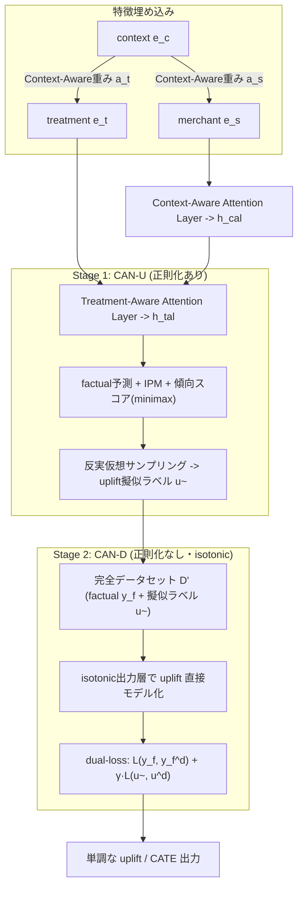

# TSCAN: Context-Aware Uplift Modeling via Two-Stage Training for Online Merchant Business Diagnosis

- **Link**: https://arxiv.org/abs/2504.18881 （HTML版: https://arxiv.org/html/2504.18881）
- **Authors**: Hangtao Zhang, Zhe Li, Kairui Zhang
- **Year**: 2025
- **Venue**: arXiv preprint（cs.LG, Machine Learning）／15 pages, 7 figures
- **Type**: Uplift / ITE（Individual Treatment Effect）モデリング論文（産業応用・実デプロイ報告を含む）

> **TSCAN の正式名称**: 論文アブストラクトの記述に従うと、TSCAN は「**Context-Aware uplift model based on the Two-Stage training approach**」（二段階学習に基づく文脈認識型 uplift モデル）の略。タイトル上は "Context-Aware Uplift Modeling via Two-Stage Training" と表現されている。サブモデルとして **CAN-U**（Stage 1）と **CAN-D**（Stage 2）を持つ。

---

## Abstract (English)

A primary challenge in ITE estimation is sample selection bias. Traditional approaches utilize treatment regularization techniques such as the Integral Probability Metrics (IPM), re-weighting, and propensity score modeling to mitigate this bias. However, these regularizations may introduce undesirable information loss and limit the performance of the model. Furthermore, treatment effects vary across different external contexts, and the existing methods are insufficient in fully interacting with and utilizing these contextual features. To address these issues, we propose a Context-Aware uplift model based on the Two-Stage training approach (TSCAN), comprising CAN-U and CAN-D sub-models. In the first stage, we train an uplift model, called CAN-U, which includes the treatment regularizations of IPM and propensity score prediction, to generate a complete dataset with counterfactual uplift labels. In the second stage, we train a model named CAN-D, which utilizes an isotonic output layer to directly model uplift effects, thereby eliminating the reliance on the regularization components. CAN-D adaptively corrects the errors estimated by CAN-U through reinforcing the factual samples, while avoiding the negative impacts associated with the aforementioned regularizations. Additionally, we introduce a Context-Aware Attention Layer throughout the two-stage process to manage the interactions between treatment, merchant, and contextual features, thereby modeling the varying treatment effect in different contexts. We conduct extensive experiments on two real-world datasets to validate the effectiveness of TSCAN. Ultimately, the deployment of our model for real-world merchant diagnosis on one of China's largest online food ordering platforms validates its practical utility and impact.

## Abstract (日本語)

ITE（個別処置効果）推定における主要な課題は「サンプル選択バイアス」である。従来手法は、Integral Probability Metrics（IPM）、re-weighting、傾向スコアモデリングといった処置正則化技術を用いてこのバイアスを緩和してきた。しかしこれらの正則化は望ましくない情報損失を招き、モデル性能を制限する恐れがある。さらに、処置効果は外部の文脈（context）に応じて変動するが、既存手法はこうした文脈特徴を十分に相互作用させ活用できていない。これらの問題に対処するため、本論文は二段階学習に基づく文脈認識型 uplift モデル **TSCAN** を提案する。TSCAN は **CAN-U** と **CAN-D** の二つのサブモデルから構成される。第一段階では、IPM と傾向スコア予測という処置正則化を含む uplift モデル **CAN-U** を学習し、反実仮想（counterfactual）の uplift ラベルを付与した完全なデータセットを生成する。第二段階では、isotonic（単調）出力層を用いて uplift 効果を直接モデル化する **CAN-D** を学習し、正則化要素への依存を排除する。CAN-D は事実（factual）サンプルを強化することで CAN-U の推定誤差を適応的に補正し、前述の正則化に伴う負の影響を回避する。加えて、処置・加盟店（merchant）・文脈の各特徴間の相互作用を管理する **Context-Aware Attention Layer** を二段階を通じて導入し、文脈ごとに異なる処置効果をモデル化する。二つの実世界データセットで有効性を検証し、最終的に中国最大級のオンラインフードデリバリープラットフォームでの実加盟店診断への展開により実用性と効果を確認した。

---

## Overview（概要）

TSCAN は、**連続処置・二値処置の双方を扱える uplift（ITE/CATE）推定モデル**であり、オンラインフードデリバリー（Ele.me 系と推定される「Eleshop」）における**加盟店ビジネス診断**を主眼に設計されている。中核となる着想は二つ:

1. **二段階学習（Two-Stage Training）による「正則化のトレードオフ」の分離**。従来の representation-based uplift モデル（TarNet / DragonNet / CFR 系）は、分布バイアスを抑えるための IPM や傾向スコア正則化を出力予測と同一の学習ループで最適化するため、バイアス抑制と予測精度が競合し情報損失が生じる。TSCAN はこれを Stage 1（CAN-U: 正則化ありで反実仮想ラベル生成）と Stage 2（CAN-D: 正則化なしで直接 uplift をモデル化・誤差補正）に**時間的に分離**する。

2. **文脈認識（Context-Aware）**。処置効果が外部文脈（時間帯・地域・需給などの context features）によって変動する点に着目し、**Context-Aware Attention Layer** と **Treatment-Aware Attention Layer** を導入して、treatment / merchant / context の三者間相互作用を明示的にモデル化する。

これにより、標準指標（QINI/AUUC）に加え、文脈ごとに層別評価する **CQINI / CAUUC** という新しい指標でも既存手法を上回ることを示している。

---

## Problem（課題）

- **サンプル選択バイアス（sample selection bias）**: 観測データでは処置割当が非ランダムであり、処置群・対照群の共変量分布が異なる。反実仮想アウトカムは観測できないため、素朴な学習ではバイアスが混入する。
- **正則化による情報損失**: IPM・re-weighting・傾向スコアといった処置正則化は分布差を抑える一方で、表現から有用な情報を削ぎ落とし、予測精度を犠牲にする（バイアス抑制と精度のトレードオフ）。
- **文脈依存の処置効果を捉えきれない**: 処置効果は外部 context（時間帯・地域・イベント等）で大きく変わるが、既存 uplift モデルは context 特徴と treatment/merchant 特徴との相互作用を十分に活用していない。
- **連続処置への対応**: 加盟店評価スコアのような連続処置（continuous treatment）に対し、単調性を保った uplift 出力を安定的に得る仕組みが不足している。
- **産業デプロイ要件**: 実プラットフォームでの加盟店診断に足る、文脈別に信頼できる uplift ランキングが必要。

---

## Proposed Method（提案手法）

### Core Idea（中核アイデア）

「バイアス抑制のための正則化」と「uplift の直接予測」を**同じ学習ループで両立させない**。まず Stage 1 の CAN-U が正則化つきで反実仮想 uplift ラベルを生成し、Stage 2 の CAN-D はそのラベルを教師に、正則化を外した状態で isotonic 出力層により uplift を直接モデル化しつつ、factual サンプルで CAN-U の誤差を補正する。二段階を通じて Context-Aware / Treatment-Aware Attention により文脈依存の効果を表現する。

### Numbered Steps

1. **特徴埋め込み**: merchant 特徴 $\mathbf{e}_s$、treatment 特徴 $\mathbf{e}_t$、context 特徴 $\mathbf{e}_c$ を埋め込む。
2. **Context-Aware 重み付け**: context を用いて merchant・treatment 埋め込みをゲート的に再重み付けする（下記数式 $a_s, a_t$）。
3. **Treatment-Aware Attention**: 文脈認識後の表現 $\mathbf{h}_{cal}$ と treatment 表現 $\mathbf{h}_t$ の相互作用を self-attention でモデル化。
4. **Stage 1 — CAN-U 学習**: IPM 損失 $\mathcal{L}_{IPM}$ と傾向スコア損失 $\mathcal{L}_\pi$ を含む minimax 目的で学習し、反実仮想サンプリングにより全サンプルへ uplift 擬似ラベルを付与。
5. **反実仮想ラベル生成**: 各サンプルに対し factual/counterfactual 出力を推定し、疑似 uplift ラベル $\tilde{u}$ を含む「完全データセット」を構成。
6. **Stage 2 — CAN-D 学習**: 正則化を外し、isotonic 出力層で uplift を直接出力。dual-loss（factual 再構成 + uplift 予測）で CAN-U の誤差を factual サンプルにより補正。
7. **予測**: CAN-D の isotonic 層から factual/counterfactual アウトカム、及びその差分である uplift を単調性を保って出力。

### Key Formulas

個別処置効果（ITE）の定義:

$$
\tau(X_i, k_1, k_0) = \mathbb{E}[y_i(k_1) - y_i(k_0)\mid X_i] = \mathbb{E}[y_i \mid t_i = k_1, X_i] - \mathbb{E}[y_i \mid t_i = k_0, X_i]
$$

Context-Aware 重み（merchant 側）:

$$
a_s = 1 + \sigma\!\big(\mathbf{W}_p[\mathbf{e}_s;\ \mathrm{MLP}(\mathrm{Flat}(\mathbf{e}_c))] + \mathbf{b}_p\big), \qquad \mathbf{h}_s = a_s \odot \mathbf{e}_s
$$

Context-Aware 重み（treatment 側）:

$$
a_t = 1 + \sigma\!\big(\mathbf{W}_t[\mathbf{e}_t;\ \mathrm{MLP}(\mathrm{Flat}(\mathbf{e}_c))] + \mathbf{b}_t\big), \qquad \mathbf{h}_t = a_t \odot \mathbf{e}_t
$$

Treatment-Aware Attention Gate:

$$
\alpha_{tal} = 1 + \sigma\!\big(\mathbf{W}_q[\mathbf{h}_{cal};\ \mathbf{h}_t] + \mathbf{b}_q\big), \qquad \mathbf{h}_{tal} = \mathrm{Self\text{-}Attn}\big([\alpha_{tal}\odot \mathbf{h}_{cal},\ \mathbf{h}_t]\big)
$$

IPM 損失（処置群・対照群の表現分布差を測る）:

$$
\mathcal{L}_{IPM} = \sup_{\|f\|_{\mathcal{H}_k}\le 1} \Big\{ \mathbb{E}_{x\sim p_{t\in T_0}}[f(x)] - \mathbb{E}_{x\sim p_{t\in T_1}}[f(x)] \Big\} = \big\| \mu(p_{t\in T_0}) - \mu(p_{t\in T_1}) \big\|_{\mathcal{H}_k}
$$

傾向スコア損失:

$$
\mathcal{L}_\pi = \sum_{i=1}^{n} \big(t_i - \pi(\hat t_i \mid \varphi(x_i))\big)^2
$$

Isotonic Encoding（連続処置 $t_i$ を単調な多段バイナリベクトルに離散化、$M$ は分割数）:

$$
\mathrm{IE}(t_i) = [\underbrace{1,\dots,1}_{k+1},\ \underbrace{0,\dots,0}_{M-k}],\quad k = \lfloor t_i \cdot M \rfloor
$$

isotonic 層による factual アウトカム予測と uplift 予測:

$$
\hat y_{i,f}^{\,d} = \sum_{k=0}^{k_f} v_{i,k},\ \ k_f = \lfloor t_f \cdot M \rfloor, \qquad \hat u_i^{\,d} = \sum_{k=k_f+1}^{k_{cf}} v_{i,k}
$$

Stage 1 の学習目的（bilevel minimax; 傾向スコアヘッド $\pi$ に対する敵対的最適化）:

$$
\min_\theta \max_\pi\ \big(\mathcal{L}_\theta - \lambda\,\mathcal{L}_\pi\big), \qquad \mathcal{L}_\theta = \mathcal{L}(\hat y_i, y_i) + \alpha\,\mathcal{L}_{IPM} + \beta\,\mathcal{R}(h)
$$

Stage 2 の dual-loss（factual 再構成 + 擬似 uplift ラベル $\tilde u$ 学習）:

$$
\mathcal{L}_d = \mathcal{L}(y_f, \hat y_f^{\,d}) + \gamma\,\mathcal{L}(\tilde u, \hat u^{\,d})
$$

---

## Algorithm（擬似コード）

> 論文には明示的な擬似コードブロックは記載なし。以下は本文の記述（Stage 1 → 反実仮想サンプリング → Stage 2）を擬似コード化した再構成である。

```text
入力: 観測データ D = {(x_i, t_i, y_i)}  （x = merchant特徴 ⊕ context特徴）
      分割数 M, ハイパーパラメータ λ, α, β, γ

# ---- Stage 1: CAN-U（正則化あり）----
for epoch in 1..E1:
    埋め込み e_s, e_t, e_c を計算
    Context-Aware 重み a_s, a_t を適用 → h_s, h_t
    Treatment-Aware Attention → h_tal
    factual アウトカム ŷ を予測
    L_θ = L(ŷ, y) + α·L_IPM + β·R(h)
    # 傾向スコアヘッド π に対する敵対的最適化
    θ ← θ を min、π ← π を max として  (L_θ − λ·L_π) を更新

# ---- 反実仮想ラベル生成 ----
for each sample i in D:
    counterfactual サンプリングで uplift 擬似ラベル ũ_i を推定
完全データセット D' = {(x_i, t_i, y_f, ũ_i)} を構成

# ---- Stage 2: CAN-D（正則化なし・isotonic 出力）----
for epoch in 1..E2:
    isotonic encoding IE(t_i) を適用
    factual 出力 ŷ_f^d, uplift 出力 û^d を isotonic 層から算出
    L_d = L(y_f, ŷ_f^d) + γ·L(ũ, û^d)   # factual 強化で CAN-U の誤差を補正
    パラメータを更新

# ---- 推論 ----
CAN-D の isotonic 層で任意 treatment 値に対する uplift を単調出力
```

---

## Architecture / Process Flow



---

## Figures & Tables

> 図の埋め込みは HTML 版で確認できた ``（相対パス）を絶対 URL 化して記載する。相対パスからの解決のため、実表示できない場合がある点に留意。

### Fig. 1: CAN-U と CAN-D のネットワーク構成


### Fig. 5: 二段階学習と反実仮想サンプリングの流れ


（黒実線＝学習フロー、青点線＝予測フロー）

### Table 2: 主要性能比較（2 データセット、値は論文記載の実数）

| Model | Eleshop-1M CQINI | Eleshop-1M QINI | Eleshop-1M CAUUC | Eleshop-1M AUUC | Shop Act. CQINI | Shop Act. QINI | Shop Act. CAUUC | Shop Act. AUUC |
|---|---|---|---|---|---|---|---|---|
| S-Learner | 0.1708 | 0.1836 | 0.6442 | 0.6649 | 0.0874 | 0.0828 | 0.5819 | 0.5800 |
| T-Learner | 0.2026 | 0.2163 | 0.6751 | 0.6871 | 0.0881 | 0.0842 | 0.6106 | 0.5955 |
| X-Learner | – | – | – | – | 0.0890 | 0.0886 | 0.6164 | 0.6068 |
| BART | 0.1236 | 0.1615 | 0.6242 | 0.6420 | 0.0914 | 0.0861 | 0.6196 | 0.6096 |
| Causal Forest | 0.1887 | 0.2014 | 0.6630 | 0.6785 | 0.0889 | 0.0873 | 0.6142 | 0.6030 |
| TarNet | 0.2323 | 0.2248 | 0.7142 | 0.7079 | 0.0936 | 0.0969 | 0.6335 | 0.6283 |
| DragonNet | 0.2470 | 0.2393 | 0.7266 | 0.7202 | 0.0930 | 0.0953 | 0.6329 | 0.6301 |
| TransTEE | 0.2652 | 0.2608 | 0.7533 | 0.7489 | 0.0919 | 0.0935 | 0.6270 | 0.6256 |
| EFIN | 0.2344 | 0.2267 | 0.7162 | 0.7107 | 0.0828 | 0.0837 | 0.5947 | 0.5949 |
| CFR-ISW | 0.2536 | 0.2489 | 0.7434 | 0.7388 | 0.0906 | 0.0925 | 0.6217 | 0.6167 |
| DESCN | 0.2581 | 0.2524 | 0.7489 | 0.7442 | 0.0938 | 0.0974 | 0.6325 | 0.6295 |
| **TSCAN** | **0.2839** | **0.2687** | **0.7686** | **0.7538** | **0.0994** | **0.1054** | **0.6379** | **0.6328** |

TSCAN が全 8 指標で最良。特に文脈別指標 CQINI（Eleshop-1M で 0.2839、次点 TransTEE 0.2652）での優位が大きい。

### Table 3: アブレーション（各構成要素の寄与）

| Variant | Eleshop-1M CQINI | Eleshop-1M QINI | Eleshop-1M CAUUC | Eleshop-1M AUUC | Shop Act. CQINI | Shop Act. QINI | Shop Act. CAUUC | Shop Act. AUUC |
|---|---|---|---|---|---|---|---|---|
| TSCAN-RC（context 除去） | 0.1737 | 0.1847 | 0.6536 | 0.6682 | 0.0865 | 0.0812 | 0.5812 | 0.5735 |
| TSCAN-RA（context-aware attention 除去） | 0.2526 | 0.2429 | 0.7380 | 0.7334 | 0.0939 | 0.0972 | 0.6234 | 0.6302 |
| TSCAN-RISO（isotonic 層除去） | 0.2602 | 0.2490 | 0.7452 | 0.7376 | 0.0933 | 0.0969 | 0.6227 | 0.6296 |
| CAN-U（Stage 1 のみ） | 0.2639 | 0.2536 | 0.7474 | 0.7430 | 0.0941 | 0.0977 | 0.6283 | 0.6309 |
| **TSCAN（CAN-D, 完全版）** | **0.2839** | **0.2687** | **0.7686** | **0.7538** | **0.0994** | **0.1054** | **0.6379** | **0.6328** |

context 除去（RC）の劣化が最も顕著で、文脈情報が本手法の核であることを示す。Stage 2（CAN-D）が Stage 1 単独（CAN-U）を明確に上回り、二段階補正の有効性を確認。

### Table 4: 実プラットフォーム A/B テスト（オンライン評価）

| Metrics | CAUUC | AUUC | Order Increase |
|---|---|---|---|
| Base (BART) | 0.6331 | 0.6370 | 0.00% |
| **TSCAN** | **0.6742** | **0.6719** | **+0.76%** |

注文増加 +0.76%（95% CI [0.68%, 0.84%]、p=0.001）。中国最大級のオンラインフードデリバリープラットフォームでの実加盟店診断に展開。

### （手法比較の位置づけ）

TSCAN は representation-based uplift（TarNet/DragonNet/CFR-ISW）や transformer 系（TransTEE/EFIN）、二値分解型（DESCN）といった学習系ベースラインを、単段学習ではなく「正則化を後段で切り離す二段構成 + isotonic 出力 + 文脈アテンション」で上回る。メタ学習系（S/T/X-Learner）や tree 系（BART/Causal Forest）に対しても全指標で優位。

---

## Experiments & Evaluation

### Setup（実験設定）

- **Eleshop-1M**: 計 100 万サンプル（train 80 万 / test 20 万）。**連続処置**（加盟店平均評価スコア）。merchant 特徴 42 + context 特徴 19 = 61 特徴。アウトカムは注文数（連続）。
- **Shop Activities**: 計 70 万サンプル（train 50 万 / test 20 万）。**二値処置**（「新規顧客クーポン」施策への参加有無）。merchant 特徴 48 + context 特徴 23 = 71 特徴。アウトカムは注文数（連続）。
- **評価指標**: QINI, AUUC（標準）に加え、文脈別に層別評価する **CQINI, CAUUC**（context-wise variants）、及び Gain Curve。
- **ハイパーパラメータ**: Stage 1 — 学習率 0.015、β₁=0.9, β₂=0.999、λ=0.5（敵対タスク重み）、α=0.01（IPM 損失）、β=1e-5（ℓ₂）。Stage 2 — 学習率 0.015、γ=0.6（uplift 予測損失重み）。

### Main Results（主要結果・実数）

- Table 2 の通り、TSCAN が **両データセット・全 8 指標で最良**。Eleshop-1M では CQINI 0.2839 / QINI 0.2687 / CAUUC 0.7686 / AUUC 0.7538。Shop Activities では CQINI 0.0994 / QINI 0.1054 / CAUUC 0.6379 / AUUC 0.6328。
- 特に文脈別指標での改善幅が大きく、Context-Aware 設計の効果が裏付けられる。

### Ablation（アブレーション）

- **TSCAN-RC（context 除去）** が最大の性能劣化（Eleshop-1M CQINI 0.2839 → 0.1737）。文脈特徴が中核。
- **TSCAN-RA / TSCAN-RISO** の劣化から、context-aware attention と isotonic 出力層それぞれの寄与も確認。
- **CAN-U（Stage 1 のみ, 0.2639）→ TSCAN（CAN-D, 0.2839）** の改善が、二段階の誤差補正の価値を示す。

### Online（オンライン）

- 実 A/B で BART ベースに対し CAUUC/AUUC が向上（0.6331→0.6742, 0.6370→0.6719）、注文数 +0.76%（p=0.001）。

---

## 本テーマへの適用可能性

**想定シナリオ**: データサイエンティストが、クーポン配布やメール配信などの**マーケティング施策を不定期に**（各施策のサンプルが疎な状態で）実施し、施策ごとのユーザー単位 uplift/CATE を推定したい。個々の施策データが少ないため、複数の疎な施策を横断して**プール/共有した base 推定器**を持ちたい、という要件。

TSCAN の貢献はこの要件と次の点で強く整合する:

- **二段階分離が「共有 base + 施策別補正」の設計テンプレになる**。Stage 1 の CAN-U を、複数施策のデータをプールして学習する**共有 base 推定器**として使い、反実仮想 uplift 擬似ラベルを全ユーザーに付与する。Stage 2 の CAN-D は、個別施策の factual サンプル（疎でよい）で誤差を補正する**軽量な施策別ヘッド**として機能させられる。疎な施策単体では推定が不安定でも、プールした CAN-U のラベルを起点にすることで少数 factual サンプルからの補正が安定化する。

- **Context-Aware Attention が「施策 ID / 施策文脈」を context として扱う枠組みを与える**。ここでの context を「配信チャネル・季節・キャンペーン種別・施策 ID」に対応づければ、**単一モデルで複数施策の異質な処置効果を共有表現から出し分ける**（context ごとに treatment/merchant 相互作用を再重み付けする）ことが可能。新規・低頻度の施策も、既存施策と表現を共有しつつ context だけで差別化できるため、cold-start に強い。

- **isotonic 出力層による連続処置対応**が、クーポン割引額・配信回数などの**連続的な施策強度**に対する単調な uplift を安定して返す。二値クーポン（Shop Activities）と連続スコア（Eleshop-1M）の両方で検証済みである点は、二値/連続が混在する施策ポートフォリオにそのまま適用しやすいことを意味する。

- **正則化を後段で外す構成が、疎データでの過度な情報損失を避ける**。施策サンプルが少ない状況では IPM/傾向スコア正則化の情報損失が相対的に痛い。CAN-D で正則化を切り離す設計は、疎な施策で精度を保ちたい本テーマに好適。

実装上の橋渡しとして、CAN-U を「全施策プールで日次/週次に再学習する共有 uplift base」、CAN-D を「新規キャンペーン投入時に少量 factual で微調整する薄いヘッド」に対応させる運用が現実的。context 次元にキャンペーン埋め込みを持たせることで、複数施策間の**転移（プーリング）と個別最適化（施策別補正）の両立**が図れる。

---

## Notes

- **TSCAN の略語表記に注意**: アブストラクト本文では「**Context-Aware uplift model based on the Two-Stage training approach**」と明記されている（本レポートはこれを正式名称として採用）。二次的な言い換えとして "Two-Stage Context-Aware uplift Network" と表現される場合もあるが、一次情報はアブストラクトの記述である。
- **擬似コード**は論文に明示ブロックとして記載なし。本レポートの Algorithm 節は本文記述からの再構成である。
- **図の埋め込み URL** は HTML 版の相対パス（`x1.png`〜`x9.png`）を絶対 URL 化したもの。Fig.2/3/4/6/7 の相対 src も確認できたが、代表として Fig.1・Fig.5 のみ本文に埋め込んだ。
- **X-Learner の Eleshop-1M 値**は表中で「–」（記載なし）。連続処置に X-Learner が非対応のためと推測されるが、論文中の明示的理由は本フェッチ範囲では確認できず（記載なし扱い）。
- **venue**: 現時点で arXiv preprint（cs.LG）。査読会議への採録有無は本調査範囲では未確認（記載なし）。
- プラットフォーム名は「中国最大級のオンラインフードデリバリー」とのみ記載。データセット名「Eleshop」から Ele.me 系と推測されるが、論文は明示していない。
