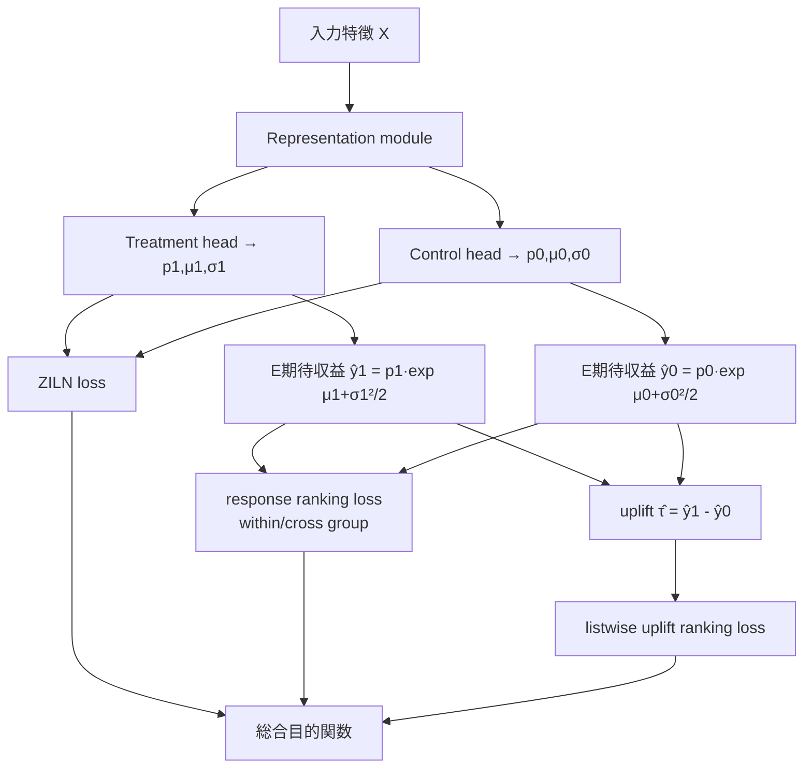

# Rankability-enhanced Revenue Uplift Modeling Framework for Online Marketing

- **Link**: https://arxiv.org/abs/2405.15301
- **Authors**: Bowei He, Yunpeng Weng, Xing Tang, Ziqiang Cui, Zexu Sun, Liang Chen, Xiuqiang He, Chen Ma
- **Year**: 2024
- **Venue**: KDD 2024 (Accepted)
- **Type**: 応用研究論文（産業応用 + 理論解析）／収益 uplift モデリング

---

## Abstract (English)

Revenue uplift modeling aims to estimate the incremental revenue that a marketing treatment (e.g., coupon, discount) generates for each individual, so that limited marketing budget can be allocated to the most revenue-sensitive users. Compared with conventional conversion (binary) uplift modeling, revenue uplift is directly connected to corporate income but is substantially harder because the response distribution is continuous and heavily long-tailed (zero-inflated with a few very large values). Existing methods that regress revenue with a standard MSE objective are poorly matched to this distribution and, more importantly, are not optimized for the *ranking* of individuals — which is what actually matters when a budget-constrained platform selects the top-k users to treat. This paper proposes a Rankability-enhanced Revenue Uplift Modeling framework that (1) adopts a zero-inflated lognormal (ZILN) loss to model the long-tailed revenue response, (2) derives tighter theoretical error bounds showing that ranking-oriented response losses upper-bound the uplift ranking error more tightly than MSE, and (3) introduces within-group / cross-group response ranking losses together with a listwise uplift ranking loss that directly optimizes the ordering of individuals by their estimated uplift. The framework is model-agnostic with respect to the base uplift architecture and is validated on public data and on Tencent FiT, a large fintech marketing platform serving hundreds of millions of users.

## Abstract (日本語)

収益 uplift モデリングは、マーケティング施策（クーポン、割引など）が各個人にもたらす増分収益を推定し、限られた予算を最も収益感応度の高いユーザーへ配分することを目的とする。従来のコンバージョン（二値）uplift モデリングと比べ、収益 uplift は企業収益と直接結びつく一方で難易度が高い。応答分布が連続かつロングテール（多数のゼロ + 少数の巨大値からなる zero-inflated 分布）だからである。収益を標準的な MSE で回帰する既存手法はこの分布に整合せず、さらに重要なことに、予算制約下で上位 k 人を選ぶ際に本質的に重要となる「個人のランキング」を最適化していない。本論文は Rankability を強化した収益 uplift モデリング枠組みを提案し、(1) ロングテール収益応答を zero-inflated lognormal (ZILN) 損失でモデル化し、(2) ランキング指向の応答損失が MSE より uplift ランキング誤差を厳しく上界するという理論誤差限界を導出し、(3) グループ内／グループ間の応答ランキング損失と、個人を uplift 推定値で並べ替える listwise uplift ranking loss を導入する。枠組みはベース uplift アーキテクチャに対して不可知（model-agnostic）で、公開データと数億ユーザー規模の金融マーケティングプラットフォーム Tencent FiT で検証された。

---

## Overview

本研究は「収益（revenue）を対象とした uplift モデリング」における 2 つの根本課題—(a) 応答分布のロングテール性、(b) 予算配分に効くのは点推定精度ではなく順位（rankability）である点—を、損失関数設計と理論解析の両面から同時に解こうとする。従来の conversion uplift はラベルが 0/1 だが、収益 uplift ではラベルが金額であり、大多数がゼロ、少数が巨大という zero-inflated かつ log スケールで裾が重い分布になる。この論文の中核主張は「MSE 回帰は uplift ランキング誤差の緩い上界にすぎず、ランキング指向の損失がより厳しい上界を与える」という理論に裏打ちされた損失設計である。ベースモデル非依存で、S-Learner / T-Learner などの上に載せられる。

## Problem（問題設定）

- **ロングテール収益応答**: 収益は zero-inflated かつ log スケールで裾が重く、MSE 回帰は少数の巨大値に引きずられる／ゼロ集中で勾配が偏る。
- **点推定と順位の乖離**: 予算制約下では「上位 k 人を treat」する運用が基本で、必要なのは uplift の絶対値精度ではなく個人間の順序（rankability）。従来手法はこれを直接最適化しない。
- **conversion uplift 手法の流用限界**: 二値応答を前提とした手法は連続・裾重の収益応答に対して整合しない。
- **理論的裏付けの欠如**: どの応答損失が uplift ランキング誤差を良く抑えるのか、という理論的接続が既存研究で欠けている。

## Proposed Method

### Core Idea

収益応答を ZILN（zero-inflated lognormal）でモデル化しつつ、応答モデリング段階から「ランキング」を最適化する損失（グループ内・グループ間の response ranking loss、および listwise uplift ranking loss）を組み込み、理論誤差限界でその妥当性を裏付ける。

### Numbered Steps

1. **表現学習**: 共有 representation module で入力 X を埋め込む。
2. **treatment / control 応答ヘッド**: それぞれが ZILN パラメータ（変換確率 $p$、対数正規の $\mu, \sigma$）を出力し、期待収益 $\mathbb{E}[y]=p\cdot\exp(\mu+\sigma^2/2)$ を構成する。
3. **ZILN 損失**でロングテール収益応答を回帰する。
4. **response ranking loss（within-group / cross-group）** でグループ内・グループ間の応答順位反転を罰する。
5. **listwise uplift ranking loss** で個人を uplift 推定値順に並べ替えることを直接最適化する。
6. これらを ZILN + ランキング損失 + L2 正則化の総合目的関数として同時学習する。

### Key Formulas

ZILN 損失（変換確率のクロスエントロピー + 正例の対数正規負対数尤度）:

$$
\mathcal{L}_{ZILN}(y;p,\mu,\sigma)=\mathcal{L}_{CE}\big(\mathbb{1}(y>0);p\big)+\mathbb{1}(y>0)\,\mathcal{L}_{LN}(y;\mu,\sigma)
$$

$$
\mathcal{L}_{CE}=-\mathbb{1}(y=0)\log(1-p)-\mathbb{1}(y>0)\log p
$$

$$
\mathcal{L}_{LN}=\log\!\big(y\,\sigma\sqrt{2\pi}\big)+\frac{(\log y-\mu)^2}{2\sigma^2}
$$

期待収益（推論時の応答予測）:

$$
\hat{y}=p\cdot\exp\!\Big(\mu+\tfrac{\sigma^2}{2}\Big),\qquad \hat{\tau}(X)=\hat{y}^{1}(X)-\hat{y}^{0}(X)
$$

listwise uplift ranking loss（softmax 型リストワイズ）:

$$
\mathcal{L}_{lu\text{-}rank}=-\,\mathbb{E}_X\;\tau(X)\,\ln\!\left(\frac{e^{\hat{\tau}(X)}}{\sum_{X}e^{\hat{\tau}(X)}}\right)
$$

応答ランキング損失（グループ内 + グループ間）:

$$
\mathcal{L}_{r\text{-}rank}=\mathcal{L}_{wr\text{-}rank}+\mathcal{L}_{cr\text{-}rank}
$$

総合目的関数:

$$
\mathcal{L}_{overall}=\mathcal{L}_{ZILN}+\mathcal{L}_{r\text{-}rank}+\mathcal{L}_{lu\text{-}rank}+\lambda\lVert\boldsymbol{\theta}\rVert_2^2
$$

> 理論面では、応答ランキングに基づく誤差限界（論文 Eq.7 / Eq.9）が導かれ、「従来の MSE 応答損失は uplift ランキング誤差に対してより緩い上界である」ことが示される。個別の誤差限界式の完全な項は HTML 抜粋では部分的にしか復元できず、詳細は原論文 Section 4 を参照。

## Algorithm（擬似コード）

```
入力: {(X_i, T_i, y_i)}  T ∈ {0,1}, y ≥ 0（収益）
出力: uplift ランカー τ̂(X)

for epoch in 1..E:
    for minibatch B:
        Z      = Representation(X_B)
        (p1,μ1,σ1) = TreatmentHead(Z)     # T=1 応答
        (p0,μ0,σ0) = ControlHead(Z)       # T=0 応答
        # ZILN: 各サンプルは自分の T に対応するヘッドで評価
        L_ziln  = mean( ZILN(y_i; p_{T_i}, μ_{T_i}, σ_{T_i}) )
        ŷ1 = p1·exp(μ1+σ1²/2);  ŷ0 = p0·exp(μ0+σ0²/2)
        τ̂  = ŷ1 - ŷ0
        L_rrank = within_group_rank(ŷ, T) + cross_group_rank(ŷ, T)
        L_lurank = listwise_uplift_rank(τ̂, τ_proxy)
        L = L_ziln + L_rrank + L_lurank + λ‖θ‖²
        θ ← θ - η ∇_θ L
return τ̂
```

## Architecture / Process Flow



## Figures & Tables

> 以下、番号・図表名は原論文の記述に基づく。数値は本文抜粋から確認できた範囲のみ記載し、確認できないものは「記載なし（原論文参照）」とする。**確認できない値を捏造していない。**

### 図1: ロングテール収益分布のヒストグラム
実収益値と log 変換後の分布を対比し、zero-inflated かつ裾が重いことを可視化。ZILN 損失採用の動機を示す。
（画像 URL は HTML 抜粋から確定できず。arXiv HTML 版 Figure 1 を参照。）

### 図2: フレームワーク全体アーキテクチャ
Representation module → treatment/control 応答ヘッド（各 $p,\mu,\sigma$）→ uplift。ベース uplift モデル（S/T-Learner 等）に不可知であることを示す。

### 表A: 主要結果（メタ指標）比較 — スキーマ

| 指標 | 説明 | 本手法 | 最良ベースライン |
|------|------|--------|------------------|
| AUUC | Area Under Uplift Curve | 記載なし（原論文 Table 参照） | 記載なし |
| QINI | 正規化 Qini 係数 | 記載なし | 記載なし |
| Qini coefficient | 未正規化 | 記載なし | 記載なし |

> 本文抜粋では「baseline 群に対する優位性」は明記されるが、具体的数値は Section 5.2 の表に依存し、抜粋からは復元できなかった。

### 表B: アブレーション（各損失成分の寄与）— スキーマ

| 構成 | ZILN | response-rank | listwise uplift-rank | AUUC/QINI |
|------|------|---------------|----------------------|-----------|
| full | ✓ | ✓ | ✓ | 最良（記載なし） |
| − listwise | ✓ | ✓ | − | 低下（記載なし） |
| − response-rank | ✓ | − | ✓ | 低下（記載なし） |
| ZILN のみ | ✓ | − | − | 最低（記載なし） |

（RQ2 のアブレーションが各成分の寄与を検証していると本文に記載。具体値は原論文参照。）

### 表C: 手法比較（ベースライン一覧）

| カテゴリ | 手法 |
|----------|------|
| メタラーナー | S-Learner, T-Learner, X-Learner |
| ツリー系 | Causal Forest |
| 表現学習系 | TARNet, DragonNet, CEVAE |
| 本手法 | Rankability-enhanced（ZILN + ranking losses） |

## Experiments & Evaluation

### Setup
- **公開データ**: IHDP（因果推論ベンチマーク）。
- **産業データ**: 匿名の社内データセット 2 種。
- **オンライン展開**: Tencent FiT（金融マーケティング、約 4 億ユーザー規模）。
- **評価指標**: AUUC, Qini coefficient, QINI（正規化 Qini）。
- **ベースライン**: S/T/X-Learner, Causal Forest, CEVAE, DragonNet, TARNet。

### Main Results
- 大規模な金融マーケティングプラットフォームでのオフライン／オンライン実験でベースライン群に対する優位性を報告（RQ1）。具体数値は原論文 Table 群に依存（本抜粋からは未確定）。
- オンライン展開結果（RQ5）でも収益改善を報告。

### Ablation
- RQ2: 各損失成分（ZILN / response-rank / listwise uplift-rank）の寄与を検証し、いずれも性能に寄与。
- RQ3: ハイパーパラメータ感度分析を実施。

## 本テーマへの適用可能性

本テーマ（キャンペーン頻度が低いデータサイエンティストが、収益・価値ベースの uplift を Qini/AUUC で頑健評価し、後段でスパースなキャンペーンをまたいでプールする「基礎推定 + 評価レイヤ」）に対して、本論文は **収益 uplift の損失設計テンプレート**として直接効く。

- **収益・価値ドリブンの中核**: conversion ではなく金額を対象にした ZILN 定式化は、割引・クーポン・還元など「金額効果」を測りたい本テーマの要件そのもの。zero-inflated かつ裾重の売上分布は実データで頻出し、MSE 回帰の落とし穴を回避できる。
- **rankability = 評価と学習の整合**: 本テーマが重視する Qini/AUUC は本質的にランキング指標であり、本手法は学習損失（listwise uplift ranking）を評価指標に整合させている。稀なキャンペーンでは「上位何 % を打つか」の意思決定が支配的なので、点推定より順位最適化が実務的に効く。
- **model-agnostic な基礎層**: ベース uplift アーキテクチャに不可知なので、後段でキャンペーンをまたいでプール（マルチタスク／転移）する際の「共通の応答モデリング + 評価」土台として採用しやすい。
- **スパース性への含意**: 各キャンペーン単体ではサンプルが少なく巨大値ノイズに脆弱。ZILN の対数正規成分は裾を安定化し、少数キャンペーン間で推定を pool する際の分散を抑える方向に働く。
- **留意点**: 本手法は数億ユーザー規模で検証されており、低頻度・小サンプルのキャンペーンにそのまま適用する場合、listwise ランキング損失の安定化や正則化強化（$\lambda$）が必要になりうる。IHDP のような小データ検証結果を参考に、キャンペーン横断のプールで有効サンプルを稼ぐ設計が推奨される。

## Notes

- 産業データセット名は匿名。厳密な主要結果数値は原論文 Section 5.2 の表に依存し、本レポートの HTML 抜粋からは一部しか確定できなかった項目を「記載なし（原論文参照）」と明示した。
- コードリポジトリは本文抜粋では明示されていない。
- 図の画像 URL は HTML 抜粋から確定できなかったため埋め込みを行っていない（捏造回避）。
