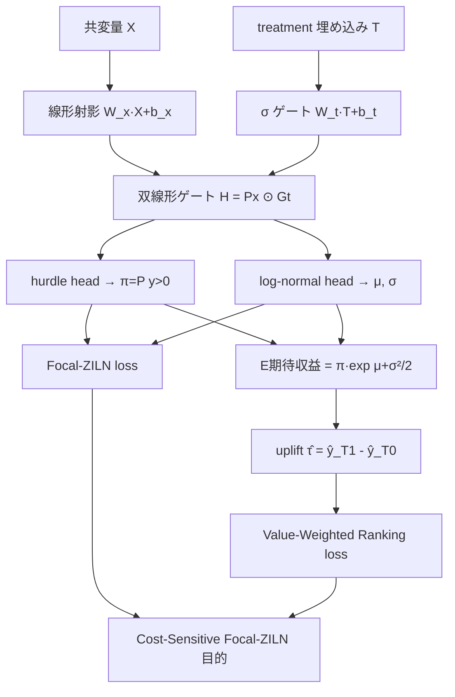

# VALOR: Value-Aware Revenue Uplift Modeling with Treatment-Gated Representation for B2B Sales

- **Link**: https://arxiv.org/abs/2604.02472
- **Authors**: Vamshi Guduguntla, Kavin Soni, Debanshu Das
- **Year**: 2026（2026-04-02 投稿）
- **Venue**: arXiv preprint [cs.LG]（査読付き会場は記載なし）
- **Type**: 応用研究論文／B2B 収益 uplift モデリング（本番 A/B テスト付き）

---

## Abstract (English)

VALOR addresses a critical B2B sales challenge: identifying persuadable accounts within zero-inflated revenue distributions so that limited human sales effort can be allocated effectively. Standard uplift frameworks struggle with treatment signal collapse in high-dimensional spaces and with the misalignment between model calibration and the ranking of high-value accounts. VALOR is a unified framework built around a Treatment-Gated Sparse-Revenue Network that uses a bilinear (gated) interaction between covariates and the treatment embedding to prevent causal signal degradation (the "vanishing treatment" problem). It is trained with a Cost-Sensitive Focal-ZILN objective that combines a focal mechanism for distributional robustness against the overwhelming mass of zero-revenue accounts with a value-weighted pairwise ranking loss whose penalties scale with the financial magnitude of mis-rankings. The authors additionally derive Robust ZILN-GBDT, a tree-based variant with a custom uplift-heterogeneity splitting criterion and Bayesian smoothing for interpretability in high-touch programs. VALOR reports a 20% improvement in rankability over state-of-the-art methods on public/synthetic benchmarks and a validated 2.7x increase in incremental revenue per account in a rigorous 4-month production A/B test.

## Abstract (日本語)

VALOR は B2B 営業の中核課題—zero-inflated な収益分布の中から「説得可能（persuadable）なアカウント」を特定し、限られた人的営業リソースを効果的に配分する—に取り組む。標準的な uplift 枠組みは高次元空間で treatment 信号が消失（collapse）し、モデルの較正と高価値アカウントのランキングが不整合になる問題を抱える。VALOR は Treatment-Gated Sparse-Revenue Network を中心とする統合枠組みで、共変量と treatment 埋め込みの間の双線形（ゲート付き）相互作用により因果信号の劣化（"vanishing treatment" 問題）を防ぐ。学習には Cost-Sensitive Focal-ZILN 目的関数を用い、ゼロ収益アカウントの圧倒的多数に対する分布ロバスト性を与える focal 機構と、誤順位の金額規模に応じて罰則をスケールする value-weighted ペアワイズランキング損失を組み合わせる。さらに、uplift 異質性に基づくカスタム分割基準とベイズ平滑化を持つツリー系変種 Robust ZILN-GBDT を導出し、高タッチ営業での解釈性を確保する。VALOR は公開／合成ベンチマークで SOTA 比 20% のランキング改善、4 ヶ月の本番 A/B テストでアカウント当たり増分収益 2.7 倍を報告する。

---

## Overview

VALOR は B2B 営業という「アカウント数が少なく、収益が極端に zero-inflated で、少数アカウントが巨大収益を占める」文脈に特化した収益 uplift 枠組み。ニューラルネット版（Treatment-Gated Sparse-Revenue Network）とツリー版（Robust ZILN-GBDT）の二形態を提供し、前者は精度・ランキング、後者は解釈性を担う。核となるのは (1) treatment 信号消失を防ぐ双線形ゲート、(2) ゼロ支配に頑健な Focal-ZILN、(3) 金額で重み付けたランキング損失、の 3 点。本番 4 ヶ月 A/B テストで検証されている点が特徴。

## Problem（問題設定）

- **treatment 信号の消失（vanishing treatment）**: 高次元共変量空間で treatment の寄与が薄まり、因果信号が劣化して uplift が測れなくなる。
- **zero-inflated 収益分布**: 大多数のアカウントが収益ゼロ、少数が巨大。ゼロが勾配を支配し、正例（高価値）の学習が阻害される。
- **較正とランキングの不整合**: 点予測の較正を良くしても、高価値アカウントの順位（実運用で効く量）が良くならない。
- **人的リソース制約**: B2B の高タッチ営業では treat できるアカウント数が厳しく限られ、上位少数の順位精度が決定的。
- **解釈性要求**: 高タッチ営業では「なぜこのアカウントか」の説明が必要で、ブラックボックス NN だけでは不十分。

## Proposed Method

### Core Idea

hurdle（ゼロ超過確率）と log-normal（正例の金額）を分離した ZILN 構造の上に、treatment 埋め込みでゲートする双線形相互作用を置き、focal + value-weighted ランキングで学習することで、ゼロ支配・信号消失・順位不整合を同時に解く。

### Numbered Steps

1. **二分岐予測ヘッド**: hurdle 確率 $\pi=P(Y>0)$ と条件付き価値の log-normal パラメータ $\mu,\sigma$ を別々に出力。
2. **Treatment-Gated 相互作用**: 共変量射影を treatment 埋め込みのシグモイドゲートで要素積し、不要な特徴部分空間をゼロ化してから回帰に渡す。
3. **Focal-ZILN 損失**: hurdle 部分を focal 化してゼロ（easy negative）の勾配支配を抑え、正例は log-normal 負対数尤度で回帰。
4. **Value-Weighted ランキング損失**: ペアワイズで、誤順位のペナルティを金額差 $|z_i-z_j|$ の対数で重み付け。
5. **期待収益の合成**: $\mathbb{E}[y]=\pi\cdot\exp(\mu+\sigma^2/2)$ を treatment / control それぞれで作り uplift を得る。
6. **ツリー版（Robust ZILN-GBDT）**: uplift 異質性ゲインで分割し、疎な葉ノードをベイズ平滑化・σ クリッピングで安定化。

### Key Formulas

期待収益（hurdle × log-normal）:

$$
\mathbb{E}[y_k]=\pi_k\cdot\exp\!\Big(\mu_k+\tfrac{\sigma_k^2}{2}\Big)
$$

Treatment-Gated 双線形相互作用（$\odot$ は要素積、$\sigma$ はシグモイド）:

$$
\text{Interaction}(X,T)=(W_x X+b_x)\;\odot\;\sigma(W_t T+b_t)
$$

Focal 化した hurdle 損失（$\alpha$ クラス重み、$\gamma$ focal 係数）:

$$
\mathcal{L}_{prop}=
\begin{cases}
-\alpha(1-p_i)^{\gamma}\log p_i & \text{if } y_i>0\\
-(1-\alpha)\,p_i^{\gamma}\log(1-p_i) & \text{if } y_i=0
\end{cases}
$$

正例の log-normal 回帰項:

$$
\mathcal{L}_{rev}=\mathbb{1}(y_i>0)\Big[\tfrac{1}{2}\big(\tfrac{\log y_i-\mu_i}{\sigma_i}\big)^2+\log(\sigma_i\sqrt{2\pi})\Big]
$$

$$
\mathcal{L}_{FL\text{-}ZILN}=\mathcal{L}_{prop}+\mathcal{L}_{rev}
$$

Value-Weighted ペアワイズランキング損失:

$$
\mathcal{L}_{V\text{-}Rank}=\sum_{i,j} w_{ij}\,\log\!\big(1+\exp(-\,\text{sign}(z_i-z_j)\,(\hat{\tau}_i-\hat{\tau}_j))\big),
\quad w_{ij}=\log(1+|z_i-z_j|)
$$

Robust ZILN-GBDT の分割ゲイン（uplift 異質性）:

$$
\Delta\text{Gain}(s)=\frac{N_L N_R}{(N_L+N_R)^2}\,(\hat{\tau}_L-\hat{\tau}_R)^2
$$

疎葉ノードの適応ベイズ平滑化:

$$
\hat{p}=\frac{n_{pos}+\alpha_p\bar{p}}{n_{total}+\alpha_p},\quad
\hat{\mu}=w\,\mu_{sample}+(1-w)\bar{\mu},\ w=\frac{n_{pos}}{n_{pos}+\alpha_{reg}},\quad
\hat{\sigma}=\text{clip}(\hat{\sigma},0.1,4.0)
$$

## Algorithm（擬似コード）

```
入力: {(X_i, T_i, y_i)} アカウント, y ≥ 0（収益, 高度に zero-inflated）
--- VALOR-DNN ---
for epoch in 1..30:
  for minibatch B(=512):
    H  = (W_x X + b_x) ⊙ σ(W_t T + b_t)      # Treatment-Gated
    π,μ,σ = Heads(H)                          # hurdle + log-normal
    L_ziln = mean(FocalZILN(y; π,μ,σ; α,γ))
    ŷ = π·exp(μ+σ²/2);  τ̂ = ŷ(T=1) - ŷ(T=0)
    L_rank = ValueWeightedPairwise(τ̂, z)      # w_ij = log(1+|z_i-z_j|)
    L = L_ziln + L_rank
    Adam(lr=5e-4).step(∇L)
--- Robust ZILN-GBDT ---
分割: argmax_s ΔGain(s) = N_L N_R/(N_L+N_R)² (τ̂_L - τ̂_R)²
葉: ベイズ平滑化(p,μ) + σ ∈ [0.1, 4.0] クリップ
```

## Architecture / Process Flow



## Figures & Tables

> 数値は本文抜粋で確認できた範囲のみ記載。図の画像 URL は HTML 抜粋から確定できず、捏造は行わない。

### 表1: オフライン主要結果（Synthetic B2B-Mimic, 236,421 アカウント）

| モデル | Qini | Lift@30 |
|--------|------|---------|
| **VALOR-CFR-WASS** | **0.3049** | **51.21** |
| RERUM-DragonNet（SOTA baseline） | 0.2596 | 43.50 |

Qini で SOTA 比 **約 20% 改善**（0.3049 vs 0.2596）。

### 表2: オンライン A/B テスト（4 ヶ月, 大手クラウドプロバイダ本番）

| 指標 | Incumbent | VALOR | 差分 |
|------|-----------|-------|------|
| Opportunity Rate | 9.3% | 17.6% | +8.3pt |
| アカウント当たり増分収益 | \$445 | **\$1,185** | **2.7×** |
| 年換算リフト（推定） | — | **≈\$30M** | — |

### 表3: アブレーション（各成分の寄与）

| 成分 | 効果 |
|------|------|
| Focal-ZILN | +23% AUUC（CFR-WASS ベース） |
| Value-Weighted Ranking | +12〜18% AUUC（結合アーキテクチャ） |
| Gated Treatment Interaction | +1〜2%（軽微だが一貫した安定化） |

### 表4: 実装・推論コスト（手法比較）

| 項目 | VALOR-DNN | Robust ZILN-GBDT |
|------|-----------|------------------|
| 推論レイテンシ | ≈0.035 ms | ≈0.0055 ms |
| 主眼 | 精度・ランキング | 解釈性・軽量 |
| 最適化 | Adam, lr=5e-4, bs=512, 30 epoch | GBDT（uplift 異質性分割） |
| HW | Tesla V100 16GB / 2CPU / 32GB | 同上 |

### アーキテクチャ図
上記 Mermaid（Treatment-Gated Sparse-Revenue Network）が本手法のアーキテクチャ図に相当。原論文 HTML 版に対応する図が存在するが画像 URL は未確定。

## Experiments & Evaluation

### Setup
- **オフライン**: Synthetic B2B-Mimic（236,421 アカウント、zero-inflated 収益を模した合成データ）。
- **オンライン**: 大手クラウドプロバイダの本番営業で 4 ヶ月 A/B テスト。
- **評価指標**: Qini, AUUC, Lift@30, KRCC（Kendall 順位相関）。
- **ベースライン**: RERUM-DragonNet 等の SOTA 収益 uplift 手法、CFR-WASS 系。

### Main Results
- オフライン: Qini 0.3049（VALOR-CFR-WASS）vs 0.2596（RERUM-DragonNet）→ 約 20% 改善。Lift@30 は 51.21 vs 43.50。
- オンライン: 増分収益 \$1,185/アカウント（vs \$445）→ 2.7 倍。Opportunity Rate 17.6%（vs 9.3%）。年換算約 \$30M のリフトと推定。

### Ablation
- Focal-ZILN が最大寄与（+23% AUUC）。value-weighted ranking が +12〜18%。gated interaction は軽微（+1〜2%）だが安定化に寄与。

## 本テーマへの適用可能性

本テーマ（低頻度キャンペーン、収益・価値ドリブン uplift、Qini/AUUC 頑健評価、スパースなキャンペーンをまたぐプール）に対し、VALOR は **「アカウント／顧客数が少なく収益が極端に zero-inflated」という低頻度・小サンプル設定に最も近い設計**を提供する。

- **少数・高価値サンプルへの最適化**: B2B のアカウント数は消費者キャンペーンより桁違いに少なく、まさに本テーマの「稀なキャンペーン」に構造が似る。Focal-ZILN はゼロ支配下で少数の高価値サンプルを学習に効かせ、value-weighted ranking は「金額の大きい誤順位ほど強く罰する」ため、限られた予算で上位を打つ運用に直結する。
- **評価との整合**: 主要指標が Qini / Lift@30 / KRCC でありランキング志向。本テーマの Qini/AUUC 頑健評価と学習目的が整合しており、評価レイヤをそのまま流用しやすい。
- **プール時の頑健化パーツ**: Robust ZILN-GBDT の「疎な葉ノードのベイズ平滑化 + σ クリッピング」は、スパースなキャンペーンをまたいで集計・プールする際にセグメント推定を安定化する部品として再利用価値が高い。
- **解釈性 = キャンペーン設計の説明**: ツリー版の異質性分割は「どのセグメントが説得可能か」を説明でき、少数キャンペーンで意思決定者に根拠を示す用途に適う。
- **留意点**: 本番結果は合成 B2B-Mimic + 単一プロバイダ A/B に基づく。消費者向けの多数・低単価キャンペーンへ移す場合、hurdle 率・金額スケールが異なるため $\alpha,\gamma$ と value 重み $w_{ij}$ の再調整が必要。GitHub 実装（下記）を起点にプール設計へ拡張するのが現実的。

## Notes

- コード: 本文抜粋に GitHub リポジトリ（VALOR-2026）への言及あり。ただし URL は本文抜粋由来であり、アクセス確認は本レポート作成時点で未実施（利用前に要確認）。
- 2026 年 arXiv preprint。査読付き会場は記載なし。数値（Qini 0.3049、増分収益 2.7×、\$30M 等）は本文抜粋に明記された値のみ転記し、確認できない項目は捏造していない。
- 図の画像 URL は HTML 抜粋から確定できなかったため埋め込みなし。
