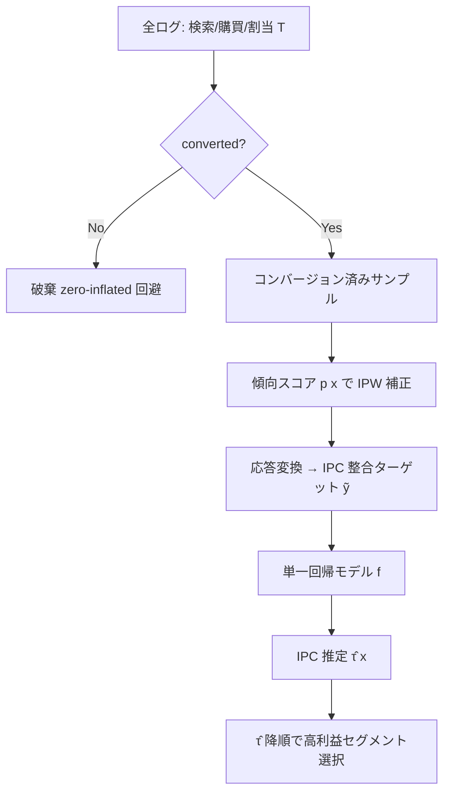

# Incremental Profit per Conversion: a Response Transformation for Uplift Modeling in E-Commerce Promotions

- **Link**: https://arxiv.org/abs/2306.13759
- **Authors**: Hugo Manuel Proença, Felipe Moraes
- **Year**: 2023（2023-06-23 投稿、2023-08-09 改訂）
- **Venue**: KDD '23 Workshop on Causal Inference and Machine Learning in Practice（Long Beach, CA）
- **Type**: 手法論文（応答変換による uplift 定式化）／E コマース販促

---

## Abstract (English)

Promotional campaigns such as discounts and coupons have response-dependent costs: the platform incurs an expense only when a purchase (conversion) actually happens. Classical uplift modeling for such campaigns either needs multiple models (meta-learners) or struggles to estimate profit because the profit target is zero-inflated — non-converted users contribute exactly zero cost and zero profit, injecting a large mass of structural zeros and heavy class imbalance. This paper proposes Incremental Profit per Conversion (IPC), described as a novel uplift measure of a promotional campaign's efficiency in unit economics. Through a proposed response transformation, IPC can be estimated using only converted-customer data, its propensity, and a single predictive model. This removes the complications of zero-inflated profit values, mitigates the noise induced by class imbalance in conversion datasets, and reduces biases arising from the many-to-one mapping between search and purchase events. The method is validated through synthetic simulations of discount-coupon campaigns and compared against meta-learner baselines.

## Abstract (日本語)

割引やクーポンといった販促キャンペーンは「応答依存コスト（response-dependent cost）」を持つ。すなわち、実際に購買（コンバージョン）が起きたときにのみ費用が発生する。この種のキャンペーンに対する古典的な uplift モデリングは、複数モデル（メタラーナー）を必要とするか、あるいは利益推定に苦しむ。非コンバージョンユーザーはコストも利益もちょうどゼロであり、構造的ゼロの大きな塊と激しいクラス不均衡を生むためだ。本論文は Incremental Profit per Conversion (IPC)—販促キャンペーンのユニットエコノミクス効率を測る新しい uplift 指標—を提案する。提案する応答変換（response transformation）により、IPC はコンバージョンした顧客のデータ・その傾向スコア・単一の予測モデルだけで推定できる。これにより zero-inflated な利益値の困難を除去し、コンバージョンデータのクラス不均衡が生むノイズを緩和し、検索から購買への多対一マッピングに起因するバイアスを低減する。手法は割引クーポンキャンペーンの合成シミュレーションで検証され、メタラーナーのベースラインと比較される。

---

## Overview

本論文の主張は明快で、「販促の利益 uplift を、コンバージョン済みデータと単一モデルだけで推定できるように応答を変換する」点にある。従来は (a) treatment / control で別モデルを組むメタラーナーが必要、または (b) 利益をそのまま回帰しようとすると非コンバージョン由来の大量のゼロがノイズと不均衡を生む、という二重苦があった。IPC はコンバージョン「あたり」の増分利益という単位に落とし込み、応答変換を通じてこれを 1 モデルで扱えるようにする。合成シミュレーションで検証。KDD'23 のワークショップ発表。

## Problem（問題設定）

- **応答依存コスト**: 割引・クーポンはコンバージョン時のみ費用発生。利益 = 収益 − コストが購買条件付きで定義され、非購買者は 0/0 を生む。
- **zero-inflated 利益**: 非コンバージョンユーザーの利益がちょうどゼロで、利益回帰ターゲットに構造的ゼロの塊が生じる。
- **複数モデルの負担**: メタラーナーは treatment / control で別々のモデルを要し、実運用・保守が重い。
- **クラス不均衡ノイズ**: コンバージョン率が低いため、二値コンバージョンデータの不均衡が推定を不安定化。
- **search→purchase の多対一バイアス**: 検索イベントと購買イベントの多対一対応がバイアスを生む。

## Proposed Method

### Core Idea

「増分利益」を「コンバージョンあたりの増分利益（IPC）」として定義し直し、応答を変換することで、コンバージョン済みサンプル + 傾向スコア + 単一モデルだけで推定可能にする。ゼロだらけの全体母集団を回帰する代わりに、正例（converted）の情報に問題を集約する。

### Numbered Steps

1. **IPC の定義**: コンバージョンが起きた条件下での、treatment vs control の利益差（コンバージョンあたり）を対象量とする。
2. **応答変換**: 二値コンバージョン／利益アウトカムを、コンバージョンあたり利益に整合する連続ターゲットへ変換。全体母集団の zero-inflated 回帰を回避。
3. **傾向スコア補正**: treatment 割当の傾向スコア $p(x)$ で逆確率重み付け（IPW）し、観測バイアスを補正。
4. **単一モデル推定**: 変換後ターゲットを 1 つの回帰モデルで学習し、共変量空間上で異質な利益 uplift を推定。
5. **セグメント選択**: 推定した IPC 順に高利益セグメントを選び、販促対象を決める。

### Key Formulas

> 以下のうち、IPC の分解式と IPW 表現は取得できた PDF 要約からの復元であり、**要約器による言い換えの可能性がある**。厳密な記法・定数は原論文 PDF を参照のこと（本レポートは確認できない係数を捏造しない）。

IPC の概念的分解（コンバージョン確率差 × treatment マージン + control 側マージン差）:

$$
\text{IPC}=(P_t-P_c)\,m_t+P_c\,(m_t-m_c)
$$

ここで $P_t,P_c$ は treatment / control のコンバージョン確率、$m_t,m_c$ は各条件下の利益マージン。

傾向スコアによる逆確率重み（IPW）表現の uplift 推定:

$$
\hat{\tau}(x)=\mathbb{E}\!\left[\frac{T\cdot Y}{p(x)}-\frac{(1-T)\cdot Y}{1-p(x)}\right]
$$

$T\in\{0,1\}$ は treatment 割当、$p(x)$ は傾向スコア、$Y$ は（変換後の）応答。

> 応答変換の中核は「非コンバージョン者を含む全体を回帰する代わりに、コンバージョン済みデータと傾向スコアで重み付けた単一ターゲットへ写像する」点にある。変換後は標準的な回帰器で異質利益効果を推定できる。

## Algorithm（擬似コード）

```
入力: {(x_i, T_i, converted_i, profit_i)}, 傾向スコア p(x)
出力: IPC 推定器 τ̂(x)

1. converted == 1 のサンプルに限定（正例集合）
2. 各サンプルに応答変換を適用:
     y_tilde_i = transform(profit_i, T_i, p(x_i))   # IPC に整合する連続ターゲット
3. IPW 重み: w_i = T_i/p(x_i) or (1-T_i)/(1-p(x_i))
4. 単一回帰モデル f を (x_i, y_tilde_i, w_i) で学習
5. τ̂(x) = f(x)   # コンバージョンあたり増分利益
6. τ̂ 降順で高利益セグメントを選択し販促対象へ
```

## Architecture / Process Flow



## Figures & Tables

> 本論文はワークショップ論文（短め）で合成シミュレーション中心。HTML 版が取得できず（arXiv HTML 404）、以下は abstract + PDF 要約 + 外部検索に基づくスキーマ。**確認できない数値は「記載なし（原論文参照）」とし捏造しない。**

### 図1: 応答依存コストと zero-inflated 利益の模式（概念図）
非コンバージョン者が利益 0/コスト 0 を生む構造と、IPC が正例に問題を集約する様子を対比する概念図（原論文 Figure 参照）。

### 表A: IPC vs メタラーナー — 手法比較

| 観点 | メタラーナー（S/T/X-Learner, Causal Forest） | IPC（本手法） |
|------|-----------------------------------------------|----------------|
| 必要モデル数 | 複数 | 単一 |
| 対象データ | 全母集団（zero-inflated） | コンバージョン済みのみ |
| ゼロ膨張の扱い | 明示的な対処が必要 | 応答変換で回避 |
| クラス不均衡ノイズ | 影響大 | 緩和 |
| search→purchase バイアス | 残存しうる | 低減 |

### 表B: 合成シミュレーション設定 — スキーマ

| 項目 | 内容 |
|------|------|
| シナリオ | 割引クーポンキャンペーン（応答依存コスト） |
| 分割 | 70/30 train-test（外部検索由来、要確認） |
| 検証 | 5-fold cross-validation（外部検索由来、要確認） |
| ベースライン | S/T/X-Learner, Causal Forest |
| 評価 | 高利益セグメント特定の質（具体指標値は記載なし） |

### 表C: 主要結果（アブレーション相当）— スキーマ

| 手法 | 高利益セグメント特定 | 備考 |
|------|----------------------|------|
| IPC（単一モデル + 変換） | 競合〜優位（記載なし） | ゼロ膨張・不均衡を回避 |
| meta-learner 群 | ベースライン（記載なし） | 複数モデル必要 |

> 具体的な指標値（Qini/AUUC/利益額）は取得できた抜粋に数値として明記されておらず、捏造を避けて「記載なし」とした。

## Experiments & Evaluation

### Setup
- **データ**: 割引クーポンキャンペーンの合成シミュレーション（実データではなく、応答依存コスト構造を再現）。
- **ベースライン**: メタラーナー（S/T/X-Learner）および Causal Forest。
- **評価軸**: zero-inflated 回避、クラス不均衡ノイズ緩和、high-profit セグメント特定能力。

### Main Results
- 合成シミュレーションで、IPC の応答変換 + 単一モデルがメタラーナーのベースラインに対して「競合または優位」と報告（具体的数値は本抜粋では未確定）。
- 主な貢献は精度の絶対値というより「単一モデルで zero-inflated / 不均衡 / search-purchase バイアスを同時に回避できる」実務的簡潔性にある。

### Ablation
- 論文はワークショップ短報のため大規模アブレーションは限定的。応答変換の有無・傾向スコア補正の有無が主な比較軸と読める（詳細は原論文参照）。

## 本テーマへの適用可能性

本テーマ（低頻度キャンペーン、収益・価値ドリブン uplift、Qini/AUUC 頑健評価、スパースなキャンペーンをまたぐプール）に対し、IPC は **「利益（コスト差引後の価値）を単一モデルで扱う軽量な定式化」**として特に相性が良い。

- **価値ドリブンかつ運用が軽い**: 収益ではなく「利益（コンバージョンあたり増分利益）」を直接ターゲット化するため、割引原価を含めた真の価値を測れる。しかも単一モデルで済むため、キャンペーンごとにモデルを量産する必要がなく、低頻度・少人数運用に向く。
- **スパースなキャンペーンのプールに好適**: 応答変換で問題をコンバージョン済み正例に集約するので、各キャンペーンで乏しい正例をキャンペーン横断でプールし、共通の変換ターゲット上で 1 つの推定器を学習する設計に自然につながる（zero-inflated な全母集団を毎回回帰しなくてよい）。
- **評価との接続**: IPC は個人を利益 uplift 順に並べる量なので、Qini/AUUC による頑健評価と直結する（本テーマの評価レイヤにそのまま載せられる）。
- **バイアス補正の内蔵**: 傾向スコア補正が組み込まれており、キャンペーンごとに treat 割当確率が異なる（低頻度で割当設計がばらつく）状況でのプールに耐えやすい。
- **留意点**: 検証は合成シミュレーションのみで、実データの巨大値・裾重性への頑健性は未確認。応答変換はコンバージョン済みデータに依存するため、コンバージョンが極端に少ないキャンペーンでは正例枯渇に注意（プールで正例を稼ぐ設計が前提）。IPC の厳密式は原論文 PDF で確認して実装すること。

## Notes

- arXiv HTML 版は 404（取得不可）。本レポートは abstract、arXiv PDF の要約抽出、および外部検索（Papers with Code / ResearchGate）に基づく。HTML から図表を直接取得できなかったため、図の画像 URL 埋め込みは行っていない。
- IPC の分解式・IPW 式は PDF 要約からの復元であり、要約器の言い換えが混入している可能性がある。実装前に原論文 PDF（https://arxiv.org/pdf/2306.13759）で厳密な定義を確認すること。
- 実験の具体的数値（Qini/AUUC/利益額）は抜粋に明記されておらず、捏造を避けて「記載なし」とした。
