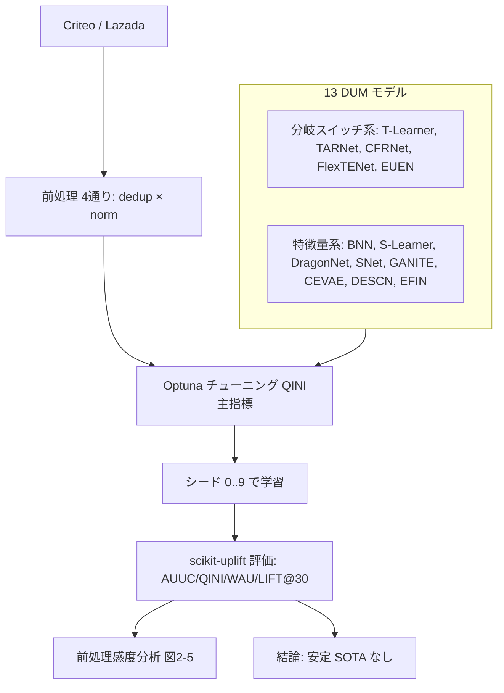

# Benchmarking for Deep Uplift Modeling in Online Marketing

- **Link**: https://arxiv.org/abs/2406.00335
- **Authors**: Dugang Liu, Xing Tang, Yang Qiao, Miao Liu, Zexu Sun, Xiuqiang He, Zhong Ming
- **Year**: 2024（2024-06-01 投稿）
- **Venue**: arXiv preprint [cs.LG]（ベンチマーク・ライブラリ公開を予告）
- **Type**: ベンチマーク／再現性研究論文

---

## Abstract (English)

Deep uplift modeling (DUM) has attracted growing interest in online marketing, where the goal is to identify user segments most responsive to incentives such as coupons. However, the field lacks a standardized benchmark: papers report on different datasets, use inconsistent preprocessing (e.g., instance deduplication, feature normalization), and rarely disclose optimal hyperparameters, which makes cross-paper comparison and reproduction difficult. This paper establishes a unified benchmark for DUM, evaluating 13 representative models on two industrial datasets (Criteo and Lazada) under consistent protocols, with metrics computed via scikit-uplift. A key and somewhat surprising finding is that recent deep-learning approaches deliver only modest improvements over simpler baselines, and that there is no stable state-of-the-art model across datasets and preprocessing configurations. Results further reveal pronounced sensitivity to preprocessing (deduplication and normalization) and clear generalization challenges under distribution shift. The authors release their benchmarking library and evaluation protocols to improve reproducibility.

## Abstract (日本語)

深層 uplift モデリング（DUM: Deep Uplift Modeling）は、クーポンなどのインセンティブに最も反応するユーザーセグメントを特定することを目的とし、オンラインマーケティングで注目を集めている。しかしこの分野には標準ベンチマークが欠けている。論文ごとにデータセットが異なり、前処理（インスタンス重複除去、特徴正規化など）が一貫せず、最適ハイパーパラメータもほとんど開示されないため、論文間比較や再現が困難である。本論文は DUM の統一ベンチマークを構築し、代表的 13 モデルを 2 つの産業データセット（Criteo と Lazada）上で一貫したプロトコル（指標は scikit-uplift で計算）で評価する。やや意外な主要知見として、近年の深層学習手法は単純なベースラインに対してわずかな改善しかもたらさず、データセットや前処理設定を横断して安定した SOTA モデルが存在しないことが示される。さらに、前処理（重複除去・正規化）への顕著な感度と、分布シフト下での明確な汎化課題が明らかになる。著者らはベンチマークライブラリと評価プロトコルを公開し、再現性の向上を図る。

---

## Overview

本論文は「新手法を提案する」のではなく「既存 DUM の実力を公平に測る」ためのベンチマーク論文。13 モデルを 2 産業データ（Criteo / Lazada）で、前処理（重複除去 × 正規化）の 4 組み合わせ × 固定シード（0〜9）× Optuna チューニングという厳密プロトコルで比較する。結論は挑発的で、「深層手法の優位は思ったほど大きくなく、データ・前処理を変えると順位が入れ替わり、安定した SOTA は存在しない」。再現可能なライブラリと最適ハイパラを公開する点が実務的価値。

## Problem（問題設定）

- **標準ベンチマークの不在**: DUM 論文がバラバラのデータ・前処理・評価で報告し、横断比較が不能。
- **前処理の非開示**: インスタンス重複除去・特徴正規化の有無が結果を大きく動かすのに、多くの論文が明記しない。
- **最適ハイパラの非開示**: CausalML / EconML / DoWhy は最適ハイパラを提供せず、公平比較を阻害。
- **汎化の疑義**: 分布シフト（Criteo は selection-biased test、Lazada は RCT test）下でモデルが崩れる懸念。
- **再現性**: 固定シード・統一指標での再現手段が欠落。

## Proposed Method（ベンチマーク設計）

### Core Idea

13 の代表 DUM モデルを、treatment の扱い（分岐スイッチ vs 特徴量）で 2 系統に整理し、前処理 4 通り × 統一指標 × 固定シード × Optuna 最適化で公平に評価する再現可能フレームワークを提供する。

### Numbered Steps

1. **モデル収集**: 13 モデルを 2 カテゴリに分類（treatment を分岐スイッチとして扱う 5 種、特徴量として扱う 8 種）。
2. **データ整備**: Criteo / Lazada を統一形式に。前処理として instance deduplication と feature normalization を各 on/off で組合せ（4 通り）。
3. **ハイパラ最適化**: Optuna で QINI を主指標にチューニング（AdamW、最大 20 epoch、early stopping patience=5）。
4. **統一評価**: scikit-uplift で AUUC / QINI / WAU / LIFT@30 を計算、シード 0〜9 で平均。
5. **感度分析**: 前処理（重複除去・正規化）が各データで順位をどう動かすかを図示。
6. **公開**: ライブラリ・プロトコル・最適ハイパラを release。

### Key Formulas

CATE（uplift の対象量）:

$$
\tau(\mathbf{x})=\mathbb{E}[Y(1)-Y(0)\mid X=\mathbf{x}]
$$

推論時の uplift 推定:

$$
\hat{\tau}_i=\hat{Y}_i(1)-\hat{Y}_i(0)
$$

学習損失（標準 MSE）:

$$
\mathcal{L}=\frac{1}{N}\sum_{\mathcal{D}}(Y_i-\hat{Y}_i)^2
$$

特徴正規化（batch norm 型）:

$$
\hat{x}_i=\frac{x_i-\mathbb{E}[x]}{\sqrt{\text{Var}[x]+\epsilon}},\qquad y_i=\gamma\hat{x}_i+\beta
$$

## Algorithm（ベンチマーク手順の擬似コード）

```
models = 13 DUM models（分岐スイッチ系5 + 特徴量系8）
datasets = {Criteo, Lazada}
preproc = {dedup∈{on,off}} × {norm∈{on,off}}     # 4 通り
metrics = {AUUC, QINI, WAU, LIFT@30}             # scikit-uplift

for d in datasets:
  for pp in preproc:
    D = preprocess(d, pp)
    for m in models:
      best_hp = Optuna(m, D, objective=QINI,
                       opt=AdamW, epochs<=20, patience=5)
      for seed in 0..9:
        train m on D(seed) with best_hp
        record metrics(m, D, seed)
report mean±std over seeds; 感度分析(pp) を図示
```

## Architecture / Process Flow



## Figures & Tables

> 数値は本文抜粋で確認できた範囲のみ。図の画像 URL は HTML 抜粋に直接 URL がなく、埋め込みは行わない（捏造回避）。

### 表1: データセット統計

| データ | Train | Test | 特徴 | Treatment 比 | 正例率 |
|--------|-------|------|------|--------------|--------|
| Criteo | 13,979,592 | — | 12 連続 | 5.67:1 | 4.70% |
| Lazada | 926,669 | 181,669 | 83 連続 | 0.28:1（train） | 1.99%（train） |

Criteo は selection-biased test、Lazada は RCT-based unbiased test。

### 表2: 主要結果 — Criteo/Lazada（重複除去あり・正規化なし, 論文 Table 4）

| データ | 上位モデル（QINI） |
|--------|--------------------|
| Criteo | EFIN 0.1220 / GANITE 0.1192 / FlexTENet 0.1164 |
| Lazada | DESCN 0.0252 / CFRNet 0.0234 / T-Learner 0.0231 |

### 表3: 主要結果 — Criteo（重複除去 + 正規化, 論文 Table 5）

| データ | 上位モデル（QINI） |
|--------|--------------------|
| Criteo | GANITE 0.1272 / EFIN 0.1208 / CFRNet 0.1194 |
| Lazada | 前処理間で大きく変動（順位入れ替わり） |

> 前処理を変えると Criteo の首位が EFIN→GANITE へ入れ替わる等、**「安定した SOTA が存在しない」**ことを数値で示す。Table 6-7（重複除去なし）でさらに順位が変動。

### 表4: ハイパーパラメータ探索範囲（論文 Table 3）

| ハイパラ | 範囲 |
|----------|------|
| Rank（隠れユニット） | {2⁵, 2⁶, 2⁷} |
| Batch size | {2⁸, 2⁹, 2¹⁰, 2¹¹} |
| Learning rate | {1e-4, 5e-4, 1e-3, 5e-3, 1e-2} |
| Weight decay | {1e-5, 1e-4, 1e-3, 1e-2} |
| 補助損失重み α | {0.1–0.9} |

### 図（感度分析, 論文 Figure 2–5）
- 図1: 代表モデルのアーキテクチャ図。
- 図2/3: インスタンス重複除去の感度（正規化なし／あり）。
- 図4/5: 特徴正規化の感度（重複除去なし／あり）。
（画像 URL は HTML 抜粋から確定できず、埋め込みなし。）

## Experiments & Evaluation

### Setup
- **モデル**: 13 種（分岐スイッチ系 5: T-Learner, TARNet, CFRNet, FlexTENet, EUEN／特徴量系 8: BNN, S-Learner, DragonNet, SNet, GANITE, CEVAE, DESCN, EFIN）。
- **データ**: Criteo（約 1,398 万件, selection-biased test）、Lazada（RCT test）。
- **指標**: AUUC, QINI（チューニング主指標）, WAU, LIFT@30（scikit-uplift）。
- **プロトコル**: 前処理 4 通り、Optuna 最適化、AdamW、最大 20 epoch、early stopping、シード 0〜9。

### Main Results
- Criteo（dedup, no-norm）: EFIN 0.1220 が首位、GANITE・FlexTENet が僅差で続く。
- Lazada（dedup, no-norm）: DESCN 0.0252 が首位、CFRNet・T-Learner が続く。
- 正規化を加えると Criteo 首位が GANITE 0.1272 に入れ替わる。
- **結論**: データ・前処理を横断して安定した SOTA は存在せず、深層手法の優位は限定的。

### Ablation（前処理感度）
- インスタンス重複除去と特徴正規化は Criteo と Lazada で逆方向の効果を示す（Criteo は分布一貫、Lazada は分布シフト）。
- 分布ミスマッチ下で汎化に明確な限界。

## 本テーマへの適用可能性

本テーマ（低頻度キャンペーン、収益・価値 uplift、Qini/AUUC 頑健評価、スパースなキャンペーンをまたぐプール）に対し、本論文は **「評価と再現性の設計図」**として最も直接的に効く。

- **頑健評価レイヤの標準化**: 本テーマが要求する Qini/AUUC 評価を、scikit-uplift ベースで AUUC/QINI/WAU/LIFT@30 まで統一計算し、固定シードで平均する手順はそのままテンプレートとして採用できる。稀なキャンペーンでは 1 回の評価が偶然に振られやすいので、シード平均・前処理感度分析は必須の実務手続きになる。
- **「深層が常に勝つわけではない」という保険**: 少数キャンペーン・小サンプルでは重い深層モデルが過学習しやすい。本ベンチマークの「安定 SOTA なし・深層の優位は限定的」という知見は、まずは軽量ベースライン（T-Learner 等）を基準に据えるべきという実務判断を支持する。
- **前処理を評価変数として扱う**: 重複除去・正規化で順位が入れ替わる事実は、キャンペーンをまたいでデータをプールする際に前処理を固定・記録することの重要性を示す。プール時に前処理が混在すると比較が壊れる。
- **分布シフトへの警戒**: Lazada の RCT test vs Criteo の selection-biased test の対比は、キャンペーンごとに割当設計が異なる（分布シフトが起こる）本テーマで、評価データの性質を明示すべきことを教える。
- **留意点**: 本ベンチマークは大規模産業データ（百万〜千万件）が前提。低頻度キャンペーンの小サンプルにそのまま適用すると QINI の分散が大きくなるため、ブートストラップ信頼区間や複数キャンペーンのプール評価を併用するのが望ましい。公開ライブラリを評価基盤として流用するのが現実的。

## Notes

- 本論文はベンチマーク・再現性論文であり、著者らはライブラリと評価プロトコルの公開を予告。実装比較の共通基盤として利用価値が高い。
- Table 6-7（重複除去なし）の詳細数値は本抜粋で個別値まで確定できず、「順位が変動する」定性記述として扱った。捏造は行っていない。
- 図の画像 URL は HTML 抜粋から確定できなかったため埋め込みなし。
