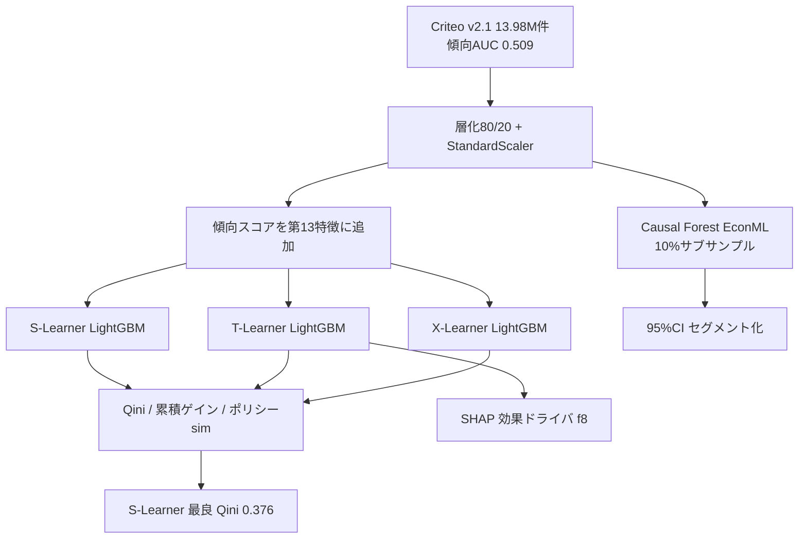

# A Large-Scale Empirical Comparison of Meta-Learners and Causal Forests for Heterogeneous Treatment Effect Estimation in Marketing Uplift Modeling

- **Link**: https://arxiv.org/abs/2604.06123
- **Authors**: Aman Singh
- **Year**: 2026（2026-04-07 投稿）
- **Venue**: arXiv preprint [stat.CO]（6 ページ、査読付き会場は記載なし）
- **Type**: 大規模実証比較研究／CATE 推定手法のベンチマーク（UpliftBench）

---

## Abstract (English)

This paper (UpliftBench) provides a large-scale empirical comparison of four conditional average treatment effect (CATE) estimators for marketing uplift modeling on the Criteo Uplift v2.1 dataset (~13.98 million customer records). The compared methods are three meta-learners — S-Learner, T-Learner, and X-Learner, all using LightGBM as the base learner — and Causal Forest from EconML with doubly robust, honest splitting and bootstrap confidence intervals. The near-random treatment assignment (propensity AUC ≈ 0.509) yields high internal validity. Using the Qini coefficient and cumulative gain curves, the study finds that the S-Learner attains the highest Qini (0.376) with the lowest variance, and that targeting the top 20% of predicted high-value customers captures 77.7% of all incremental conversions — a 3.9x improvement over random targeting. SHAP analysis identifies feature f8 as the primary driver of heterogeneous treatment effects, and Causal Forest uncertainty quantification shows that only 1.9% of customers are "confident persuadables" (95% CI lower bound above zero). The work provides evidence-based guidance for methodology selection in large-scale marketing applications.

## Abstract (日本語)

本論文（UpliftBench）は、Criteo Uplift v2.1 データセット（約 1,398 万件の顧客レコード）上で、マーケティング uplift のための 4 つの条件付き平均処置効果（CATE）推定手法を大規模に実証比較する。比較対象は、LightGBM をベース学習器とする 3 つのメタラーナー（S-Learner, T-Learner, X-Learner）と、EconML の Causal Forest（二重頑健・honest 分割・ブートストラップ信頼区間付き）である。ほぼランダムな処置割当（傾向スコア AUC ≈ 0.509）により高い内的妥当性が得られる。Qini 係数と累積ゲイン曲線を用い、S-Learner が最高 Qini（0.376）を最小分散で達成し、予測高価値顧客の上位 20% を狙うと全増分コンバージョンの 77.7% を捕捉—ランダム比 3.9 倍—であることを見出す。SHAP 分析は特徴 f8 を異質処置効果の主要ドライバと特定し、Causal Forest の不確実性定量化では顧客のわずか 1.9% だけが「確信的説得可能層（95% 信頼区間下限がゼロ超）」であることを示す。本研究は大規模マーケティング応用における手法選択の実証的指針を提供する。

---

## Overview

本論文は新手法を提案するのではなく、「マーケティング uplift で実際にどの CATE 推定器を選ぶべきか」を、単一の大規模 RCT データ（Criteo v2.1, 約 1,398 万件）で公平比較する実証研究。結論は「意外にも最も単純な S-Learner が最良（Qini 0.376）で分散も最小」。加えて、SHAP による効果ドライバ特定（f8）と、Causal Forest の信頼区間による顧客セグメント化（confident persuadables 1.9%）という「不確実性を伴う意思決定」の観点を提供する。本レポートでは指示通り、単一手法ではなく手法比較表を中心に構成する。

## Problem（問題設定）

- **手法選択の指針不足**: メタラーナー各種と Causal Forest のどれを実務で選ぶべきか、大規模統一比較が乏しい。
- **分散・安定性の軽視**: Qini の平均値だけでなく分散（安定性）が実運用の信頼性を左右するが評価されにくい。
- **不確実性の欠如**: 点推定の uplift 順位だけでは「本当に説得可能か」の確信度が分からず、予算配分の誤りにつながる。
- **効果ドライバの不明**: どの特徴が異質効果を駆動するか（説明可能性）が実運用のアクションに必要。

## Proposed Method（4 手法の比較設計）

> 指示に従い、単一手法の記述ではなく **手法比較表** を中心に据える。

### 比較対象の 4 手法

| 手法 | 中核アイデア | CATE 推定式 | 特性 |
|------|--------------|-------------|------|
| **S-Learner** | treatment を特徴に含めた単一結果モデル $\mu(\mathbf{x},t)$ | $\hat{\tau}(\mathbf{x})=\mu(\mathbf{x},1)-\mu(\mathbf{x},0)$ | 効果ゼロへ正則化され分散が小さい |
| **T-Learner** | treated / control で別モデル $\mu_1,\mu_0$ | $\hat{\tau}(\mathbf{x})=\mu_1(\mathbf{x})-\mu_0(\mathbf{x})$ | 群別パターンを捉えるが不均衡下で過学習 |
| **X-Learner** | 2 段クロスフィッティング + 傾向重み付き個別効果補完 | 傾向スコアで imputed effect を融合 | 処置不均衡に強い設計 |
| **Causal Forest** | EconML 実装、二重頑健 + honest 分割 | 点推定 + 95% ブートストラップ信頼区間 | 不確実性定量化が可能 |

全メタラーナーは LightGBM をベース学習器に使用。

### 共通の対象量と評価

CATE（対象量）:

$$
\tau(\mathbf{x})=\mathbb{E}[Y(1)-Y(0)\mid X=\mathbf{x}]
$$

Qini 係数（評価指標）:

$$
\text{Qini}=\int_0^1\big[G(\phi)-\phi\cdot G(1)\big]\,d\phi
$$

ここで $G(\phi)$ は、予測 CATE 上位 $\phi$ 割合をターゲットしたときに捕捉される増分コンバージョンの割合。

### Numbered Steps（実験手順）

1. Criteo v2.1（約 1,398 万件、傾向 AUC 0.509 のほぼ RCT）を 80/20 層化分割、StandardScaler で正規化。
2. メタラーナー訓練時、傾向スコアを 13 番目の特徴として追加。
3. S/T/X-Learner（LightGBM）と Causal Forest（EconML、計算制約により約 28 万件＝10% サブサンプル）を学習。
4. Qini・累積ゲイン曲線・ポリシーシミュレーションで評価。
5. SHAP で効果ドライバを特定（T-Learner 予測に対して）。
6. Causal Forest の 95% CI で顧客を confident persuadables / sleeping dogs / uncertain に分類。

## Algorithm（擬似コード）

```
D = Criteo v2.1（13,979,592 件, 傾向AUC 0.509）
train/test = 層化80/20; StandardScaler
propensity をメタラーナーの13番目の特徴に付加

for m in {S,T,X}-Learner(LightGBM):
    fit m on train; τ̂ = m.predict_cate(test)
    Qini(m), TopK-capture(m)
CausalForest(EconML, honest, 10%サブサンプル):
    τ̂, CI95 = fit_predict(subsample)
    segment: lowerCI>0→confident persuadable
             upperCI<0→confident sleeping dog
             else→uncertain
SHAP(T-Learner) → 効果ドライバ順位(f8, f6, f2)
```

## Architecture / Process Flow



## Figures & Tables

> 数値は本文抜粋で確認できた範囲のみ記載。図の画像 URL は HTML 抜粋に直接 URL がなく、埋め込みは行わない（捏造回避）。

### 表1: 主要結果 — 手法比較（正確な数値）

| モデル | CATE 平均 | CATE 標準偏差 | Qini | Top 20% 捕捉 | Top 50% 捕捉 |
|--------|-----------|----------------|------|--------------|--------------|
| **S-Learner** | 0.0070 | 0.0223 | **0.3759** | **77.7%** | 95.8% |
| X-Learner | 0.0074 | 0.0248 | 0.3615 | 76.0% | 92.8% |
| T-Learner | 0.0074 | 0.0267 | 0.3503 | 75.1% | 92.4% |
| Causal Forest | 0.0072 | 0.0377 | 0.2524 | — | — |
| Random baseline | — | — | ≈0.007 | 20.0% | 50.0% |

S-Learner が最高 Qini かつ最小分散。上位 20% で全増分コンバージョンの 77.7% を捕捉（ランダム比 3.9 倍）。

### 表2: データセット（Criteo Uplift v2.1）

| 項目 | 値 |
|------|----|
| レコード数 | 13,979,592 |
| 特徴 | 12 共変量（f0–f11） |
| 割当 | 85% treated / 15% control |
| 主要アウトカム | visit（4.7%） |
| 副次アウトカム | conversion（0.29%） |
| 傾向 AUC | 0.509（ほぼ RCT） |

### 表3: 不確実性定量化（Causal Forest, 95% CI セグメント化）

| セグメント | 定義 | 割合 |
|------------|------|------|
| Confident persuadables | 下限 CI > 0（確実に正効果） | 1.9% |
| Confident sleeping dogs | 上限 CI < 0（確実に負効果） | 0.1% |
| Uncertain | CI が 0 をまたぐ | 98.0% |

### 表4: SHAP 効果ドライバ（アブレーション相当・特徴寄与）

| 順位 | 特徴 | 役割 |
|------|------|------|
| 1 | f8 | 異質処置効果の主要ドライバ |
| 2 | f6 | 副次ドライバ |
| 3 | f2 | 副次ドライバ |

（SHAP は T-Learner 予測に対して算出。特徴は匿名化済み。）

### アーキテクチャ／プロセス図
上記 Mermaid（4 手法比較のパイプライン）が本研究のプロセスフロー図に相当。原論文 HTML 版に Qini 曲線・CATE 分布・ポリシーシミュレーション・CF 不確実性・SHAP の図が含まれるが、画像 URL は未確定のため埋め込みなし。

## Experiments & Evaluation

### Setup
- **データ**: Criteo Uplift v2.1（約 1,398 万件、傾向 AUC 0.509 のほぼ RCT）。
- **分割**: 層化 80/20、StandardScaler 正規化、傾向スコアを 13 番目の特徴として付加。
- **手法**: S/T/X-Learner（LightGBM）、Causal Forest（EconML、計算制約で約 28 万件＝10% サブサンプル）。
- **指標**: Qini 係数、累積ゲイン曲線、ポリシーシミュレーション。

### Main Results
- **S-Learner が最良**: Qini 0.3759、CATE 標準偏差 0.0223（最小分散）。
- X-Learner 0.3615、T-Learner 0.3503、Causal Forest 0.2524。
- 上位 20%（100 万顧客中 20 万件）ターゲティングで全増分コンバージョンの 77.7% を捕捉、コスト 80% 削減で 3.9 倍の効率。

### Ablation / 追加分析
- **SHAP**: f8 が異質効果の主ドライバ、次いで f6, f2。
- **不確実性**: confident persuadables はわずか 1.9%、sleeping dogs 0.1%、残り 98.0% は不確実。点推定の順位だけに頼る危うさを示す。
- Causal Forest は 10% サブサンプル評価のため、メタラーナーとの直接比較には計算制約の留保あり。

## 本テーマへの適用可能性

本テーマ（低頻度キャンペーン、収益・価値ドリブン uplift、Qini/AUUC 頑健評価、スパースなキャンペーンをまたぐプール）に対し、本論文は **「基礎推定器の選定と、不確実性を伴う評価」**の実証的指針として直接効く。

- **軽量ベースラインの正当化**: S-Learner（LightGBM 単一モデル）が Qini 最良かつ最小分散という結果は、少数キャンペーン・小サンプルでまず単純で安定な推定器を基礎層に据えるべきという判断を強く支持する。分散が小さい手法はキャンペーンをまたいでプールする際も推定が安定する。
- **Qini/累積ゲインの評価テンプレート**: Qini 係数と累積ゲイン曲線、Top-k 捕捉率（77.7% @20%）という評価一式は、本テーマの頑健評価レイヤにそのまま移植できる。稀なキャンペーンでは Top-k 捕捉率が「限られた予算で何を打つか」の意思決定に直結する。
- **不確実性ベースの意思決定**: Causal Forest の 95% CI による confident persuadables 抽出（1.9%）は、低頻度で誤爆コストが高い場面で「確信度の高い層だけ打つ」保守運用を可能にする。点推定順位だけでプールすると 98% の uncertain を過信する危険を回避できる。
- **効果ドライバの共有**: SHAP による f8 等の特定は、キャンペーンをまたいで「共通して効くドライバ」を見つけ、スパースな campaign を pool する際の特徴設計・転移の手がかりになる。
- **留意点**: 対象は visit/conversion（二値）であり、本テーマの収益・価値ドリブン（金額）とはアウトカムが異なる。価値ベースに拡張するには #11/#12 の ZILN 系損失と組み合わせる必要がある。また Causal Forest は計算コストが高く 10% サブサンプル評価のため、大規模プールでの適用は計算資源に留意。単一大規模データでの結論であり、複数の小キャンペーンをまたぐ一般化は追検証が要る。

## Notes

- 2026 年 arXiv preprint（stat.CO、6 ページ短報）。査読付き会場は記載なし。コード: https://github.com/Aman12x/UpliftBench（本文抜粋由来、利用前に要確認）。
- 主要数値（Qini 0.3759 等、Top20% 77.7%、confident persuadables 1.9%）は本文抜粋に明記された値のみ転記。Causal Forest の Top20%/50% は「—（記載なし）」とし捏造していない。
- 指示に従い、本レポートは単一手法記述ではなく手法比較表を中核に構成した。
- 図の画像 URL は HTML 抜粋から確定できなかったため埋め込みなし。
