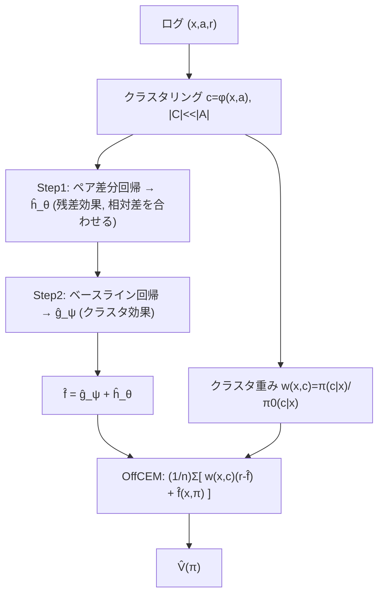

# Off-Policy Evaluation for Large Action Spaces via Conjunct Effect Modeling (OffCEM)

- **Link**: https://arxiv.org/abs/2305.08062
- **Authors**: Yuta Saito, Qingyang Ren, Thorsten Joachims
- **Year**: 2023
- **Venue**: ICML 2023 (Proceedings of Machine Learning Research v202, saito23b)
- **Type**: 手法論文（Off-Policy Evaluation / 大規模行動空間）
- **Code**: https://github.com/usaito/icml2023-offcem

---

## Abstract (English)

> We study off-policy evaluation (OPE) of contextual bandit policies for large discrete action spaces where conventional importance-weighting approaches suffer from excessive variance. To circumvent this variance issue, we propose a new estimator, called OffCEM, that is based on the conjunct effect model (CEM), a novel decomposition of the causal effect into a cluster effect and a residual effect. OffCEM applies importance weighting only to action clusters and addresses the residual causal effect through model-based reward estimation. We show that the proposed estimator is unbiased under a new condition, called local correctness, which only requires that the residual-effect model preserves the relative expected reward differences of the actions within each cluster. To best leverage the CEM and local correctness, we also propose a new two-step procedure for performing model-based estimation that minimizes bias in the first step and variance in the second step. We find that the resulting OffCEM estimator substantially improves bias and variance compared to a range of conventional estimators. Experiments demonstrate that OffCEM provides substantial improvements in OPE especially in the presence of many actions.

## Abstract (日本語訳)

大規模離散行動空間における文脈付きバンディットの Off-Policy Evaluation (OPE) を研究する。ここでは従来の重要度重み付けが過大な分散に苦しむ。この分散問題を回避するため、**Conjunct Effect Model (CEM)**——因果効果を**クラスタ効果 (cluster effect)** と**残差効果 (residual effect)** に分解する新しい分解——に基づく新推定量 **OffCEM** を提案する。OffCEM は重要度重み付けを**行動クラスタにのみ**適用し、残差因果効果はモデルベース報酬推定で扱う。提案推定量は **local correctness（局所正当性）**という新条件のもとで不偏となり、これは残差効果モデルが各クラスタ内の行動間の**相対的な期待報酬差**を保存することだけを要求する。CEM と local correctness を最大限活かすため、第1ステップでバイアスを、第2ステップで分散を最小化する新しい**2段階手続き**も提案する。結果として OffCEM は従来推定量群に対しバイアスと分散を大幅に改善し、特に行動数が多い場面で OPE を大きく改善する。

---

## Overview

MIPS（02）は「No Direct Effect（埋め込みが行動効果を完全媒介）」という強い仮定に依存し、埋め込みが粗いとバイアスが出る。OffCEM はこの仮定を **local correctness** という遥かに弱い条件に置き換える。行動の期待報酬 $q(x,a)$ を「クラスタ効果 $g(x,\phi(x,a))$」と「残差効果 $h(x,a)$」に分解し、**重要度重みはクラスタ $c=\phi(x,a)$ のみ**に適用（$|\mathcal{C}|\ll|\mathcal{A}|$ なので低分散）、残差は回帰モデル $\hat f$ で補正する。不偏性には「残差モデルがクラスタ内の相対報酬差を保つ」ことだけが必要で、絶対値の正確さは不要。これを実現する 2 段階回帰（差分回帰でバイアス最小化 → ベースライン回帰で分散最小化）を提案。

---

## Problem（課題リスト）

- 大行動空間で IPS/DR の重要度重みの分散が爆発。
- MIPS は No Direct Effect 仮定に依存し、埋め込みが粗いと相対報酬差を無視してバイアス。細粒度化すると IPS に退化して分散増大（バイアス-分散トレードオフに縛られる）。
- DM は回帰誤指定で高バイアス。
- ロギングポリシーの common support 欠如（未サポート行動）にも頑健である必要。

---

## Proposed Method（中核アイデアと手順）

**中核アイデア**: 因果効果を「クラスタ効果＋残差効果」に分解し、重要度重みは**クラスタにのみ**掛け、残差は回帰で補正。不偏性の鍵は「残差モデルがクラスタ内の相対差を保存する（local correctness）」ことだけ。

### 手順

1. 行動をクラスタリング $c=\phi(x,a)$（$|\mathcal{C}|\ll|\mathcal{A}|$、埋め込み・カテゴリ・ヒューリスティックで可）。
2. **Step 1（バイアス最小化）**: クラスタ内の**ペア差分**を回帰し、残差効果 $\hat h_\theta(x,a)$ を学習（相対差を合わせる）。
3. **Step 2（分散最小化）**: Step1 を固定し、クラスタ効果 $\hat g_\psi(x,c)$ をベースラインとして回帰。最終 $\hat f = \hat g_\psi + \hat h_\theta$。
4. クラスタ重要度重み $w(x,c)=\pi(c|x)/\pi_0(c|x)$ を計算。
5. OffCEM 推定量で $\hat V$ を算出。

### Key Formulas

OffCEM 推定量:

$$\hat{V}_{\text{OffCEM}}(\pi;\mathcal{D}) = \frac{1}{n}\sum_{i=1}^{n}\Big\{ w(x_i,\phi(x_i,a_i))\big(r_i-\hat{f}(x_i,a_i)\big) + \hat{f}(x_i,\pi) \Big\}$$

ただし $\hat{f}(x,\pi):=\mathbb{E}_{\pi(a|x)}[\hat{f}(x,a)]$。

Conjunct Effect Model（因果効果分解）:

$$q(x,a) = \underbrace{g(x,\phi(x,a))}_{\text{cluster effect}} + \underbrace{h(x,a)}_{\text{residual effect}}$$

クラスタ重要度重み:

$$w(x,c) := \frac{\pi(c|x)}{\pi_0(c|x)} = \frac{\sum_{a}\mathbb{I}\{\phi(x,a)=c\}\pi(a|x)}{\sum_{a}\mathbb{I}\{\phi(x,a)=c\}\pi_0(a|x)}$$

**Local Correctness**: 全ての $x$ と、$\phi(x,a)=\phi(x,b)$ となる $a,b$ に対して

$$\Delta_q(x,a,b)=\Delta_{\hat{f}}(x,a,b),\qquad \Delta_q(x,a,b):=q(x,a)-q(x,b)$$

バイアス（local correctness が破れた場合, Theorem 3.3）:

$$\mathrm{Bias}(\hat{V}_{\text{OffCEM}}) = \mathbb{E}_{p(x)\pi(c|x)}\Big[\!\!\sum_{\substack{a<b:\phi=\phi=c}}\!\!\pi_0(a|x,c)\pi_0(b|x,c)\big(\Delta_q-\Delta_{\hat f}\big)\Big(\tfrac{\pi(b|x,c)}{\pi_0(b|x,c)}-\tfrac{\pi(a|x,c)}{\pi_0(a|x,c)}\Big)\Big]$$

---

## Algorithm（擬似コード）

```
Input: logged data D, target π, logging π0, clustering φ (|C|<<|A|)
Output: V̂_OffCEM

# --- two-step model estimation ---
1. Step1 (bias-min): θ = argmin Σ_pairs ℓ_h( r_a - r_b , ĥ_θ(x,a)-ĥ_θ(x,b) )
        over pairs (a,b) with φ(x,a)=φ(x,b)
2. Step2 (var-min):  ψ = argmin Σ ℓ_g( r - ĥ_θ(x,a) , ĝ_ψ(x,φ(x,a)) )
3. f̂(x,a) = ĝ_ψ(x,φ(x,a)) + ĥ_θ(x,a)

# --- estimation ---
4. for each i:
5.     w_i = π(c_i|x_i) / π0(c_i|x_i),  c_i=φ(x_i,a_i)
6.     term_i = w_i*(r_i - f̂(x_i,a_i)) + E_{π(a|x_i)}[f̂(x_i,a)]
7. V̂_OffCEM = (1/n) Σ_i term_i
```

---

## Architecture / Process Flow



---

## Figures & Tables（主要な図表・数値）

### 表1: 合成データ主要 MSE（正規化 MSE、OffCEM の値と対ベースライン削減率; ar5iv 抽出）

**$n=500,\ |\mathcal{A}|=1{,}000,\ |\mathcal{C}|=50$**

| 比較対象 | OffCEM の MSE | 削減率 |
|----------|--------------:|-------:|
| vs IPS   | 0.169 | 約 83% 削減 |
| vs MIPS  | 0.184 | 約 81.5% 削減 |
| vs DR    | 0.317 | 約 68.2% 削減 |

**$|\mathcal{A}|=4{,}000$**

| 比較対象 | OffCEM の MSE | 削減率 |
|----------|--------------:|-------:|
| vs IPS   | 0.082 | 約 99.1% 削減 |
| vs MIPS  | 0.086 | 約 99% 削減 |
| vs DR    | 0.112 | 約 88.7% 削減 |

行動数が増えるほど OffCEM の優位が拡大。

### 表2: 実験設定（Setup）

| 項目 | 合成データ | 実データ |
|------|-----------|---------|
| 行動数 | 200〜4,000 | EUR-Lex 4K: 3,956 / Wiki10-31K: 30,938 |
| サンプル数 | 500 / 3,000 / 8,000 | EUR-Lex: 15,449 train / Wiki10: 14,146 train |
| クラスタ数 | 50（$|\mathcal{A}|$=1000 で 1%） | 100（ランダムクラスタリング, ヒューリスティック） |
| 報酬ノイズ | σ=3 | − |
| 未サポート行動 | 最大 900 | − |

### 表3: アブレーション（要素の寄与）

| 構成 | 効果 |
|------|------|
| クラスタ重みのみ（残差モデルなし） | バイアス残存（クラスタ内相対差を無視） |
| + 2段階回帰（Step1 差分→Step2 ベースライン） | local correctness を近似し**バイアス大幅減** |
| 単純 1段階回帰 | 相対差保存が甘くバイアス残る（2段階が有効） |
| クラスタ数の増減 | 増やすと分散↑（IPS 寄り）、減らすとバイアス↑ |

（正確なアブレーション数値は原論文 Table/Figure を参照。確認できない値は「記載なし」。）

### 表4: 手法比較

| 推定量 | 重み対象 | 残差処理 | 不偏の条件 | 大行動空間の分散 |
|--------|---------|---------|-----------|-----------------|
| IPS    | 行動 $a$ | なし | common support（行動） | 非常に高 |
| DR     | 行動 $a$ | 回帰 $\hat q$ | common support（行動） | 高 |
| MIPS   | 埋め込み $e$ | なし | No Direct Effect | 低 |
| **OffCEM** | **クラスタ $c$** | **2段階回帰 $\hat f$** | **local correctness（相対差保存のみ）** | **低** |

（図の実画像 URL は ar5iv 上で埋め込み可能な直リンクとして確認できなかったため省略。）

---

## Experiments & Evaluation

### Setup
- 合成: 行動 200〜4,000、$n\in\{500,3000,8000\}$、クラスタ 50、報酬ノイズ σ=3、未サポート行動最大 900。
- 実データ: EUR-Lex 4K（3,956 行動）、Wiki10-31K（30,938 行動）。ランダムクラスタリング（$|\mathcal{C}|=100$）。
- 指標: 真値で正規化した MSE。

### Main Results
- 合成で **OffCEM が全ベースライン（DM/IPS/DR/MIPS）を上回る**。$|\mathcal{A}|=4000$ で対 IPS 約 99% の MSE 削減（ar5iv 抽出値）。
- 行動数が多いほど、また未サポート行動が多いほど OffCEM の相対優位が拡大。
- 実データ EUR-Lex / Wiki10 でも両データセットで全ベースラインを上回る。

### Ablation
- **2段階回帰が鍵**: Step1（差分回帰でバイアス最小化）→ Step2（ベースライン回帰で分散最小化）の順が最良。単純 1 段階回帰では local correctness を近似しきれずバイアスが残る。
- クラスタ数はバイアス-分散のノブ（少→バイアス、多→分散）。

---

## 本テーマへの適用可能性

本テーマ（クーポン/メール配信のオフライン方針評価、A/B なし、キャンペーン横断）に OffCEM は MIPS の弱点を補う実務的な選択肢となる。

- **粗いクラスタでも不偏に近い評価**: クーポン/商品を「割引率帯」「商品カテゴリ」等で粗くクラスタリングすると、MIPS では同一クラスタ内の反応差（例: 同じ 10%OFF でも人気商品と不人気商品で購買率が違う）を無視してバイアスが出る。OffCEM は**クラスタ内の相対差だけを回帰 $\hat f$ で補正**すればよいため、粗いクラスタでも低分散かつ低バイアスで新配信方針の売上/購買率を推定できる。マーケでは「絶対的な購買率を当てる」より「どのセグメントにどのクーポンが相対的に効くか」を保存できれば十分で、これは local correctness と親和的。
- **未配布クーポンへの外挿**: common support 欠如（過去に一部セグメントへ配っていないクーポン）に頑健。クラスタレベルで support があれば評価可能なので、低頻度・偏った配信ログでも新ターゲティングを評価できる。
- **キャンペーン横断プーリング**: 複数キャンペーンの行動を共通クラスタ（割引率×カテゴリ×チャネル）に束ね、クラスタ効果 $g$ をキャンペーン横断で共有、残差効果 $h$ をキャンペーン固有として学習する運用が自然。データが薄い個別キャンペーンでもクラスタ効果をプーリングで安定推定できる。
- **2段階回帰の実務メリット**: マーケ担当が持つドメイン知識（どの属性でクラスタを切るか）を Step1/Step2 に反映しやすく、既存の購買予測モデルを $\hat f$ として流用できる。

---

## Notes

- OffCEM の不偏性は local correctness（クラスタ内相対差保存）に依存。クラスタ設計が悪く、クラスタ内で報酬構造が大きく異なると残差モデルの学習が難しくなる。
- MIPS（02）と MDR（05）の中間的立ち位置: MIPS は重みを埋め込みに、MDR は DR を周辺化重みで拡張、OffCEM はクラスタ重み＋残差回帰の 2 段階。用途に応じ使い分け。
- 表内の一部数値は ar5iv 抽出値。厳密な桁は原論文（PMLR v202 saito23b）で照合すること。確認できない値は「記載なし」とした。
