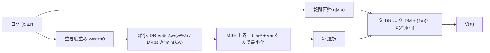

# Doubly Robust Off-Policy Evaluation with Shrinkage (DRos / DRps)

- **Link**: https://arxiv.org/abs/1907.09623
- **Authors**: Yi Su, Maria Dimakopoulou, Akshay Krishnamurthy, Miroslav Dudík
- **Year**: 2019 (arXiv v1) / 2020 (採択)
- **Venue**: ICML 2020
- **Type**: 手法論文（Off-Policy Evaluation / 推定量設計フレームワーク）

---

## Abstract (English)

> We propose a new framework for designing estimators for off-policy evaluation in contextual bandits. Our approach is based on the asymptotically optimal doubly robust estimator, but we shrink the importance weights to minimize a bound on the mean squared error, which results in a better bias-variance tradeoff in finite samples. We use this optimization-based framework to obtain three estimators: (a) a weight-clipping estimator, (b) a new weight-shrinkage estimator, and (c) the first shrinkage-based estimator for combinatorial action sets. We prove that all our estimators possess strong theoretical guarantees, and we demonstrate their effectiveness through extensive experiments in both standard and combinatorial bandit benchmark problems.

## Abstract (日本語訳)

文脈付きバンディットにおける Off-Policy Evaluation のための推定量を**設計する新しいフレームワーク**を提案する。漸近的に最適な Doubly Robust (DR) 推定量を基礎としつつ、**重要度重みを縮小 (shrink)** して平均二乗誤差 (MSE) の上界を最小化し、有限標本でより良いバイアス-分散トレードオフを得る。この最適化ベースの枠組みから 3 つの推定量を導く: (a) 重みクリッピング推定量、(b) 新しい重み縮小推定量、(c) 組合せ行動集合に対する初の縮小ベース推定量。全推定量が強い理論保証を持つことを証明し、標準および組合せバンディットのベンチマークで有効性を実証する。

---

## Overview

本論文は「重要度重み $w(x,a)=\pi(a|x)/\pi_0(a|x)$ を、そのまま使うのではなく **MSE の鋭い上界を最小化するように縮小した重み $\hat w$** に置き換える」という最適化ベースの設計原理を提案する。DR 推定量の重み部分を $\hat w$ に差し替えることで、有限標本でのバイアス-分散を明示的に最適化する。得られる代表推定量が **DRos（Optimistic Shrinkage）**（滑らかな縮小）と **DRps（Pessimistic Shrinkage＝クリッピング）**。縮小の強さはハイパーパラメータ $\lambda$ で制御し、MSE 上界を最小化する $\lambda$ をデータ駆動で選ぶ。後の OBP（01）や多くの OPE 研究で DRos が強力なベースラインとして採用される。

---

## Problem（課題リスト）

- 標準 DR は漸近最適だが、有限標本では重要度重みの分散が大きく MSE が悪化。
- 重みクリッピング（切り捨て）は分散を下げるがバイアスの入り方が粗く、閾値選択が難しい。
- Switch-DR 等は「切り替え」でヒューリスティックにバイアス-分散を調整するが、MSE を直接最適化していない。
- 組合せ行動（ランキング/スレート）では重みの積で分散がさらに爆発し、縮小推定量が存在しなかった。

---

## Proposed Method（中核アイデアと手順）

**中核アイデア**: DR の重み $w$ を、MSE 上界を最小化する縮小重み $\hat w(x,a;\lambda)$ に置換。縮小の形で 2 種（optimistic=滑らか, pessimistic=クリップ）を導き、$\lambda$ を MSE 上界最小化で選ぶ。

### 手順

1. 報酬回帰モデル $\hat\eta(x,a)$（＝$\hat q$）を学習。
2. 縮小重み $\hat w(x,a;\lambda)$ を定義（DRos or DRps）。
3. MSE 上界 $\hat{\mathrm{MSE}}(\lambda)$ をバイアス項＋分散項として構成し、$\lambda$ を最小化。
4. 縮小 DR 推定量を算出。組合せ行動では pseudo-inverse (PI) 重み等で拡張。

### Key Formulas

DR 推定量（ベース）:

$$\hat{V}_{\mathrm{DR}}(\pi;\hat{\eta}) = \hat{V}_{\mathrm{DM}}(\pi;\hat{\eta}) + \frac{1}{n}\sum_{i=1}^{n} w(x_i,a_i)\big(r_i-\hat{\eta}(x_i,a_i)\big)$$

DRos（Optimistic Shrinkage）重み:

$$\hat{w}_{\mathrm{o},\lambda}(x,a) = \frac{\lambda}{w^2(x,a)+\lambda}\, w(x,a),\qquad \lambda\in[0,\infty)$$

（$\lambda\to\infty$ で $\hat w\to w$（=通常 DR）、$\lambda\to 0$ で $\hat w\to 0$（=DM）。）

DRps（Pessimistic Shrinkage＝クリッピング）重み:

$$\hat{w}_{\mathrm{p},\lambda}(x,a) = \min\{\lambda,\; w(x,a)\}$$

縮小 DR 推定量（$\hat w$ を代入）:

$$\hat{V}_{\mathrm{DRs}}(\pi;\hat\eta,\lambda) = \hat{V}_{\mathrm{DM}}(\pi;\hat\eta) + \frac{1}{n}\sum_{i=1}^{n} \hat{w}(x_i,a_i;\lambda)\big(r_i-\hat{\eta}(x_i,a_i)\big)$$

分散（近似, Proposition 1）:

$$\mathrm{Var}(\hat w) \approx \frac{1}{n}\,\mathbb{E}_{\mu}\!\big[\hat w^2(x,a)\,(r-\hat\eta(x,a))^2\big]$$

バイアス上界（optimistic）:

$$|\mathrm{Bias}(\hat w)| \leq \sqrt{\mathbb{E}_\mu\!\Big[\tfrac{1}{z(x,a)}(\hat w(x,a)-w(x,a))^2\Big]}\cdot\sqrt{L(\hat\eta)}$$

**Theorem 3（オラクル不等式）**: 手続きはハイパーパラメータ集合内の全ての不偏推定量と、$O(n^{-3/2})$ の項を除いて常に同等以上に振る舞う。

---

## Algorithm（擬似コード）

```
Input: logged data D, target π, logging π0, reward model class,
       shrinkage grid Λ, weight z (e.g. z=w^2 for shrinkage methods)
Output: V̂_DRs and selected λ*

1. train η̂(x,a) by regression (weighted by z)
2. for λ in Λ:
3.     for each i: ŵ_i(λ) = λ/(w_i^2+λ) * w_i        # DRos
4.                 (or  ŵ_i(λ) = min(λ, w_i)          # DRps)
5.     bias_bound(λ), var_est(λ) = estimate from D
6.     mse_bound(λ) = bias_bound(λ)^2 + var_est(λ)
7. λ* = argmin_λ mse_bound(λ)
8. V̂_DRs = V̂_DM(π;η̂) + (1/n) Σ_i ŵ_i(λ*) (r_i - η̂(x_i,a_i))
9. return V̂_DRs, λ*
```

---

## Architecture / Process Flow



---

## Figures & Tables（主要な図表・数値）

### 表1: 手法比較（縮小の型と極限挙動）

| 推定量 | 重み関数 $\hat w$ | $\lambda$ 大 | $\lambda$ 小 | 特徴 |
|--------|------------------|-------------|-------------|------|
| DR     | $w$ | − | − | 漸近最適・有限標本で高分散 |
| DRps（クリップ） | $\min\{\lambda,w\}$ | → DR | → DM | 硬い閾値、バイアス粗い |
| **DRos（滑らか）** | $\dfrac{\lambda}{w^2+\lambda}w$ | → DR | → DM | 滑らかな縮小、MSE 上界最小化 |
| Switch-DR | $w\cdot\mathbb{I}[w\le\tau]$ | − | − | 切替ヒューリスティック |

### 表2: 実験設定（Setup）

| 項目 | 内容 |
|------|------|
| データ | UCI 多クラス→バンディット変換 9 データセット（OptDigits, PenDigits, SatImage, Letter, Shuttle, Adult, Covertype, Connect-4, Yeast） |
| プロトコル | 75% で 500 バンディット複製、25% を真値算出用に保持 |
| ポリシー | 決定的 2 種 $\pi_{1,\det},\pi_{2,\det}$ を softening（$\alpha\in\{0.5,0.7,0.9\}$, $\beta\in\{0,0.1,0.2\}$） |
| 条件数 | 非組合せ 108 条件 |
| 組合せ | MSLR-WEB10K ランキング |

### 表3: 主要結果（要約; ar5iv 抽出）

| 観察 | 内容 |
|------|------|
| 非組合せ 108 条件 | **DRs-direct が最小 MSE を広範に達成**（決定的・確率的報酬設定とも） |
| 回帰の重み付け | shrinkage 系は $z=w^2$ が最適、標準 DR は $z=1$ |
| 組合せ (MSLR-WEB10K) | **DRs-PI が DR-PI 比 約1.5× の MSE 改善**、oracle 調整版でさらに改善 |
| MRDR 比較 | MRDR は代替重み付けに劣後 |

（推定量ごとの厳密な MSE 数値表は原論文 Figure（CDF プロット中心）に依存。個別の数値点は「記載なし」の箇所あり。）

### 表4: 主要比較推定量一覧

| 推定量 | 種別 |
|--------|------|
| DM | モデルベース |
| IPW / IPS | 重み付け |
| SNIPW | 自己正規化重み付け |
| DR | ハイブリッド |
| Switch-DR | ハイブリッド＋切替 |
| DRclip (=DRps) | ハイブリッド＋クリップ縮小 |
| **DRos** | ハイブリッド＋滑らか縮小（本論文） |
| MRDR | more robust DR（比較対象） |

（図は主に相対性能の CDF プロット。ar5iv 上で埋め込み可能な図直リンクは確認できなかったため省略。）

---

## Experiments & Evaluation

### Setup
- UCI 9 データセット（多クラス→文脈付きバンディット変換）。75% を 500 回のバンディット複製に、25% を真値算出に使用。
- 決定的ベースポリシーを softening パラメータ $\alpha,\beta$ で確率化し、多様な (behavior, target) ペアを生成、計 108 条件（非組合せ）。
- 組合せ実験は MSLR-WEB10K（学習到ランキング）。

### Main Results
- **DRos/DRs 系が広範な条件で最小 MSE** を達成し、IPS/DM/DR/Switch-DR を上回る。特に決定的・準決定的ポリシーで優位。
- 縮小系推定量では報酬回帰の訓練重みを $z=w^2$ にするのが最適（標準 DR の $z=1$ と異なる）。
- 組合せ設定で **DRs-PI が DR-PI 比約 1.5 倍の MSE 改善**（ar5iv 抽出値）。
- オフポリシー学習（線形 softmax ポリシーの勾配学習）でも DRs-direct が代表 4 データセットでベースラインを上回るテスト値を達成。

### Ablation
- $\lambda$（縮小強度）を MSE 上界最小化で選ぶことの有効性。$\lambda$ を大きくすると DR、小さくすると DM に漸近。
- モデル選択（$\lambda$ 選択）が主なボトルネックで、oracle 調整版はさらに改善余地を示す。

---

## 本テーマへの適用可能性

本テーマ（クーポン/メール配信のオフライン方針評価、A/B なし、キャンペーン横断）に対し、DRos は**分散を抑えつつバイアスを制御する実務の定番推定量**として第一候補になる。

- **少サンプル・低頻度マーケでの安定推定**: 低頻度キャンペーンではログが少なく、素の IPS/DR は重要度重み $w$ の分散で推定が暴れる。DRos は重みを $\lambda w/(w^2+\lambda)$ に滑らかに縮小することで、極端な $w$（過去にほぼ配っていない組合せ）の影響を抑え、新クーポン方針の売上/購買率を安定推定できる。$\lambda$ は MSE 上界最小化で自動選択できるので、担当者が閾値を手で決める必要がない。
- **報酬回帰との併用**: DRos は DR の枠組みなので、既存の購買予測/反応予測モデル $\hat\eta$ をそのまま報酬回帰として流用できる。モデルが良ければバイアスが下がり、悪くても縮小重みが分散を抑えるため頑健。
- **組合せ配信（バスケット/複数枠メール）**: 1 通のメールに複数クーポンを載せる、複数枠を同時最適化するといった**組合せ行動**の OPE に、本論文の組合せ版縮小推定量（DRs-PI）が直接使える。従来は重みの積で分散が爆発して評価不能だった施策も評価可能に。
- **キャンペーン横断プーリング**: 複数キャンペーンのログを統合し文脈にキャンペーン属性を含めた上で DRos を適用すれば、キャンペーンごとに $w$ が偏っていても縮小により全体として安定した方針比較ができる。OBP（01）に DRos が実装済みなので実装コストも低い。

---

## Notes

- DRos は OBP（01）や後続 OPE 研究で最頻出の強ベースライン。まず DRos を基準線に置くのが実務上の定石。
- 大行動空間そのものへの根本対処は MIPS（02）/ OffCEM（03）/ MDR（05）で、DRos は「重みの縮小」という直交する改善。両者は組合せ可能（例: 周辺化重み＋縮小）。
- 表内の一部数値は ar5iv 抽出値。原論文の主要図は CDF プロット中心で、点推定の厳密数値は Figure/付録を参照。確認できない値は「記載なし」とした。
