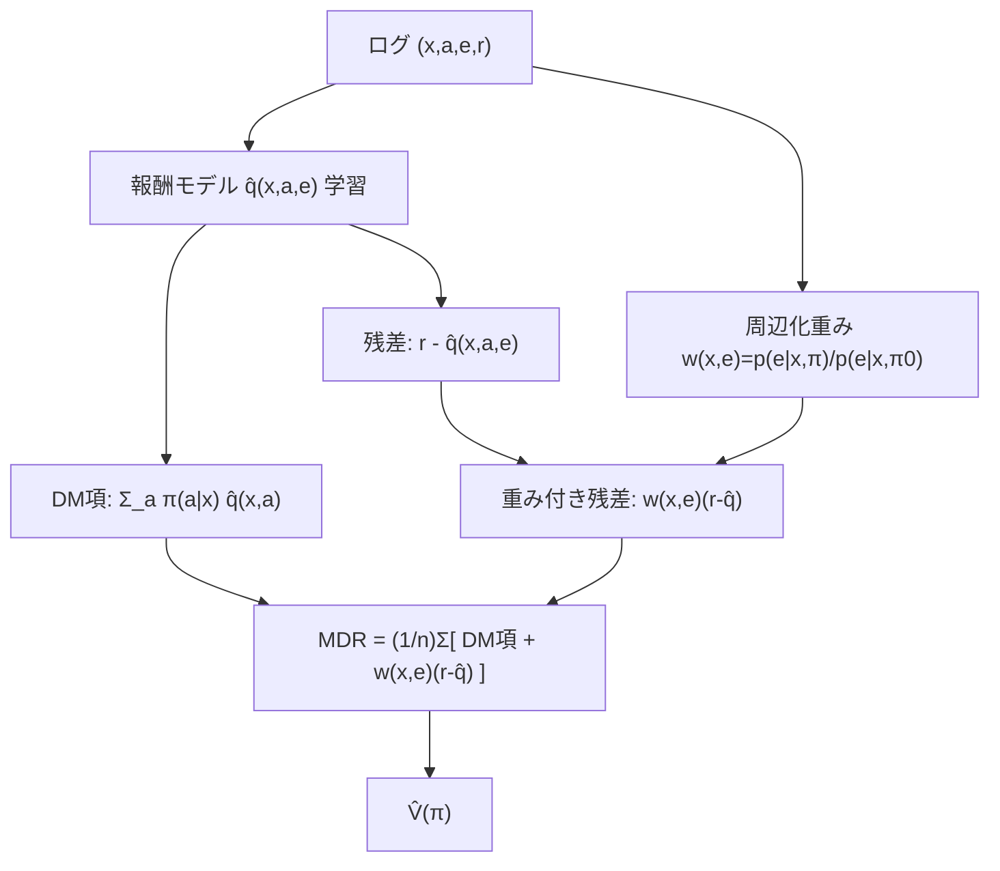

# Doubly Robust Estimator for Off-Policy Evaluation with Large Action Spaces (MDR)

- **Link**: https://arxiv.org/abs/2308.03443
- **Authors**: Tatsuhiro Shimizu, Laura Forastiere
- **Year**: 2023
- **Venue**: arXiv (stat.ML)（プレプリント）
- **Type**: 手法論文（Off-Policy Evaluation / 大規模行動空間）

---

## Abstract (English)

> We study Off-Policy Evaluation (OPE) in contextual bandit settings with large action spaces. The benchmark estimators suffer from severe bias and variance tradeoffs. Parametric approaches suffer from bias due to difficulty specifying the correct model, whereas ones with importance weight suffer from variance. To overcome these limitations, Marginalized Inverse Propensity Scoring (MIPS) was proposed to mitigate the estimator's variance via embeddings of an action. Nevertheless, MIPS is unbiased under the no direct effect, which assumes that the action embedding completely mediates the effect of an action on a reward. To overcome the dependency on these unrealistic assumptions, we propose a Marginalized Doubly Robust (MDR) estimator. Theoretical analysis shows that the proposed estimator is unbiased under weaker assumptions than MIPS while reducing the variance against MIPS. The empirical experiment verifies the supremacy of MDR against existing estimators with large action spaces.

## Abstract (日本語訳)

大規模行動空間を持つ文脈付きバンディット設定での Off-Policy Evaluation (OPE) を研究する。ベンチマーク推定量は深刻なバイアス-分散トレードオフに苦しむ。パラメトリック手法（DM）は正しいモデルの特定が難しくバイアスに、重要度重みを使う手法（IPS）は分散に苦しむ。この限界を克服するため、行動の埋め込みを介して分散を緩和する **MIPS**（Marginalized IPS）が提案された。しかし MIPS は「**No Direct Effect**（行動埋め込みが報酬への行動効果を完全媒介する）」という仮定の下でのみ不偏である。これらの非現実的仮定への依存を克服するため、**Marginalized Doubly Robust (MDR)** 推定量を提案する。理論解析により、MDR は MIPS より**弱い仮定**の下で不偏でありながら MIPS に対して分散も削減することを示す。実験は大規模行動空間で MDR が既存推定量に優越することを検証する。

---

## Overview

MDR は MIPS（02）に Doubly Robust の思想を注入した推定量である。MIPS は周辺化重み $w(x,e)$ で分散を抑えるが、不偏性のために強い No Direct Effect 仮定を要する。MDR は「埋め込み込みの報酬モデル $\hat q(x,a,e)$」を回帰項として加え、周辺化重みを残差 $(r-\hat q)$ にのみ掛ける。これにより (1) No Direct Effect より弱い仮定（＝報酬モデルが正しい、あるいは No Direct Effect のいずれか）で不偏、(2) 回帰による制御変量効果で MIPS よりさらに分散削減、という 2 重の頑健性を得る。構造的には「MIPS ＝ MDR の $\hat q\equiv 0$ 特殊ケース」「DR を周辺化重みに置き換えたもの」と理解できる。

---

## Problem（課題リスト）

- 大行動空間で IPS/DR は重要度重みの分散が爆発、DM はモデル誤指定でバイアス。
- MIPS は分散を抑えるが、不偏性のために **No Direct Effect（埋め込みが行動効果を完全媒介）**という非現実的仮定に依存。
- 埋め込みが行動効果を完全には媒介しない実問題（残差効果あり）では MIPS がバイアスを持つ。
- MIPS 自体の分散をさらに減らす余地が残っている。

---

## Proposed Method（中核アイデアと手順）

**中核アイデア**: MIPS の周辺化重み $w(x,e)$ を「報酬残差 $(r-\hat q(x,a,e))$」にだけ掛け、埋め込み込み報酬モデル $\hat q(x,a,e)$ を DM 項として足す（＝周辺化版 Doubly Robust）。

### 手順

1. 埋め込み込み報酬モデル $\hat q(x,a,e)=\mathbb{E}[r|x,a,e]$ を回帰で学習。
2. 周辺化重み $w(x,e)=p(e|x,\pi)/p(e|x,\pi_0)$ を計算（MIPS と同じ）。
3. DM 項 $\mathbb{E}_{\pi(a|x)}[\hat q(x,a)]$ と、重み付き残差 $w(x,e)(r-\hat q(x,a,e))$ を合算。
4. MDR 推定量で $\hat V$ を算出。

### Key Formulas

MDR 推定量:

$$\hat{V}_{\mathrm{MDR}}(\pi;\mathcal{D},\hat{q}) = \frac{1}{n}\sum_{i=1}^{n}\Big\{ \mathbb{E}_{\pi(a|x_i)}\big[\hat{q}(x_i,a)\big] + w(x_i,e_i)\big(r_i-\hat{q}(x_i,a_i,e_i)\big) \Big\}$$

周辺化重み（MIPS と同一）:

$$w(x,e) := \frac{p(e|x,\pi)}{p(e|x,\pi_0)},\qquad p(e|x,\pi)=\sum_{a\in\mathcal{A}}\pi(a|x)\,p(e|x,a)$$

埋め込み込み報酬モデル:

$$q(x,a,e) := \mathbb{E}_{p(r|x,a,e)}[\,r\mid x,a,e\,]$$

**不偏性の仮定（緩和版, Assumption 4.1）**: $\hat q(x,a,e)=q(x,a,e)$（期待報酬の完全推定）。
**Proposition 4.2（不偏性）**: MDR は「Assumption 3.3（No Direct Effect）＋3.4（common support）」**または** 「Assumption 4.1（報酬モデル正しい）」のいずれか一方で不偏。→ MIPS より弱い。

**Proposition 4.4（分散削減）**: MIPS と MDR の分散差は、推定報酬関数を組み込むことで得られる削減分に等しい（$\ge 0$）。

---

## Algorithm（擬似コード）

```
Input: logged data D={(x_i,a_i,e_i,r_i)}, target π, logging π0
Output: V̂_MDR

1. train reward model q̂(x,a,e) = E[r|x,a,e]   # regression incl. embedding
2. for each i:
3.     w_i = p(e_i|x_i,π) / p(e_i|x_i,π0)          # marginalized weight
4.     dm_i = Σ_a π(a|x_i) q̂(x_i,a)               # DM term (marginal over e)
5.     res_i = w_i * ( r_i - q̂(x_i,a_i,e_i) )      # weighted residual
6.     term_i = dm_i + res_i
7. V̂_MDR = (1/n) Σ_i term_i
```

---

## Architecture / Process Flow



---

## Figures & Tables（主要な図表・数値）

### 表1: 実験設定（合成データ; ar5iv 抽出）

| 項目 | 内容 |
|------|------|
| 文脈 | 10 次元、標準正規 |
| 行動埋め込み | 10 次元空間、カテゴリ分布 |
| 期待報酬 | $q(x,e)=\sum_k \eta_k(x^\top M x_{e_k}+\theta_x^\top x+\theta_e^\top x_{e_k})$ |
| ロギングポリシー | 真の報酬に対する softmax |
| 評価ポリシー | 95% 最適 + 5% 一様探索 |

### 表2: 主要結果（Figure 1, 行動数を変化; ar5iv 抽出・定性）

| 推定量 | MSE の主因 | 大行動空間での挙動 |
|--------|-----------|-------------------|
| DM     | 高バイアス | 高 MSE |
| IPS / DR | 重み分散 | 高 MSE |
| MIPS   | 周辺化で緩和 | 低 MSE（ただし No Direct Effect 破れでバイアス） |
| **MDR** | 周辺化＋回帰補正 | **最小 MSE（MIPS より低バイアス・低分散）** |

Figure 2（サンプル数変化）: 「MDR のバイアスはログ増・$\hat q$ 改善とともに減少」。
Figure 3（報酬ノイズ変化）: 「MDR はノイズ増でも緩やかに劣化（graceful degradation）」。

（注: 上記は定性記述。行動数別の厳密な MSE 数値は原論文 Figure を参照。個別の数値点は本文抽出では「記載なし」。）

### 表3: 図の画像 URL（ar5iv 抽出、相対パス）

- Figure 1（MSE vs 行動数）: `/images/n_actions.png`
- Figure 2（MSE vs サンプル数）: `/images/n_rounds.png`
- Figure 3（MSE vs 報酬ノイズ）: `/images/reward_std.png`

（注: 上記は相対パスであり、埋め込み可能な絶対 URL としては確認できなかったため画像埋め込みは行わない。）

### 表4: 手法比較（不偏の条件と分散）

| 推定量 | 定式 | 不偏の条件 | 分散（大行動空間） |
|--------|------|-----------|-------------------|
| DM     | $\mathbb{E}_\pi[\hat q]$ | 報酬モデル正しい | 低（バイアス大） |
| IPS    | $w(x,a) r$ | common support（行動） | 非常に高 |
| DR     | $\mathbb{E}_\pi[\hat q]+w(x,a)(r-\hat q)$ | common support（行動） | 高 |
| MIPS   | $w(x,e) r$ | **No Direct Effect** + common support（埋め込み） | 低 |
| **MDR** | $\mathbb{E}_\pi[\hat q]+w(x,e)(r-\hat q(x,a,e))$ | **No Direct Effect + support、または報酬モデル正しい（いずれか）** | **MIPS より低** |

---

## Experiments & Evaluation

### Setup
- 合成データ: 文脈 10 次元、行動埋め込み 10 次元（カテゴリ分布）、期待報酬は二次形式 $q(x,e)=\sum_k\eta_k(x^\top M x_{e_k}+\theta_x^\top x+\theta_e^\top x_{e_k})$。
- ロギング: 真報酬 softmax。評価: 95% 最適＋5% 一様探索。
- 比較: DM, IPS, DR, MIPS。

### Main Results
- **MDR が MIPS より低バイアス・低分散**で、行動数を増やしても最小 MSE を維持（Figure 1）。
- 行動数が大きいほど DM（高バイアス）・IPS/DR（高分散）は劣化、MIPS/MDR が優位。その中で MDR が最良。
- サンプル数増加で MDR のバイアスが減少（$\hat q$ の推定が改善するため, Figure 2）。
- 報酬ノイズ増加に対して MDR は緩やかに劣化（Figure 3）。

### Ablation
- 報酬モデル $\hat q$ の質を変えると MDR の挙動が変化: $\hat q$ が良ければバイアス減、悪くても No Direct Effect が成り立てば不偏（二重頑健性）。
- $\hat q\equiv 0$ とすると MDR は MIPS に一致する（MIPS は MDR の特殊ケース）。

---

## 本テーマへの適用可能性

本テーマ（クーポン/メール配信のオフライン方針評価、A/B なし、キャンペーン横断）に対し、MDR は MIPS の「埋め込み媒介仮定」を外したい実務ケースで有力である。

- **埋め込みが効果を完全媒介しないマーケ状況**: クーポン/商品を割引率・カテゴリ等の埋め込みで表しても、同じ埋め込み内で個別クーポンの反応が異なる（＝直接効果が残る）のが普通。MIPS はこの残差効果を無視してバイアスを持つが、MDR は埋め込み込み報酬モデル $\hat q(x,a,e)$ で残差を補正するため、**より現実的な仮定の下で新配信方針の売上/購買率を不偏に近く推定**できる。マーケの既存反応予測モデルをそのまま $\hat q$ に流用できる。
- **二重頑健性が保険になる**: MDR は「埋め込みが効果を媒介する」か「報酬モデルが正しい」かのどちらか一方が成り立てば不偏。マーケ現場ではどちらの仮定が成り立つか事前に分からないため、二重頑健性は実務上の安全マージンとして価値が高い。
- **低分散で少サンプルに強い**: 低頻度キャンペーンのように標本が少ない場合、MIPS より分散が小さい MDR は推定のブレを抑えられる。回帰項による制御変量効果が効く。
- **キャンペーン横断プーリング**: 複数キャンペーンを共通埋め込み（割引率×カテゴリ×チャネル）で束ね、$\hat q(x,a,e)$ をキャンペーン横断で学習すれば、個別キャンペーンのデータが薄くても報酬モデルをプーリングで安定化でき、周辺化重みで分散も抑えた横断評価が可能。新規クーポン（埋め込み既知・行動未経験）にも $\hat q$ で外挿しつつ評価できる。

---

## Notes

- MDR = 「MIPS ＋ Doubly Robust 補正」= 「DR の重みを周辺化重みに置換」。OffCEM（03）とは、残差の扱い方（OffCEM はクラスタ重み＋2段階回帰、MDR は埋め込み重み＋単一報酬回帰）が異なるが問題意識は近い。
- 本論文は arXiv プレプリント（stat.ML）であり、査読付き会議採択情報は本調査では確認できなかった（venue は arXiv と記載）。
- 図は相対パス（`/images/*.png`）のみ確認でき、埋め込み可能な絶対 URL は得られなかったため画像埋め込みは省略。行動数別の厳密な MSE 数値は原論文 Figure を参照（本文抽出では定性記述のみ、個別数値は「記載なし」）。
