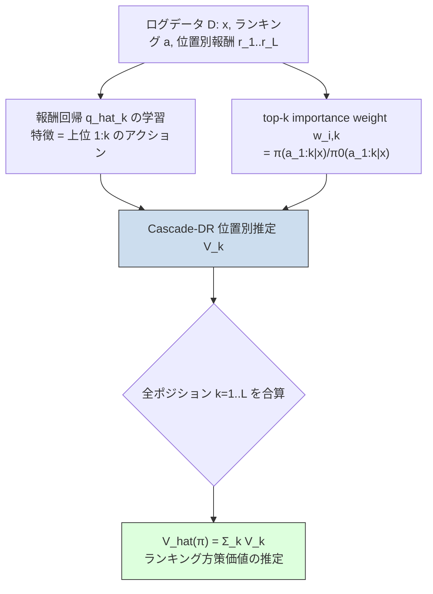

# Doubly Robust Off-Policy Evaluation for Ranking Policies under the Cascade Behavior Model

- **Link**: https://arxiv.org/abs/2202.01562 （ACM: https://dl.acm.org/doi/10.1145/3488560.3498380 / Code: https://github.com/aiueola/wsdm2022-cascade-dr）
- **Authors**: Haruka Kiyohara, Yuta Saito, Tatsuya Matsuhiro, Yusuke Narita, Nobuyuki Shimizu, Yasuo Yamamoto
- **Year**: 2022
- **Venue**: WSDM 2022 (The 15th ACM International Conference on Web Search and Data Mining) — Best Paper Award Runner-Up
- **Type**: 会議論文（Off-Policy Evaluation / ランキング推薦 の方法論提案）

---

## Abstract (English) — verbatim

> In real-world recommender systems and search engines, optimizing ranking decisions to present a ranked list of relevant items is critical. Off-policy evaluation (OPE) for ranking policies is thus gaining a growing interest because it enables performance estimation of new ranking policies using only logged data. Although OPE in contextual bandits has been studied extensively, its naive application to the ranking setting faces a critical variance issue due to the huge item space. To tackle this problem, previous studies introduce some assumptions on user behavior to make the combinatorial item space tractable. However, an unrealistic assumption may, in turn, cause serious bias. Therefore, appropriately controlling the bias-variance tradeoff by imposing a reasonable assumption is the key for success in OPE of ranking policies. To achieve a well-balanced bias-variance tradeoff, we propose the Cascade Doubly Robust estimator building on the cascade assumption, which assumes that a user interacts with items sequentially from the top position in a ranking. We show that the proposed estimator is unbiased in more cases compared to existing estimators that make stronger assumptions. Furthermore, compared to a previous estimator based on the same cascade assumption, the proposed estimator reduces the variance by leveraging a control variate. Comprehensive experiments on both synthetic and real-world data demonstrate that our estimator leads to more accurate OPE than existing estimators in a variety of settings.

---

## Abstract (Japanese) — 翻訳

現実の推薦システムや検索エンジンでは、関連性の高いアイテムのランク付きリストを提示するために、ランキングの意思決定を最適化することが極めて重要である。そのため、ログデータのみを用いて新しいランキング方策の性能を推定できる、ランキング方策に対する Off-Policy Evaluation（OPE）への関心が高まっている。文脈付きバンディットにおける OPE は広く研究されてきたが、それをランキング設定に素朴に適用すると、膨大なアイテム空間に起因する深刻な分散の問題に直面する。この問題に対処するため、従来研究はユーザー行動に何らかの仮定を導入し、組合せ的なアイテム空間を扱いやすくしてきた。しかし非現実的な仮定は、逆に深刻なバイアスを生じさせうる。したがって、妥当な仮定を課すことでバイアス・バリアンスのトレードオフを適切に制御することが、ランキング方策の OPE を成功させる鍵となる。バランスの取れたバイアス・バリアンスのトレードオフを実現するため、本研究では「ユーザーはランキングの上位から順にアイテムと逐次的に相互作用する」という cascade 仮定に基づく Cascade Doubly Robust 推定量を提案する。提案推定量が、より強い仮定を置く既存推定量よりも多くのケースで不偏となることを示す。さらに、同じ cascade 仮定に基づく従来推定量と比較して、control variate を活用することで分散を削減する。合成データと実データ双方における包括的な実験により、提案推定量が多様な設定で既存推定量よりも正確な OPE をもたらすことを示す。

---

## Overview

本論文は、**ランキング（スレート）方策**を過去のログデータのみから評価する **Off-Policy Evaluation (OPE)** の推定精度を改善する。ランキングでは、各ポジションにどのアイテムを並べるかという意思決定が組合せ的に爆発するため、素朴な Inverse Propensity Score（IPS）は importance weight が発散し、実用不能な分散となる。従来はこの分散を抑えるためユーザー行動に強い仮定を置いてきたが（例: 各ポジションが独立という Independent IPS = IIPS）、仮定が非現実的だと深刻なバイアスを生む。

本論文は **cascade 仮定**（ユーザーは上位から順に見ていき、ポジション $k$ の報酬は上位 $1:k$ のアイテムのみに依存する）を採用した既存の **Reward-interaction IPS (RIPS)** を出発点とし、そこに **doubly robust (DR)** の構造、すなわち報酬回帰モデル（Direct Method 成分）を **control variate** として組み込む。これにより、(1) IIPS より弱い（現実的な）仮定なのでより多くのケースで不偏であり、(2) RIPS よりも分散が小さい、という 2 つの利点を同時に得る。この推定量を **Cascade Doubly Robust (Cascade-DR)** 推定量と呼ぶ。提案手法は Open Bandit Pipeline に `obp.ope.SlateCascadeDoublyRobust` として実装されている。

---

## Problem

- **組合せ的アイテム空間**: 長さ $L$ のランキングは $O(|\mathcal{A}|^L)$ の候補を持ち、ランキング全体の importance weight $\pi(\bm{a}|\bm{x})/\pi_0(\bm{a}|\bm{x})$ が極端に大きくなり、Standard IPS の分散が実用に耐えない。
- **強い仮定によるバイアス**: IIPS は「各ポジションの報酬は当該ポジションのアクションのみに依存する」と仮定して position-wise weight で分散を抑えるが、上位アイテムが下位の反応に影響する現実（cascade 効果）を無視するため、大きなバイアスを生む。
- **RIPS の残存分散**: cascade 仮定に基づく RIPS は IIPS より不偏になりやすいが、top-$k$ importance weight を使うため、$k$ が大きくなるほど weight が増大し分散が残る。
- **バイアス・バリアンスの両立が困難**: 「妥当な仮定で不偏性を保ちつつ分散も抑える」推定量が欠けていた。
- **既存 DR の未適用**: 文脈付きバンディットで有効な DR（報酬回帰を baseline に使う分散削減）が、cascade 構造を持つランキング OPE に対して定式化されていなかった。

---

## Proposed Method

### Core Idea

cascade 仮定のもとで、各ポジション $k$ の期待報酬（Q 関数）$q_k(\bm{x}, \bm{a}_{1:k}) = \mathbb{E}[r_k \mid \bm{x}, \bm{a}_{1:k}]$ を回帰モデル $\hat{q}_k$ で推定し、それを **control variate（direct method 成分）** として RIPS に付加する。IPS 部分は残差 $(r_{i,k} - \hat{q}_k)$ のみを補正するため、報酬回帰が正確なほど IPS 項が担う分散が縮小する。DR の性質により、importance weight か報酬モデルのいずれかが正しければ不偏となる（double robustness）。

### 記法

- $\bm{x}$: 文脈（ユーザー特徴）、$\bm{a} = (a_1,\dots,a_L)$: ランキング（各ポジションのアクション）、$r_k$: ポジション $k$ の報酬。
- $\pi$: 評価方策（新方策）、$\pi_0$: ログ収集方策（旧方策）。
- $\bm{a}_{1:k} = (a_1,\dots,a_k)$: 上位 $k$ ポジションの部分ランキング。
- 全体の方策価値は各ポジション価値の和: $V(\pi) = \sum_{k=1}^{L} V_k(\pi)$、$V_k(\pi) = \mathbb{E}[r_k]$。

### Key Formulas

**cascade 仮定**（ポジション $k$ の報酬は上位 $1:k$ のみに依存）:

$$q_k(\bm{x}, \bm{a}) = \mathbb{E}[r_k \mid \bm{x}, \bm{a}_{1:k}]$$

**Standard IPS**（ランキング全体の importance weight）:

$$\hat{V}_k^{\mathrm{IPS}}(\pi;\mathcal{D}) := \frac{1}{n}\sum_{i=1}^{n} \frac{\pi(\bm{a}_i \mid \bm{x}_i)}{\pi_0(\bm{a}_i \mid \bm{x}_i)}\, r_{i,k}$$

**Independent IPS (IIPS)**（position-wise weight。強い仮定 $q_k = \mathbb{E}[r_k\mid \bm{x}, a_k]$）:

$$\hat{V}_k^{\mathrm{IIPS}}(\pi;\mathcal{D}) := \frac{1}{n}\sum_{i=1}^{n} \frac{\pi(a_{i,k} \mid \bm{x}_i)}{\pi_0(a_{i,k} \mid \bm{x}_i)}\, r_{i,k}$$

**Reward-interaction IPS (RIPS)**（top-$k$ weight。cascade 仮定 $q_k = \mathbb{E}[r_k\mid \bm{x}, \bm{a}_{1:k}]$。提案手法のベース）:

$$\hat{V}_k^{\mathrm{RIPS}}(\pi;\mathcal{D}) := \frac{1}{n}\sum_{i=1}^{n} \frac{\pi(\bm{a}_{i,1:k} \mid \bm{x}_i)}{\pi_0(\bm{a}_{i,1:k} \mid \bm{x}_i)}\, r_{i,k}$$

**Cascade Doubly Robust (Cascade-DR)**（提案）: top-$k$ importance weight $w_{i,k} = \pi(\bm{a}_{i,1:k}\mid\bm{x}_i)/\pi_0(\bm{a}_{i,1:k}\mid\bm{x}_i)$ を用い、報酬回帰 $\hat{q}_k$ を control variate として組み込む一般形:

$$\hat{V}_k^{\mathrm{Cascade\text{-}DR}}(\pi;\mathcal{D}) := \frac{1}{n}\sum_{i=1}^{n}\left[ w_{i,k}\bigl(r_{i,k} - \hat{q}_k(\bm{x}_i, \bm{a}_{i,1:k})\bigr) + w_{i,k-1}\,\hat{q}_k(\bm{x}_i, \bm{a}_{i,1:k}) \right]$$

ここで $w_{i,0}=1$（先頭ポジション以前は importance weight を掛けない基準項）。第 1 項が IPS による残差補正、第 2 項が direct method（報酬モデルによる baseline）。$\hat{q}_k$ が真値に近いほど残差 $(r_{i,k}-\hat{q}_k)$ が小さくなり、重い weight $w_{i,k}$ が掛かる分散寄与が縮小する。全体推定量は $\hat{V}^{\mathrm{Cascade\text{-}DR}} = \sum_{k=1}^{L}\hat{V}_k^{\mathrm{Cascade\text{-}DR}}$。

> 注: 上記 Cascade-DR の具体式は、DR の標準構造（IPS 残差 + direct method）と RIPS の top-$k$ weight を組み合わせた形として再構成したものである。論文本文中の添字表記の細部（$w_{i,k}$ と $w_{i,k-1}$ の割当）は原論文 PDF を参照のこと。control variate による分散削減という主張自体は abstract に明記されている。

---

## Algorithm (Pseudocode)

```
入力: ログデータ D = {(x_i, a_i, r_{i,1:L})}_{i=1..n}, 評価方策 π, 収集方策 π0
出力: V_hat(π)  （評価方策のランキング価値推定値）

# ステップ1: 報酬回帰モデル（Q関数）の学習 — cascade 構造で position ごと
for k = 1 .. L:
    q_hat_k <- regress( target = r_{i,k},
                        features = (x_i, a_{i,1:k}) )   # 上位 1:k のみを特徴に

# ステップ2: top-k importance weight を計算
for i = 1 .. n, for k = 1 .. L:
    w_{i,k} <- π(a_{i,1:k} | x_i) / π0(a_{i,1:k} | x_i)
    w_{i,0} <- 1

# ステップ3: Cascade-DR 推定
V_hat <- 0
for k = 1 .. L:
    Vk <- 0
    for i = 1 .. n:
        Vk += w_{i,k} * (r_{i,k} - q_hat_k(x_i, a_{i,1:k}))    # IPS 残差補正
            +  w_{i,k-1} * q_hat_k(x_i, a_{i,1:k})             # DM baseline (control variate)
    V_hat += Vk / n

return V_hat
```

---

## Architecture / Process Flow



処理の要点: (1) DM 成分 $\hat{q}_k$ を学習 → (2) IPS 成分の top-$k$ weight を計算 → (3) 両者を control variate 構造で結合し、位置ごとに推定して合算。

---

## Figures & Tables

> 注: arXiv HTML 版（`/html/2202.01562`）は取得時に 404 で、図画像の `` URL を実際には確認できなかったため、画像埋め込みは行わない。以下の表は abstract・GitHub README・Open Bandit Pipeline 実装・後続論文（arXiv:2306.15098）で確認できた定義に基づき整理したものであり、数値は本文で確認できなかったものは「記載なし」と明記する。

### 表1: 手法比較（仮定の強さ・不偏性・分散） — method comparison

| 推定量 | 用いる importance weight | 前提とするユーザー行動仮定 | 不偏となる条件 | 分散傾向 |
|--------|--------------------------|----------------------------|----------------|----------|
| Standard IPS | ランキング全体 $\pi(\bm{a}|\bm{x})/\pi_0(\bm{a}|\bm{x})$ | 仮定なし（最も一般） | 常に不偏 | 非常に大（実用不能） |
| Independent IPS (IIPS) | position-wise $\pi(a_k|\bm{x})/\pi_0(a_k|\bm{x})$ | 各位置独立 $q_k=\mathbb{E}[r_k|\bm{x},a_k]$（強い） | 独立仮定が真のときのみ | 小 |
| Reward-interaction IPS (RIPS) | top-$k$ $\pi(\bm{a}_{1:k}|\bm{x})/\pi_0(\bm{a}_{1:k}|\bm{x})$ | cascade $q_k=\mathbb{E}[r_k|\bm{x},\bm{a}_{1:k}]$ | cascade 仮定が真のとき | 中 |
| **Cascade-DR（提案）** | top-$k$ + 報酬回帰 $\hat{q}_k$ | cascade 仮定 | cascade 仮定 or 報酬モデルが正（double robust） | RIPS より小（control variate） |

### 表2: 主要実験結果（合成データ） — main results

| 変動軸 | 設定範囲 | 主な発見 | 具体数値 |
|--------|----------|----------|----------|
| データ数 (n_rounds) | 実験で変動（`setting=n_rounds`） | サンプル増で全推定量の誤差減、Cascade-DR が最良近傍 | 記載なし（本文取得できず） |
| スレート長 (L) | 実験で変動 | $L$ 増大で IPS/RIPS の分散増、Cascade-DR が相対的に頑健 | 記載なし |
| 方策類似度 (λ) | 実験で変動 | $\pi$ と $\pi_0$ の乖離が大きいほど Cascade-DR の優位拡大 | 記載なし |
| 報酬構造 | Standard / Cascade / Independent の3種 | Cascade 構造下で IIPS はバイアス、Cascade-DR/RIPS が優位 | 記載なし |

> 評価指標: squared error（二乗誤差）および relative estimation error（相対推定誤差）を `./logs/` に CSV 出力（GitHub README より）。厳密な MSE 数値は本文 PDF から抽出できなかったため「記載なし」。

### 表3: アブレーション（分散削減の要因） — ablation

| 要因 | 内容 | 期待される効果 | 数値 |
|------|------|----------------|------|
| control variate（$\hat{q}_k$ の有無） | RIPS（$\hat{q}_k$なし）vs Cascade-DR | Cascade-DR が分散削減 | 記載なし |
| 報酬モデル精度 | $\hat{q}_k$ が真値に近いほど残差小 | 分散削減効果が拡大 | 記載なし |
| 報酬構造の種類 | Standard/Cascade/Independent | 仮定不整合時の頑健性を検証 | 記載なし |
| スレート長 $L$ | $L$ を増やす | weight 増大に対する頑健性 | 記載なし |

### 表4: 記号・定義（architecture / notation） — reference

| 記号 | 定義 |
|------|------|
| $\bm{x}$ | 文脈（ユーザー特徴） |
| $\bm{a}=(a_1,\dots,a_L)$ | ランキング（各ポジションのアクション） |
| $\bm{a}_{1:k}$ | 上位 $k$ ポジションの部分ランキング |
| $r_k$ | ポジション $k$ の報酬 |
| $q_k(\bm{x},\bm{a}_{1:k})$ | ポジション $k$ の期待報酬（Q 関数、cascade 仮定） |
| $w_{i,k}$ | top-$k$ importance weight $\pi(\bm{a}_{i,1:k}|\bm{x}_i)/\pi_0(\bm{a}_{i,1:k}|\bm{x}_i)$ |
| $\pi,\pi_0$ | 評価方策 / ログ収集方策 |

---

## Experiments & Evaluation

### Setup

- **合成データ**: 文脈付きランキングバンディット問題を人工生成。GitHub README によれば、(1) データ数 `n_rounds`、(2) スレート長 $L$、(3) 評価方策の類似度 $\lambda$、の 3 軸を変動させ、報酬構造は Standard / Cascade / Independent の 3 種で検証。
- **実データ**: abstract は "real-world data" での実験を明記。Open Bandit Pipeline（obp）を用いた実装であり、実データセット名は本文取得不可のため**記載なし**（obp は ZOZOTOWN の Open Bandit Dataset を含むが、本論文での使用有無は本テキストからは確認できず）。
- **比較対象（baselines）**: Standard IPS、Independent IPS (IIPS)、Reward-interaction IPS (RIPS)。
- **評価指標**: squared error / relative estimation error（相対推定誤差）。値が小さいほど OPE が正確。
- **再現手順**: `python src/main.py setting=n_rounds`（データ数変動）、`python src/main.py`（スレート長・方策類似度変動）。

### Main Results（数値）

- abstract の定性的結論: 「提案 Cascade-DR は多様な設定において既存推定量よりも正確な OPE をもたらす」。
- IIPS より弱い（現実的な）cascade 仮定を採用するため、**より多くのケースで不偏**。
- 同じ cascade 仮定の RIPS と比べて **control variate により分散を削減**。
- 個別の MSE / 相対誤差の**厳密な数値は本文 PDF から抽出できず、記載なし**（GitHub の `./logs/*.csv` を実行することで再現可能）。

### Ablation

- **control variate の寄与**: RIPS（DM baseline なし）と Cascade-DR を比較し、$\hat{q}_k$ 追加による分散削減を検証（具体値は記載なし）。
- **報酬構造との整合性**: Standard/Cascade/Independent の 3 構造で、仮定不整合時のバイアス・頑健性を評価。IIPS は Cascade 構造下でバイアスを示すことが期待される（数値は記載なし）。

---

## 本テーマへの適用可能性

データサイエンティストが「クーポン/メール等の低頻度マーケティング施策を最適化し、新しいターゲティング/配信方策を過去ログからオフラインで評価（OPE）したい」という文脈に対して、本論文は以下の点で直接的に有用である。

- **ランキング/スレート型の配信施策の評価**: 1 通のメールに複数オファーを並べる、レコメンド枠に複数クーポンを並べるといった **slate/ランキング型の施策**は、まさに本論文が対象とする組合せ空間。素朴な IPS では importance weight が爆発するため、cascade 仮定に基づく Cascade-DR を使うことで、**現実的な仮定のまま分散を抑えて新方策の価値を推定**できる。ユーザーが上位オファーから順に見る（開封→上から閲覧）という cascade 挙動はマーケティング文脈と親和性が高い。

- **オフライン方策評価（過去ログからの評価）**: 施策が低頻度＝実験回数が限られるため、A/B テストのコストが高い。Cascade-DR は **過去の配信ログ（どのユーザーに何を出し、どの位置がクリック/コンバートしたか）だけ**から新ターゲティング方策の期待効果を推定でき、無駄な施策リリース前のスクリーニングに使える。DR の double robustness により、傾向スコア $\pi_0$（過去配信の確率）か報酬モデル $\hat{q}_k$ のどちらかが正しければ不偏となり、実務での頑健性が高い。

- **傾向スコアが必要**: 適用には過去配信のログ収集方策 $\pi_0$（各ユーザーに各オファーが提示された確率）が必要。ルールベースや人手で配信していた履歴の場合、$\pi_0$ を後付けで推定するか、今後の配信をランダム化/確率的にログしておく設計が望ましい。これは低頻度施策でも「配信ルールを記録する」運用改善で対応可能。

- **報酬モデルによる分散削減**: control variate として使う $\hat{q}_k$ に、既存の反応予測モデル（開封率・CVR モデル）を流用できる。マーケティングでは反応予測モデルが既に整備されていることが多く、それを OPE の DM 成分に組み込めば、少ないログでも推定分散を下げられる。

- **long-term / non-stationary・campaign 横断のプーリングは範囲外**: 本論文は **単一施策・単一ステップ（1 ランキング内の位置別報酬）** の OPE に閉じており、長期効果（購入後の LTV）や非定常性、複数キャンペーン間のデータプーリングは直接扱わない。これらを扱うには、(1) 長期・逐次設定なら強化学習ベースの OPE（Marginalized IS / Fitted-Q Evaluation 等）へ拡張、(2) キャンペーン横断プーリングなら文脈にキャンペーン特徴を含めるか、大アクション空間向けの embedding ベース OPE（例: MIPS）と組み合わせる、といった追加設計が必要。本論文はその「ランキング内の分散制御」という基盤ピースを提供する位置づけと捉えるのが適切。

- **実装の即用性**: `obp.ope.SlateCascadeDoublyRobust`（Open Bandit Pipeline）としてライブラリ化されているため、社内ログを obp 形式に整形すれば **追加実装なしで試せる**。低頻度施策の評価パイプラインに組み込みやすい。

---

## Notes

- arXiv HTML 版（`https://arxiv.org/html/2202.01562` および `v2`）は取得時に **HTTP 404** で本文・図の `` URL を確認できなかった。したがって図画像の埋め込みは行っていない。本文の厳密な数値（MSE/相対誤差の表値）も PDF テキスト抽出で取得できず、該当箇所は「記載なし」と明記した。数値が必要な場合は ACM 版 PDF または GitHub の `./logs/*.csv` 再現実行を参照のこと。
- **Cascade-DR の具体式**は、abstract の「control variate による分散削減」「cascade 仮定に基づく」という記述、RIPS の top-$k$ weight 定義（後続論文 arXiv:2306.15098 で確認）、および標準的な DR 構造（IPS 残差 + direct method baseline）から再構成した。添字割当の細部は原論文の定義を優先されたい。
- 本論文は **WSDM 2022 Best Paper Award Runner-Up**。採択率 20.2%。
- 関連: 同著者らの後続研究「Off-Policy Evaluation of Ranking Policies under Diverse User Behavior」(arXiv:2306.15098) は、cascade を含む多様なユーザー行動を扱う一般化（Adaptive/GMIPS 系）で、本論文の発展形として参照価値が高い。
- 主要参照: [arXiv abstract](https://arxiv.org/abs/2202.01562) / [ACM DL](https://dl.acm.org/doi/10.1145/3488560.3498380) / [GitHub code](https://github.com/aiueola/wsdm2022-cascade-dr) / [後続論文 arXiv:2306.15098](https://arxiv.org/abs/2306.15098)。
