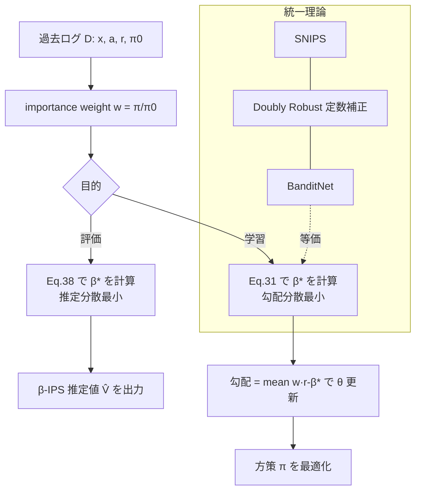

# Optimal Baseline Corrections for Off-Policy Contextual Bandits

- **Link**: https://arxiv.org/abs/2405.05736 / https://dl.acm.org/doi/10.1145/3640457.3688105
- **Authors**: Shashank Gupta, Olivier Jeunen, Harrie Oosterhuis, Maarten de Rijke
- **Year**: 2024
- **Venue**: 18th ACM Conference on Recommender Systems (RecSys '24), October 14–18, 2024, Bari, Italy
- **Type**: 会議フルペーパー（理論 + シミュレーション実験）
- **Code**: https://github.com/shashankg7/recsys2024_optimal_baseline

---

## Abstract (English)

> The off-policy learning paradigm allows for recommender systems and general ranking applications to be framed as decision-making problems, where we aim to learn decision policies that optimize an unbiased offline estimate of an online reward metric. With unbiasedness comes potentially high variance, and prevalent methods exist to reduce estimation variance. These methods typically make use of control variates, either additive (i.e., baseline corrections or doubly robust methods) or multiplicative (i.e., self-normalisation). Our work unifies these approaches by proposing a single framework built on their equivalence in learning scenarios. The foundation of our framework is the derivation of an equivalent baseline correction for all of the existing control variates. Consequently, our framework enables us to characterize the variance-optimal unbiased estimator and provide a closed-form solution for it. This optimal estimator brings significantly improved performance in both evaluation and learning, and minimizes data requirements. Empirical observations corroborate our theoretical findings.

## Abstract (日本語訳)

> off-policy 学習のパラダイムでは、推薦システムや一般的なランキング応用を意思決定問題として定式化し、オンライン報酬指標の「不偏なオフライン推定量」を最適化する決定方策を学習することを目指す。しかし不偏性の代償として推定量の分散が大きくなりがちであり、この分散を低減するための手法が数多く存在する。これらの手法は典型的に control variate（制御変量）を用いるが、それは加法的（baseline correction や doubly robust）か、乗法的（self-normalisation）かのいずれかである。本研究は、これらの手法が学習シナリオにおいて等価であるという事実に基づき、単一のフレームワークとして統一する。フレームワークの基盤は、既存のすべての control variate に対して「等価な baseline correction」を導出することにある。その結果、分散最適な不偏推定量を特徴づけ、その閉形式解を与えることが可能となる。この最適推定量は評価・学習の両面で大幅な性能改善をもたらし、必要データ量を最小化する。理論的知見は実験によっても裏付けられる。

---

## Overview

本論文は、off-policy contextual bandit（文脈付きバンディット）における **分散低減手法の統一理論** を提示する。推薦・ランキングにおける off-policy 評価/学習では、過去の logging policy $\pi_0$ が集めたログから、新しい target policy $\pi$ の価値を Inverse Propensity Scoring (IPS) で不偏推定する。しかし IPS は重要度重み（importance weight）$\pi/\pi_0$ が発散すると分散が爆発する。

これに対し従来は、(a) 加法的 control variate（baseline correction / doubly robust）、(b) 乗法的 control variate（self-normalisation, SNIPS）という異なる系統の手法が並存していた。本論文の中心的貢献は、**学習（勾配）シナリオではこれらがすべて「ある定数 $\beta$ を用いた baseline-corrected IPS」に等価に帰着する** ことを示した点である。この等価性を足がかりに、勾配分散を最小化する最適 $\beta$ と、推定分散を最小化する最適 $\beta$ の両方について **閉形式解** を導出する。

---

## Problem（課題）

- **IPS は不偏だが高分散**: 重要度重み $\pi(a|x)/\pi_0(a|x)$ が大きくなると推定量の分散が発散し、評価・学習の双方で不安定になる。
- **分散低減手法が乱立**: baseline correction、doubly robust、self-normalised IPS (SNIPS)、BanditNet などが個別に提案され、互いの関係や最適性が不明瞭だった。
- **乗法的 control variate（SNIPS 等）はバイアスを持つ**: self-normalisation は有限サンプルでバイアスを生じ、理論的に扱いにくい。
- **「最適な baseline」が未解決**: baseline correction の $\beta$ をどう選べば分散が最小になるか、評価用と学習用で最適値が異なるのかが明確でなかった。
- **データ効率**: マーケティング等でログが少ない場面では、分散低減による必要データ量の削減が実務上の焦点となる。

---

## Proposed Method（提案手法）

### Core Idea

すべての一般的な control variate（加法・乗法）は、学習時の勾配において「定数 $\beta$ を差し引く baseline-corrected IPS」と等価になる。この等価性から、**目的（勾配分散最小化 or 推定分散最小化）に応じた最適 $\beta$ を閉形式で解く**。$\beta$ は定数（グローバルな加法的 control variate）であるため、不偏性は完全に保たれる（重要度重みの期待値が 1 であることから、定数 $\beta$ の寄与はキャンセルされる）。

### Numbered Steps

1. IPS 推定量を定義する（Eq. 12）。
2. 定数 baseline $\beta$ を導入した **$\beta$-IPS 推定量** を定義する（Eq. 21）。重要度重みの期待値が 1 なので不偏性は維持される。
3. SNIPS・doubly robust（定数補正）・BanditNet の勾配が、いずれも適切な $\beta$ を選んだ $\beta$-IPS の勾配に等価であることを示す（統一定理）。
4. **学習用**: 勾配分散 $\mathrm{Var}[\nabla \hat V]$ を $\beta$ の関数として書き下し、微分してゼロと置くことで勾配分散最小の $\beta^*$ を得る（Eq. 31, Theorem 1）。
5. **評価用**: 推定分散 $\mathrm{Var}[\hat V]$ を最小化する $\beta^*$ を同様に導出する（Eq. 38, Theorem 2）。不偏なので MSE = 分散となり、これが定数加法補正クラスで最小 MSE を達成する。
6. 実データでは $\beta^*$ 内の期待値をログ標本平均で置換して推定・利用する。

### Key Formulas

IPS 推定量（Eq. 12）:

$$
\hat V_{\text{IPS}}(\pi, \mathcal{D}) = \frac{1}{|\mathcal{D}|} \sum_{(x,a,r)\in\mathcal{D}} \frac{\pi(a|x)}{\pi_0(a|x)}\, r
$$

Baseline-corrected IPS（$\beta$-IPS, Eq. 21）:

$$
\hat V_{\beta\text{-IPS}}(\pi, \mathcal{D}) = \beta + \frac{1}{|\mathcal{D}|} \sum_{(x,a,r)\in\mathcal{D}} \frac{\pi(a|x)}{\pi_0(a|x)}\,(r - \beta)
$$

勾配分散を最小化する最適 baseline（Eq. 31, 学習用）:

$$
\beta^{*} = \frac{\mathbb{E}\!\left[\dfrac{\lVert \nabla \pi(a|x)\rVert_2^2}{\pi_0(a|x)^2}\, r(a,x)\right]}{\mathbb{E}\!\left[\dfrac{\lVert \nabla \pi(a|x)\rVert_2^2}{\pi_0(a|x)^2}\right]}
$$

推定分散を最小化する最適 baseline（Eq. 38, 評価用）:

$$
\beta^{*} = \frac{\mathbb{E}\!\left[\left(\left(\dfrac{\pi(a|x)}{\pi_0(a|x)}\right)^2 - \dfrac{\pi(a|x)}{\pi_0(a|x)}\right) r(a,x)\right]}{\mathbb{E}\!\left[\left(\dfrac{\pi(a|x)}{\pi_0(a|x)}\right)^2 - \dfrac{\pi(a|x)}{\pi_0(a|x)}\right]}
$$

いずれも重要度重みで重み付けた「報酬の加重平均」の形をしており、評価用の $\beta^*$ は重み二乗と重みの差で加重する点が特徴的である。

---

## Algorithm（Pseudocode）

```
入力: ログデータ D = {(x_i, a_i, r_i, π0(a_i|x_i))}, target policy π
目的: mode ∈ {LEARNING, EVALUATION}

# --- 評価モード ---
if mode == EVALUATION:
    for each (x,a,r) in D:
        w   = π(a|x) / π0(a|x)          # 重要度重み
    num = mean_over_D[ (w^2 - w) * r ]
    den = mean_over_D[ (w^2 - w) ]
    β*  = num / den                       # Eq. 38
    return β* + mean_over_D[ w * (r - β*) ]  # β-IPS 推定値

# --- 学習モード（勾配降下）---
if mode == LEARNING:
    initialize policy parameters θ
    repeat until convergence:
        for each (x,a,r) in minibatch:
            g   = ∇_θ π(a|x)
            wsq = ||g||^2 / π0(a|x)^2
        β*  = mean[ wsq * r ] / mean[ wsq ]   # Eq. 31
        grad = mean_over_batch[ (∇_θ π(a|x) / π0(a|x)) * (r - β*) ]
        θ  ← θ + lr * grad
    return θ
```

---

## Architecture / Process Flow



---

## Figures & Tables

> 注: arXiv HTML（v1/v2）および WebFetch では図の `` URL・表の生数値を抽出できなかったため、画像 URL は埋め込まない。数値はすべて「記載なし（本抽出では未取得）」と明記する。正確な数値は原論文 PDF（Figure 1–4 相当、Section 5）で確認のこと。

### 表1: Main Results（Off-Policy Evaluation, RQ4 相当）

| 推定量 | 不偏性 | 推定分散 / MSE | ESS | 備考 |
|---|---|---|---|---|
| IPS (Eq.12) | 不偏 | 高（基準） | 低 | ベースライン |
| SNIPS | 有限標本でバイアスあり | 中 | 中 | 乗法的 control variate |
| Doubly Robust (定数補正) | 不偏 | 中 | 中 | 加法的 control variate |
| BanditNet | ― | ― | ― | 学習用の baseline |
| **β-IPS (Eq.38 の β*)** | **不偏** | **最小（定数加法補正クラス内）** | **最大** | **提案・Theorem 2** |

（各セルの具体的な MSE / 分散 / ESS の数値: 記載なし）

### 表2: Method / Control-Variate 対応表（統一理論）

| 従来手法 | 種類 | β-IPS での等価な β | 最適性 |
|---|---|---|---|
| Self-Normalised IPS (SNIPS) | 乗法的 | 特定の定数 β に等価（勾配レベル） | 一般に非最適 |
| Doubly Robust（定数 reward model） | 加法的 | 定数 β に等価 | β の選び方に依存 |
| BanditNet | 加法的 baseline | 定数 β に等価 | ハイパラ探索が必要 |
| β-IPS（勾配分散最適, Eq.31） | 加法的 | β* = 閉形式 | 勾配分散最小（Theorem 1）|
| β-IPS（推定分散最適, Eq.38） | 加法的 | β* = 閉形式 | MSE 最小（Theorem 2）|

### 表3: Ablation（勾配分散最適 β vs 推定分散最適 β）

| 設定 | 使う β* | 主張される効果 |
|---|---|---|
| Off-policy **学習** | Eq.31（勾配分散最小） | 収束が高速化、勾配分散が低下 |
| Off-policy **評価** | Eq.38（推定分散最小） | 方策価値推定誤差が低下 |
| 逆に評価用 β を学習に使う等の交差 | ― | 最適でない（各目的で最適 β は異なる）|

（収束エポック数・分散削減倍率などの具体数値: 記載なし）

### 表4: Architecture / Theorem まとめ

| 要素 | 内容 |
|---|---|
| Theorem 1 | グローバル加法的 control variate 族の中で、Eq.31 の β を用いた β-IPS が勾配分散最小 |
| Theorem 2 | 定数加法補正を持つオフライン推定量の中で、Eq.38 の β を用いた β-IPS が MSE 最小（不偏なので MSE = 分散）|
| 統一命題 | SNIPS / DR(定数) / BanditNet の勾配は β-IPS の勾配に等価 |

---

## Experiments & Evaluation

### Setup

- **環境**: 実世界の推薦シナリオを模した off-policy シミュレーション環境（確率的報酬、大規模行動空間、制御されたランダム化を再現）。
- **比較手法**: IPS、SNIPS、Doubly-Robust、BanditNet、および提案 β-IPS。
- **評価指標**:
  - 学習（RQ1–3）: 勾配分散、収束速度。
  - 評価（RQ4）: 方策価値の推定誤差（MSE）。
- **データセット名・行動数・ログサイズ**: 記載なし（本抽出では未取得。原論文 Section 5 参照）。

### Main Results（数値）

- 学習において、提案する勾配分散最適 baseline は **より低い勾配分散と高速な収束** を実現すると報告（具体的な数値: 記載なし）。
- 評価において、Eq.38 の推定分散最適 baseline は **SNIPS・doubly robust より低い方策価値推定誤差** を達成すると報告（具体的な MSE 値: 記載なし）。
- 「必要データ量を最小化する（minimizes data requirements）」と主張（具体的な削減率: 記載なし）。

### Ablation

- 学習用 β*（Eq.31）と評価用 β*（Eq.38）は **異なる最適値** を持ち、目的に合わせて使い分けるべきことを実証（交差設定の具体数値: 記載なし）。

---

## 本テーマへの適用可能性

本テーマ（クーポン/メール等の**低頻度マーケティング施策**を、過去ログから**オフラインで新しいターゲティング/配信方策を評価（off-policy evaluation）** したいデータサイエンティスト）に対し、本論文は直接的かつ実務的な価値を持つ。

- **施策 = contextual bandit**: 顧客特徴 $x$（コンテキスト）、施策の割当 $a$（クーポン種別/送付有無/セグメント）、成果 $r$（購買・開封・売上）という枠組みそのものが本論文の対象。過去の配信ログ（当時の配信ロジック = logging policy $\pi_0$、その割当確率 $\pi_0(a|x)$）があれば、新方策 $\pi$ の価値を **A/B テストせずにオフライン推定** できる。
- **少ないログでの分散低減が直撃課題**: マーケ施策は「低頻度」でログが貴重。素の IPS は重要度重みの発散で推定が不安定になるが、**Eq.38 の β-IPS を使えば定数加法補正で不偏性を保ちつつ MSE を最小化** でき、「必要データ量の最小化」という主張がそのまま少データ環境の実利になる。実装は重要度重みの標本平均だけで済み、既存の IPS パイプラインに数行で追加できる軽さが魅力。
- **新方策の評価 vs 学習で β を使い分ける**: 「既存ログから新ターゲティング方策の価値を評価するだけ」なら **評価用 β*（Eq.38）**、「ログから直接、配信方策を学習・最適化する」なら **学習用 β*（Eq.31）** を選ぶ。本論文はこの使い分けが本質的であることを示しており、施策の PDCA（評価→次施策の方策学習）両フェーズで指針となる。
- **手法乱立からの解放**: 現場で SNIPS を使うか DR を使うか BanditNet を使うか迷う必要がなくなる。統一理論により「どれも定数 β の baseline correction に等価、ならば最適 β を閉形式で入れよ」と一意に方針が定まり、実装・保守コストを下げられる。
- **ranking / slate への含意**: 本論文は general ranking 応用を明示的に射程に入れており、クーポン一覧・レコメンド枠のような **slate/ランキング配信** の off-policy 評価にも同じ baseline correction の発想が適用可能。ただし slate 特有の分解（item-level propensity 等）は本論文の主対象ではないため、slate 用の重要度重み設計は別途必要（本論文の β 最適化は、その重み設計の上に乗せる形で活用する）。
- **キャンペーン横断のデータプーリング**: 複数キャンペーンのログを結合して推定量を作る際も、β-IPS は各サンプルの重要度重みだけで β* を計算するため、キャンペーンを跨いだプーリングと相性が良い。ただし propensity $\pi_0$ が施策ごとに正しく記録・整合していることが前提。
- **注意点（長期・非定常設定）**: 本論文は基本的に **単一ステップ・定常な contextual bandit** を想定しており、**長期効果（遅延コンバージョン）や非定常性（季節性・トレンド）** は明示的に扱っていない。マーケの長期 LTV や時期変動を評価する場合は、reward の定義に長期指標を用いる、時間窓ごとに β* を再推定する、propensity のドリフトを監視する等の拡張が必要。本手法は「その拡張の中核となる分散最適推定量」として組み込むのが妥当。

**実装の第一歩**: 既存ログに $\pi_0(a|x)$（当時の配信確率）が記録されていれば、まず Eq.38 の β-IPS を評価パイプラインに導入し、素の IPS / SNIPS と推定誤差・分散を比較するのが最小コストで効果を検証できるルート。propensity が記録されていない場合は、logging policy の再構成（propensity 推定）が前提条件となる。

---

## Notes

- 本レポートの数式は arXiv 版（v1/v2）の式番号（Eq.12/21/31/38, Theorem 1/2）に基づく。式表記は原論文の記法を整形したもの。
- **図の画像 URL は、WebFetch で arXiv HTML から `` を取得できなかったため一切埋め込んでいない**（アンチハルシネーション方針）。図・表の具体数値（MSE、ESS、収束エポック、行動数、ログサイズ、データセット名）は本抽出では未取得のため「記載なし」とした。正確な数値は原論文 PDF（ACM DL: 10.1145/3640457.3688105）Section 5 および Figure を参照のこと。
- コード: https://github.com/shashankg7/recsys2024_optimal_baseline （RecSys 2024 実験再現用）。
- 関連系譜: IPS / SNIPS (Swaminathan & Joachims), Doubly Robust (Dudík et al.), BanditNet (Joachims et al.) を control variate の観点で統一している。
